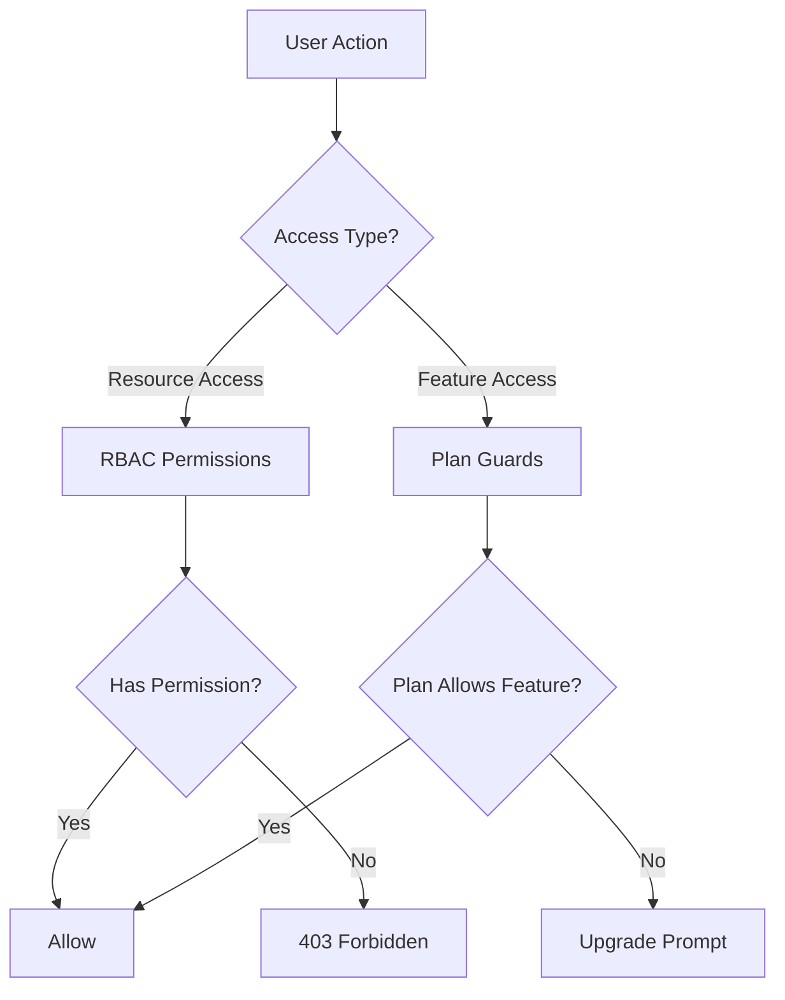
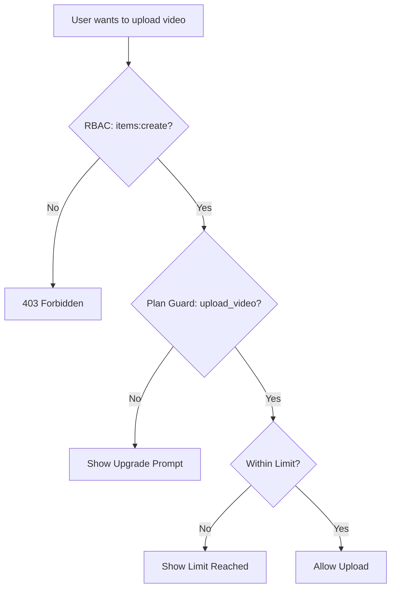

# Sistema de guardias y permisos

La plantilla Ever Works implementa un sistema de control de acceso de doble capa: **permisos RBAC** para acceso a recursos basado en roles y **guardias de planes** para control de funciones basado en suscripción. Juntos, estos sistemas controlan lo que los usuarios pueden hacer y a qué funciones pueden acceder.

## Arquitectura del sistema



## Sistema de permisos RBAC

### Definiciones de permisos

Todos los permisos se definen en `lib/permissions/definitions.ts` usando un formato `resource:action`:

```typescript
const PERMISSIONS = {
  items: {
    read: 'items:read',
    create: 'items:create',
    update: 'items:update',
    delete: 'items:delete',
    review: 'items:review',
    approve: 'items:approve',
    reject: 'items:reject',
  },
  categories: { read, create, update, delete },
  tags: { read, create, update, delete },
  roles: { read, create, update, delete },
  users: { read, create, update, delete, assignRoles },
  analytics: { read, export },
  system: { settings },
} as const;
```

### Tipo de permiso

El tipo `Permission` se deriva del objeto constante `PERMISSIONS`, lo que garantiza la seguridad de tipos:

```typescript
type Permission = 'items:read' | 'items:create' | ... | 'system:settings';
```

### Roles predeterminados

Hay dos roles predeterminados preconfigurados:

|Rol|identificación|Permisos|
|---|---|---|
|superadministrador|`super-admin`|Todos los permisos del sistema|
|Administrador de contenido|`content-manager`|Artículos + Categorías + Etiquetas (CRUD + revisión completa)|

### Grupos de permisos

Los permisos están organizados en grupos compatibles con la interfaz de usuario en `lib/permissions/groups.ts`:

|grupo|Icono|Recursos incluidos|
|---|---|---|
|Gestión de contenidos|`FileText`|Artículos, Categorías, Etiquetas|
|Gestión de usuarios|`Users`|Usuarios, roles|
|Sistema y análisis|`Settings`|Analítica, Sistema|

### Funciones de utilidad

El módulo `lib/permissions/utils.ts` proporciona utilidades de administración de estado para la interfaz de usuario de permisos:

```typescript
// Create a permission state map for checkboxes
const state = createPermissionState(currentPermissions);
// { 'items:read': true, 'items:create': true, ... }

// Get selected permissions from state
const selected = getSelectedPermissions(state);

// Calculate changes between old and new permissions
const changes = calculatePermissionChanges(original, updated);
// { added: ['items:delete'], removed: ['tags:create'] }

// Compare two permission sets
const equal = arePermissionsEqual(perms1, perms2);

// Filter permissions by search term
const filtered = filterPermissions(allPerms, 'items');
```

## Sistema de guardias del plano

Los guardias del plan controlan el acceso a las funciones según el plan de suscripción del usuario. El sistema está definido en `lib/guards/plan-features.guard.ts`.

### Jerarquía del plan

```typescript
const PLAN_LEVELS: Record<string, number> = {
  free: 1,
  standard: 2,
  premium: 3,
};
```

### Definiciones de funciones

Todas las funciones cerradas se enumeran en `FEATURES`:

|categoría|Características|
|---|---|
|Presentación|`submit_product`, `extended_description`, `unlimited_description`, `upload_images`, `upload_video`|
|Insignias|`verified_badge`, `sponsored_badge`|
|Revisión|`priority_review`, `instant_review`|
|Visibilidad|`search_visibility`, `category_placement`, `sponsored_position`, `homepage_featured`, `newsletter_mention`|
|Analítica|`view_statistics`, `advanced_analytics`|
|Soporte|`email_support`, `priority_email_support`, `phone_support`|
|sociales|`social_sharing`, `learn_more_button`|
|Otro|`free_modifications`, `unlimited_submissions`|

### Matriz de acceso a funciones

Cada característica se asigna a una regla de acceso:

|Tipo de acceso|Sintaxis|Ejemplo|
|---|---|---|
|Todos los planes|`'all'`|`submit_product`, `upload_images`|
|Plan único|`PaymentPlan.PREMIUM`|`upload_video`, `instant_review`|
|Plan mínimo|`{ minPlan: PaymentPlan.STANDARD }`|`verified_badge`, `priority_review`|
|Planes específicos|`[PaymentPlan.STANDARD, PaymentPlan.PREMIUM]`|(características personalizadas)|

### Límites del plan

Los límites numéricos varían según el plan:

|Límite|Gratis|Estándar|prima|
|---|---|---|---|
|`max_images`| 1 | 5 |Ilimitado|
|`max_description_words`| 200 | 500 |Ilimitado|
|`max_submissions`| 1 | 10 |Ilimitado|
|`review_days`| 7 | 3 | 1 |
|`free_modification_days`| 0 | 30 | 365 |

### Uso de la protección del lado del servidor

```typescript
import { canAccessFeature, createPlanGuard, FEATURES } from '@/lib/guards';

// Simple check
const allowed = canAccessFeature(FEATURES.UPLOAD_VIDEO, userPlan);

// Guard factory for multiple checks
const guard = createPlanGuard(userPlan);
guard.canAccess(FEATURES.VERIFIED_BADGE);       // boolean
guard.requireFeature(FEATURES.UPLOAD_VIDEO);     // throws PlanGuardError
guard.getLimit('max_images');                    // number | null
guard.isWithinLimit('max_submissions', count);   // boolean
guard.getAccessibleFeatures();                   // Feature[]
```

### PlanGuardError

Cuando `requireFeature` falla, arroja un error escrito:

```typescript
class PlanGuardError extends Error {
  feature: Feature;      // e.g., 'upload_video'
  userPlan: string;      // e.g., 'free'
  requiredPlan: PaymentPlan; // e.g., 'premium'
}
```

### Gancho de protección del lado del cliente

El gancho `usePlanGuard` en `hooks/use-plan-guard.ts` envuelve el sistema de protección para los componentes de React:

```typescript
import { usePlanGuard, FEATURES } from '@/hooks/use-plan-guard';

function VideoUploadButton() {
  const { canAccess, requireUpgrade, isLoading } = usePlanGuard();

  if (isLoading) return <Spinner />;

  const upgradePlan = requireUpgrade(FEATURES.UPLOAD_VIDEO);
  if (upgradePlan) {
    return <UpgradePrompt plan={upgradePlan} />;
  }

  return <Button>Upload Video</Button>;
}
```

### Ganchos especializados

#### `useFeatureAccess`

Verifique el acceso a una sola característica:

```typescript
const { hasAccess, requiredPlan, isLoading } = useFeatureAccess(FEATURES.VERIFIED_BADGE);
```

#### `useFeatureLimit`

Verifique los límites numéricos con el recuento restante:

```typescript
const { limit, isUnlimited, remaining, isWithinLimit } = useFeatureLimit('max_images', currentCount);

if (!isUnlimited && remaining <= 0) {
  return <LimitReached />;
}
```

## Componer guardias

Los guardias se componen de forma natural para escenarios complejos de control de acceso:

```typescript
// Server: Combine RBAC + plan check
function canCreateItem(userPermissions: UserPermissions, userPlan: string): boolean {
  const hasRBACAccess = hasPermission(userPermissions, 'items:create');
  const hasPlanAccess = canAccessFeature(FEATURES.SUBMIT_PRODUCT, userPlan);
  return hasRBACAccess && hasPlanAccess;
}

// Client: Combine hooks
function CreateItemButton() {
  const { canAccess } = usePlanGuard();
  const { permissions } = useRolePermissions();

  const canCreate =
    hasPermission(permissions, 'items:create') &&
    canAccess(FEATURES.SUBMIT_PRODUCT);

  if (!canCreate) return null;
  return <Button>Create Item</Button>;
}
```

## Diagrama de flujo de guardia



## Agregar nuevos guardias

### Agregar un nuevo permiso

1. Agregar a `PERMISSIONS` en `lib/permissions/definitions.ts`:

```typescript
billing: {
  read: 'billing:read',
  manage: 'billing:manage',
},
```

2. Agregar a un grupo de permisos en `lib/permissions/groups.ts`
3. Asignar roles predeterminados apropiados

### Agregar una función de nuevo plan

1. Agregue la característica constante a `FEATURES` en `lib/guards/plan-features.guard.ts`
2. Defina la regla de acceso en `FEATURE_ACCESS`
3. Opcionalmente, agregue límites numéricos a `PLAN_LIMITS`

## Mejores prácticas

1. **Prefiera los guardias del plan para la activación de funciones** y RBAC para el control de acceso a los recursos; no los mezcle.
2. **Verifique siempre en el servidor** incluso si el cliente oculta elementos de la interfaz de usuario; las comprobaciones del lado del cliente son solo para la experiencia de usuario.
3. **Utilice `createPlanGuard`** para realizar múltiples comprobaciones en la misma solicitud para evitar búsquedas repetidas de planes.
4. **Manejar estados de carga** en enlaces: los datos del plan pueden cargarse de forma asincrónica desde el servicio de suscripción.
5. **Mantenga los nombres de las funciones descriptivos**: utilice `upload_video`, no `feature_3` para mayor claridad en los registros y mensajes de error.
