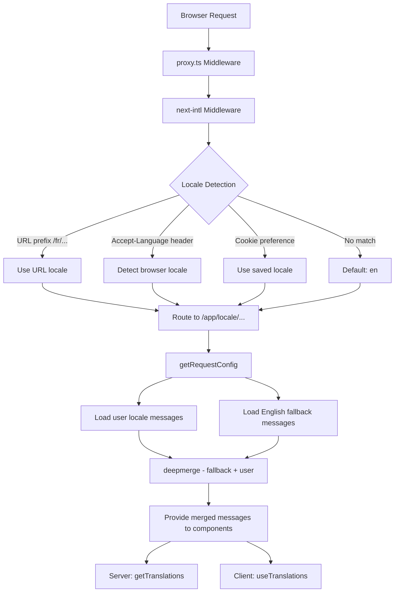

# Implementación de i18n

## Descripción general

La plantilla Ever Works implementa la internacionalización usando **next-intl** con soporte para más de 20 configuraciones regionales, dirección de texto RTL (de derecha a izquierda), respaldos de mensajes de fusión profunda y navegación con reconocimiento regional. El sistema se basa en tres capas: configuración de enrutamiento, carga de mensajes con respaldo y ayudas de navegación con reconocimiento regional.

## Arquitectura



## Archivos fuente

|Archivo|Propósito|
|------|---------|
|`template/i18n/routing.ts`|Configuración de enrutamiento local|
|`template/i18n/request.ts`|Carga de mensajes con alcance de solicitud|
|`template/i18n/navigation.ts`|Exportaciones de navegación con reconocimiento local|
|`template/lib/constants.ts`|Definiciones locales y RTL|
|`template/messages/*.json`|Archivos de mensajes de traducción|
|`template/proxy.ts`|Middleware con resolución de prefijo local|

## Configuraciones regionales admitidas

```typescript
// lib/constants.ts
export const DEFAULT_LOCALE = 'en';
export const LOCALES = [
    'en', 'fr', 'es', 'de', 'zh', 'ar', 'he',
    'ru', 'uk', 'pt', 'it', 'ja', 'ko', 'nl',
    'pl', 'tr', 'vi', 'th', 'hi', 'id', 'bg'
] as const;

export type Locale = (typeof LOCALES)[number];

/** Locales that use right-to-left text direction */
export const RTL_LOCALES: readonly Locale[] = ['ar', 'he'] as const;
```

La plantilla admite 20 configuraciones regionales, incluidas dos configuraciones regionales RTL (árabe y hebreo).

## Configuración de enrutamiento

```typescript
// i18n/routing.ts
import { defineRouting } from "next-intl/routing";
import { DEFAULT_LOCALE, LOCALES } from "@/lib/constants";

export const routing = defineRouting({
    locales: LOCALES,
    defaultLocale: DEFAULT_LOCALE,
    localeDetection: true,
    localePrefix: "as-needed",
});
```

|Configuración|Valor|Efecto|
|---------|-------|--------|
|`locales`|20 códigos locales|Conjunto de idiomas admitidos|
|`defaultLocale`|`'en'`|Retorno cuando no hay coincidencias locales|
|`localeDetection`|`true`|Detección automática del encabezado `Accept-Language`|
|`localePrefix`|`"as-needed"`|La configuración regional predeterminada no tiene prefijo; otros lo hacen|

Con `localePrefix: "as-needed"`:
- Inglés (predeterminado): `https://example.com/about`
- Francés: `https://example.com/fr/about`
- Árabe: `https://example.com/ar/about`

## Carga de mensajes con respaldo

```typescript
// i18n/request.ts
import deepmerge from "deepmerge";
import { getRequestConfig } from "next-intl/server";

export default getRequestConfig(async ({ requestLocale }) => {
    let locale = await requestLocale;

    if (!locale || !routing.locales.includes(locale as any)) {
        locale = routing.defaultLocale;
    }

    const userMessages = (await import(`../messages/${locale}.json`)).default;
    const defaultMessages = (await import(`../messages/en.json`)).default;
    const messages = deepmerge(defaultMessages, userMessages) as any;

    return { locale, messages };
});
```

La estrategia de fusión profunda garantiza que:
1. Los mensajes en inglés sirven como conjunto de respaldo completo
2. Los mensajes específicos de la configuración regional anulan el inglés cuando existen traducciones
3. Las traducciones faltantes vuelven elegantemente al inglés en lugar de mostrar claves

### Estructura del archivo de mensajes

```
messages/
  en.json        # Complete English messages (base)
  fr.json        # French translations
  es.json        # Spanish translations
  de.json        # German translations
  ar.json        # Arabic translations
  he.json        # Hebrew translations
  zh.json        # Chinese translations
  ...            # 13+ more locales
```

### Formatos de fecha/número

```typescript
// i18n/request.ts
export const formats = {
    dateTime: {
        short: {
            day: "numeric",
            month: "short",
            year: "numeric",
        },
    },
    number: {
        precise: {
            maximumFractionDigits: 5,
        },
    },
    list: {
        enumeration: {
            style: "long",
            type: "conjunction",
        },
    },
} satisfies Formats;
```

## Ayudantes de navegación

```typescript
// i18n/navigation.ts
import { createNavigation } from "next-intl/navigation";
import { routing } from "./routing";

export const { Link, redirect, usePathname, useRouter, getPathname } =
    createNavigation(routing);
```

Estas exportaciones reemplazan las utilidades de navegación estándar de Next.js con versiones compatibles con la configuración regional:

|Exportar|Estándar siguiente.js|Comportamiento según la configuración regional|
|--------|-----------------|----------------------|
|`Link`|`next/link`|Agrega el prefijo local a `href`|
|`redirect`|`next/navigation`|Conserva la configuración regional actual en la redirección|
|`usePathname`|`next/navigation`|Devuelve la ruta sin prefijo local|
|`useRouter`|`next/navigation`|`push()` / `replace()` agregar prefijo local|
|`getPathname`| -- |Ruta del lado del servidor con configuración regional|

### Uso en componentes de servidor

```typescript
import { getTranslations } from 'next-intl/server';

export default async function Page({ params }: { params: Promise<{ locale: string }> }) {
    const { locale } = await params;
    const t = await getTranslations({ locale, namespace: 'common' });

    return <h1>{t('WELCOME')}</h1>;
}
```

### Uso en componentes del cliente

```typescript
'use client';
import { useTranslations } from 'next-intl';
import { Link } from '@/i18n/navigation';

export function NavLink() {
    const t = useTranslations('navigation');
    return <Link href="/about">{t('ABOUT')}</Link>;
}
```

## Resolución de configuración regional del middleware

El middleware en `proxy.ts` resuelve la información local para las decisiones de protección de autenticación:

```typescript
function resolveLocalePrefix(pathname: string): {
    prefix: string;           // "/fr" or ""
    hasLocale: boolean;
    locale?: string;
    pathWithoutLocale: string; // "/admin/items"
} {
    const segments = pathname.split('/').filter(Boolean);
    const maybeLocale = segments[0];
    const hasLocale = routing.locales.includes(maybeLocale as any);
    const pathWithoutLocale = hasLocale
        ? `/${segments.slice(1).join('/')}`
        : pathname;
    return {
        prefix: hasLocale ? `/${maybeLocale}` : '',
        hasLocale,
        locale: hasLocale ? maybeLocale : undefined,
        pathWithoutLocale
    };
}
```

Esto se utiliza para construir URL de redireccionamiento que tengan en cuenta la configuración regional en los guardias de autenticación:

```typescript
url.pathname = `${localePrefix}/auth/signin`;
```

## Soporte RTL

Las configuraciones regionales RTL se definen en `lib/constants.ts`:

```typescript
export const RTL_LOCALES: readonly Locale[] = ['ar', 'he'] as const;
```

El componente de diseño raíz debe aplicar el atributo `dir` según la configuración regional actual:

```typescript
// app/[locale]/layout.tsx
const isRTL = RTL_LOCALES.includes(locale as Locale);

return (
    <html lang={locale} dir={isRTL ? 'rtl' : 'ltr'}>
        {/* ... */}
    </html>
);
```

## SEO: alternativas de Hreflang

La utilidad `lib/seo/hreflang.ts` genera enlaces en idiomas alternativos para SEO:

```typescript
import { generateHreflangAlternates } from '@/lib/seo/hreflang';

export async function generateMetadata(): Promise<Metadata> {
    return {
        alternates: {
            languages: generateHreflangAlternates('/about')
        }
    };
}
```

Esto genera etiquetas `<link rel="alternate" hreflang="fr" href="...">` para todas las configuraciones regionales admitidas, además de una entrada `x-default` que apunta a la versión en inglés.

## Integración del complemento Next.js

```typescript
// next.config.ts
import createNextIntlPlugin from "next-intl/plugin";

const withNextIntl = createNextIntlPlugin('./i18n/request.ts');
const configWithIntl = withNextIntl(nextConfig);
```

El complemento `next-intl` se aplica a la configuración de Next.js con una ruta explícita al archivo de configuración de solicitud.

## Mejores prácticas

1. **Utilice siempre `getTranslations` en los componentes del servidor**: carga traducciones sin costo del paquete de cliente
2. **Importar navegación desde `@/i18n/navigation`**: garantiza enlaces que tengan en cuenta la configuración regional
3. **Mantener el inglés completo**: sirve como respaldo para todas las demás configuraciones regionales
4. **Utilice traducciones con espacios de nombres**: organice por característica (`common`, `footer`, `pages`, etc.)
5. **Verifique RTL con `RTL_LOCALES`** -- aplique `dir="rtl"` en el nivel de diseño
6. **Generar etiquetas hreflang** - use `generateHreflangAlternates()` en funciones de metadatos
