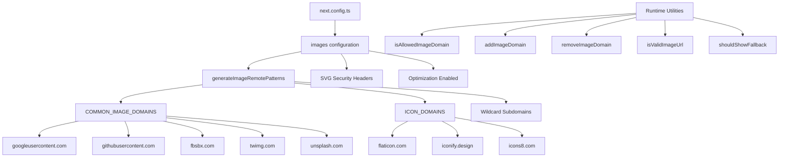

# Optimización de imagen

## Descripción general

La plantilla Ever Works configura la optimización de imágenes Next.js con patrones remotos dinámicos, compatibilidad con SVG y una capa de utilidad para la gestión de dominios. El sistema maneja imágenes de proveedores de OAuth (Google, GitHub, Facebook, Twitter), servicios de fotografías de archivo (Unsplash) y bibliotecas de íconos, al tiempo que aplica encabezados de seguridad para contenido SVG.

## Arquitectura



## Archivos fuente

|Archivo|Propósito|
|------|---------|
|`template/next.config.ts`|Configuración de imagen de Next.js|
|`template/lib/utils/image-domains.ts`|Utilidades de gestión de dominios|

## Configuración

### Configuración de imagen de Next.js

```typescript
// next.config.ts
images: {
    remotePatterns: generateImageRemotePatterns(),
    dangerouslyAllowSVG: true,
    contentDispositionType: 'attachment',
    contentSecurityPolicy: "default-src 'self'; script-src 'none'; sandbox;",
    unoptimized: false,
},
```

|Configuración|Valor|Propósito|
|---------|-------|---------|
|`remotePatterns`|Dinámico vía `generateImageRemotePatterns()`|Incluir dominios de imágenes externos en la lista blanca|
|`dangerouslyAllowSVG`|`true`|Permitir imágenes SVG a través del optimizador|
|`contentDispositionType`|`'attachment'`|Forzar la descarga en lugar de la representación en línea para acceso sin formato|
|`contentSecurityPolicy`|Caja de arena estricta|Prevenir ataques XSS basados en SVG|
|`unoptimized`|`false`|Mantener habilitada la optimización de imágenes|

### Seguridad SVG

Los archivos SVG pueden contener JavaScript incrustado. La plantilla mitiga esto con:
- **Política de seguridad de contenido**: `script-src 'none'; sandbox;` evita la ejecución de scripts en SVG
- **Disposición de contenido**: `attachment` garantiza que los SVG se descarguen, no se ejecuten, cuando se accede directamente

## Generación remota de patrones

La función `generateImageRemotePatterns()` crea la lista de permitidos dinámicamente:

```typescript
export function generateImageRemotePatterns() {
    const patterns = [
        {
            protocol: 'https' as const,
            hostname: 'lh3.googleusercontent.com',
            pathname: '/a/**'
        },
        {
            protocol: 'https' as const,
            hostname: 'avatars.githubusercontent.com',
            pathname: '/u/**'
        },
        {
            protocol: 'https' as const,
            hostname: 'platform-lookaside.fbsbx.com',
            pathname: '/platform/**'
        },
        // ... more specific patterns
    ];

    // Add wildcard subdomain patterns
    [...COMMON_IMAGE_DOMAINS, ...ICON_DOMAINS].forEach((domain) => {
        patterns.push({
            protocol: 'https' as const,
            hostname: `*.${domain}`,
            pathname: '/**'
        });
    });

    return patterns;
}
```

### Dominios permitidos

**Dominios de imágenes comunes** (avatares de OAuth, fotografías de archivo):

|Dominio|Fuente|
|--------|--------|
|`lh3.googleusercontent.com`|Avatares de Google OAuth|
|`avatars.githubusercontent.com`|Avatares de GitHub OAuth|
|`platform-lookaside.fbsbx.com`|Avatares de Facebook OAuth|
|`pbs.twimg.com`|Avatares de Twitter/X|
|`images.unsplash.com`|Unsplash fotos de archivo|

**Dominios de íconos** (íconos de elementos):

|Dominio|Fuente|
|--------|--------|
|`flaticon.com`|Iconos planos|
|`iconify.design`|Iconificar iconos|
|`icons8.com`|Iconos8 iconos|
|`feathericons.com`|Iconos de plumas|
|`heroicons.com`|Iconos de héroe|
|`tabler-icons.io`|Iconos de mesa|

## Gestión de dominios en tiempo de ejecución

### Comprobación de dominios permitidos

```typescript
import { isAllowedImageDomain } from '@/lib/utils/image-domains';

// Returns true for whitelisted domains
isAllowedImageDomain('https://lh3.googleusercontent.com/a/photo.jpg'); // true
isAllowedImageDomain('https://cdn.flaticon.com/icons/svg/123.svg');    // true
isAllowedImageDomain('https://evil-site.com/image.jpg');               // false

// Relative URLs are always allowed
isAllowedImageDomain('/images/logo.png'); // true
```

### Adición de dominio dinámico

```typescript
import { addImageDomain, removeImageDomain } from '@/lib/utils/image-domains';

// Add a new domain at runtime
addImageDomain('cdn.example.com');

// Add as an icon domain
addImageDomain('my-icons.com', true);

// Remove a domain
removeImageDomain('old-cdn.com');
```

Nota: Las adiciones de tiempo de ejecución afectan las funciones de la utilidad, pero no modifican los patrones remotos de Next.js `next.config.ts` (esos requieren una reconstrucción).

### Validación de URL

```typescript
import { isValidImageUrl, isProblematicUrl, shouldShowFallback } from '@/lib/utils/image-domains';

// Check URL format validity
isValidImageUrl('https://example.com/photo.jpg'); // true
isValidImageUrl('/images/local.png');              // true (relative)
isValidImageUrl('not-a-url');                      // false

// Check for problematic URLs (non-image pages, redirect URLs)
isProblematicUrl('https://flaticon.com/icone-gratuite/search'); // true (not a direct image)
isProblematicUrl('https://cdn.flaticon.com/icon.svg');          // false (has image extension)

// Determine if fallback icon should be shown
shouldShowFallback('');                                          // true (empty)
shouldShowFallback('https://flaticon.com/icone-gratuite/123');   // true (problematic)
shouldShowFallback('https://cdn.flaticon.com/icon.svg');         // false
```

## Encabezados de seguridad

El `next.config.ts` aplica encabezados de seguridad a todas las rutas:

```typescript
async headers() {
    return [{
        source: "/(.*)",
        headers: [
            { key: "X-Content-Type-Options", value: "nosniff" },
            { key: "X-Frame-Options", value: "DENY" },
            { key: "Referrer-Policy", value: "strict-origin-when-cross-origin" },
            { key: "X-DNS-Prefetch-Control", value: "on" },
            { key: "Strict-Transport-Security", value: "max-age=63072000; includeSubDomains; preload" },
            {
                key: "Content-Security-Policy",
                value: "default-src 'self'; script-src 'self' 'unsafe-inline' https://assets.lemonsqueezy.com; style-src 'self' 'unsafe-inline'; img-src 'self' data: https:; font-src 'self'; connect-src 'self' https:; frame-ancestors 'none';"
            },
        ],
    }];
},
```

La directiva `img-src 'self' data: https:` permite imágenes del mismo origen, URI de datos y cualquier fuente HTTPS. Esto es intencionalmente permisivo para `img-src` porque el componente Imagen Next.js maneja la validación del dominio a nivel de aplicación.

## Mejores prácticas

1. **Use `next/image`** para todas las imágenes externas: maneja la optimización, la carga diferida y la conversión de formato.
2. **Agregue nuevos dominios a `image-domains.ts`** -- no en línea en `next.config.ts`
3. **Compruebe `shouldShowFallback()`** antes de renderizar: muestra un icono predeterminado para URL no válidas o faltantes.
4. **Conserve los encabezados de seguridad SVG**: nunca elimine la configuración `contentSecurityPolicy` o `contentDispositionType`
5. **Prefiera restricciones de nombres de ruta**: use patrones `pathname` específicos (por ejemplo, `/a/**`) en lugar de comodines amplios cuando sea posible.
