# Descripción general de las utilidades Lib

El directorio `template/lib/` es la utilidad principal y la capa de lógica empresarial de la plantilla Ever Works. Contiene módulos compartidos para análisis, comunicación API, autenticación, trabajos en segundo plano, almacenamiento en caché, configuración, acceso a bases de datos, pagos, herramientas de edición, guardias y más. Toda la lógica sin componentes ni ruta vive aquí siguiendo el principio de mantener los componentes en forma de presentación y delegar la lógica pesada a `lib/`.

## Mapa del módulo

```mermaid
graph TD
    subgraph Core Infrastructure
        A[config/] --> B[config.ts / config-manager.ts]
        C[db/] --> D[drizzle.ts / queries/ / migrate.ts]
        E[cache-config.ts] --> F[cache-invalidation.ts]
    end

    subgraph Auth & Security
        G[auth/] --> H[NextAuth / Supabase / Guards / Caching]
        I[guards/] --> J[Plan Feature Access Control]
        K[permissions/] --> L[Role-Based Permissions]
    end

    subgraph API Layer
        M[api/] --> N[ApiClient / ServerClient / Error Handling]
    end

    subgraph Analytics & Tracking
        O[analytics/] --> P[PostHog + Sentry Singleton]
    end

    subgraph Background Processing
        Q[background-jobs/] --> R[Trigger.dev / Local / NoOp]
    end

    subgraph Content & Editor
        S[content.ts] --> T[Git CMS Content Loader]
        U[editor/] --> V[TipTap Rich Text Editor]
        W[lib.ts] --> X[Content Path / File Utilities]
    end

    subgraph Business Logic
        Y[services/] --> Z[20+ Domain Services]
        AA[repositories/] --> AB[Data Access Layer]
        AC[payment/] --> AD[Stripe / LemonSqueezy / Polar]
    end

    subgraph Shared Utilities
        AE[constants.ts + constants/]
        AF[utils.ts + utils/]
        AG[types.ts + types/]
        AH[validations/]
        AI[helpers.ts]
    end
```



## Estructura del directorio

|Directorio / Archivo|Descripción|
|-----------------|-------------|
|`lib/analytics/`|Singleton de análisis de PostHog + Sentry ([docs](./analytics-module))|
|`lib/api/`|Clientes HTTP para navegador y servidor ([docs](./api-client-module))|
|`lib/auth/`|Autenticación con NextAuth.js + Supabase ([docs](./auth-utilities-module))|
|`lib/background-jobs/`|Programación de trabajos con Trigger.dev/local/no-op ([docs](./background-jobs-module))|
|`lib/cache-config.ts`|TTL de caché y definiciones de etiquetas ([docs](./cache-invalidation-module))|
|`lib/cache-invalidation.ts`|Funciones de invalidación de caché ([docs](./cache-invalidation-module))|
|`lib/config/`|Servicio de configuración centralizado con esquemas Zod|
|`lib/config.ts`|Configuración del sitio (`siteConfig`)|
|`lib/config-manager.ts`|Administrador de configuración en tiempo de ejecución|
|`lib/constants.ts`|Barril de constantes de aplicación ([docs](./constants-reference-module))|
|`lib/constants/`|Constantes específicas del dominio (pago, análisis)|
|`lib/content.ts`|Carga y almacenamiento en caché de contenido CMS basado en Git|
|`lib/db/`|Conexión a base de datos, migraciones, inicialización, consultas ([docs](./db-utilities-module))|
|`lib/editor/`|Componentes y utilidades del editor de texto enriquecido TipTap ([docs](./editor-utilities-module))|
|`lib/guards/`|Control de acceso a funciones basado en planes ([docs](./guards-module))|
|`lib/helpers.ts`|Asignación de código de idioma a código de país|
|`lib/lib.ts`|Resolución de ruta de contenido, utilidades del sistema de archivos|
|`lib/logger.ts`|Utilidad de registro estructurado|
|`lib/mail/`|Envío de correo electrónico con soporte de plantilla|
|`lib/mappers/`|Mapeadores de transformación de datos|
|`lib/maps/`|Integraciones de proveedores de mapas (Google Maps, Mapbox)|
|`lib/middleware/`|Utilidades del middleware Next.js|
|`lib/newsletter/`|Proveedores de suscripción a boletines|
|`lib/paginate.ts`|Función auxiliar de paginación|
|`lib/payment/`|Procesamiento de pagos (Stripe, LemonSqueezy, Solidgate, Polar)|
|`lib/permissions/`|Definiciones de permisos basados en roles|
|`lib/query-client.ts`|Configuración del cliente React Query|
|`lib/react-query-config.ts`|Opciones predeterminadas de React Query|
|`lib/repositories/`|Capa de acceso a datos (patrón de repositorio)|
|`lib/repository.ts`|Operaciones del repositorio Git (clonar, extraer, sincronizar)|
|`lib/seo/`|Metadatos SEO y generadores de datos estructurados|
|`lib/services/`|Servicios de lógica empresarial (más de 20 servicios de dominio)|
|`lib/stripe-helpers.ts`|Utilidades específicas de Stripe|
|`lib/swagger/`|Anotaciones Swagger/OpenAPI|
|`lib/theme-color-manager.ts`|Gestión dinámica del color del tema|
|`lib/theme-utils.ts`|Funciones de utilidad del tema|
|`lib/themes.tsx`|Definiciones temáticas|
|`lib/types.ts`|Definiciones de tipos compartidos|
|`lib/types/`|Definiciones de tipos específicos de dominio|
|`lib/utils.ts`|Funciones de utilidad generales|
|`lib/utils/`|Utilidades específicas de dominio (más de 15 módulos)|
|`lib/validations/`|Esquemas de validación de Zod|

## Módulos independientes clave

### `lib/helpers.ts` -- Asignación de código de idioma/país

```typescript
type LanguageCode = 'en' | 'fr' | 'es' | 'zh' | 'de' | 'ar' | ... ;

const LANGUAGE_COUNTRY_CODES: Record<LanguageCode, string>;
// { en: 'US', fr: 'FR', es: 'ES', zh: 'CN', ... }

const appLocales: string[];
// All supported locale codes

function getCountryCode(languageCode?: LanguageCode): string;
// 'en' -> 'US', 'fr' -> 'FR'
```

### `lib/lib.ts` -- Ruta de contenido y sistema de archivos

Utilidades exclusivas del servidor para la gestión de directorios de contenidos:

```typescript
function getContentPath(): string;
// Returns '.content' path (local) or '/tmp/.content' (Vercel runtime)

async function ensureContentAvailable(): Promise<string>;
// Ensures content is available, triggering Git clone if needed

async function fsExists(filepath: string): Promise<boolean>;
async function dirExists(dirpath: string): Promise<boolean>;
```

### `lib/paginate.ts` -- Ayudante de paginación

```typescript
function paginate<T>(items: T[], page: number, limit: number): T[];
```

### `lib/logger.ts` -- Registro estructurado

```typescript
const logger = {
  info(message: string, context?: Record<string, any>): void;
  warn(message: string, context?: Record<string, any>): void;
  error(message: string, context?: Record<string, any>): void;
  debug(message: string, context?: Record<string, any>): void;
};
```

### `lib/color-generator.ts` -- Generación de color determinista

Genera colores consistentes a partir de cadenas (usadas para avatares, etiquetas, etc.).

### `lib/theme-color-manager.ts` -- Colores dinámicos del tema

Gestiona actualizaciones de propiedades personalizadas de CSS para cambiar de tema.

## Capa de servicios (`lib/services/`)

El directorio de servicios contiene servicios de lógica empresarial organizados por dominio:

|Servicio|Responsabilidad|
|---------|---------------|
|`analytics-background-processor.ts`|Procesamiento de análisis en segundo plano|
|`analytics-export.service.ts`|Exportación de datos analíticos|
|`analytics-scheduled-reports.service.ts`|Informes analíticos programados|
|`category-file.service.ts`|Operaciones de archivos de categoría|
|`category-git.service.ts`|Operaciones de categoría Git|
|`collection-git.service.ts`|Operaciones de colección Git|
|`company.service.ts`|Gestión del perfil de la empresa.|
|`currency-detection.service.ts`|Detección de moneda del usuario|
|`currency.service.ts`|Conversión de moneda|
|`email-notification.service.ts`|Notificaciones por correo electrónico|
|`engagement.service.ts`|Ver/votar/seguimiento de favoritos|
|`file.service.ts`|Carga/gestión de archivos|
|`geocoding/`|Geocodificación con proveedores de Google/Mapbox|
|`item-audit.service.ts`|Pista de auditoría del artículo|
|`item-git.service.ts`|Operaciones de Git del artículo|
|`location/`|Indexación y gestión de ubicaciones|
|`moderation.service.ts`|Moderación de contenido|
|`notification.service.ts`|Notificaciones push|
|`posthog-api.service.ts`|API PostHog del lado del servidor|
|`role-db.service.ts`|Gestión de roles|
|`settings.service.ts`|Configuración de la aplicación|
|`sponsor-ad.service.ts`|Gestión de anuncios de patrocinadores.|
|`stripe-products.service.ts`|Sincronización de productos Stripe|
|`subscription-jobs.ts`|Trabajos en segundo plano por suscripción|
|`subscription.service.ts`|Ciclo de vida de la suscripción|
|`survey.service.ts`|Gestión de encuestas|
|`sync-service.ts`|Sincronización del repositorio Git|
|`tag-git.service.ts`|Etiquetar operaciones de Git|
|`twenty-crm-*.ts`|Integración Twenty CRM (5 archivos)|
|`user-db.service.ts`|Operaciones de base de datos de usuarios|
|`webhook-subscription.service.ts`|Gestión de webhooks|

## Capa de utilidades (`lib/utils/`)

Módulos de utilidad para inquietudes específicas:

|Módulo|Propósito|
|--------|---------|
|`api-error.ts`|Clase de error de API|
|`bot-detection.ts`|Detección de agente-usuario de bot|
|`checkout-utils.ts`|Ayudantes de pago y pago|
|`client-auth.ts`|Utilidades de autenticación del lado del cliente|
|`currency-format.ts`|Formato de moneda|
|`custom-navigation.ts`|Navegación personalizada del enrutador|
|`database-check.ts`|Comprobación del estado de la base de datos|
|`email-validation.ts`|Validación del formato de correo electrónico|
|`error-handler.ts`|Manejador de errores globales|
|`featured-items.ts`|Selección de artículos destacados|
|`footer-utils.ts`|Utilidades de enlace de pie de página|
|`image-domains.ts`|Dominios de imagen permitidos|
|`pagination-validation.ts`|Validación de parámetros de paginación.|
|`payment-provider.ts`|Detección de proveedores de pagos|
|`plan-expiration.utils.ts`|Cálculos de vencimiento del plan|
|`rate-limit.ts`|Limitación de tasa API|
|`request-body.ts`|Solicitar análisis del cuerpo|
|`server-url.ts`|Resolución de URL del servidor|
|`settings.ts`|Funciones auxiliares de configuración|
|`slug.ts`|Generación de slugs de URL|
|`url-cleaner.ts`|Desinfección de URL|
|`url-filter-sync.ts`|Sincronización del estado del filtro de URL|

## Principios de diseño

1. **Separación de preocupaciones**: lógica empresarial en `services/`, acceso a datos en `repositories/` y `db/queries/`, presentación en `components/`.

2. **Seguridad de scripts**: los módulos utilizados por los scripts de migración/semilla (como `constants/payment.ts` y `db/config.ts`) evitan la importación de código específico de Next.js.

3. **Inicialización diferida**: las conexiones de bases de datos, los clientes API y los administradores de trabajos utilizan patrones únicos con inicialización diferida para evitar errores durante el tiempo de compilación.

4. **Importaciones dinámicas**: los módulos específicos de Node.js utilizan importaciones dinámicas en trabajos en segundo plano y autenticación para evitar problemas de agrupación de paquetes web.

5. **Límite de servidor/cliente**: los módulos exclusivos de servidor utilizan el paquete `server-only`. Los módulos seguros para el cliente evitan las importaciones de servidores. La directiva `'use client'` se utiliza con moderación.
