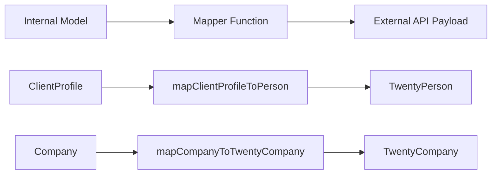

# Patrones de mapeador

La plantilla utiliza funciones de mapeo puras para transformar datos entre modelos internos y cargas útiles de API externas. Los mapeadores no tienen efectos secundarios, son seguros para nulos y validan los campos obligatorios antes de la transformación.

## Descripción general de la arquitectura



## Archivos fuente

|Archivo|Propósito|
|------|---------|
|`lib/mappers/twenty-crm.mapper.ts`|Asigna entidades locales a cargas útiles de Twenty CRM API|

## Principios de diseño

El módulo mapeador sigue estrictas convenciones de programación funcional:

1. **Funciones puras**: sin efectos secundarios, sin mutaciones, sin llamadas a bases de datos
2. **A prueba de nulos**: todos los campos opcionales utilizan comprobaciones nulas/indefinidas explícitas
3. **Validación antes del mapeo**: los campos obligatorios se validan con errores descriptivos
4. **Cumplimiento de identificación externa**: cada entidad asignada debe tener un `external_id` válido

## Validación de identificación externa

Cada entidad asignada a un sistema externo requiere un identificador válido:

```typescript
export function ensureExternalId(id: string | undefined | null, entityType: string): string {
  if (!id || id.trim() === '') {
    throw new Error(`${entityType} ID is required for external_id mapping`);
  }
  return id.trim();
}
```

Esta función se llama al inicio de cada asignador para garantizar que el campo `external_id` nunca esté vacío.

## Extracción de ubicación

Una función de utilidad analiza los nombres de las ciudades a partir de cadenas de ubicación de texto libre:

```typescript
export function extractCityFromLocation(location: string | undefined | null): string | null {
  if (!location || location.trim() === '') return null;
  const parts = location.split(',');
  const city = parts[0]?.trim();
  return city || null;
}
```

Maneja formatos como `"San Francisco"`, `"San Francisco, CA"` y `"San Francisco, CA, USA"`.

## Perfil de cliente de veinte personas de CRM

Asigna registros `ClientProfile` internos a la carga útil de Twenty CRM `TwentyPerson`:

```typescript
export function mapClientProfileToPerson(clientProfile: ClientProfile): TwentyPerson {
  const external_id = ensureExternalId(clientProfile.id, 'ClientProfile');

  const person: TwentyPerson = {
    external_id,
    name: clientProfile.name,
    email: clientProfile.email,
  };

  // Optional field mapping (null-safe)
  if (clientProfile.phone)     person.phone = clientProfile.phone;
  if (clientProfile.jobTitle)  person.job_title = clientProfile.jobTitle;
  if (clientProfile.company)   person.company_name = clientProfile.company;
  if (clientProfile.website)   person.website = clientProfile.website;

  const city = extractCityFromLocation(clientProfile.location);
  if (city) person.city = city;

  // Custom fields
  if (clientProfile.accountType) person.account_type = clientProfile.accountType;
  if (clientProfile.plan)        person.plan = clientProfile.plan;
  if (clientProfile.totalSubmissions !== null && clientProfile.totalSubmissions !== undefined) {
    person.total_submissions = clientProfile.totalSubmissions;
  }

  return person;
}
```

### Tabla de mapeo de campos

|Campo de perfil de cliente|Campo de veinte personas|Requerido|Notas|
|--------------------|--------------------|----------|-------|
|`id`|`external_id`|si|Validado y recortado|
|`name`|`name`|si|Mapeo directo|
|`email`|`email`|si|Mapeo directo|
|`phone`|`phone`|No|Sólo si está presente|
|`jobTitle`|`job_title`|No|camelCase a Snake_case|
|`company`|`company_name`|No|Campo renombrado|
|`website`|`website`|No|Mapeo directo|
|`location`|`city`|No|Extraído vía `extractCityFromLocation`|
|`accountType`|`account_type`|No|Campo personalizado|
|`plan`|`plan`|No|Campo personalizado|
|`totalSubmissions`|`total_submissions`|No|Se requiere verificación nula explícita|

## Empresa a empresa Twenty CRM

Asigna entidades internas `Company` a la carga útil de Twenty CRM `TwentyCompany`:

```typescript
export function mapCompanyToTwentyCompany(company: Company): TwentyCompany {
  const external_id = ensureExternalId(company.id, 'Company');

  const twentyCompany: TwentyCompany = {
    external_id,
    name: company.name,
  };

  if (company.domain)  twentyCompany.domain_name = company.domain;
  if (company.website) twentyCompany.website = company.website;
  if (company.status)  twentyCompany.status = company.status;

  return twentyCompany;
}
```

### Tabla de mapeo de campos

|Campo de la empresa|Campo TwentyCompany|Requerido|Notas|
|--------------|---------------------|----------|-------|
|`id`|`external_id`|si|Validado y recortado|
|`name`|`name`|si|Mapeo directo|
|`domain`|`domain_name`|No|Campo renombrado|
|`website`|`website`|No|Mapeo directo|
|`status`|`status`|No|`'active'` o `'inactive'`|

## Agregar nuevos mapeadores

Al crear mapeadores para nuevas integraciones, siga los patrones establecidos:

```typescript
// 1. Always validate external_id first
const external_id = ensureExternalId(entity.id, 'EntityName');

// 2. Build the required fields object
const payload: ExternalType = {
  external_id,
  // ... required fields
};

// 3. Conditionally add optional fields (null-safe)
if (entity.optionalField) {
  payload.optional_field = entity.optionalField;
}

// 4. Return the payload -- never mutate the input
return payload;
```

## Consideraciones de prueba

Dado que los mapeadores son funciones puras, es sencillo realizar pruebas unitarias:

- Prueba con todos los campos opcionales completados
- Pruebe con todos los campos opcionales como `null` o `undefined`
- Pruebe que los ID requeridos que faltan generen errores descriptivos
- Extracción de ubicación de prueba con varios formatos de cadena
- Verifique que el objeto de entrada nunca esté mutado
