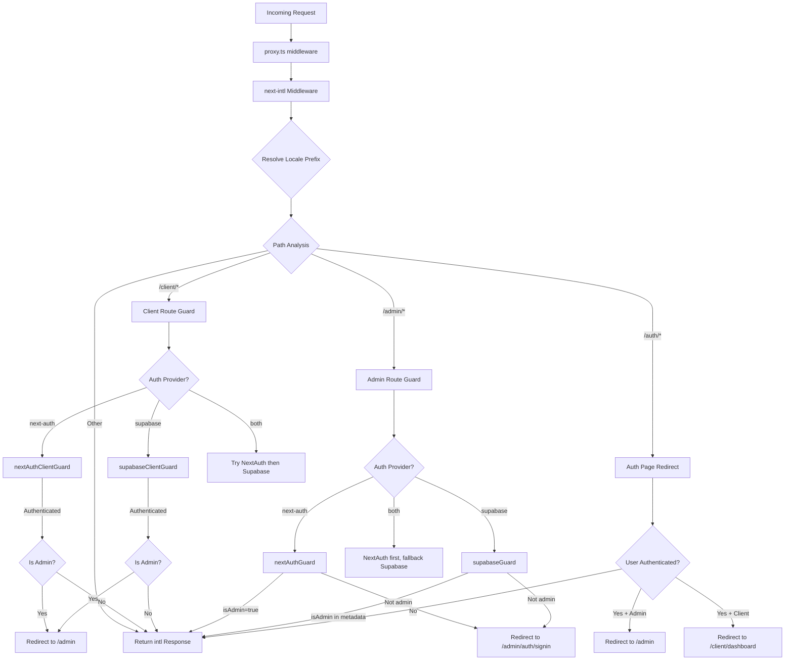

# Cadena de middleware y procesamiento de solicitudes

## Descripción general

La plantilla Ever Works utiliza una arquitectura **middleware unificada** definida en `proxy.ts` en la raíz del proyecto. Este middleware organiza tres preocupaciones críticas para cada solicitud entrante:

1. **Internacionalización**: detección de configuración regional, inserción de prefijos y enrutamiento a través de `next-intl`
2. **Guardias de autenticación**: protegen las rutas `/admin/*` y `/client/*` utilizando NextAuth, Supabase o ambos.
3. **Redirección basada en roles**: alejar a los usuarios autenticados de las páginas de autenticación públicas y redirigir a los administradores/clientes a sus respectivos paneles

El diseño admite un modelo de **proveedor de autenticación conectable**: el middleware lee el `AuthProviderType` (`'next-auth'`, `'supabase'` o `'both'` actual de la configuración de autenticación centralizada y selecciona las funciones de protección apropiadas en consecuencia.

## Diagrama de arquitectura



## Archivos fuente

|Archivo|Propósito|
|------|---------|
|`template/proxy.ts`|Punto de entrada principal del middleware|
|`template/lib/auth/config.ts`|Configuración del proveedor de autenticación (`getAuthConfig()`)|
|`template/lib/auth/supabase/middleware.ts`|Ayudante de actualización de sesión de Supabase|
|`template/lib/auth/validate-callback-url.ts`|Construcción de URL de devolución de llamada segura|
|`template/i18n/routing.ts`|Configuración de enrutamiento local|

## Solicitar orden de procesamiento

### Paso 1: Internacionalización

Cada solicitud pasa primero por el middleware `next-intl` creado con `createIntlMiddleware(routing)`:

```typescript
import createIntlMiddleware from 'next-intl/middleware';
import { routing } from './i18n/routing';

const intl = createIntlMiddleware(routing);
```

Esto maneja la detección de configuración regional a través del encabezado `Accept-Language`, las preferencias de cookies y el prefijo de URL. La configuración de enrutamiento usa `localePrefix: "as-needed"`, lo que significa que la configuración regional predeterminada (`en`) no requiere un prefijo de URL.

### Paso 2: resolución local

El ayudante `resolveLocalePrefix` extrae información local del nombre de ruta:

```typescript
function resolveLocalePrefix(pathname: string): {
    prefix: string;       // e.g., "/fr" or ""
    hasLocale: boolean;
    locale?: string;
    pathWithoutLocale: string;  // e.g., "/admin/items"
}
```

Esto es fundamental porque todas las coincidencias de rutas posteriores (por ejemplo, comprobar `/admin` o `/client`) deben operar en la ruta **sin** el prefijo local.

### Paso 3: Selección de guardia basada en ruta

El middleware evalúa `pathWithoutLocale` para determinar qué cadena de protección aplicar:

|Patrón de ruta|Guardia aplicada|Propósito|
|-------------|--------------|---------|
|`/client` o `/client/*`|Guardia de autenticación del cliente|Requiere autenticación; redirige a los administradores a `/admin`|
|`/admin/*` (excepto `/admin/auth/signin`)|Guardia de autenticación de administrador|Requiere autenticación + `isAdmin` bandera|
|`/auth/*`|Redirección de página de autenticación|Redirige a los usuarios autenticados fuera del inicio de sesión/registro|
|Todo lo demás|sin guardia|Pasa con respuesta i18n|

### Paso 4: Verificación de autenticación

#### SiguienteAuth Guard (basado en JWT)

```typescript
const token = await getToken({ req, secret: process.env.AUTH_SECRET });
if (token?.isAdmin === true) {
    return baseRes; // Admin access granted
}
```

Los guardias de NextAuth usan `getToken()` de `next-auth/jwt` para leer el token JWT de las cookies. Es compatible con Edge Runtime y no requiere una búsqueda en la base de datos.

#### Guardia Supabase

```typescript
const supRes = await supabaseUpdate(req);
// Merge cookies...
const { data: { user } } = await supabase.auth.getUser();
const isAdmin = user?.user_metadata?.isAdmin === true
    || user?.user_metadata?.role === 'admin';
```

El guardia de Supabase primero actualiza la sesión usando `updateSession()`, luego verifica los metadatos del usuario en busca de indicadores de administrador.

### Paso 5: propagación de cookies

Un detalle de implementación crítico: cuando un guardia produce una respuesta de redireccionamiento, todas las cookies de `intlResponse` deben propagarse:

```typescript
const redirectRes = NextResponse.redirect(url);
baseRes.cookies.getAll().forEach((c) => redirectRes.cookies.set(c));
return redirectRes;
```

Esto garantiza que las preferencias locales y las cookies de sesión de autenticación sobrevivan a las redirecciones.

## Configuración

### Selección de proveedor de autenticación

El proveedor de autenticación lo determina `getAuthConfig()` en `lib/auth/config.ts`:

```typescript
export type AuthProviderType = 'supabase' | 'next-auth' | 'both';

export function getAuthConfig(): AuthConfig {
    // Priority 1: Global override via configureAuth()
    // Priority 2: Environment-based (detects Supabase env vars)
    // Priority 3: Default ('next-auth')
}
```

### Comparador de middleware

```typescript
export const config = {
    matcher: ['/((?!api|trpc|_next|_vercel|.*\\..*).*)']
};
```

Esta expresión regular excluye:
- `/api/*` rutas (manejadas por la capa API Next.js)
- `/trpc/*` rutas
- `/_next/*` (partes internas de Next.js)
- `/_vercel/*` (partes internas de Vercel)
- Cualquier ruta con una extensión de archivo (activos estáticos)

### Seguridad de URL de devolución de llamada

El middleware utiliza `createSafeCallbackUrl()` para evitar ataques de redireccionamiento abierto:

```typescript
export function createSafeCallbackUrl(pathname: string, search?: string): string {
    // Limits URL length to 2048 characters
    // Validates relative-only paths
}

export function isValidCallbackUrl(url: string | null): boolean {
    return url?.startsWith('/') && !url.startsWith('//');
}
```

## Modo de proveedor dual ("ambos")

Cuando `provider === 'both'`, el middleware implementa una cadena de respaldo:

1. **Rutas del cliente**: Pruebe NextAuth primero; si no está autenticado, pruebe Supabase
2. **Rutas de administración**: Pruebe NextAuth primero; si produce una redirección (denegada), pruebe Supabase
3. **Páginas de autenticación**: primero verifique el token NextAuth y luego verifique la sesión de Supabase

Esto permite a las organizaciones migrar entre proveedores de autenticación sin interrumpir a los usuarios existentes.

## Detalles clave de implementación

### Compatibilidad con el tiempo de ejecución de Edge

El middleware se ejecuta en Next.js Edge Runtime. Todas las comprobaciones de autenticación utilizan API compatibles con Edge:
- NextAuth: `getToken()` (basado en JWT, no se necesita base de datos)
- Supabase: `createServerClient()` con sesión basada en cookies

### Registro de desarrollo versus producción

El registro de depuración está cerrado detrás de `NODE_ENV === 'development'`:

```typescript
if (process.env.NODE_ENV === 'development') {
    console.log('[Middleware] Admin access granted via token');
}
```

### Actualización de sesión de Supabase

Se llama al asistente de middleware Supabase (`updateSession`) antes de cada verificación de autenticación para garantizar que los tokens se actualicen:

```typescript
export async function updateSession(request: NextRequest) {
    const supabase = createServerClient(url, anonKey, {
        cookies: { getAll, setAll }
    });
    // IMPORTANT: DO NOT REMOVE auth.getUser()
    await supabase.auth.getUser();
    return supabaseResponse;
}
```

El comentario en el código fuente enfatiza que `auth.getUser()` no debe eliminarse: activa el ciclo de actualización del token que evita cierres de sesión aleatorios.
