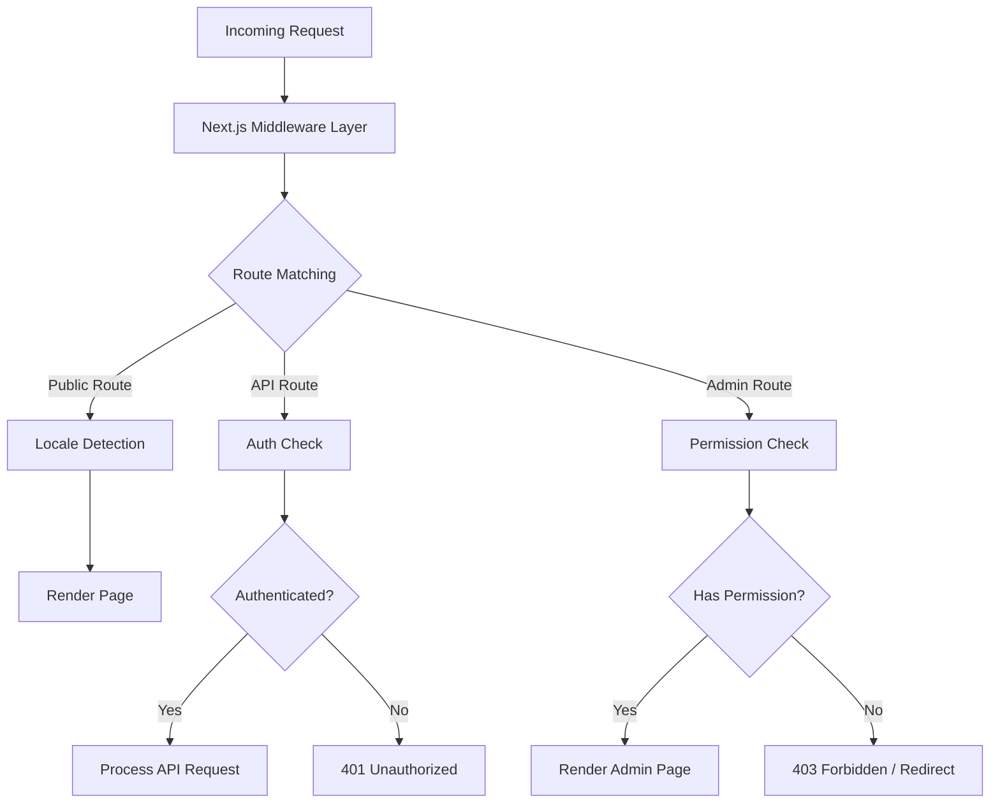
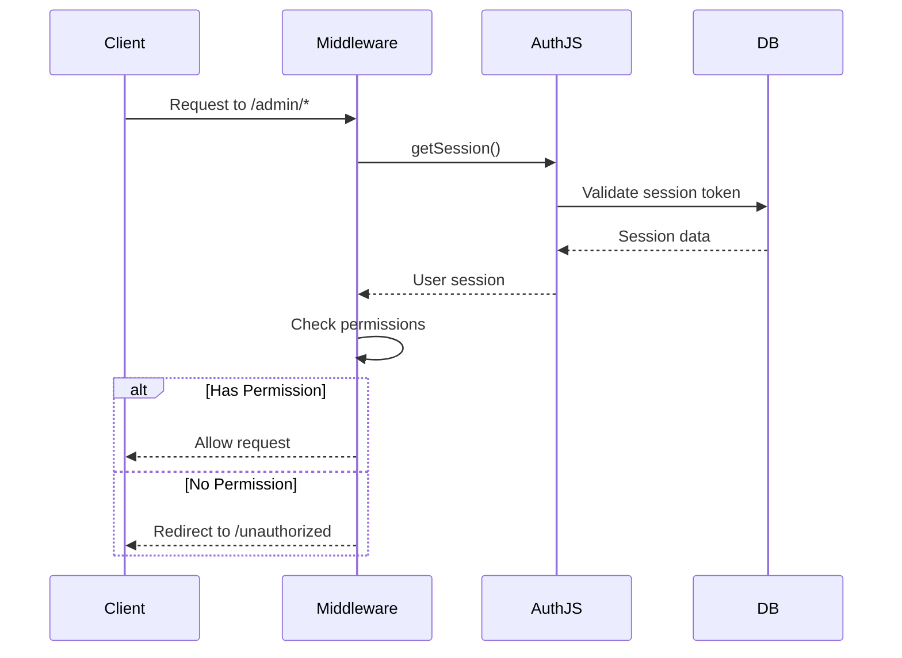
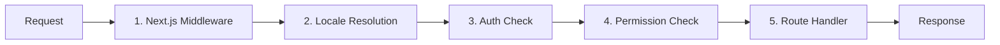

# Análisis profundo del middleware

La plantilla Ever Works utiliza una arquitectura de middleware en capas basada en las convenciones de Next.js App Router y una lógica de verificación de permisos personalizada. Este documento cubre todo el proceso de procesamiento de solicitudes, comprobaciones de permisos, middleware de autenticación, manejo local y pedido de middleware.

## Descripción general de la arquitectura



## Middleware de verificación de permisos

El sistema de verificación de permisos reside en `lib/middleware/permission-check.ts` y proporciona control de acceso granular para rutas API y páginas de administración.

### Interfaz principal

```typescript
interface UserPermissions {
  userId: string;
  roles: string[];
  permissions: Permission[];
}
```

### Funciones de verificación de permisos

|Función|Propósito|Devoluciones|
|---|---|---|
|`hasPermission(user, permission)`|Verificar permiso único|`boolean`|
|`hasAnyPermission(user, permissions)`|Compruebe si el usuario tiene al menos uno|`boolean`|
|`hasAllPermissions(user, permissions)`|Compruebe si el usuario tiene todos los listados|`boolean`|
|`hasResourcePermission(user, resource, action)`|Compruebe el formato `resource:action`|`boolean`|
|`getResourcePermissions(user, resource)`|Obtener todos los permisos para un recurso|`Permission[]`|
|`canManageResource(user, resource)`|Marque crear/actualizar/eliminar acceso|`boolean`|
|`isSuperAdmin(user)`|Verifique la función de superadministrador o todos los permisos|`boolean`|

### Uso en rutas API

```typescript
import { hasPermission, hasAnyPermission } from '@/lib/middleware/permission-check';

export async function GET(request: Request) {
  const userPermissions = await getUserPermissions(session);

  // Single permission check
  if (!hasPermission(userPermissions, 'items:read')) {
    return new Response('Forbidden', { status: 403 });
  }

  // Multiple permission check (any)
  if (!hasAnyPermission(userPermissions, ['items:review', 'items:approve'])) {
    return new Response('Forbidden', { status: 403 });
  }
}
```

### Comprobaciones de nivel de recursos

```typescript
// Check specific resource and action
const canEdit = hasResourcePermission(userPermissions, 'items', 'update');

// Get all permissions for a resource
const itemPerms = getResourcePermissions(userPermissions, 'items');
// Returns: ['items:read', 'items:create', 'items:update']

// Check management capability (create, update, or delete)
const canManage = canManageResource(userPermissions, 'categories');
```

### Ayudantes de permisos especializados

El middleware proporciona ayudas específicas de dominio que combinan múltiples comprobaciones de permisos:

```typescript
// Can the user review, approve, or reject items?
const canReview = canReviewItems(userPermissions);

// Can the user manage users (read, create, update, delete, assignRoles)?
const canAdmin = canManageUsers(userPermissions);

// Can the user view analytics data?
const canView = canViewAnalytics(userPermissions);

// Is the user a super admin?
const isAdmin = isSuperAdmin(userPermissions);
```

### Detección de superadministrador

La función `isSuperAdmin` utiliza un enfoque de dos niveles:

1. **Verificación de rol** (principal): Comprueba si el usuario tiene el rol `super-admin`
2. **Verificación de permisos** (alternativa): verifica que el usuario tenga todos los permisos del sistema

```typescript
function isSuperAdmin(userPermissions: UserPermissions): boolean {
  // Fast path: check role
  if (userPermissions.roles.includes('super-admin')) {
    return true;
  }
  // Exhaustive check: verify all permissions
  return hasAllPermissions(userPermissions, allSystemPermissions);
}
```

## Middleware de autenticación

La autenticación se maneja a través de NextAuth.js (Auth.js v5) configurado en `auth.config.ts`. El middleware se ejecuta en cada solicitud de rutas protegidas.

### Configuración del proveedor

La configuración de autenticación configura dinámicamente los proveedores de OAuth con un respaldo elegante:

|Proveedor|Fuente de configuración|
|---|---|
|google|`authConfig.google.clientId/clientSecret`|
|GitHub|`authConfig.github.clientId/clientSecret`|
|facebook|`authConfig.facebook.clientId/clientSecret`|
|Gorjeo/X|`authConfig.twitter.clientId/clientSecret`|
|Credenciales|Siempre habilitado|

Si la configuración de OAuth falla, el sistema recurre a la autenticación de solo credenciales.

### Flujo de sesión de autenticación



## Middleware local

La plantilla admite más de 20 configuraciones regionales a través de la integración de middleware `next-intl`. La detección de configuración regional sigue el patrón de prefijo "según sea necesario":

- Configuración regional predeterminada (`en`): Sin prefijo de URL -- `/items/my-app`
- Otras configuraciones regionales: prefijo local: `/fr/items/my-app`

### Configuraciones regionales admitidas

|Localidad|Idioma|Localidad|Idioma|
|---|---|---|---|
|`en`|Inglés (predeterminado)|`ja`|japonés|
|`fr`|francés|`ko`|coreano|
|`es`|español|`nl`|holandés|
|`de`|alemán|`pl`|polaco|
|`zh`|chino|`tr`|turco|
|`ar`|árabe|`vi`|vietnamita|
|`he`|hebreo|`th`|tailandés|
|`ru`|ruso|`hi`|hindi|
|`uk`|Ucraniano|`id`|indonesio|
|`pt`|portugués|`bg`|búlgaro|
|`it`|italiano| | |

## Canal de procesamiento de solicitudes

El proceso completo de procesamiento de solicitudes sigue este orden:



### Pasos del oleoducto

1. **Middleware Next.js** (`middleware.ts`): se ejecuta en cada solicitud que coincida con los comparadores configurados. Maneja redirecciones, reescrituras e inyección de encabezados.

2. **Resolución de configuración regional**: Detecta la configuración regional preferida del usuario a partir de la ruta URL, el encabezado `Accept-Language` o la cookie. Establece la configuración regional para el contexto de la solicitud.

3. **Verificación de autenticación**: Para rutas protegidas (`/admin/*`, `/dashboard/*`, `/api/admin/*`), valida el token de sesión del usuario.

4. **Verificación de permisos**: después de la autenticación, verifica que el usuario tenga los permisos necesarios para el recurso y la acción específicos.

5. **Controlador de ruta**: el componente de página real o el controlador de ruta API procesa la solicitud.

### Garantías de pedidos de middleware

El sistema impone un orden estricto:

- La detección de configuración regional siempre se ejecuta primero (necesaria para las páginas de error)
- Las comprobaciones de autenticación se ejecutan antes que las comprobaciones de permisos (se necesita un usuario para comprobar los permisos)
- Los controles de permisos son la última puerta antes de que los manejadores de rutas
- Las rutas API utilizan comprobaciones de permisos a nivel de función (no a nivel de middleware)

## Utilidades de validación de permisos

El middleware incluye ayudas de validación para trabajar con cadenas de permisos:

```typescript
// Validate a permission string
validatePermission('items:read');     // true
validatePermission('invalid:perm');   // false

// Parse a permission into parts
parsePermission('items:update');
// Returns: { resource: 'items', action: 'update' }

// Get summary grouped by resource
getPermissionSummary(userPermissions);
// Returns: { items: ['read', 'create'], categories: ['read'] }
```

## Manejo de errores

El sistema middleware maneja errores en cada capa:

|capa|error|Respuesta|
|---|---|---|
|Localidad|Configuración regional no válida|Redirigir a la configuración regional predeterminada|
|autenticación|Sin sesión|401 o redirigir para iniciar sesión|
|autenticación|Sesión caducada|401 con sugerencia de actualización|
|Permiso|Permiso faltante|403 Prohibido|
|Permiso|Cadena de permiso no válida|Advertencia registrada, acceso denegado|

## Mejores prácticas

1. **Utilice la verificación más específica**: prefiera `hasPermission` con un único permiso en lugar de `isSuperAdmin` para la activación normal de funciones.

2. **Verifique los permisos en las rutas API**: no confíe únicamente en el middleware; validar siempre en el controlador de ruta para una defensa en profundidad.

3. **Utilice importaciones dinámicas** en el middleware para evitar agrupar módulos exclusivos del servidor en el tiempo de ejecución perimetral.

4. **Mantenga las comprobaciones de permisos rápidas**: la búsqueda de conjuntos de permisos `O(1)` garantiza una sobrecarga mínima por solicitud.

5. **Errores de permisos de registro**: utilice el registro estructurado con el ID de usuario y el permiso intentado para la auditoría de seguridad.
