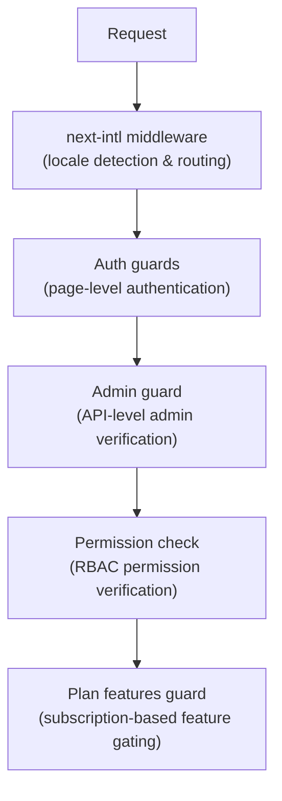

# Middleware y guardias

La plantilla Ever Works utiliza un sistema de protección en capas que consta de middleware Next.js para enrutamiento, protectores de autenticación para protección de páginas y API, verificaciones de permisos para RBAC y protectores de funciones basadas en planes para control de suscripciones.

## Capas de middleware



## Middleware local (siguiente-intl)

El middleware raíz maneja el enrutamiento de internacionalización a través de `next-intl`. Se configura a través de `i18n/routing.ts` y `i18n/request.ts`.

Responsabilidades:
- Detectar la configuración regional del usuario a partir de la ruta URL, las cookies o el encabezado `Accept-Language`
- Redirigir solicitudes sin prefijo local a la configuración regional apropiada
- El valor predeterminado es inglés (`en`) cuando no se detecta ninguna preferencia
- Admite 6 configuraciones regionales: `en`, `fr`, `es`, `de`, `ar`, `zh`.

## Guardias de autenticación

### Guardias a nivel de página (`lib/auth/guards.ts`)

El módulo de guardias proporciona comprobaciones de autenticación del lado del servidor para las páginas. Estos se llaman en la parte superior de los componentes del servidor para proteger el acceso a la página.

**`requireAuth()`** -- Requiere que el usuario esté autenticado:

```typescript
import { requireAuth } from '@/lib/auth/guards';

export default async function ProtectedPage() {
  const session = await requireAuth();
  // session.user is guaranteed to exist here
  return <div>Welcome {session.user.email}</div>;
}
```

Si el usuario no está autenticado, se le redirige a `/auth/signin`.

**`requireAdmin()`** -- Requiere que el usuario esté autenticado Y tenga función de administrador:

```typescript
import { requireAdmin } from '@/lib/auth/guards';

export default async function AdminPage() {
  const session = await requireAdmin();
  return <div>Admin: {session.user.email}</div>;
}
```

Si el usuario no está autenticado, se le redirige a `/admin/auth/signin`. Si está autenticado pero no es administrador, se le redirige a `/unauthorized`.

**`getSession()`** -- Obtiene la sesión sin redirigir:

```typescript
const session = await getSession();
if (session) {
  // Authenticated
} else {
  // Guest
}
```

**`checkIsAdmin()`** -- Comprueba el estado del administrador sin redirigir:

```typescript
const isAdmin = await checkIsAdmin();
// Returns true or false
```

### Acciones validadas (`lib/auth/guards.ts`)

El módulo de guardias también proporciona envoltorios de acciones validados para las acciones del servidor Next.js:

**`validatedAction(schema, action)`** -- Valida los datos del formulario con un esquema Zod:

```typescript
export const myAction = validatedAction(mySchema, async (data, formData) => {
  // data is validated and typed
});
```

**`validatedActionWithUser(schema, action)`** -- Valida y requiere autenticación:

```typescript
export const myAction = validatedActionWithUser(mySchema, async (data, formData, user) => {
  // data is validated, user is authenticated
});
```

## Guardia administrativa (`lib/auth/admin-guard.ts`)

La protección de administración proporciona protección de ruta API específicamente para puntos finales de administración.

**`checkAdminAuth()`** -- Función de middleware para rutas API:

```typescript
import { checkAdminAuth } from '@/lib/auth/admin-guard';

export async function GET(request: NextRequest) {
  const authError = await checkAdminAuth();
  if (authError) return authError;

  // User is verified admin, proceed with handler
}
```

Devuelve `null` si está autorizado, o un `NextResponse` con el estado de error apropiado (401 o 403).

**`withAdminAuth(handler)`** -- Contenedor de funciones de orden superior:

```typescript
import { withAdminAuth } from '@/lib/auth/admin-guard';

export const GET = withAdminAuth(async (request) => {
  // Already verified as admin
  return NextResponse.json({ data: 'admin only' });
});
```

El guardia de administrador verifica tanto la autenticación (la sesión existe) como la autorización (el usuario tiene una función de administrador en la base de datos mediante la verificación `isAdmin()`).

## Sistema de verificación de permisos (`lib/middleware/permission-check.ts`)

El sistema de permisos implementa el control de acceso basado en roles (RBAC) con permisos granulares.

### Estructura de permisos

Los permisos siguen un formato `resource:action`:

```typescript
// Examples of permission keys
'items:read'
'items:create'
'items:update'
'items:delete'
'items:review'
'items:approve'
'items:reject'
'categories:read'
'categories:create'
'users:assignRoles'
'analytics:read'
'system:settings'
```

### Funciones de verificación de permisos

```typescript
import {
  hasPermission,
  hasAnyPermission,
  hasAllPermissions,
  hasResourcePermission,
  canManageResource,
  canReviewItems,
  canManageUsers,
  canManageRoles,
  canViewAnalytics,
  isSuperAdmin,
} from '@/lib/middleware/permission-check';

// Single permission check
hasPermission(userPermissions, 'items:create');

// Any of multiple permissions
hasAnyPermission(userPermissions, ['items:create', 'items:update']);

// All permissions required
hasAllPermissions(userPermissions, ['items:read', 'items:update']);

// Resource-level check
hasResourcePermission(userPermissions, 'items', 'create');

// Domain-specific helpers
canManageResource(userPermissions, 'categories'); // create, update, or delete
canReviewItems(userPermissions);                  // review, approve, or reject
canManageUsers(userPermissions);                  // user CRUD + assignRoles
isSuperAdmin(userPermissions);                    // all system permissions
```

### Detección de superadministrador

La función `isSuperAdmin()` comprueba dos condiciones:
1. Si el usuario tiene el rol `super-admin` (preferido)
2. Como alternativa, si el usuario tiene TODOS los permisos del sistema.

### Validación de permiso

```typescript
// Validate a permission string is defined in the system
validatePermission('items:create'); // true
validatePermission('invalid:perm'); // false

// Parse permission into resource and action
parsePermission('items:create'); // { resource: 'items', action: 'create' }
```

## Plan Características Guardia (`lib/guards/plan-features.guard.ts`)

El plan incluye controles de guardia y acceso a funciones según planes de suscripción (Gratis, Estándar, Premium).

### Jerarquía del plan

```typescript
const PLAN_LEVELS = {
  free: 1,
  standard: 2,
  premium: 3,
};
```

### Matriz de acceso a funciones

Cada característica está asignada a los planes que pueden acceder a ella:

|Característica|Gratis|Estándar|prima|
|---------|------|----------|---------|
|Enviar producto|si|si|si|
|Subir imágenes|si|si|si|
|Soporte por correo electrónico|si|si|si|
|Descripción ampliada| - |si|si|
|Insignia verificada| - |si|si|
|Revisión prioritaria| - |si|si|
|Ver estadísticas| - |si|si|
|Subir vídeo| - | - |si|
|Insignia patrocinada| - | - |si|
|Página de inicio Destacados| - | - |si|
|Análisis avanzado| - | - |si|
|Envíos ilimitados| - | - |si|

### Límites del plan

Cada plan tiene límites numéricos para ciertas funciones:

|Límite|Gratis|Estándar|prima|
|-------|------|----------|---------|
|Imágenes máximas| 1 | 5 |Ilimitado|
|Palabras de descripción máxima| 200 | 500 |Ilimitado|
|Envíos máximos| 1 | 10 |Ilimitado|
|Días de revisión| 7 | 3 | 1 |
|Días de modificación gratuita| 0 | 30 | 365 |

### Usando el Plan Guard

**Llamadas a funciones directas:**

```typescript
import { canAccessFeature, getFeatureLimit, isWithinLimit } from '@/lib/guards';

canAccessFeature('upload_video', 'free');    // false
canAccessFeature('upload_video', 'premium'); // true
getFeatureLimit('max_images', 'standard');   // 5
isWithinLimit('max_submissions', 3, 'free'); // false (limit is 1)
```

**Guardia de fábrica (para controles múltiples):**

```typescript
import { createPlanGuard } from '@/lib/guards';

const guard = createPlanGuard('standard');
guard.canAccess('verified_badge');     // true
guard.canAccess('upload_video');       // false
guard.getLimit('max_images');          // 5
guard.requireFeature('upload_video');  // throws PlanGuardError
```

**Integración del gancho de reacción:**

```typescript
import { createPlanGuardResult } from '@/lib/guards';

// In a hook or component
const guardResult = createPlanGuardResult(userPlan);
guardResult.canAccess('verified_badge');
guardResult.accessibleFeatures; // array of all accessible features
```

El `PlanGuardError` lanzado por `requireFeature()` incluye el nombre de la función, el plan actual del usuario y el plan requerido, lo que permite mensajes informativos de actualización en la interfaz de usuario.
