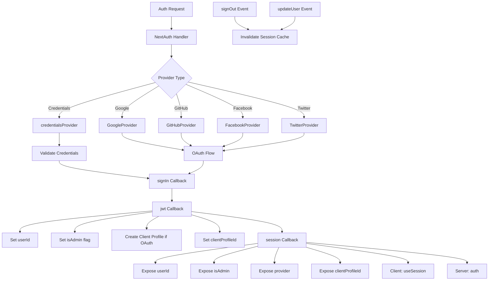

# Configuración de autenticación siguiente

## Descripción general

La plantilla Ever Works configura NextAuth.js (Auth.js v5) con sesiones basadas en JWT, un adaptador Drizzle ORM, múltiples proveedores de OAuth (Google, GitHub, Facebook, Twitter), autenticación basada en credenciales y devoluciones de llamadas personalizadas para la gestión de roles de administrador/cliente. El sistema admite la creación automática de perfiles de cliente para usuarios de OAuth y el almacenamiento en caché de sesiones con invalidación de caché.

## Arquitectura



## Archivos fuente

|Archivo|Propósito|
|------|---------|
|`template/lib/auth/index.ts`|Configuración y exportaciones principales de NextAuth|
|`template/auth.config.ts`|Configuración del proveedor (compatible con Edge)|
|`template/lib/auth/config.ts`|Selección del tipo de proveedor de autenticación|
|`template/lib/auth/providers.ts`|Funciones de fábrica del proveedor OAuth|
|`template/lib/auth/credentials.ts`|Implementación del proveedor de credenciales|
|`template/lib/auth/guards.ts`|Utilidades de protección de autenticación del lado del servidor|
|`template/lib/auth/middleware.ts`|Envoltorios de acciones validados|
|`template/lib/auth/setup.ts`|Ayudante de inicialización de autenticación|
|`template/lib/auth/cached-session.ts`|Gestión de caché de sesión|
|`template/lib/auth/session-cache.ts`|Implementación de caché de sesión|
|`template/lib/auth/admin-guard.ts`|Lógica de protección específica del administrador|

## Siguiente inicialización de autenticación

```typescript
// lib/auth/index.ts
export const { handlers, auth, signIn, signOut, unstable_update } = NextAuth({
    adapter: drizzle,
    session: {
        strategy: 'jwt',
        maxAge: 30 * 24 * 60 * 60,    // 30 days
        updateAge: 24 * 60 * 60        // Refresh every 24 hours
    },
    jwt: {
        maxAge: 30 * 24 * 60 * 60      // 30 days
    },
    callbacks: { authorized, redirect, signIn, jwt, session },
    events: { signOut, updateUser },
    pages: {
        signIn: '/auth/signin',
        signOut: '/auth/signout',
        error: '/auth/error',
        verifyRequest: '/auth/verify-request',
        newUser: '/auth/register'
    },
    ...authConfig  // Merges providers from auth.config.ts
});
```

### Estrategia de sesión

La plantilla utiliza **sesiones JWT** (`strategy: 'jwt'`), no sesiones de base de datos. Esto significa:
- Las sesiones se almacenan en cookies cifradas, no en la base de datos.
- No se necesita ninguna consulta a la base de datos para validar una sesión.
- Compatible con Edge Runtime (middleware)
- Los datos de la sesión se limitan a lo que cabe en un token JWT

## Adaptador de base de datos

```typescript
const isDatabaseAvailable = !!coreConfig.DATABASE_URL && typeof db !== 'undefined';

const drizzle = isDatabaseAvailable
    ? DrizzleAdapter(getDrizzleInstance(), {
        usersTable: users,
        accountsTable: accounts,
        sessionsTable: sessions,
        verificationTokensTable: verificationTokens
    })
    : undefined;
```

El adaptador se crea condicionalmente según la disponibilidad de la base de datos. Esto permite que la plantilla se inicie incluso sin una base de datos (por ejemplo, durante la configuración inicial), aunque la autenticación será limitada.

## Configuración del proveedor

### auth.config.ts (Compatible con Edge)

```typescript
// auth.config.ts
const configureProviders = () => {
    try {
        const oauthProviders = configureOAuthProviders();
        return createNextAuthProviders({
            google: oauthProviders.find((p) => p.id === 'google')
                ? { enabled: true, clientId: '...', clientSecret: '...' }
                : { enabled: false },
            github: { /* ... */ },
            facebook: { /* ... */ },
            twitter: { /* ... */ },
            credentials: { enabled: true },
        });
    } catch (error) {
        // Fallback to credentials only
        return createNextAuthProviders({
            credentials: { enabled: true },
            google: { enabled: false },
            github: { enabled: false },
            facebook: { enabled: false },
            twitter: { enabled: false },
        });
    }
};

export default {
    trustHost: true,
    providers: configureProviders(),
} satisfies NextAuthConfig;
```

### Fábrica de proveedores

```typescript
// lib/auth/providers.ts
export function createNextAuthProviders(config: OAuthProvidersConfig) {
    const providers = [];

    if (config.google?.enabled && config.google.clientId && config.google.clientSecret) {
        providers.push(GoogleProvider({
            clientId: config.google.clientId,
            clientSecret: config.google.clientSecret,
            ...config.google.options,
        }));
    }
    // GitHub, Facebook, Twitter follow the same pattern...

    if (config.credentials?.enabled) {
        providers.push(credentialsProvider);
    }

    return providers;
}
```

Los proveedores solo se agregan cuando tienen credenciales válidas, evitando errores de configuración al inicio.

## Devoluciones de llamada

### Iniciar sesión Devolución de llamada

```typescript
signIn: async ({ user, account, profile }) => {
    const isCredentials = account?.provider === 'credentials';

    if (!user?.email) {
        return !isCredentials; // Allow OAuth without email
    }

    if (!isDatabaseAvailable) {
        return !isCredentials; // Skip DB validation if no DB
    }

    // For OAuth providers, allow account linking
    if (!isCredentials && account?.provider) {
        return true;
    }

    return true;
}
```

### Devolución de llamada

La devolución de llamada JWT es el núcleo del proceso de autenticación. Se ejecuta en cada solicitud y gestiona:

```typescript
jwt: async ({ token, user, account }) => {
    // 1. Set userId from user object or token.sub
    if (user?.id) token.userId = user.id;
    if (!token.userId && token.sub) token.userId = token.sub;

    // 2. Set clientProfileId
    if (user?.clientProfileId) token.clientProfileId = user.clientProfileId;

    // 3. Record provider
    if (account?.provider) token.provider = account.provider;

    // 4. Auto-create client profile for OAuth users
    if (isOAuthProvider && !token.clientProfileId && token.userId) {
        let clientProfile = await getClientProfileByUserId(token.userId);
        if (!clientProfile) {
            clientProfile = await createClientProfile({
                userId: token.userId,
                email: token.email,
                name: token.name || token.email?.split('@')[0],
            });
        }
        token.clientProfileId = clientProfile?.id;
    }

    // 5. Set isAdmin flag
    if (user?.isClient !== undefined) {
        token.isAdmin = !user.isClient;
    } else if (user?.isAdmin !== undefined) {
        token.isAdmin = user.isAdmin;
    } else if (token.isAdmin === undefined) {
        token.isAdmin = false; // Default: non-admin
    }

    return token;
}
```

### devolución de llamada de sesión

Asigna campos de token JWT al objeto de sesión expuesto a los componentes del cliente:

```typescript
session: async ({ session, token }) => {
    if (token && session.user) {
        session.user.id = token.userId;
        session.user.clientProfileId = token.clientProfileId;
        session.user.provider = token.provider || 'credentials';
        session.user.isAdmin = token.isAdmin;
    }
    return session;
}
```

## Eventos

### Invalidación de caché de sesión

```typescript
events: {
    signOut: async (event) => {
        const token = 'token' in event ? event.token : undefined;
        if (token?.userId) {
            await invalidateSessionCache(undefined, token.userId);
        }
    },
    updateUser: async ({ user }) => {
        if (user?.id) {
            await invalidateSessionCache(undefined, user.id);
        }
    }
}
```

Tanto los eventos `signOut` como `updateUser` desencadenan la invalidación de la memoria caché de la sesión, lo que garantiza que los datos de la sesión obsoletos no se entreguen después de los cambios en el estado de autenticación.

## Guardias del lado del servidor

### requerirAuth

```typescript
export async function requireAuth() {
    const session = await auth();
    if (!session?.user) {
        redirect('/auth/signin');
    }
    return session;
}
```

### requerirAdmin

```typescript
export async function requireAdmin() {
    const session = await auth();
    if (!session?.user) {
        redirect('/admin/auth/signin');
    }
    if (!session.user.isAdmin) {
        redirect('/unauthorized');
    }
    return session;
}
```

### Guardias de servicios públicos

```typescript
// Check without redirecting
export async function getSession() {
    return await auth();
}

export async function checkIsAdmin() {
    const session = await auth();
    return session?.user?.isAdmin === true;
}
```

## Páginas personalizadas

|Página|Camino|Propósito|
|------|------|---------|
|Iniciar sesión|`/auth/signin`|Formulario de inicio de sesión|
|Cerrar sesión|`/auth/signout`|Confirmación de cierre de sesión|
|error|`/auth/error`|Visualización de error de autenticación|
|Verificar solicitud|`/auth/verify-request`|Mensaje de verificación de correo electrónico|
|Registrarse|`/auth/register`|Registro de nuevo usuario|

## Variables de entorno

|variable|Requerido|Propósito|
|----------|----------|---------|
|`AUTH_SECRET`|si|Secreto de cifrado JWT|
|`AUTH_GOOGLE_ID`|No|ID de cliente de Google OAuth|
|`AUTH_GOOGLE_SECRET`|No|Secreto del cliente Google OAuth|
|`AUTH_GITHUB_ID`|No|ID de cliente de GitHub OAuth|
|`AUTH_GITHUB_SECRET`|No|Secreto del cliente GitHub OAuth|
|`AUTH_FACEBOOK_ID`|No|ID de cliente de Facebook OAuth|
|`AUTH_FACEBOOK_SECRET`|No|Secreto del cliente Facebook OAuth|
|`AUTH_TWITTER_ID`|No|ID de cliente de Twitter/X OAuth|
|`AUTH_TWITTER_SECRET`|No|Secreto del cliente Twitter/X OAuth|
|`DATABASE_URL`|Para adaptador|Cadena de conexión de base de datos|

## Mejores prácticas

1. **Utilice la estrategia JWT** para compatibilidad con Edge Runtime en middleware
2. **Creación automática de perfiles de cliente** para usuarios de OAuth en la devolución de llamada de JWT
3. **Degradación elegante**: si falla la configuración de OAuth, recurra únicamente a las credenciales
4. **Invalidar caché en eventos de autenticación**: cierre sesión y actualice el usuario para borrar sesiones en caché
5. **Adaptador condicional**: permite el inicio sin una base de datos para la configuración inicial
6. **Funciones de protección**: utilice `requireAuth()` / `requireAdmin()` en los componentes del servidor, no en comprobaciones manuales de sesión.
7. **Páginas personalizadas**: anula las páginas NextAuth predeterminadas para lograr una interfaz de usuario coherente con el diseño de la plantilla.
