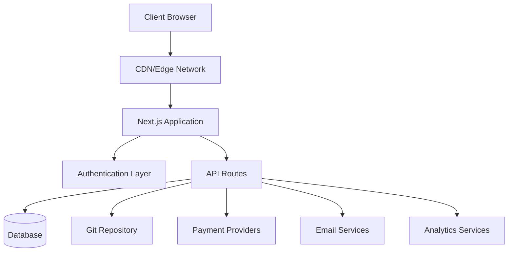
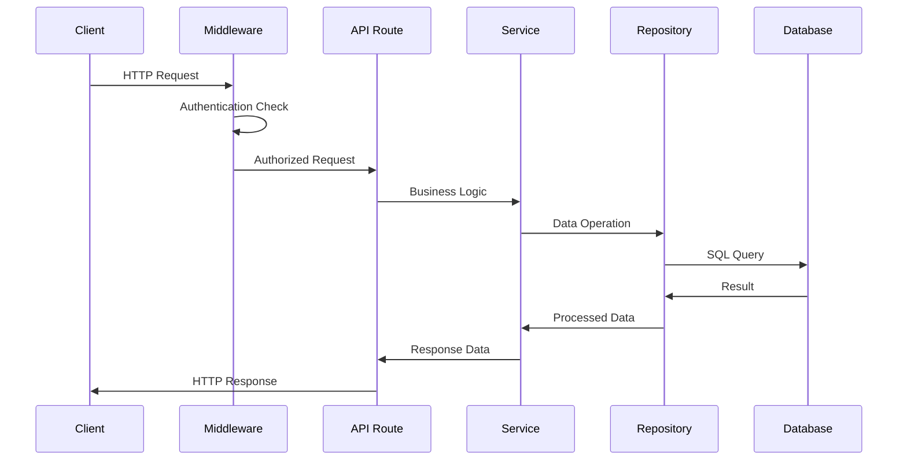
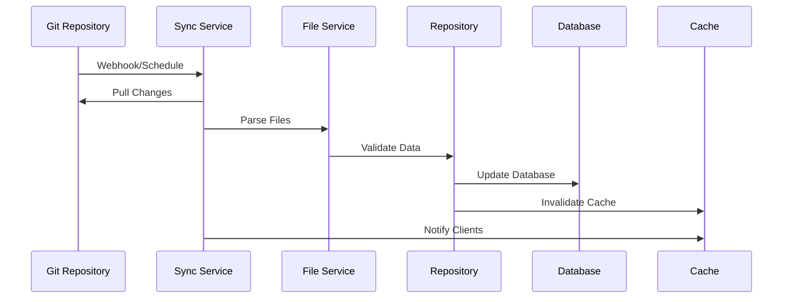
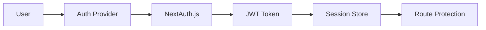

# Descripción general de la arquitectura

Ever Works sigue una arquitectura moderna y escalable diseñada para el rendimiento, la mantenibilidad y la experiencia del desarrollador.

## Arquitectura de alto nivel



## Principios básicos

### 1. Separación de preocupaciones
- **Capa de presentación**: componentes de React y lógica de UI
- **Capa Empresarial**: Servicios y repositorios
- **Capa de datos**: base de datos y API externas

### 2. Diseño modular
- Organización basada en características
- Componentes reutilizables
- Integraciones tipo complemento

### 3. Tipo de seguridad
- TypeScript en todas partes
- Comprobación estricta de tipos
- Validación en tiempo de ejecución con Zod

### 4. El rendimiento es lo primero
- Representación del lado del servidor
- Generación estática cuando sea posible
- Estrategias de almacenamiento en caché optimizadas

## Capas de aplicación

### Capa frontal

**Tecnología**: React 19 + Next.js 15
**Responsabilidades**:
- Representación de la interfaz de usuario
- Gestión de estado del lado del cliente
- Interacciones del usuario
- Manejo de rutas

**Componentes clave**:
- Componentes de la página (`app/[locale]/`)
- Componentes de interfaz de usuario reutilizables (`components/`)
- Ganchos personalizados (`hooks/`)
- Proveedores de contexto (`components/providers/`)

### Capa API

**Tecnología**: Rutas API de Next.js
**Responsabilidades**:
- Ejecución de lógica de negocios
- Validación de datos
- Integración de servicios externos
- Manejo de autenticación

**Estructura**:
```
app/api/
├── auth/           # Authentication endpoints
├── admin/          # Admin-only endpoints
├── items/          # Item management
└── webhooks/       # External service webhooks
```

### Capa de datos

**Tecnologías**: Drizzle ORM + PostgreSQL
**Responsabilidades**:
- Persistencia de datos
- Optimización de consultas
- Gestión de transacciones
- Migraciones de esquemas

**Componentes**:
- Esquema de base de datos (`lib/db/schema.ts`)
- Repositorios (`lib/repositories/`)
- Archivos de migración (`lib/db/migrations/`)

### Capa de contenido

**Tecnología**: CMS basado en Git
**Responsabilidades**:
- Sincronización de contenidos
- Control de versiones
- Edición colaborativa
- Validación de contenido

**Estructura**:
```
.content/
├── config.yml      # Site configuration
├── items/          # Item definitions
├── categories/     # Category definitions
└── tags/           # Tag definitions
```

## Patrones de diseño

### 1. Patrón de repositorio

Lógica de acceso a datos de resúmenes:

```typescript
interface ItemRepository {
  findById(id: string): Promise<Item | null>;
  findBySlug(slug: string): Promise<Item | null>;
  findWithFilters(filters: ItemFilters): Promise<Item[]>;
  create(item: CreateItemRequest): Promise<Item>;
  update(id: string, updates: UpdateItemRequest): Promise<Item>;
  delete(id: string): Promise<void>;
}
```

### 2. Patrón de capa de servicio

Encapsula la lógica empresarial:

```typescript
class ItemService {
  constructor(
    private itemRepository: ItemRepository,
    private gitService: GitService,
    private notificationService: NotificationService
  ) {}

  async submitItem(data: SubmitItemRequest): Promise<SubmissionResult> {
    // Business logic here
  }
}
```

### 3. Patrón de fábrica

Crea instancias de servicio:

```typescript
class PaymentProviderFactory {
  static create(provider: PaymentProvider): PaymentService {
    switch (provider) {
      case 'stripe':
        return new StripePaymentService();
      case 'lemonsqueezy':
        return new LemonSqueezyPaymentService();
      default:
        throw new Error(`Unsupported provider: ${provider}`);
    }
  }
}
```

### 4. Patrón de observador

Actualizaciones basadas en eventos:

```typescript
class ContentSyncService {
  private observers: ContentObserver[] = [];

  addObserver(observer: ContentObserver): void {
    this.observers.push(observer);
  }

  notifyObservers(event: ContentEvent): void {
    this.observers.forEach(observer => observer.update(event));
  }
}
```

## Flujo de datos

### 1. Flujo de solicitudes



### 2. Flujo de sincronización de contenido



## Arquitectura de seguridad

### 1. Flujo de autenticación



### 2. Capas de autorización

- **Nivel de ruta**: protección de middleware
- **Nivel de API**: guardias de puntos finales
- **Nivel de datos**: seguridad a nivel de fila
- **Nivel de interfaz de usuario**: control de acceso basado en componentes

### 3. Medidas de seguridad

- **Validación de entrada**: esquemas Zod
- **Inyección SQL**: consultas parametrizadas
- **Protección XSS**: desinfección de contenido
- **Protección CSRF**: validación de token
- **Limitación de velocidad**: Solicitar limitación

## Estrategia de almacenamiento en caché

### 1. Caché de aplicaciones

- **React Query**: caché de datos del lado del cliente
- **Next.js Cache**: caché de ruta de página y API
- **Generación estática**: páginas prediseñadas

### 2. Caché de base de datos

- **Agrupación de conexiones**: conexiones de base de datos eficientes
- **Optimización de consultas**: consultas indexadas
- **Réplicas de lectura**: operaciones de lectura distribuida

### 3. Caché CDN

- **Activos estáticos**: Imágenes, CSS, JS
- **Respuestas de API**: puntos finales almacenables en caché
- **Ubicaciones perimetrales**: Distribución global

## Consideraciones de escalabilidad

### 1. Escala horizontal

- **Diseño sin estado**: sin sesiones del lado del servidor
- **Escalado de base de datos**: lectura de réplicas y fragmentación
- **Distribución CDN**: almacenamiento en caché de borde global

### 2. Optimización del rendimiento

- **División de código**: importaciones dinámicas
- **Optimización de imagen**: componente de imagen Next.js
- **Optimización de paquetes**: sacudida y minificación de árboles

### 3. Monitoreo y observabilidad

- **Seguimiento de errores**: integración de Sentry
- **Monitoreo de rendimiento**: Core Web Vitals
- **Análisis**: integración de PostHog
- **Registro**: registro estructurado

## Decisiones tecnológicas

### ¿Por qué Next.js?
- **Marco completo**: rutas API + interfaz
- **Rendimiento**: SSR, SSG e ISR
- **Experiencia de desarrollador**: recarga en caliente, compatibilidad con TypeScript
- **Ecosistema**: ecosistema rico en complementos

### ¿Por qué rociar ORM?
- **Seguridad de tipos**: compatibilidad total con TypeScript
- **Rendimiento**: gastos generales mínimos
- **Flexibilidad**: SQL sin formato cuando sea necesario
- **Sistema de migración**: cambios de esquema controlados por versión

### ¿Por qué un CMS basado en Git?
- **Control de versiones**: Seguimiento del historial completo
- **Colaboración**: flujo de trabajo de solicitud de extracción
- **Copia de seguridad**: Distribuida por naturaleza
- **Flexibilidad**: cualquier proveedor de Git

### ¿Por qué reaccionar consulta?
- **Almacenamiento en caché**: gestión inteligente de caché
- **Sincronización**: actualizaciones en segundo plano
- **Actualizaciones optimistas**: Mejor UX
- **Manejo de errores**: Lógica de reintento

## Puntos de extensión

La arquitectura proporciona varios puntos de extensión:

### 1. Proveedores de autenticación personalizados
```typescript
// lib/auth/providers/custom-provider.ts
export function CustomProvider(options: CustomProviderOptions) {
  return {
    id: "custom",
    name: "Custom Provider",
    type: "oauth",
    // Implementation
  }
}
```

### 3. Integración de fuentes de contenido
```typescript
// lib/content/sources/custom-source.ts
export class CustomContentSource implements ContentSource {
  async sync(): Promise<SyncResult> {
    // Implementation
  }
}
```

## Próximos pasos

- [Explore la pila tecnológica](./tech-stack) en detalle
