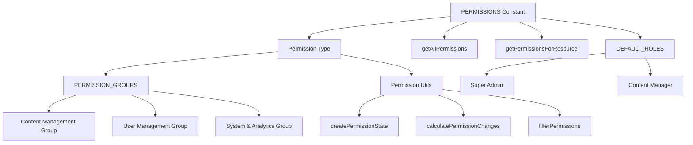

# Sistema de permisos

La plantilla implementa un sistema de permisos granular basado en recursos con definiciones de permisos de tipo seguro, agrupaciones lógicas para la organización de la interfaz de usuario y funciones de utilidad para la gestión del estado y la detección de cambios.

## Descripción general de la arquitectura



## Archivos fuente

|Archivo|Propósito|
|------|---------|
|`lib/permissions/definitions.ts`|Constantes de permisos, extracción de tipos, roles predeterminados|
|`lib/permissions/groups.ts`|Agrupaciones de permisos orientadas a la interfaz de usuario con metadatos|
|`lib/permissions/utils.ts`|Gestión de estados, cálculo de diferencias y filtrado.|

## Definiciones de permisos

Los permisos siguen una convención de nomenclatura `resource:action`. El objeto `PERMISSIONS` los organiza por recurso:

```typescript
export const PERMISSIONS = {
  items: {
    read: 'items:read',
    create: 'items:create',
    update: 'items:update',
    delete: 'items:delete',
    review: 'items:review',
    approve: 'items:approve',
    reject: 'items:reject',
  },
  categories: {
    read: 'categories:read',
    create: 'categories:create',
    update: 'categories:update',
    delete: 'categories:delete',
  },
  tags: {
    read: 'tags:read',
    create: 'tags:create',
    update: 'tags:update',
    delete: 'tags:delete',
  },
  roles: {
    read: 'roles:read',
    create: 'roles:create',
    update: 'roles:update',
    delete: 'roles:delete',
  },
  users: {
    read: 'users:read',
    create: 'users:create',
    update: 'users:update',
    delete: 'users:delete',
    assignRoles: 'users:assignRoles',
  },
  analytics: {
    read: 'analytics:read',
    export: 'analytics:export',
  },
  system: {
    settings: 'system:settings',
  },
} as const;
```

### Lista completa de permisos

|Recurso|Acciones|
|----------|---------|
|`items`|`read`, `create`, `update`, `delete`, `review`, `approve`, `reject`|
|`categories`|`read`, `create`, `update`, `delete`|
|`tags`|`read`, `create`, `update`, `delete`|
|`roles`|`read`, `create`, `update`, `delete`|
|`users`|`read`, `create`, `update`, `delete`, `assignRoles`|
|`analytics`|`read`, `export`|
|`system`|`settings`|

## Tipo de permiso de tipo seguro

El tipo `Permission` se extrae de la constante `PERMISSIONS` utilizando tipos condicionales recursivos:

```typescript
type PermissionValues<T> = T extends Record<string, infer U>
  ? U extends Record<string, infer V>
    ? V extends string ? V : never
    : never
  : never;

export type Permission = PermissionValues<typeof PERMISSIONS>;
// Resolves to: 'items:read' | 'items:create' | ... | 'system:settings'
```

Esto garantiza la seguridad en tiempo de compilación: cualquier cadena de permiso que no exista en la constante `PERMISSIONS` provocará un error de TypeScript.

## Funciones de consulta

```typescript
// Get all permissions as a flat array
export function getAllPermissions(): Permission[];

// Get permissions for a specific resource
export function getPermissionsForResource(resource: keyof typeof PERMISSIONS): Permission[];

// Validate whether a string is a valid permission
export function isValidPermission(permission: string): permission is Permission;
```

## Roles predeterminados

Dos definiciones de funciones integradas proporcionan puntos de partida:

```typescript
export const DEFAULT_ROLES = {
  SUPER_ADMIN: {
    id: 'super-admin',
    name: 'Super Administrator',
    description: 'Full system access with all permissions',
    permissions: getAllPermissions(), // Every permission
  },
  CONTENT_MANAGER: {
    id: 'content-manager',
    name: 'Content Manager',
    description: 'Manage content including items, categories, and tags',
    permissions: [
      ...getPermissionsForResource('items'),
      ...getPermissionsForResource('categories'),
      ...getPermissionsForResource('tags'),
    ],
  },
} as const;
```

## Grupos de permisos

Los grupos organizan permisos para la visualización de la interfaz de usuario con íconos y descripciones:

```typescript
export interface PermissionGroup {
  id: string;
  name: string;
  description: string;
  icon: string;       // Lucide icon name
  permissions: Permission[];
}

export const PERMISSION_GROUPS: PermissionGroup[] = [
  {
    id: 'content',
    name: 'Content Management',
    description: 'Manage items, categories, and tags',
    icon: 'FileText',
    permissions: [...items, ...categories, ...tags],
  },
  {
    id: 'users',
    name: 'User Management',
    description: 'Manage users and their roles',
    icon: 'Users',
    permissions: [...users, ...roles],
  },
  {
    id: 'system',
    name: 'System & Analytics',
    description: 'System settings and analytics access',
    icon: 'Settings',
    permissions: [...analytics, ...system],
  },
];
```

### Funciones de consulta grupal

```typescript
// Find which group a permission belongs to
export function getPermissionGroup(permission: Permission): PermissionGroup | undefined;

// Get all permissions in a group by group ID
export function getPermissionsByGroup(groupId: string): Permission[];
```

### Formato de visualización de permisos

```typescript
// Format for display: "items:approve" -> "Approve Items"
export function formatPermissionName(permission: Permission): string;

// Generate description: "items:approve" -> "Approve submissions items and submissions"
export function formatPermissionDescription(permission: Permission): string;
```

El formateador de descripciones utiliza tablas de búsqueda tanto para acciones como para recursos:

|acción|Prefijo de descripción|
|--------|-------------------|
|`read`|Ver y acceder|
|`create`|Crear nuevo|
|`update`|Editar existente|
|`delete`|Quitar|
|`review`|Revisar y moderar|
|`approve`|Aprobar envíos|
|`reject`|Rechazar envíos|
|`assignRoles`|Asignar roles a|
|`export`|Exportar datos de|
|`settings`|Administrar la configuración de|

## Gestión del estado de permisos

El módulo de utilidades proporciona funciones para gestionar el estado de los permisos en la interfaz de usuario:

### Creando estado a partir de permisos

```typescript
export function createPermissionState(currentPermissions: Permission[]): PermissionState;
// Returns: { 'items:read': true, 'items:create': true, ... }
```

### Extracción de permisos seleccionados

```typescript
export function getSelectedPermissions(permissionState: PermissionState): Permission[];
// Filters the state object to return only permissions where value is `true`
```

### Detección de cambios

```typescript
export function calculatePermissionChanges(
  originalPermissions: Permission[],
  newPermissions: Permission[]
): PermissionChanges;
// Returns: { added: Permission[], removed: Permission[] }
```

### Control de igualdad

```typescript
export function arePermissionsEqual(
  permissions1: Permission[],
  permissions2: Permission[]
): boolean;
// Uses Set-based comparison for order-independent equality
```

### Filtrado de búsqueda

```typescript
export function filterPermissions(
  permissions: Permission[],
  searchTerm: string
): Permission[];
// Matches against permission string and space-separated format
// e.g., "assign" matches "users:assignRoles" and "users assignRoles"
```

## Ejemplo de uso

```typescript
import { PERMISSIONS, getAllPermissions } from '@/lib/permissions/definitions';
import { PERMISSION_GROUPS, formatPermissionName } from '@/lib/permissions/groups';
import { createPermissionState, calculatePermissionChanges } from '@/lib/permissions/utils';

// Check a specific permission
if (userPermissions.includes(PERMISSIONS.items.approve)) {
  // User can approve items
}

// Build a permission editor UI
const state = createPermissionState(user.permissions);

// After user toggles permissions
const changes = calculatePermissionChanges(user.permissions, newPermissions);
console.log(`Added: ${changes.added.length}, Removed: ${changes.removed.length}`);
```
