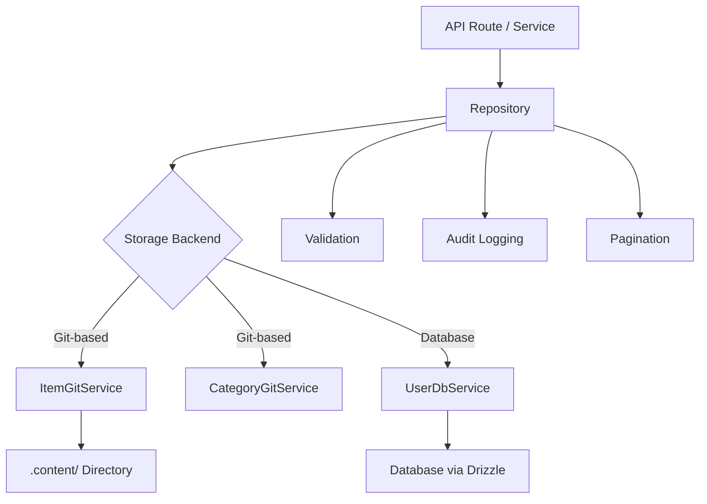

# Patrones de repositorio

La plantilla implementa el patrón Repositorio para proporcionar una capa de acceso a datos limpia entre la lógica empresarial y el almacenamiento de datos. Los repositorios encapsulan la creación de consultas, la validación, la paginación y el registro de auditoría mientras delega el almacenamiento real a los servicios subyacentes (basados ​​en Git o respaldados por bases de datos).

## Descripción general de la arquitectura



## Archivos fuente

|Archivo|Propósito|
|------|---------|
|`lib/repositories/item.repository.ts`|Item CRUD con almacenamiento, filtrado y auditoría de Git|
|`lib/repositories/category.repository.ts`|Gestión de categorías con almacenamiento Git|
|`lib/repositories/user.repository.ts`|Operaciones de usuario con almacenamiento de base de datos.|
|`lib/repositories/tag.repository.ts`|Gestión de etiquetas|
|`lib/repositories/role.repository.ts`|Gestión de roles|
|`lib/repositories/collection.repository.ts`|Gestión de colecciones|
|`lib/repositories/sponsor-ad.repository.ts`|Gestión de anuncios de patrocinadores.|
|`lib/repositories/client-item.repository.ts`|Operaciones de artículos de cara al cliente|
|`lib/repositories/client-dashboard.repository.ts`|Datos del panel del cliente|
|`lib/repositories/admin-stats.repository.ts`|Estadísticas de administración|
|`lib/repositories/admin-analytics-optimized.repository.ts`|Consultas analíticas optimizadas|
|`lib/repositories/integration-mapping.repository.ts`|Mapeos de integración externa|
|`lib/repositories/twenty-crm-config.repository.ts`|Configuración veinte CRM|

## Métodos de repositorio comunes

Todos los repositorios siguen una superficie API consistente:

|Método|Descripción|
|--------|-------------|
|`findAll(options?)`|Recuperar todos los registros con filtrado opcional|
|`findAllPaginated(page, limit, options?)`|Recuperación paginada|
|`findById(id)`|Encuentre un solo registro por ID|
|`findBySlug(slug)`|Encuentra un solo registro por slug|
|`create(data)`|Crear un nuevo registro con validación|
|`update(id, data)`|Actualizar un registro existente con validación|
|`delete(id)`|Eliminar definitivamente un registro|
|`getStats()`|Obtener estadísticas agregadas|

## Repositorio de artículos

El repositorio más completo, que demuestra todos los patrones clave.

### Inicialización diferida del servicio

El servicio Git se inicializa de forma diferida en el primer uso:

```typescript
export class ItemRepository {
  private gitService: ItemGitService | null = null;

  private async getGitService(): Promise<ItemGitService> {
    if (!this.gitService) {
      const dataRepo = coreConfig.content.dataRepository;
      const token = coreConfig.content.ghToken;
      // Parse GitHub URL, create service config
      this.gitService = await createItemGitService(config);
    }
    return this.gitService;
  }
}
```

### Filtrado

El método `findAll` admite el filtrado multicriterio con lógica OR para matrices:

```typescript
async findAll(options: ItemListOptions = {}): Promise<ItemData[]> {
  const items = await gitService.readItems(options.includeDeleted ?? false);
  let filteredItems = items;

  if (options.status)
    filteredItems = filteredItems.filter(item => item.status === options.status);

  if (options.categories?.length > 0)
    filteredItems = filteredItems.filter(item => {
      const itemCategories = Array.isArray(item.category) ? item.category : [item.category];
      return options.categories!.some(cat => itemCategories.includes(cat));
    });

  if (options.tags?.length > 0)
    filteredItems = filteredItems.filter(item =>
      options.tags!.some(tag => item.tags.includes(tag))
    );

  if (options.search) {
    const searchLower = options.search.toLowerCase();
    filteredItems = filteredItems.filter(item =>
      item.name.toLowerCase().includes(searchLower) ||
      item.description.toLowerCase().includes(searchLower)
    );
  }

  return filteredItems;
}
```

### Paginación

```typescript
async findAllPaginated(page = 1, limit = 10, options = {}): Promise<{
  items: ItemData[];
  total: number;
  page: number;
  limit: number;
  totalPages: number;
}> {
  return await gitService.getItemsPaginated(page, limit, options);
}
```

### Registro de auditoría

Todas las operaciones de mutación se registran en un registro de auditoría (mejor esfuerzo, sin bloqueo):

```typescript
async create(data: CreateItemRequest, auditUser?: AuditUser): Promise<ItemData> {
  this.validateCreateData(data);
  const item = await gitService.createItem(data);

  try {
    await itemAuditService.logCreation(item, auditUser);
  } catch (err) {
    console.warn('Audit logCreation failed:', err);
  }

  return item;
}
```

Eventos de auditoría capturados:

|Operación|Método de auditoría|Datos capturados|
|-----------|-------------|---------------|
|crear|`logCreation`|Nuevo elemento, usuario|
|Actualizar|`logUpdate`|Estado anterior, nuevo estado, usuario|
|Revisión|`logReview`|Artículo, estado anterior, notas, usuario.|
|Eliminar|`logDeletion`|Artículo, usuario, bandera suave/dura|
|Restaurar|`logRestoration`|Artículo, usuario|

### Operaciones por lotes

El método `batchUpdate` optimiza múltiples actualizaciones con una única confirmación de Git:

```typescript
async batchUpdate(updates: Array<{ id: string; data: UpdateItemRequest }>): Promise<ItemData[]> {
  // Pre-validate ALL updates before writing
  for (const { id, data } of updates) {
    this.validateUpdateData(id, data);
  }

  // Write each update without committing
  for (const { id, data } of updates) {
    await gitService.updateItemWithoutCommit(id, data);
  }

  // Single commit for all changes
  await gitService.commitAndPushBatch(`Batch update ${updates.length} items`);

  // Audit logging after successful commit
  for (const entry of auditEntries) {
    await itemAuditService.logUpdate(entry.previous, entry.updated, auditUser);
  }
}
```

### Validación

Los repositorios realizan la validación de entradas antes de las operaciones de almacenamiento:

```typescript
private validateCreateData(data: CreateItemRequest): void {
  if (!data.id?.trim())          throw new Error('Item ID is required');
  if (!data.name?.trim())        throw new Error('Item name is required');
  if (!data.slug?.trim())        throw new Error('Item slug is required');
  if (!data.description?.trim()) throw new Error('Item description is required');
  if (!data.source_url?.trim())  throw new Error('Item source URL is required');

  if (!/^[a-z0-9-]+$/.test(data.slug))
    throw new Error('Slug must contain only lowercase letters, numbers, and hyphens');

  try { new URL(data.source_url); }
  catch { throw new Error('Invalid source URL format'); }
}
```

### Eliminación temporal y restauración

```typescript
async softDelete(id: string): Promise<ItemData> {
  return await gitService.softDeleteItem(id);
}

async restore(id: string): Promise<ItemData> {
  return await gitService.restoreItem(id);
}
```

## CategoríaRepositorio

Demuestra patrón singleton y verificación de duplicados:

```typescript
export class CategoryRepository {
  // Duplicate name checking (case-insensitive, excludes self for updates)
  private async checkDuplicateName(name: string, excludeId?: string): Promise<void> {
    const categories = await gitService.readCategories();
    const duplicate = categories.find(cat =>
      cat.name.toLowerCase() === name.toLowerCase() && cat.id !== excludeId
    );
    if (duplicate) throw new Error(`Category with name "${name}" already exists`);
  }

  // Sorting
  private sortCategories(categories, options): CategoryData[] {
    return categories.sort((a, b) => {
      const comparison = a.name.localeCompare(b.name);
      return options.sortOrder === 'desc' ? -comparison : comparison;
    });
  }
}

// Singleton export
export const categoryRepository = new CategoryRepository();
```

## Repositorio de usuarios

Utiliza almacenamiento respaldado por bases de datos a través de `UserDbService` con validación Zod:

```typescript
export class UserRepository {
  private userDbService: UserDbService;

  async create(data: CreateUserRequest): Promise<AuthUserData> {
    // Zod schema validation
    const validatedData = userValidationSchema
      .pick({ email: true, password: true })
      .parse(data);

    // Uniqueness check
    const exists = await this.userDbService.emailExists(validatedData.email);
    if (exists) throw new Error('Email already in use');

    return await this.userDbService.createUser(validatedData);
  }
}
```

## Estrategia de manejo de errores

Los repositorios siguen un patrón consistente de manejo de errores:

1. Volver a generar errores comerciales conocidos (p. ej., "Correo electrónico ya en uso")
2. Registre y ajuste errores desconocidos con mensajes genéricos
3. Las fallas en el registro de auditoría se detectan y advierten, sin bloquear nunca la operación.
