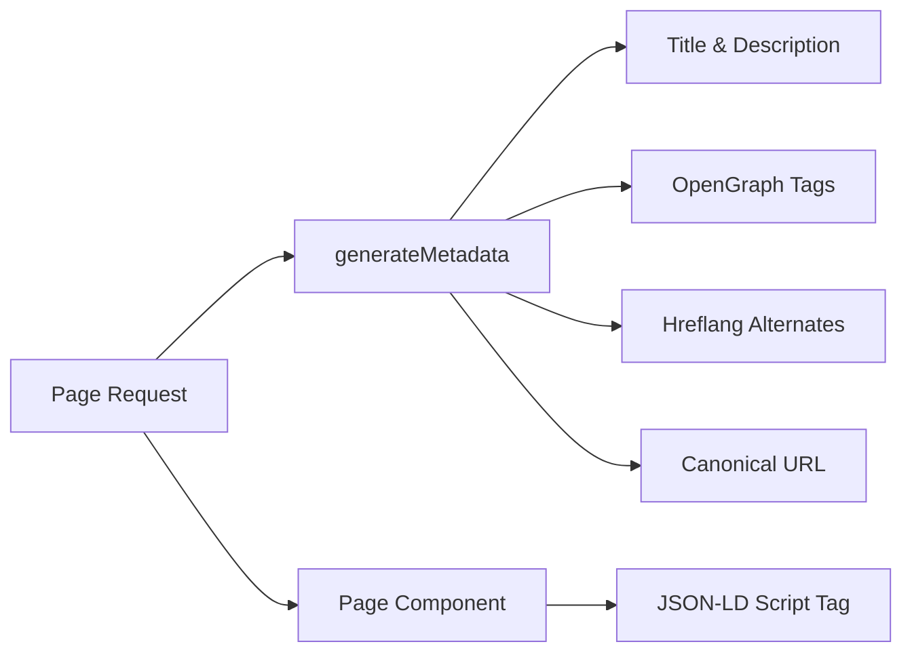

# Sistema SEO

La plantilla Ever Works incluye un sistema SEO integral que genera datos estructurados (JSON-LD), etiquetas hreflang, metadatos OpenGraph y mapas de sitio dinámicos. Todas las utilidades de SEO se encuentran en `lib/seo/` y se integran con la API de metadatos de Next.js.

## Descripción general de la arquitectura



### Archivos fuente

|Archivo|Propósito|
|---|---|
|`lib/seo/schema.ts`|Generadores de datos estructurados JSON-LD|
|`lib/seo/hreflang.ts`|Generadores de URL alternativos de idioma|
|`lib/seo/listing-metadata.ts`|Fábrica de metadatos de página de listado|

## Datos estructurados JSON-LD

El módulo `lib/seo/schema.ts` genera datos estructurados de Schema.org para resultados enriquecidos en motores de búsqueda.

### Esquema del producto

Para páginas de detalles de artículos, genera un esquema `Product`:

```typescript
import { generateProductSchema } from '@/lib/seo/schema';

const schema = generateProductSchema({
  name: 'My App',
  description: 'A productivity tool',
  image: 'https://example.com/icon.png',
  url: 'https://example.com/items/my-app',
  category: 'Productivity',
  sourceUrl: 'https://myapp.com',
  brandName: 'MyApp Inc.',
});
```

Salida generada:

```json
{
  "@context": "https://schema.org",
  "@type": "Product",
  "name": "My App",
  "description": "A productivity tool",
  "image": "https://example.com/icon.png",
  "url": "https://example.com/items/my-app",
  "category": "Productivity",
  "brand": {
    "@type": "Brand",
    "name": "MyApp Inc."
  },
  "offers": {
    "@type": "Offer",
    "url": "https://myapp.com",
    "availability": "https://schema.org/InStock"
  }
}
```

### Esquema de organización

Genera un esquema `Organization` en todo el sitio para la visibilidad del Panel de conocimiento:

```typescript
import { generateOrganizationSchema } from '@/lib/seo/schema';

const schema = generateOrganizationSchema();
```

Este esquema incluye:
- Nombre de marca, URL y logotipo
- Enlaces de perfiles sociales (`sameAs` array) de `siteConfig.social`
- Punto de contacto con correo electrónico (cuando esté configurado)

### Esquema del sitio web con SearchAction

Habilita el cuadro de búsqueda de vínculos a sitios de Google:

```typescript
import { generateWebSiteSchema } from '@/lib/seo/schema';

const schema = generateWebSiteSchema('en');
// Includes potentialAction with SearchAction targeting /?q={search_term_string}
```

El esquema respeta los prefijos locales:
- Configuración regional predeterminada: `https://example.com`
- Otras configuraciones regionales: `https://example.com/fr`

### Esquema de ruta de navegación

Genera `BreadcrumbList` para resultados de búsqueda con reconocimiento de navegación:

```typescript
import { generateBreadcrumbSchema } from '@/lib/seo/schema';

const schema = generateBreadcrumbSchema([
  { name: 'Home', url: 'https://example.com' },
  { name: 'Productivity', url: 'https://example.com/categories/productivity' },
  { name: 'My App', url: 'https://example.com/items/my-app' },
]);
```

### Incrustar en páginas

JSON-LD se incrusta mediante una etiqueta `<script>` en el componente de la página:

```tsx
export default function ItemDetailPage({ item }) {
  const schema = generateProductSchema({ ... });

  return (
    <>
      <script
        type="application/ld+json"
        dangerouslySetInnerHTML={{ __html: JSON.stringify(schema) }}
      />
      <ItemDetail item={item} />
    </>
  );
}
```

## Hreflang Etiquetas

El módulo `lib/seo/hreflang.ts` genera URL de idiomas alternativos para SEO multilocal.

### Patrón de URL

La plantilla utiliza el patrón de prefijo local "según sea necesario":

|Localidad|Patrón de URL|
|---|---|
|`en` (predeterminado)|`https://example.com/items/my-app`|
|`fr`|`https://example.com/fr/items/my-app`|
|`es`|`https://example.com/es/items/my-app`|
|`x-default`|Igual que `en` (localización predeterminada)|

### Generando alternativas

```typescript
import { generateHreflangAlternates } from '@/lib/seo/hreflang';

// For any page path
const alternates = generateHreflangAlternates('/about');
// Returns: { en: 'https://example.com/about', fr: 'https://example.com/fr/about', ... }

// Convenience functions for common page types
import { generateItemHreflangAlternates } from '@/lib/seo/hreflang';
const itemAlternates = generateItemHreflangAlternates('my-app');

import { generatePageHreflangAlternates } from '@/lib/seo/hreflang';
const pageAlternates = generatePageHreflangAlternates('about');
```

### Integración con metadatos de Next.js

```typescript
export async function generateMetadata({ params }) {
  const { locale, slug } = await params;
  return {
    alternates: {
      canonical: `https://example.com/${locale}/items/${slug}`,
      languages: generateItemHreflangAlternates(slug),
    },
  };
}
```

### Asignaciones de configuración regional admitidas

Las más de 20 configuraciones regionales están asignadas en `LOCALE_TO_HREFLANG`:

```
en -> en, fr -> fr, es -> es, de -> de, zh -> zh,
ar -> ar, he -> he, ru -> ru, uk -> uk, pt -> pt,
it -> it, ja -> ja, ko -> ko, nl -> nl, pl -> pl,
tr -> tr, vi -> vi, th -> th, hi -> hi, id -> id, bg -> bg
```

## Metadatos de la página de listado

El módulo `lib/seo/listing-metadata.ts` genera objetos `Metadata` completos para páginas de listados y categorías.

### Uso

```typescript
import { generateListingMetadata } from '@/lib/seo/listing-metadata';

export async function generateMetadata({ params }) {
  const { locale } = await params;
  return generateListingMetadata({
    title: 'Time Tracking Tools',
    description: 'Browse the best time tracking tools',
    path: '/categories/time-tracking',
    locale,
    itemCount: 42,
    keywords: ['time tracking', 'productivity', 'tools'],
    imageUrl: 'https://example.com/og/time-tracking.png',
  });
}
```

### Estructura de metadatos generados

La función produce un objeto Next.js `Metadata` completo:

|campo|Fuente|
|---|---|
|`title`|`{título} \|{nombre del sitio}`|
|`description`|Personalizado o generado automáticamente a partir del título + recuento de elementos|
|`keywords`|Matriz de palabras clave unida|
|`openGraph.type`|`'website'`|
|`openGraph.siteName`|De `siteConfig.name`|
|`openGraph.url`|URL canónica con configuración regional|
|`openGraph.images`|URL de imagen opcional|
|`twitter.card`|`'summary_large_image'`|
|`alternates.canonical`|URL canónica completa|
|`alternates.languages`|Hreflang alternativo para todas las configuraciones regionales|

## Generación de imágenes OpenGraph

Las imágenes dinámicas OG se generan usando Next.js `ImageResponse` en dos niveles:

|Archivo|Ruta|Propósito|
|---|---|---|
|`app/opengraph-image.tsx`|`/opengraph-image`|Imagen OG predeterminada en todo el sitio|
|`app/[locale]/items/[slug]/opengraph-image.tsx`|`/items/{slug}/opengraph-image`|Imagen OG dinámica por elemento|

Estos archivos utilizan el módulo `next/og` para representar los componentes de React como imágenes en el momento de la solicitud, lo que permite texto, logotipos y marcas dinámicos.

## Lista de verificación de SEO

Al agregar un nuevo tipo de página, asegúrese de que estén implementados los siguientes elementos de SEO:

|Elemento|Implementación|
|---|---|
|Título de la página|`generateMetadata` con título descriptivo|
|Meta descripción|Descripción personalizada o generada automáticamente|
|URL canónica|Establecido en `alternates.canonical`|
|Etiquetas hreflang|Utilice `generateHreflangAlternates`|
|Etiquetas OpenGraph|Incluido a través de `generateListingMetadata` o manualmente|
|tarjeta de Twitter|Establezca `twitter.card` en `summary_large_image`|
|JSON-LD|Agregar esquema a través de `<script type="application/ld+json">`|
|Pan rallado|Utilice `generateBreadcrumbSchema` para páginas anidadas|

## Mejores prácticas

1. **Establezca siempre URL canónicas**: evita problemas de contenido duplicado entre regiones.
2. **Incluya hreflang para todas las configuraciones regionales**: incluso si el contenido aún no está traducido, la estructura de la URL ayuda a los motores de búsqueda.
3. **Utilice títulos descriptivos y únicos**: evite títulos genéricos como "Inicio" sin el nombre del sitio.
4. **Mantenga las descripciones con menos de 160 caracteres**: las descripciones más largas se truncan en los resultados de búsqueda.
5. **Pruebe los datos estructurados** con la herramienta de prueba de resultados enriquecidos de Google antes de implementarlos.
6. **Genere imágenes OG dinámicamente**: las imágenes alternativas estáticas pierden oportunidades de marca específicas del artículo.
