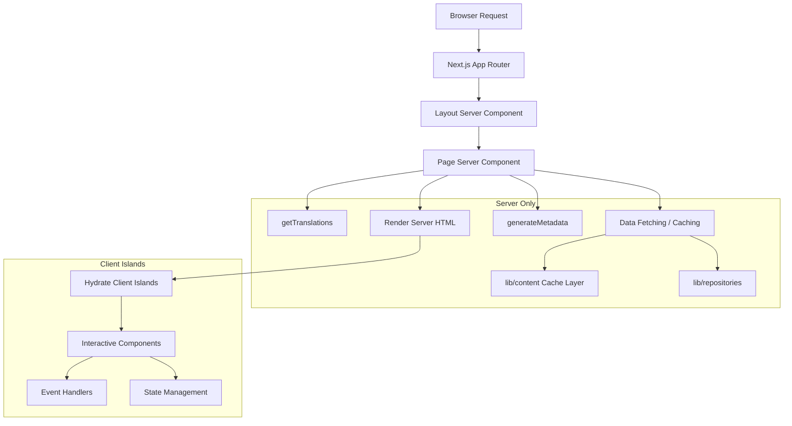

# Patrones de componentes del servidor

## Descripción general

La plantilla Ever Works aprovecha los componentes del servidor React (RSC) como estrategia de representación predeterminada en todo el enrutador de aplicaciones Next.js. Los componentes del servidor manejan la obtención de datos, la carga de traducciones, la generación de metadatos y la composición del diseño en el servidor, enviando solo el HTML renderizado al cliente.

## Arquitectura



## Archivos fuente

|Archivo|Patrón demostrado|
|------|---------------------|
|`template/app/[locale]/about/page.tsx`|Obtención de datos, i18n, metadatos, renderizado MDX|
|`template/app/[locale]/layout.tsx`|Diseño raíz con proveedor local|
|`template/app/layout.tsx`|Diseño global, fuentes, proveedores|
|`template/app/sitemap.ts`|Generación de rutas solo para servidor|
|`template/app/robots.ts`|Configuración solo de servidor|

## Patrones centrales

### Patrón 1: Componentes de página asíncronos con i18n

Cada página localizada sigue este patrón:

```typescript
// Server Component -- no "use client" directive
export const revalidate = 3600; // ISR: revalidate every hour

interface PageProps {
    params: Promise<{ locale: string }>;
}

export async function generateMetadata({ params }: PageProps): Promise<Metadata> {
    const { locale } = await params;
    const t = await getTranslations({ locale, namespace: 'footer' });
    return {
        title: t('ABOUT_US'),
        description: t('ABOUT_PAGE_META_DESCRIPTION'),
        alternates: {
            languages: generateHreflangAlternates('/about')
        }
    };
}

export default async function AboutPage({ params }: PageProps) {
    const { locale } = await params;
    const pageData = await getCachedPageContent('about', locale);
    const tCommon = await getTranslations({ locale, namespace: 'common' });

    return (
        <PageContainer>
            <MDX source={pageData?.content || DEFAULT_CONTENT} />
        </PageContainer>
    );
}
```

Características clave:
- `params` es un `Promise` (convención de enrutador de aplicaciones Next.js 15+)
- Múltiples llamadas `getTranslations()` para diferentes espacios de nombres
- Obtención de contenido en caché a través de `getCachedPageContent()`
- Intervalo de revalidación estática con `export const revalidate`

### Patrón 2: Generación de metadatos

Los componentes del servidor generan metadatos SEO a nivel de ruta:

```typescript
export async function generateMetadata({ params }: PageProps): Promise<Metadata> {
    const { locale } = await params;
    const t = await getTranslations({ locale, namespace: 'pages' });

    return {
        metadataBase: new URL(appUrl),
        title: t('PAGE_TITLE'),
        description: t('PAGE_DESCRIPTION'),
        alternates: {
            languages: generateHreflangAlternates('/path')
        }
    };
}
```

La utilidad `generateHreflangAlternates()` de `lib/seo/hreflang.ts` genera automáticamente enlaces de idiomas alternativos para todas las configuraciones regionales admitidas.

### Patrón 3: ISR con almacenamiento en caché de contenido

```typescript
export const revalidate = 3600; // Revalidate every hour

export default async function Page({ params }: PageProps) {
    const data = await getCachedPageContent('page-name', locale);
    // Render with cached data...
}
```

La función `getCachedPageContent()` proporciona una capa de caché del lado del servidor sobre el contenido del CMS basado en Git en `.content/`. Combinado con `revalidate`, esto crea un patrón ISR (regeneración estática incremental) donde las páginas se generan estáticamente y se actualizan periódicamente.

### Patrón 4: comprobaciones de autenticación del lado del servidor

Las páginas protegidas utilizan protecciones del lado del servidor de `lib/auth/guards.ts`:

```typescript
import { requireAuth, requireAdmin } from '@/lib/auth/guards';

export default async function ProtectedPage() {
    const session = await requireAuth();
    // session.user is guaranteed to exist here
    return <div>Welcome {session.user.email}</div>;
}

export default async function AdminPage() {
    const session = await requireAdmin();
    // session.user.isAdmin is guaranteed true here
    return <AdminDashboard />;
}
```

Estos guardias llaman a `auth()` internamente y utilizan `redirect()` de `next/navigation` para enviar usuarios no autenticados a la página de inicio de sesión. La redirección ocurre en el lado del servidor, por lo que no se necesita JavaScript del cliente.

### Patrón 5: composición de componentes de servidor y cliente

Los componentes del servidor delegan interactividad a las "islas" de los componentes del cliente:

```typescript
// Server Component (page.tsx)
export default async function Page({ params }: PageProps) {
    const { locale } = await params;
    const data = await fetchData();
    const t = await getTranslations({ locale, namespace: 'page' });

    return (
        <div>
            <h1>{t('TITLE')}</h1>
            {/* Server-rendered static content */}
            <StaticContent data={data} />
            {/* Client island for interactivity */}
            <InteractiveFilter initialData={data} />
        </div>
    );
}
```

Los datos fluyen del servidor al cliente como accesorios serializables. Los componentes del cliente reciben datos capturados previamente y manejan las interacciones del usuario.

## Estrategias de obtención de datos

### Acceso directo al repositorio

Los componentes del servidor pueden importar y llamar a funciones del repositorio directamente:

```typescript
import { getItemBySlug } from '@/lib/repositories/item-repository';

export default async function ItemPage({ params }) {
    const item = await getItemBySlug(params.slug);
    // ...
}
```

### Capa de contenido en caché

Para contenido CMS basado en Git:

```typescript
import { getCachedPageContent } from '@/lib/content';

const pageData = await getCachedPageContent('about', locale);
```

### Llamadas API externas

Las funciones de servicio en `lib/services/` encapsulan interacciones API externas:

```typescript
import { triggerManualSync } from '@/lib/services/sync-service';
```

## Streaming y suspenso

Los componentes del servidor admiten la transmisión a través de los límites de React Suspense. Las páginas grandes pueden mostrar estados de carga para secciones individuales:

```typescript
import { Suspense } from 'react';

export default async function Page() {
    return (
        <div>
            <Header /> {/* Renders immediately */}
            <Suspense fallback={<LoadingSkeleton />}>
                <SlowDataSection /> {/* Streams when ready */}
            </Suspense>
        </div>
    );
}
```

## Mejores prácticas en la plantilla

1. **No `"use client"` a menos que sea necesario**: los componentes son componentes del servidor de forma predeterminada
2. **Las traducciones se cargan en el lado del servidor** -- `getTranslations()` se ejecuta solo en el servidor
3. **Metadatos ubicados conjuntamente con páginas**: `generateMetadata` se exporta desde el mismo archivo.
4. **Revalidación a nivel de ruta** -- `export const revalidate` controla el tiempo ISR
5. **Funciones de protección para autenticación**: redireccionamientos del lado del servidor sin costo del paquete de cliente
6. **Procesos desactivados, eventos activos**: los componentes del servidor pasan datos a las islas de clientes como accesorios
