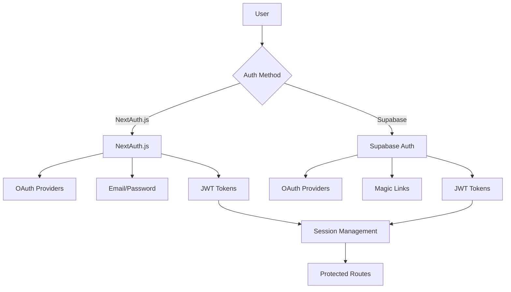
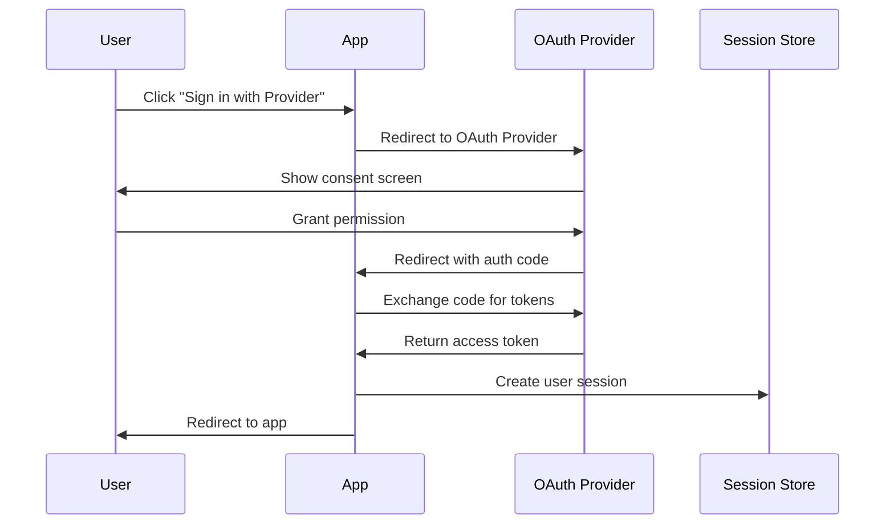
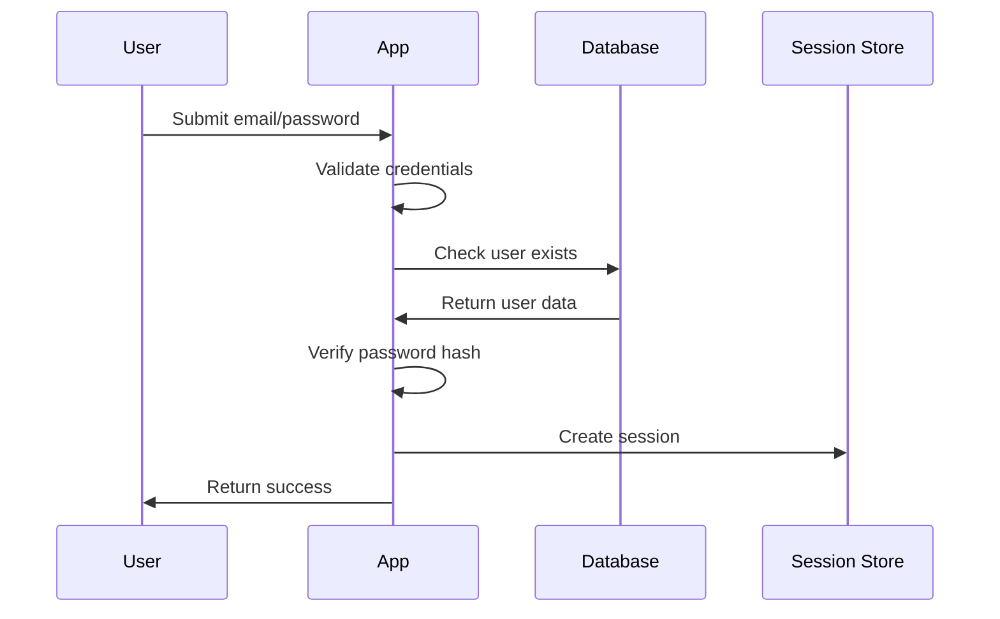

# 

The Ever Works provides a flexible, secure authentication system that supports multiple providers and authentication methods.

## Authentication Architecture

The template uses a hybrid authentication approach, supporting both NextAuth.js and Supabase Auth simultaneously, allowing you to choose the best solution for your needs.



## Supported Authentication Methods

### 1. OAuth Providers

#### NextAuth.js OAuth
- **Google** - Google OAuth 2.0
- **GitHub** - GitHub OAuth
- **Facebook** - Facebook Login
- **Twitter/X** - Twitter OAuth 2.0
- **Microsoft** - Microsoft OAuth 2.0

#### Supabase OAuth
- **Google** - Google OAuth 2.0
- **GitHub** - GitHub OAuth
- **Facebook** - Facebook Login
- **Twitter/X** - Twitter OAuth 2.0
- **Discord** - Discord OAuth
- **Apple** - Sign in with Apple

### 2. Email/Password Authentication

#### NextAuth.js Credentials
- Custom email/password authentication
- Password hashing with bcrypt
- Custom validation logic
- Database session storage

#### Supabase Auth
- Built-in email/password authentication
- Email verification
- Password reset functionality
- Secure password policies

### 3. Magic Link Authentication

#### Supabase Magic Links
- Passwordless authentication
- Email-based login
- Secure token generation
- Automatic account creation

## Authentication Flow

### OAuth Authentication Flow



### Email/Password Flow



## User Roles and Permissions

### Default Roles

| Role | Description | Permissions |
|------|-------------|-------------|
| **user** | Regular user | Submit items, manage profile |
| **moderator** | Content moderator | Review submissions, moderate content |
| **admin** | Administrator | Full system access except user management |
| **super_admin** | Super administrator | Complete system control |

### Permission System

```typescript
// Permission definitions
export const permissions = {
  // Item permissions
  'items:create': ['user', 'moderator', 'admin', 'super_admin'],
  'items:read': ['user', 'moderator', 'admin', 'super_admin'],
  'items:update': ['moderator', 'admin', 'super_admin'],
  'items:delete': ['admin', 'super_admin'],
  'items:approve': ['moderator', 'admin', 'super_admin'],
  
  // User permissions
  'users:read': ['admin', 'super_admin'],
  'users:update': ['admin', 'super_admin'],
  'users:delete': ['super_admin'],
  'users:ban': ['admin', 'super_admin'],
  
  // System permissions
  'system:configure': ['super_admin'],
  'system:backup': ['admin', 'super_admin'],
  'system:logs': ['admin', 'super_admin'],
} as const;
```

## Session Management

### NextAuth.js Sessions

#### JWT Strategy
```typescript
// JWT session configuration
export const authOptions: NextAuthOptions = {
  session: {
    strategy: 'jwt',
    maxAge: 30 * 24 * 60 * 60, // 30 days
  },
  jwt: {
    maxAge: 30 * 24 * 60 * 60, // 30 days
  },
  callbacks: {
    jwt: async ({ token, user }) => {
      if (user) {
        token.role = user.role;
        token.permissions = user.permissions;
      }
      return token;
    },
    session: async ({ session, token }) => {
      session.user.role = token.role;
      session.user.permissions = token.permissions;
      return session;
    },
  },
};
```

#### Database Strategy
```typescript
// Database session configuration
export const authOptions: NextAuthOptions = {
  session: {
    strategy: 'database',
    maxAge: 30 * 24 * 60 * 60, // 30 days
    updateAge: 24 * 60 * 60, // 24 hours
  },
  adapter: DrizzleAdapter(db),
};
```

### Supabase Sessions

```typescript
// Supabase session management
export const supabaseAuth = {
  session: {
    persistSession: true,
    autoRefreshToken: true,
    detectSessionInUrl: true,
  },
  auth: {
    flowType: 'pkce',
    autoRefreshToken: true,
    persistSession: true,
  },
};
```

## Security Features

### Password Security

#### Password Requirements
- Minimum 8 characters
- At least one uppercase letter
- At least one lowercase letter
- At least one number
- At least one special character

#### Password Hashing
```typescript
import bcrypt from 'bcryptjs';

// Hash password
const hashPassword = async (password: string): Promise<string> => {
  const saltRounds = 12;
  return bcrypt.hash(password, saltRounds);
};

// Verify password
const verifyPassword = async (password: string, hash: string): Promise<boolean> => {
  return bcrypt.compare(password, hash);
};
```

### Rate Limiting

```typescript
// Authentication rate limiting
export const authRateLimit = {
  signin: {
    max: 5, // 5 attempts
    windowMs: 15 * 60 * 1000, // 15 minutes
  },
  signup: {
    max: 3, // 3 attempts
    windowMs: 60 * 60 * 1000, // 1 hour
  },
  passwordReset: {
    max: 3, // 3 attempts
    windowMs: 60 * 60 * 1000, // 1 hour
  },
};
```

### CSRF Protection

```typescript
// CSRF token validation
export const csrfProtection = {
  enabled: true,
  secret: process.env.CSRF_SECRET,
  cookie: {
    name: '__Host-csrf-token',
    sameSite: 'strict',
    secure: true,
    httpOnly: true,
  },
};
```

## Route Protection

### Middleware Protection

```typescript
// middleware.ts
import { withAuth } from 'next-auth/middleware';

export default withAuth(
  function middleware(req) {
    // Additional middleware logic
  },
  {
    callbacks: {
      authorized: ({ token, req }) => {
        // Check if user has required permissions
        const { pathname } = req.nextUrl;
        
        if (pathname.startsWith('/admin')) {
          return token?.role === 'admin' || token?.role === 'super_admin';
        }
        
        if (pathname.startsWith('/moderator')) {
          return ['moderator', 'admin', 'super_admin'].includes(token?.role);
        }
        
        return !!token;
      },
    },
  }
);

export const config = {
  matcher: ['/admin/:path*', '/moderator/:path*', '/profile/:path*'],
};
```

### Component-Level Protection

```typescript
// components/ProtectedRoute.tsx
interface ProtectedRouteProps {
  children: React.ReactNode;
  requiredRole?: UserRole;
  requiredPermission?: string;
  fallback?: React.ReactNode;
}

export function ProtectedRoute({
  children,
  requiredRole,
  requiredPermission,
  fallback = <div>Access denied</div>,
}: ProtectedRouteProps) {
  const { data: session, status } = useSession();
  
  if (status === 'loading') {
    return <div>Loading...</div>;
  }
  
  if (!session) {
    return <SignInPrompt />;
  }
  
  if (requiredRole && !hasRole(session.user, requiredRole)) {
    return fallback;
  }
  
  if (requiredPermission && !hasPermission(session.user, requiredPermission)) {
    return fallback;
  }
  
  return <>{children}</>;
}
```

## Error Handling

### Authentication Errors

```typescript
// Authentication error types
export enum AuthError {
  INVALID_CREDENTIALS = 'invalid_credentials',
  USER_NOT_FOUND = 'user_not_found',
  USER_BANNED = 'user_banned',
  EMAIL_NOT_VERIFIED = 'email_not_verified',
  RATE_LIMIT_EXCEEDED = 'rate_limit_exceeded',
  OAUTH_ERROR = 'oauth_error',
  SESSION_EXPIRED = 'session_expired',
}

// Error handling
export const handleAuthError = (error: AuthError) => {
  switch (error) {
    case AuthError.INVALID_CREDENTIALS:
      return 'Invalid email or password';
    case AuthError.USER_BANNED:
      return 'Your account has been suspended';
    case AuthError.EMAIL_NOT_VERIFIED:
      return 'Please verify your email address';
    case AuthError.RATE_LIMIT_EXCEEDED:
      return 'Too many attempts. Please try again later';
    default:
      return 'An error occurred during authentication';
  }
};
```

## Testing Authentication

### Unit Tests

```typescript
// __tests__/auth.test.ts
import { hashPassword, verifyPassword } from '@/lib/auth';

describe('Password hashing', () => {
  it('should hash password correctly', async () => {
    const password = 'testPassword123!';
    const hash = await hashPassword(password);
    
    expect(hash).not.toBe(password);
    expect(hash).toMatch(/^\$2[aby]\$\d+\$/);
  });
  
  it('should verify password correctly', async () => {
    const password = 'testPassword123!';
    const hash = await hashPassword(password);
    
    const isValid = await verifyPassword(password, hash);
    expect(isValid).toBe(true);
    
    const isInvalid = await verifyPassword('wrongPassword', hash);
    expect(isInvalid).toBe(false);
  });
});
```

### Integration Tests

```typescript
// __tests__/auth-flow.test.ts
import { render, screen, fireEvent, waitFor } from '@testing-library/react';
import { SignInForm } from '@/components/auth/SignInForm';

describe('Authentication flow', () => {
  it('should sign in user with valid credentials', async () => {
    render(<SignInForm />);
    
    fireEvent.change(screen.getByLabelText(/email/i), {
      target: { value: 'test@example.com' },
    });
    
    fireEvent.change(screen.getByLabelText(/password/i), {
      target: { value: 'password123!' },
    });
    
    fireEvent.click(screen.getByRole('button', { name: /sign in/i }));
    
    await waitFor(() => {
      expect(screen.getByText(/welcome/i)).toBeInTheDocument();
    });
  });
});
```

## Best Practices

### Security Best Practices

1. **Use HTTPS** in production
2. **Implement rate limiting** for auth endpoints
3. **Validate input** on both client and server
4. **Use secure session storage**
5. **Implement proper CSRF protection**
6. **Regular security audits**

### User Experience Best Practices

1. **Clear error messages**
2. **Loading states** during authentication
3. **Remember user preferences**
4. **Smooth OAuth redirects**
5. **Mobile-friendly auth forms**

### Development Best Practices

1. **Environment-specific OAuth apps**
2. **Comprehensive testing**
3. **Proper error logging**
4. **Documentation updates**
5. **Regular dependency updates**

## Next Steps

Authentication is now configured and ready to use. You can customize the providers and settings according to your needs.
