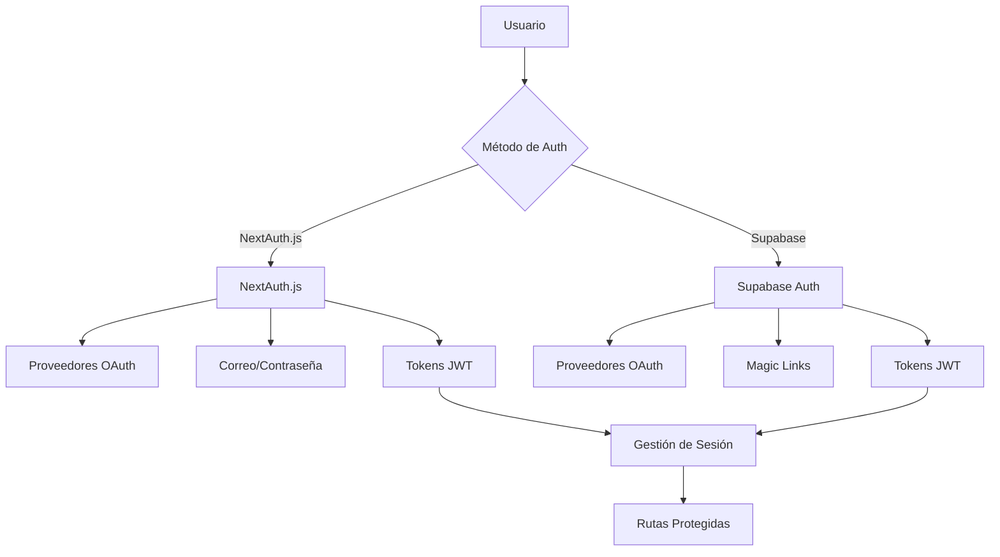
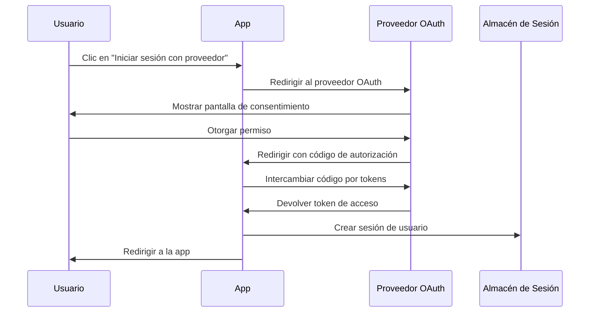

# Descripción general de autenticación

Ever Works ofrece un sistema de autenticación flexible y seguro que admite múltiples proveedores y métodos de autenticación.

## Arquitectura de autenticación

La plantilla utiliza un enfoque de autenticación híbrido, compatible con NextAuth.js y Supabase Auth simultáneamente, permitiéndole elegir la mejor solución para sus necesidades.

## Métodos de autenticación admitidos

### 1. Proveedores OAuth

#### NextAuth.js OAuth
- **Google** - Google OAuth 2.0
- **GitHub** - GitHub OAuth
- **Facebook** - Facebook Login
- **Twitter/X** - Twitter OAuth 2.0
- **Microsoft** - Microsoft OAuth 2.0

#### Supabase OAuth
- **Google** - Google OAuth 2.0
- **GitHub** - GitHub OAuth
- **Facebook** - Facebook Login
- **Twitter/X** - Twitter OAuth 2.0
- **Discord** - Discord OAuth
- **Apple** - Iniciar sesión con Apple

### 2. Autenticación con correo electrónico y contraseña

#### NextAuth.js Credentials
- Autenticación personalizada de correo/contraseña
- Hash de contraseña con bcrypt
- Lógica de validación personalizada
- Almacenamiento de sesión en base de datos

#### Supabase Auth
- Autenticación integrada de correo/contraseña
- Verificación de correo electrónico
- Funcionalidad de restablecimiento de contraseña
- Políticas de contraseñas seguras

### 3. Autenticación con enlace mágico

#### Supabase Magic Links
- Autenticación sin contraseña
- Inicio de sesión por correo electrónico
- Generación segura de tokens
- Creación automática de cuenta

### 4. WebAuthn / Passkeys

Compatibilidad con NextAuth.js para autenticación biométrica, llaves de seguridad de hardware y FIDO2.

## Flujo de autenticación

### Flujo OAuth

## Gestión de sesiones

- Tokens JWT para autenticación sin estado
- Sesiones de base de datos para estado persistente
- Manejo seguro de cookies
- Actualización automática de tokens

## Características de seguridad

- Protección CSRF
- Limitación de velocidad
- Protección contra fuerza bruta
- Hash seguro de contraseñas con bcrypt
