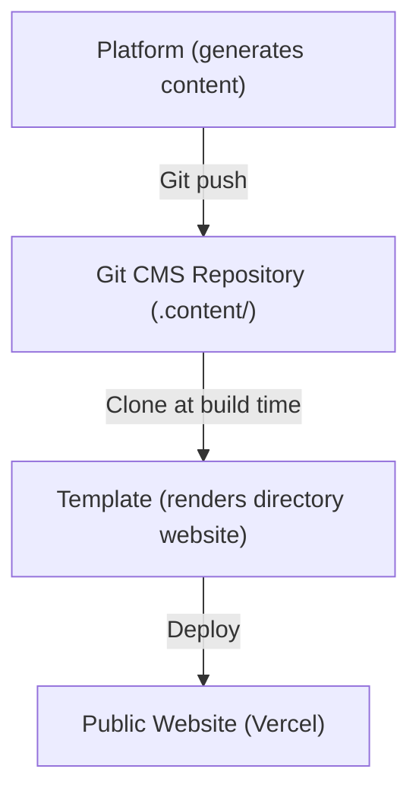
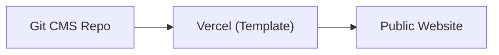
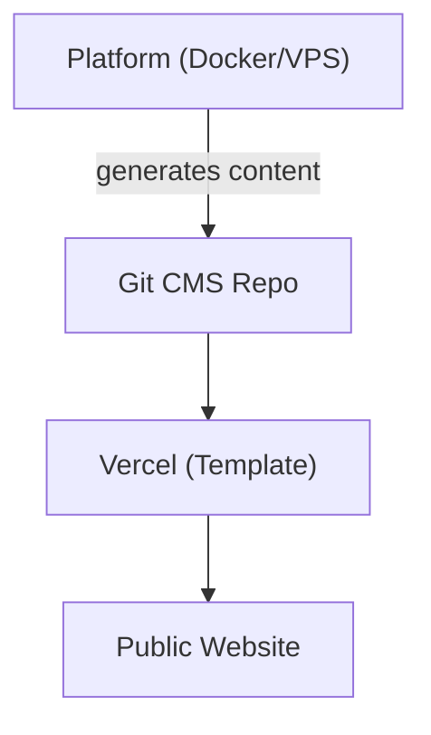
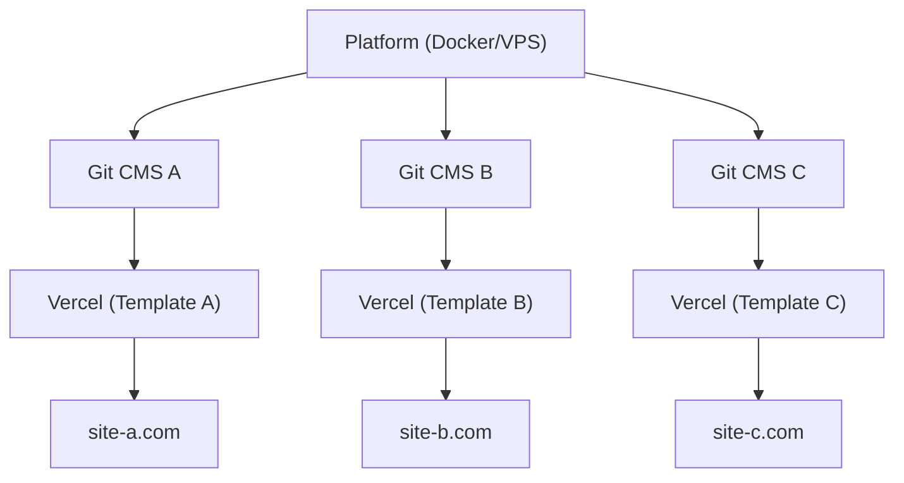

# Plataforma vs Plantilla

Ever Works consta de dos productos principales que sirven propósitos diferentes pero trabajan juntos como un ecosistema unificado. Esta página explica la diferencia y cuándo usar cada uno.

## Ever Works Platform

La **Ever Works Platform** es la infraestructura backend para construir y gestionar sitios web de directorio a escala. Proporciona una API REST, pipelines de generación de contenido impulsados por IA, un sistema de plugins y orquestación de despliegue.

Para la documentación completa de la plataforma, visita [docs.ever.works](https://docs.ever.works).

## Directory Web Template

El **Directory Web Template** (este proyecto) es un sitio web de directorio full-stack listo para producción que puedes clonar, personalizar e implementar como una aplicación independiente.

### Qué hace

- Proporciona un **sitio web de directorio** completo con listados de elementos, búsqueda, filtrado, categorías, etiquetas y colecciones
- Incluye **autenticación** a través de NextAuth.js v5 con proveedores OAuth (Google, GitHub, Facebook, Twitter, Microsoft) y Supabase Auth
- Soporta **pagos** mediante Stripe, LemonSqueezy y Polar con gestión de suscripciones
- Ofrece **internacionalización** con múltiples idiomas y soporte RTL mediante next-intl
- Utiliza un **CMS basado en Git** para sincronizar el contenido del directorio desde repositorios Git
- Incluye un **sistema de temas** con temas integrados y generación dinámica de colores
- Proporciona **análisis y monitoreo** a través de PostHog y Sentry
- Incluye **optimización SEO**, generación de sitemap y datos estructurados (JSON-LD)
- Incluye un **panel de administración** con gestión de contenido, gestión de usuarios y análisis

### Stack Tecnológico

- **Framework:** Next.js 15, React 19
- **Lenguaje:** TypeScript 5
- **ORM:** Drizzle ORM (PostgreSQL)
- **UI:** Tailwind CSS 4, HeroUI React, Radix UI
- **Auth:** NextAuth.js v5, Supabase Auth
- **Pagos:** Stripe, LemonSqueezy, Polar
- **Testing:** Playwright (E2E)
- **Despliegue:** Vercel (principal), Docker (alternativo)

## Comparación en Paralelo

| Aspecto              | Plataforma                                 | Plantilla                              |
| -------------------- | ------------------------------------------ | -------------------------------------- |
| **Propósito**        | Infraestructura backend y pipeline de IA   | Sitio web de directorio frontend       |
| **Arquitectura**     | Monorepo (Turborepo + pnpm)                | Aplicación Next.js independiente       |
| **Backend**          | NestJS 11 API                              | Rutas de API de Next.js                |
| **ORM de Base**      | TypeORM                                    | Drizzle ORM                            |
| **Autenticación**    | JWT + OAuth (NestJS Guards)                | NextAuth.js v5 + Supabase Auth         |
| **Pagos**            | No incluido                                | Stripe, LemonSqueezy, Polar            |
| **Funciones de IA**  | Agentes LangChain, 7 proveedores LLM       | Ninguna (consume contenido generado por IA) |
| **Contenido**        | Genera contenido mediante pipelines de IA  | Lee contenido del CMS basado en Git    |
| **Despliegue**       | Docker en cualquier VPS                    | Vercel (o Docker)                      |
| **Testing**          | Jest + Vitest                              | Playwright                             |
| **Audiencia**        | Operadores de plataforma, desarrolladores IA | Constructores de sitios web, creadores de directorios |

## Cómo Se Conectan

La Plataforma y la Plantilla trabajan juntas a través del patrón de **CMS basado en Git**:

### Operación Independiente

- **Plantilla sin Plataforma:** Mantén el contenido del directorio manualmente editando archivos YAML y Markdown en el repositorio Git CMS. La Plantilla funciona como un sitio web de directorio completamente funcional sin generación de IA.
- **Plataforma sin Plantilla:** Usa la API de la Plataforma para generar datos del directorio y exportarlos a cualquier frontend.

## Cuándo Usar Cuál

### Usa la Plantilla cuando...

- Quieres lanzar un sitio web de directorio rápidamente con una configuración mínima del backend
- El contenido de tu directorio se curada manualmente o proviene de una fuente de datos estática
- Necesitas un sitio web listo para producción con autenticación, pagos y SEO listos para usar
- Prefieres desplegar en Vercel sin gestión de servidor

### Usa la Plataforma cuando...

- Necesitas generación de contenido impulsada por IA para directorios grandes
- Quieres pipelines automatizados que descubren, enriquecen y actualizan elementos del directorio
- Necesitas gestionar múltiples directorios desde un único backend
- Quieres usar el sistema de plugins para integraciones personalizadas

### Usa Ambos cuando...

- Quieres que el contenido generado por IA fluya en un sitio web de producción
- Estás construyendo un producto SaaS sobre Ever Works
- Necesitas generación automatizada de contenido Y un frontend pulido

## Arquitecturas de Despliegue

### Solo Plantilla (La Más Simple)

Gestión manual de contenido mediante Git. Despliegue único en Vercel.

### Plataforma + Plantilla (Full Stack)

Generación automatizada de contenido mediante Plataforma. Conectado a través de Git.

### Plataforma + Múltiples Plantillas

Una sola instancia de la Plataforma gestionando múltiples sitios web de directorio.
