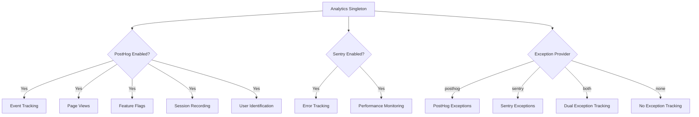
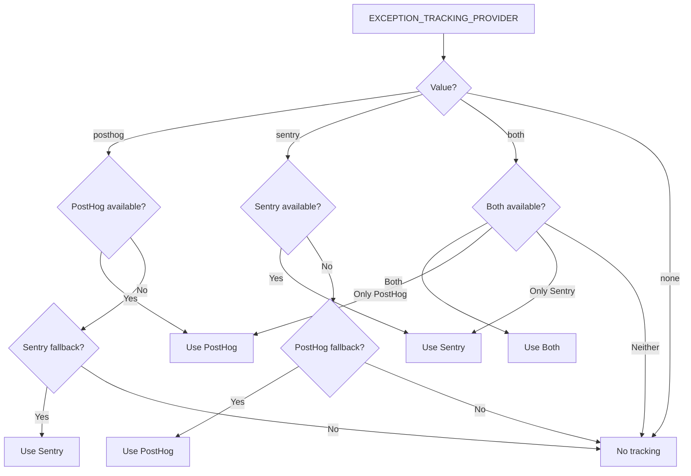

# Configuración de Análisis

El template proporciona un sistema de análisis unificado que integra PostHog para el análisis de producto y Sentry para el seguimiento de errores. Ambos proveedores se gestionan a través de una clase singleton `Analytics` con comportamiento de fallback automático.

## Arquitectura



## Variables de Entorno

### Configuración de PostHog

| Variable | Requerido | Predeterminado | Descripción |
|---|---|---|---|
| `NEXT_PUBLIC_POSTHOG_KEY` | Sí (para análisis) | -- | Clave API del proyecto PostHog |
| `NEXT_PUBLIC_POSTHOG_HOST` | Sí (para análisis) | -- | URL de la instancia de PostHog |
| `POSTHOG_DEBUG` | No | `false` | Habilitar registro de depuración |
| `POSTHOG_SESSION_RECORDING_ENABLED` | No | `true` | Habilitar grabaciones de sesión |
| `POSTHOG_AUTO_CAPTURE` | No | `false` | Captura automática de vistas de página |
| `POSTHOG_EXCEPTION_TRACKING` | No | `true` | Habilitar seguimiento de excepciones de PostHog |

### Configuración de Sentry

| Variable | Requerido | Predeterminado | Descripción |
|---|---|---|---|
| `NEXT_PUBLIC_SENTRY_DSN` | Sí (para errores) | -- | Sentry Data Source Name |
| `SENTRY_ENABLE_DEV` | No | `false` | Habilitar Sentry en desarrollo |
| `SENTRY_DEBUG` | No | `false` | Habilitar modo de depuración de Sentry |
| `SENTRY_EXCEPTION_TRACKING` | No | `true` | Habilitar seguimiento de excepciones de Sentry |

### Seguimiento Unificado de Excepciones

| Variable | Requerido | Predeterminado | Descripción |
|---|---|---|---|
| `EXCEPTION_TRACKING_PROVIDER` | No | `both` | Proveedor a usar: `posthog`, `sentry`, `both` o `none` |

## Configuración de PostHog

### Paso 1: Obtener Credenciales

1. Regístrate en [posthog.com](https://posthog.com) o aloja PostHog por tu cuenta
2. Crea un proyecto
3. Copia la clave API del proyecto y la URL del host

### Paso 2: Configurar el Entorno

```env
NEXT_PUBLIC_POSTHOG_KEY=phc_your_project_key_here
NEXT_PUBLIC_POSTHOG_HOST=https://app.posthog.com
```

PostHog se habilita automáticamente cuando tanto `NEXT_PUBLIC_POSTHOG_KEY` como `NEXT_PUBLIC_POSTHOG_HOST` están configurados.

### Paso 3: Frecuencias de Muestreo

Las frecuencias de muestreo se ajustan automáticamente según el entorno:

| Entorno | Tasa de Muestreo de Eventos | Tasa de Muestreo de Grabación de Sesión |
|---|---|---|
| Producción | 10% (`0.1`) | 10% (`0.1`) |
| Desarrollo | 100% (`1.0`) | 100% (`1.0`) |

## Configuración de Sentry

### Paso 1: Obtener DSN

1. Crea un proyecto en [sentry.io](https://sentry.io)
2. Copia el DSN desde la configuración del proyecto

### Paso 2: Configurar el Entorno

```env
NEXT_PUBLIC_SENTRY_DSN=https://examplePublicKey@o0.ingest.sentry.io/0
SENTRY_ENABLE_DEV=true  # Opcional: habilitar en desarrollo
```

Sentry se habilita automáticamente en producción cuando el DSN está configurado. Para desarrollo, establece explícitamente `SENTRY_ENABLE_DEV=true`.

## API de la Clase Analytics

La clase `Analytics` es un singleton accesible en toda la aplicación:

```typescript
import { analytics } from '@/lib/analytics';
```

### Inicialización

```typescript
// Inicializar analytics (llamar una vez en la raíz de la app)
analytics.init();
```

El método `init()` es solo para el cliente y puede llamarse de forma segura en contextos del servidor (no realizará ninguna acción).

### Seguimiento de Eventos

```typescript
// Rastrear un evento personalizado
analytics.track('button_clicked', {
  buttonName: 'signup',
  page: '/landing'
});

// Rastrear una vista de página
analytics.trackPageView('/dashboard', {
  referrer: document.referrer
});
```

### Identificación de Usuario

```typescript
// Identificar a un usuario (después del inicio de sesión)
analytics.identify('user-123', {
  email: 'user@example.com',
  plan: 'premium',
  company: 'Acme Inc.'
});

// Restablecer identidad (después del cierre de sesión)
analytics.reset();

// Establecer propiedades persistentes del usuario
analytics.setUserProperties({
  subscription_tier: 'premium',
  signup_date: '2024-01-15'
});

// Establecer super propiedades (enviadas con cada evento)
analytics.setSuperProperties({
  app_version: '2.0.0',
  platform: 'web'
});
```

### Indicadores de Funcionalidad

```typescript
// Verificar si un indicador de funcionalidad está habilitado
const isEnabled = analytics.isFeatureEnabled('new-dashboard', false);

// Recargar indicadores de funcionalidad desde el servidor
await analytics.reloadFeatureFlags();
```

### Seguimiento de Excepciones

```typescript
// Capturar una excepción (enrutada al proveedor configurado)
analytics.captureException(error, {
  component: 'PaymentForm',
  action: 'submit'
});

// Capturar con mensaje de texto
analytics.captureException('Payment processing failed', {
  orderId: 'ord-123'
});
```

## Selección del Proveedor de Seguimiento de Excepciones



## Grabación de Sesión

Cuando `POSTHOG_SESSION_RECORDING_ENABLED=true`, PostHog graba las sesiones de usuario con esta configuración de privacidad:

```typescript
session_recording: {
  maskAllInputs: true,        // Enmascarar valores de entrada de formulario
  maskTextSelector: "[data-mask]",  // Enmascarar elementos con data-mask
  sampleRate: 0.1,            // 10% en producción
}
```

Añade `data-mask` a cualquier elemento cuyo contenido de texto deba estar oculto en las grabaciones.

## Seguimiento de Excepciones con PostHog

Cuando el seguimiento de excepciones de PostHog está habilitado, el sistema instala manejadores de errores globales:

- **`window.onerror`** -- Captura errores JavaScript no controlados
- **`unhandledrejection`** -- Captura rechazos de Promise no controlados

Estos se reenvían a PostHog como eventos `$exception` con trazas de pila.

## Integración Sentry-PostHog

Cuando ambos proveedores están activos (`EXCEPTION_TRACKING_PROVIDER=both`), el sistema crea un vínculo bidireccional:

1. La propiedad `sentry` de PostHog se establece en el SDK de Sentry
2. Un procesador de eventos Sentry personalizado reenvía errores a PostHog como eventos `sentry_error`
3. Esto permite correlacionar las sesiones de usuario (PostHog) con los detalles de errores (Sentry)

## Constantes de Seguimiento de Visitantes

El archivo `lib/constants/analytics.ts` proporciona constantes para el seguimiento anónimo de visitantes:

```typescript
// Nombre de la cookie para el ID de visitante anónimo
```
