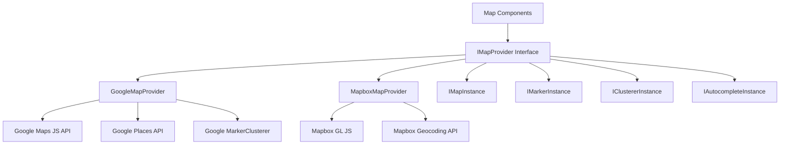
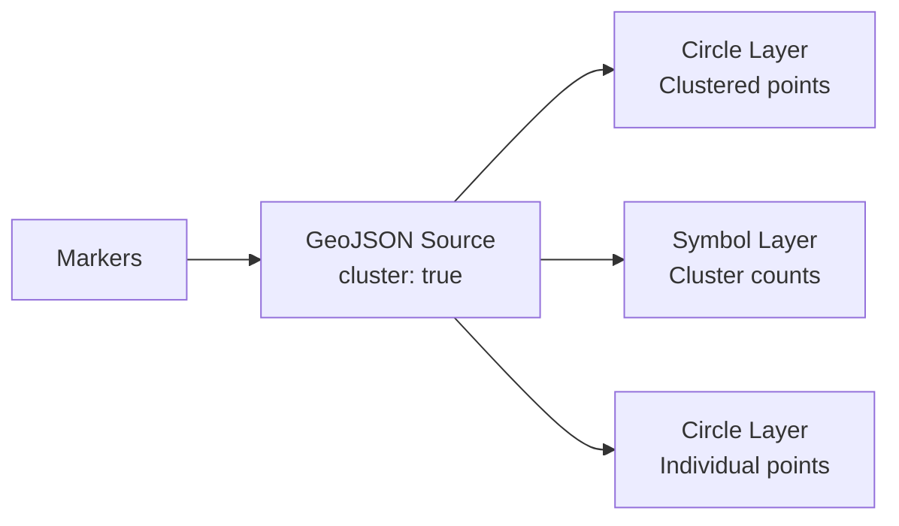

# Configuración de Mapa

La plantilla incluye un sistema de mapas agnóstico al proveedor compatible con Google Maps y Mapbox GL JS. Una capa de interfaz compartida permite cambiar entre proveedores sin modificar el código de los componentes.

## Arquitectura



## Selección de Proveedor

El proveedor de mapas se determina según las claves de API configuradas:

| Proveedor | Variable de Entorno Necesaria |
|---|---|
| Google Maps | `NEXT_PUBLIC_GOOGLE_MAPS_API_KEY` |
| Mapbox | `NEXT_PUBLIC_MAPBOX_ACCESS_TOKEN` |

Si ambos están configurados, el proveedor se selecciona a través de los ajustes de configuración de mapa de la aplicación.

## Configuración de Google Maps

### Paso 1: Obtener Clave de API

1. Ve a [Google Cloud Console](https://console.cloud.google.com)
2. Habilita las siguientes APIs:
   - Maps JavaScript API
   - Places API
   - Geocoding API
3. Crea una clave de API con restricciones de referencia HTTP

### Paso 2: Configurar Entorno

```env
NEXT_PUBLIC_GOOGLE_MAPS_API_KEY=AIzaSy...your-api-key
NEXT_PUBLIC_GOOGLE_MAPS_MAP_ID=your-map-id        # Optional: for styled maps
```

### Paso 3: Seguridad

El proveedor de Google Maps aplica el uso de claves solo en el navegador:

```typescript
// @security Uses NEXT_PUBLIC_GOOGLE_MAPS_API_KEY (browser-exposed).
// Only use HTTP referrer-restricted keys, never unrestricted or server keys.
```

**Restricciones requeridas para la clave de API:**
- Restricción de aplicación: referencias HTTP
- Añade tus patrones de dominio (ej. `https://tudominio.com/*`)
- Restricción de API: Limitar a Maps JavaScript, Places y Geocoding APIs

## Configuración de Mapbox

### Paso 1: Obtener Token de Acceso

1. Regístrate en [mapbox.com](https://www.mapbox.com)
2. Copia tu token de acceso público (comienza con `pk.`)

### Paso 2: Configurar Entorno

```env
NEXT_PUBLIC_MAPBOX_ACCESS_TOKEN=pk.eyJ1Ijoi...your-token
```

### Paso 3: Seguridad

```typescript
// @security Uses NEXT_PUBLIC_MAPBOX_ACCESS_TOKEN (browser-exposed).
// Only use public tokens (pk.*) with URL restrictions, never secret tokens (sk.*).
```

**Restricciones requeridas para el token:**
- Usa un token **público** (prefijo `pk.`)
- Añade restricciones de URL para tus dominios
- Nunca uses tokens secretos (`sk.*`) en código del lado del cliente

## Interfaz del Proveedor

Ambos proveedores implementan la interfaz `IMapProvider` con capacidades idénticas:

### Métodos de IMapProvider

| Método | Descripción |
|---|---|
| `isLoaded()` | Verificar si el script del proveedor está cargado |
| `loadScript()` | Cargar la biblioteca del proveedor (idempotente) |
| `createMap(container, options)` | Crear una instancia de mapa en un elemento DOM |
| `createMarker(map, options)` | Añadir un marcador al mapa |
| `createClusterer(map, options, onClick)` | Agrupar marcadores cercanos en clústeres |
| `createAutocomplete(input, onSelect)` | Adjuntar autocompletado de dirección a una entrada |
| `getStyleUrl(style)` | Obtener la URL de estilo para la vista de calles o satélite |
| `isConfigured()` | Verificar si las claves de API están presentes |

### Estilos de Mapa

| Estilo | Google Maps | Mapbox |
|---|---|---|
| `streets` | `roadmap` | `mapbox://styles/mapbox/streets-v12` |
| `satellite` | `satellite` | `mapbox://styles/mapbox/satellite-streets-v12` |

## Sistema de Tipos

La biblioteca de mapas define tipos completos en `lib/maps/types.ts`:

### Tipos Principales

```typescript
interface Coordinates {
  latitude: number;
  longitude: number;
}

interface MapBounds {
  north: number;
  south: number;
  east: number;
  west: number;
}

interface MapViewport {
  center: Coordinates;
  zoom: number;
  bounds?: MapBounds;
}
```

### Tipos de Marcadores

```typescript
interface MapMarkerData {
  id: string;
  coordinates: Coordinates;
  title: string;
  icon?: string;
  category?: string;
  slug: string;
  description?: string;
}

interface MapMarkerWithDistance extends MapMarkerData {
  distanceKm?: number;
}
```

### Configuración de Clústeres

```typescript
interface ClusterOptions {
  radius?: number;     // Cluster radius in pixels (default: 60)
  maxZoom?: number;    // Max zoom for clustering (default: 16)
  minZoom?: number;    // Min zoom for clustering (default: 0)
  minPoints?: number;  // Min points to form cluster (default: 2)
}
```

### Controladores de Eventos

```typescript
interface MapEventHandlers {
  onMarkerClick?: (marker: MapMarkerData) => void;
  onClusterClick?: (cluster: MapClusterData) => void;
  onViewportChange?: (viewport: MapViewport) => void;
  onMapReady?: () => void;
  onMapError?: (error: Error) => void;
}
```

## Props del Componente de Mapa

La interfaz `MapComponentProps` define el conjunto completo de props para el componente de mapa principal:

| Prop | Tipo | Predeterminado | Descripción |
|---|---|---|---|
| `markers` | `MapMarkerData[]` | `[]` | Marcadores a mostrar |
| `center` | `Coordinates` | -- | Posición central inicial |
| `zoom` | `number` | -- | Nivel de zoom inicial (1-20) |
| `style` | `MapStyle` | `streets` | Estilo del mapa (calles/satélite) |
| `height` | `string \| number` | -- | Altura del contenedor |
| `width` | `string \| number` | -- | Anchura del contenedor |
| `enableClustering` | `boolean` | `false` | Habilitar agrupación de marcadores |
| `clusterOptions` | `ClusterOptions` | -- | Configuración de agrupación |
| `controls` | `MapControlsConfig` | -- | Configuración de controles de interfaz |
| `isLoading` | `boolean` | `false` | Estado de carga externo |
| `isDisabled` | `boolean` | `false` | Deshabilitar interacción |
| `onMarkerClick` | `function` | -- | Controlador de clic en marcador |
| `onClusterClick` | `function` | -- | Controlador de clic en clúster |
| `onViewportChange` | `function` | -- | Controlador de cambio de viewport |

## Autocompletado de Dirección

Ambos proveedores admiten autocompletado de dirección con una interfaz unificada:

```typescript
interface AddressSuggestion {
  id: string;
  mainText: string;       // Street address
  secondaryText: string;  // City, state
  fullAddress: string;    // Complete formatted address
  coordinates?: Coordinates;
}
```

**Google Maps:** Usa la API Place Autocomplete con los campos `formatted_address`, `geometry`, `name` y `address_components`.

**Mapbox:** Usa la API Geocoding (`/geocoding/v5/mapbox.places/`) con entrada con debounce (300ms) y una interfaz desplegable personalizada.

## Selector de Ubicación

La interfaz `LocationPickerProps` admite una experiencia completa de selección de ubicación:

```typescript
interface LocationPickerValue {
  address?: string;
  city?: string;
  state?: string;
  country?: string;
  postalCode?: string;
  latitude?: number;
  longitude?: number;
  serviceArea?: 'local' | 'regional' | 'national' | 'global';
  isRemote?: boolean;
}
```

## Servicios de Geocodificación

La geocodificación del lado del servidor está disponible a través de `lib/services/geocoding/`:

| Archivo | Propósito |
|---|---|
| `geocoding-provider.interface.ts` | Interfaz de geocodificación compartida |
| `google-geocoding.provider.ts` | Implementación de la API Geocoding de Google |
| `mapbox-geocoding.provider.ts` | Implementación de la API Geocoding de Mapbox |
| `geocoding.service.ts` | Servicio de geocodificación unificado |

## Implementación de Agrupación

### Agrupación de Google Maps

Usa `@googlemaps/markerclusterer` con `AdvancedMarkerElement`:

- Importa dinámicamente la biblioteca de agrupación
- Crea elementos de contenido de marcadores personalizados con iconos
- Comportamiento predeterminado: zoom a los límites del clúster al hacer clic

### Agrupación de Mapbox

Usa la agrupación nativa a nivel de fuente de Mapbox GL:

- Fuente GeoJSON con `cluster: true`
- Tres capas: círculos de clúster, etiquetas de recuento, puntos no agrupados
- Codificados por color según el tamaño del clúster (pequeño: cian, mediano: amarillo, grande: rosa)



## Configuración de Controles

```typescript
interface MapControlsConfig {
  showZoomControls?: boolean;        // Zoom in/out buttons
  showFullscreenControl?: boolean;   // Fullscreen toggle
  showNavigationControl?: boolean;   // Compass/navigation
  showScaleControl?: boolean;        // Distance scale
}
```

## Solución de Problemas

| Problema | Solución |
|---|---|
| Mapa no se renderiza | Verifica que la clave de API esté configurada y sea correcta |
| "Google Maps API key not configured" | Establece `NEXT_PUBLIC_GOOGLE_MAPS_API_KEY` |
| Mapa Mapbox en blanco | Asegúrate de que el token comience con `pk.` (público) |
| Marcadores sin agrupar | Establece `enableClustering={true}` en el componente de mapa |
| Autocompletado no funciona | Verifica que Places API esté habilitada (Google) |
| Errores de CORS | Comprueba las restricciones de dominio de la clave de API |
| Limitación de velocidad | Supervisa el uso de API en el panel del proveedor |
