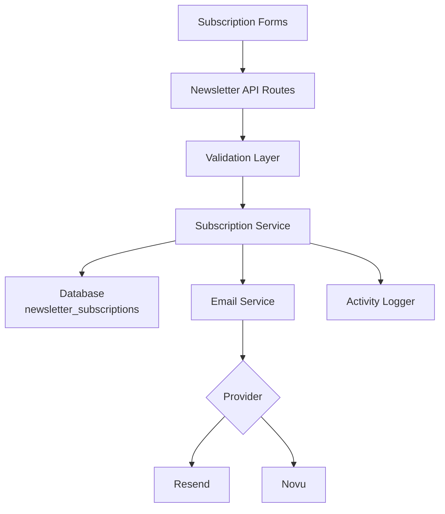
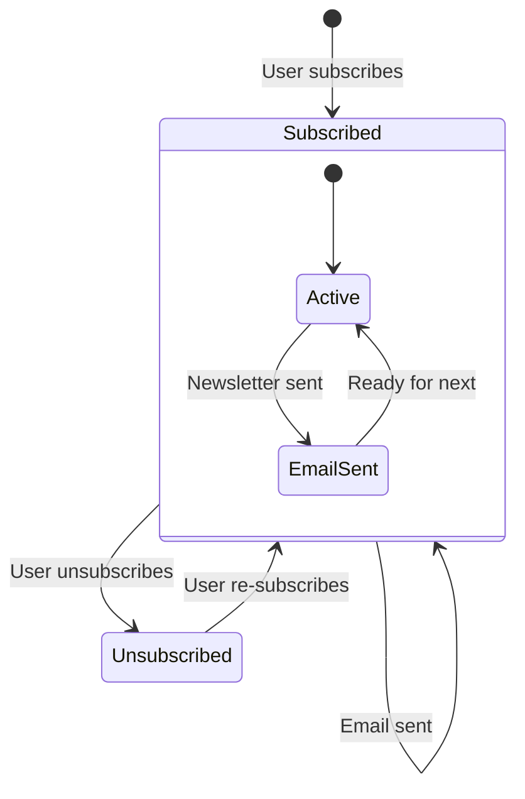

# Configuración del Boletín

La plantilla incluye un sistema completo de suscripción al boletín con integración de proveedor de correo electrónico, validación, gestión del ciclo de vida de suscripciones y registro de actividades. La configuración está centralizada en `lib/newsletter/`.

## Arquitectura



## Estructura de Archivos

```
lib/newsletter/
├── config.ts    # Configuration, types, validation schemas
└── utils.ts     # Email sending, subscription validation, logging
```

## Constantes de Configuración

El objeto `NEWSLETTER_CONFIG` en `config.ts` define todos los valores predeterminados y mensajes:

```typescript
export const NEWSLETTER_CONFIG = {
  DEFAULT_PROVIDER: "resend",
  DEFAULT_FROM: "onboarding@resend.dev",
  DEFAULT_COMPANY_NAME: "Ever Works",

  SOURCES: {
    FOOTER: "footer",
    POPUP: "popup",
    SIGNUP: "signup",
  },

  ERRORS: {
    INVALID_EMAIL: "Please enter a valid email address",
    ALREADY_SUBSCRIBED: "Email is already subscribed to the newsletter",
    NOT_SUBSCRIBED: "Email is not subscribed to the newsletter",
    SUBSCRIPTION_FAILED: "Failed to create subscription. Please try again.",
    UNSUBSCRIPTION_FAILED: "Failed to unsubscribe. Please try again.",
    EMAIL_SEND_FAILED: "Failed to send email. Please try again.",
    STATS_FAILED: "Failed to get newsletter statistics",
  },

  SUCCESS: {
    SUBSCRIBED: "Successfully subscribed to newsletter",
    UNSUBSCRIBED: "Successfully unsubscribed from newsletter",
  },
};
```

## Configuración del Proveedor de Correo Electrónico

### Resend (Predeterminado)

```env
RESEND_API_KEY=re_your_api_key_here
```

1. Regístrese en [resend.com](https://resend.com)
2. Cree una clave de API
3. Verifique su dominio de envío (o use `onboarding@resend.dev` para pruebas)

### Novu

```env
NOVU_API_KEY=your_novu_api_key
```

Para Novu, hay configuración adicional disponible en la configuración del sitio:

```yaml
mail:
  provider: "novu"
  template_id: "your-template-id"
  backend_url: "https://api.novu.co"
```

## Configuración de Correo Electrónico

La función `createEmailConfig()` construye la configuración de correo electrónico desde la configuración de la aplicación:

```typescript
interface EmailConfig {
  provider: string;      // "resend" or "novu"
  defaultFrom: string;   // Sender email address
  domain: string;        // Application domain URL
  apiKeys: {
    resend: string;
    novu: string;
  };
  novu?: {
    templateId?: string;
    backendUrl?: string;
  };
}
```

Prioridad de configuración:

| Configuración      | Fuente                          | Valor por defecto          |
|---|---|---|
| Proveedor          | `config.mail.provider`          | `"resend"`                 |
| Dirección remitente| `config.mail.default_from`      | `"onboarding@resend.dev"`  |
| Dominio            | `config.app_url`                | `coreConfig.APP_URL`       |
| Clave Resend       | Variable de entorno `RESEND_API_KEY` | Cadena vacía          |
| Clave Novu         | Variable de entorno `NOVU_API_KEY`  | Cadena vacía          |

## Esquemas de Validación

El sistema de boletín usa esquemas Zod para la validación de entradas:

### Esquema de Correo Electrónico

```typescript
const emailSchema = z.object({
  email: z
    .string()
    .email("Please enter a valid email address")
    .transform((email) => email.toLowerCase().trim()),
});
```

### Esquema de Suscripción

```typescript
const newsletterSubscriptionSchema = z.object({
  email: z
    .string()
    .email("Please enter a valid email address")
    .transform((email) => email.toLowerCase().trim()),
  source: z
    .enum(["footer", "popup", "signup"])
    .default("footer"),
});
```

## Fuentes de Suscripción

Rastrear de dónde provienen las suscripciones:

| Fuente   | Descripción                                      |
|---|---|
| `footer` | Formulario de suscripción en el pie de página    |
| `popup`  | Popup/modal del boletín                          |
| `signup` | Flujo de registro de cuenta                      |

## Utilidades del Boletín

### Envío de Correo Electrónico

```typescript
import { sendEmailSafely, createEmailService } from '@/lib/newsletter/utils';

// Create email service
const { service, config } = await createEmailService();

// Send email with error handling
const result = await sendEmailSafely(
  service,
  config,
  {
    subject: "Welcome to our newsletter!",
    html: "<h1>Welcome!</h1>",
    text: "Welcome!"
  },
  "user@example.com",
  "welcome"
);

if (!result.success) {
  console.error(result.error);
}
```

### Validación de Suscripción

```typescript
import { canSubscribe, canUnsubscribe } from '@/lib/newsletter/utils';

// Check if email can be subscribed
const { canSubscribe: allowed, error } = await canSubscribe("user@example.com");
if (!allowed) {
  // Email is already subscribed
}

// Check if email can be unsubscribed
const { canUnsubscribe: allowed, error } = await canUnsubscribe("user@example.com");
if (!allowed) {
  // Email is not currently subscribed
}
```

### Registro de Actividades

```typescript
import { logNewsletterActivity, trackNewsletterMetric } from '@/lib/newsletter/utils';

// Log newsletter activity
logNewsletterActivity("subscribe", "user@example.com", "footer", {
  ip: "192.168.1.1"
});

// Track newsletter metrics
trackNewsletterMetric("subscription", "user@example.com", "popup");
```

Tipos de actividad:

| Acción         | Cuándo se Registra                                  |
|---|---|
| `subscribe`    | El usuario se suscribe al boletín                   |
| `unsubscribe`  | El usuario cancela la suscripción                   |
| `email_sent`   | Correo del boletín enviado con éxito                |
| `email_failed` | Falló el envío del correo del boletín               |

### Utilidades de Plantilla

```typescript
import { getTemplateWithCompany } from '@/lib/newsletter/utils';

// Generate email template with company name
const template = await getTemplateWithCompany(
  (email, companyName) => ({
    subject: `Welcome to ${companyName}`,
    html: `<p>Thanks for subscribing, ${email}!</p>`,
    text: `Thanks for subscribing, ${email}!`
  }),
  "user@example.com"
);
```

### Helpers de Respuesta

```typescript
import { createErrorResponse, createSuccessResponse } from '@/lib/newsletter/utils';

// Standardized error response
const error = createErrorResponse(
  "Subscription failed",
  "user@example.com",
  "subscribe"
);
// { error: "Subscription failed", email: "user@example.com", context: "subscribe" }

// Standardized success response
const success = createSuccessResponse("user@example.com", "subscribe");
// { success: true, email: "user@example.com", context: "subscribe" }
```

## Esquema de Base de Datos

Las suscripciones al boletín se almacenan en la tabla `newsletter_subscriptions`:

| Columna          | Tipo      | Descripción                                       |
|---|---|---|
| `id`             | UUID      | Clave primaria                                    |
| `email`          | String    | Correo del suscriptor (único)                     |
| `isActive`       | Boolean   | Estado actual de la suscripción                   |
| `subscribedAt`   | Timestamp | Cuándo comenzó la suscripción                     |
| `unsubscribedAt` | Timestamp | Cuándo se canceló (nullable)                      |
| `lastEmailSent`  | Timestamp | Último correo enviado al suscriptor               |
| `source`         | String    | Fuente de suscripción (footer, popup, signup)     |

## Ciclo de Vida de la Suscripción



## Tipos

```typescript
type NewsletterSource = "footer" | "popup" | "signup";

interface NewsletterActionResult {
  success?: boolean;
  error?: string;
  email?: string;
}

interface NewsletterStats {
  totalActive: number;
  recentSubscriptions: number;
}
```

## Seguridad

- Las direcciones de correo electrónico se normalizan a minúsculas y se recortan antes del almacenamiento
- La validación de correo electrónico usa una expresión regular segura que previene ataques ReDoS (de `lib/utils/email-validation.ts`)
- La función `sendEmailSafely` envuelve todas las operaciones de correo en bloques try-catch
- Las claves de API nunca se exponen al cliente — todas las operaciones de correo ocurren en el servidor

## Solución de Problemas

| Problema                            | Solución                                                                           |
|---|---|
| Los correos no se envían            | Verifique que `RESEND_API_KEY` o `NOVU_API_KEY` esté configurado                   |
| Error "ya suscrito"                 | Compruebe la tabla `newsletter_subscriptions` por una entrada activa existente     |
| Dirección de remitente incorrecta   | Actualice `mail.default_from` en la configuración del sitio                        |
| La plantilla no carga               | Asegúrese de que `getCompanyName()` pueda acceder a la configuración del sitio     |
| La fuente no se rastrea             | Pase el parámetro `source` en las solicitudes de suscripción                       |
