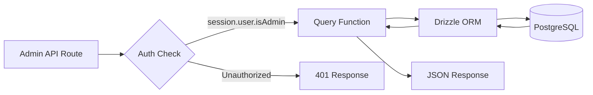
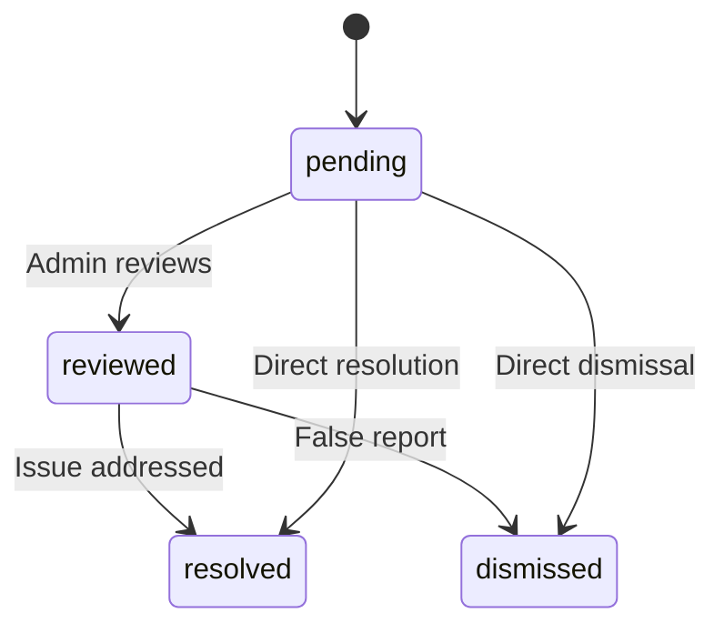

# Consultas de base de datos de administrador

Las consultas de administrador manejan la gestión de elementos, la gestión de usuarios/clientes, el acceso basado en roles, las estadísticas del panel, la moderación de informes y la configuración. Estas funciones las consumen principalmente las rutas API bajo `app/api/admin/`.

## Flujo de consultas de administrador



## Gestión de usuarios (`user.queries.ts`)

### Funciones principales

|Función|Parámetros|Devoluciones|Descripción|
|----------|-----------|---------|-------------|
|`getUserByEmail`|`email: string`|`Usuario\|nulo`|Buscar usuario por dirección de correo electrónico|
|`getUserById`|`id: string`|`Usuario\|nulo`|Buscar usuario por clave principal|
|`insertNewUser`|`user: NewUser`|`User[]`|Crear un nuevo registro de usuario|
|`updateUserPassword`|`hash, userId`|`void`|Actualizar hash de contraseña|
|`updateUserVerification`|`email, verified`|`void`|Establecer estado de verificación de correo electrónico|
|`softDeleteUser`|`userId: string`|`void`|Eliminación temporal (añade `-deleted` al correo electrónico)|
|`isUserAdmin`|`userId: string`|`boolean`|Verifique el rol de administrador mediante unirse|

### Verificación de rol de administrador

La función `isUserAdmin` realiza una unión de varias tablas para verificar el estado del administrador:

```typescript
export async function isUserAdmin(userId: string): Promise<boolean> {
  const result = await db
    .select({ isAdmin: roles.isAdmin })
    .from(userRoles)
    .innerJoin(roles, eq(userRoles.roleId, roles.id))
    .where(and(
      eq(userRoles.userId, userId),
      eq(roles.isAdmin, true),
      eq(roles.status, 'active')
    ))
    .limit(1);

  return result.length > 0;
}
```

### Patrón de eliminación suave

Los usuarios nunca se eliminan físicamente. La eliminación temporal concatena el ID de usuario con el correo electrónico para liberar la dirección de correo electrónico para volver a registrarse:

```typescript
export async function softDeleteUser(userId: string) {
  return db
    .update(users)
    .set({
      deletedAt: sql`CURRENT_TIMESTAMP`,
      email: sql`CONCAT(email, '-', id, '-deleted')`
    })
    .where(eq(users.id, userId));
}
```

## Gestión de Clientes (`client.queries.ts`)

### Perfil CRUD

|Función|Descripción|
|----------|-------------|
|`createClientProfile(data)`|Crear perfil con nombre de usuario único generado automáticamente|
|`getClientProfileById(id)`|Recuperar por ID de perfil|
|`getClientProfileByUserId(userId)`|Recuperar por referencia de usuario|
|`getClientProfileByEmail(email)`|Recuperar mediante búsqueda en la tabla de cuentas|
|`updateClientProfile(id, data)`|Actualización parcial con marca de tiempo.|
|`deleteClientProfile(id)`|Eliminación definitiva del registro de perfil|

### Datos del panel de administración

La función `getAdminDashboardData` está optimizada para el panel de administración y devuelve tanto una lista de clientes paginada como estadísticas completas en una cantidad mínima de consultas:

```typescript
export async function getAdminDashboardData(params: {
  page: number;
  limit: number;
  search?: string;
  status?: string;
  plan?: string;
  accountType?: string;
  provider?: string;
  createdAfter?: Date;
  createdBefore?: Date;
}): Promise<{
  clients: ClientProfileWithAuth[];
  stats: { overview, byProvider, byPlan, byAccountType, activity, growth };
  pagination: { page, totalPages, total, limit };
}>
```

La función excluye a los usuarios administradores de los listados de clientes utilizando un patrón LEFT JOIN + IS NULL:

```typescript
// Exclude admin users from client listing
.leftJoin(userRoles, eq(userRoles.userId, clientProfiles.userId))
.leftJoin(roles, and(eq(userRoles.roleId, roles.id), eq(roles.isAdmin, true)))
.where(isNull(roles.id))  // Only non-admin users
```

### Búsqueda avanzada de clientes

`advancedClientSearch` admite filtrado complejo de criterios múltiples:

|Categoría de filtro|Parámetros|
|----------------|------------|
|**Búsqueda de texto**|`search` (a través de nombre, correo electrónico, nombre de usuario, empresa, biografía, puesto de trabajo, industria, ubicación)|
|**Filtros de enumeración**|`status`, `plan`, `accountType`, `provider`|
|**Rangos de fechas**|`createdAfter`, `createdBefore`, `updatedAfter`, `updatedBefore`, `dateRange`|
|**Específico del campo**|`emailDomain`, `companySearch`, `locationSearch`, `industrySearch`|
|**Numérico**|`minSubmissions`, `maxSubmissions`|
|**Booleano**|`hasAvatar`, `hasWebsite`, `hasPhone`, `emailVerified`, `twoFactorEnabled`|
|**Clasificación**|`sortBy` (creado en, actualizado en, nombre, correo electrónico, empresa, total de envíos), `sortOrder`|

### Estadísticas de clientes

`getEnhancedClientStats` devuelve un desglose completo:

```typescript
{
  overview: { total, active, inactive, suspended, trial },
  byProvider: { credentials, google, github, facebook, twitter, linkedin, other },
  byPlan: { free: number, standard: number, premium: number },
  byAccountType: { individual, business, enterprise },
  activity: { newThisWeek, newThisMonth, activeThisWeek, activeThisMonth },
  growth: { weeklyGrowth, monthlyGrowth },
}
```

## Gestión de informes (`report.queries.ts`)

### Denunciar CRUD

|Función|Descripción|
|----------|-------------|
|`createReport(data)`|Crear un informe de contenido (elemento o comentario)|
|`getReportById(id)`|Obtener informe con detalles del reportero y revisor|
|`getReports(params)`|Listado de informes paginados con filtros|
|`updateReport(id, data)`|Actualizar estado, resolución, agregar notas de revisión|
|`getReportStats()`|Estadísticas por estado, tipo de contenido, motivo|
|`hasUserReportedContent(reportedBy, contentType, contentId)`|Verificación de informes duplicados|

### Flujo de estado del informe



### Filtrado de informes

Los informes admiten el filtrado por estado, tipo de contenido (elemento/comentario) y motivo (spam, acoso, inapropiado, otros):

```typescript
export async function getReports(params: {
  page?: number;
  limit?: number;
  search?: string;
  status?: ReportStatusValues;
  contentType?: ReportContentTypeValues;
  reason?: ReportReasonValues;
}): Promise<{
  reports: ReportWithReporter[];
  total: number;
  page: number;
  totalPages: number;
  limit: number;
}>
```

## Estadísticas del panel (`dashboard.queries.ts`)

### Métricas disponibles

|Función|Propósito|Utilizado en|
|----------|---------|---------|
|`getVotesReceivedCount(itemSlugs)`|Votos totales sobre artículos|Resumen del panel|
|`getCommentsReceivedCount(itemSlugs)`|Total de comentarios sobre artículos.|Resumen del panel|
|`getUniqueItemsInteractedCount(clientId)`|Elementos con los que el usuario ha interactuado|Panel de actividades|
|`getUserTotalActivityCount(clientId)`|Votos totales + comentarios por usuario|Panel de actividades|
|`getWeeklyEngagementData(itemSlugs, weeks)`|Cuadro semanal de votos/comentarios|tabla de compromiso|
|`getDailyActivityData(clientId, itemSlugs, days)`|Desglose de la actividad diaria|tabla de actividades|
|`getTopItemsEngagement(itemSlugs, limit)`|Artículos principales por participación|Panel de elementos principales|

### Datos de participación semanal

Devuelve datos de participación agregados por semana ISO, que coinciden con el formato `to_char(date, 'IYYY-IW')` de PostgreSQL:

```typescript
const weeklyVotes = await db
  .select({
    week: sql<string>`to_char(${votes.createdAt}, 'IYYY-IW')`.as('week'),
    count: count(),
  })
  .from(votes)
  .where(and(inArray(votes.itemId, itemSlugs), gte(votes.createdAt, startDate)))
  .groupBy(sql`to_char(${votes.createdAt}, 'IYYY-IW')`)
  .orderBy(sql`to_char(${votes.createdAt}, 'IYYY-IW')`);
```

## Gestión de tokens de autenticación (`auth.queries.ts`)

|Función|Descripción|
|----------|-------------|
|`getPasswordResetTokenByEmail(email)`|Encuentre el token de reinicio por correo electrónico|
|`getPasswordResetTokenByToken(token)`|Buscar token de reinicio por cadena de token|
|`deletePasswordResetToken(token)`|Eliminar token usado/caducado|
|`getVerificationTokenByEmail(email)`|Encuentre el token de verificación por correo electrónico|
|`getVerificationTokenByToken(token)`|Buscar token de verificación por cadena de token|
|`deleteVerificationToken(token)`|Eliminar token usado/caducado|

Todas las funciones de token siguen el mismo patrón simple de selección por campo con `.limit(1)`.
