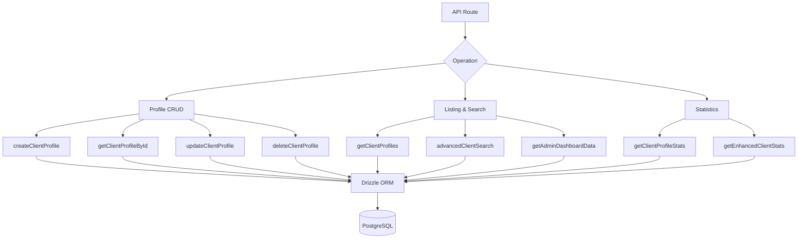

# Consultas de cara al cliente

Las consultas de los clientes manejan la gestión de perfiles, listados con metadatos de autenticación, búsqueda avanzada de criterios múltiples y estadísticas completas. Todas las funciones residen en `client.queries.ts` y son consumidas tanto por las rutas API de administración como por las de cliente.

## Arquitectura de consulta del cliente



## Perfil CRUD

### Crear perfil

Los nuevos perfiles generan automáticamente nombres de usuario únicos a partir de la dirección de correo electrónico cuando no se proporciona ningún nombre de usuario:

```typescript
export async function createClientProfile(data: {
  userId: string;
  email: string;
  name: string;
  displayName?: string;
  username?: string;
  bio?: string;
  jobTitle?: string;
  company?: string;
  status?: string;
  plan?: string;
  accountType?: string;
}): Promise<ClientProfile>
```

Lógica de generación de nombre de usuario:

1. Si se proporciona `username`, normalice y garantice la unicidad
2. De lo contrario, extraiga el nombre de usuario del correo electrónico a través de `extractUsernameFromEmail()`
3. Alternativa: generar el prefijo `user<timestamp>`
4. Todas las rutas pasan por `ensureUniqueUsername()`, que añade sufijos numéricos si es necesario

Valores predeterminados aplicados durante la creación:

|campo|Predeterminado|
|-------|---------|
|`displayName`|Igual que `name`|
|`bio`|`"Welcome! I'm a new user on this platform."`|
|`jobTitle`|`"User"`|
|`company`|`"Unknown"`|
|`status`|`"active"`|
|`plan`|`"free"`|
|`accountType`|`"individual"`|

### Leer operaciones

|Función|Campo de búsqueda|Devoluciones|
|----------|-------------|---------|
|`getClientProfileById(id)`|`clientProfiles.id`|`PerfilCliente\|nulo`|
|`getClientProfileByUserId(userId)`|`clientProfiles.userId`|`PerfilCliente\|nulo`|
|`getClientProfileByEmail(email)`|A través de la tabla `accounts`|`PerfilCliente\|nulo`|

La búsqueda basada en correo electrónico se resuelve a través de la tabla `accounts` para encontrar el `userId` asociado, luego consulta `clientProfiles`:

```typescript
export async function getClientProfileByEmail(email: string): Promise<ClientProfile | null> {
  const account = await getClientAccountByEmail(email);
  if (!account) return null;
  const [profile] = await db
    .select()
    .from(clientProfiles)
    .where(eq(clientProfiles.userId, account.userId))
    .limit(1);
  return profile || null;
}
```

### Actualizar y eliminar

- **`updateClientProfile(id, data)`** -- Actualización parcial con marca de tiempo automática `updatedAt`
- **`deleteClientProfile(id)`** -- Eliminación definitiva (devuelve éxito booleano)

## Listado paginado

`getClientProfiles` devuelve resultados paginados con datos del proveedor de autenticación, excluyendo a los usuarios administradores:

```typescript
export async function getClientProfiles(params: {
  page?: number;
  limit?: number;
  search?: string;
  status?: string;
  plan?: string;
  accountType?: string;
  provider?: string;
}): Promise<{
  profiles: ClientProfileWithAuth[];
  total: number;
  page: number;
  totalPages: number;
  limit: number;
}>
```

### Patrón de exclusión de administrador

Tanto la consulta de recuento como la consulta de datos utilizan un patrón LEFT JOIN + IS NULL para excluir a los usuarios administradores:

```typescript
.leftJoin(userRoles, eq(userRoles.userId, clientProfiles.userId))
.leftJoin(roles, and(eq(userRoles.roleId, roles.id), eq(roles.isAdmin, true)))
.where(isNull(roles.id))  // Only non-admin users
```

### Subconsulta de proveedor

Para evitar filas duplicadas cuando un usuario tiene varias cuentas de autenticación, el proveedor se resuelve mediante una subconsulta escalar:

```typescript
accountProvider: sql<string>`coalesce(
  (SELECT provider FROM ${accounts}
   WHERE ${accounts.userId} = ${clientProfiles.userId}
   LIMIT 1),
  'unknown'
)`
```

### Filtro de búsqueda

La búsqueda de texto utiliza `ILIKE` en múltiples campos con prevención de inyección SQL:

```typescript
const escapedSearch = search
  .replace(/\\/g, '\\\\')
  .replace(/[%_]/g, '\\$&');

whereConditions.push(
  sql`(${clientProfiles.username} ILIKE ${`%${escapedSearch}%`} OR
       ${clientProfiles.displayName} ILIKE ${`%${escapedSearch}%`} OR
       ${clientProfiles.company} ILIKE ${`%${escapedSearch}%`} OR
       ${clientProfiles.name} ILIKE ${`%${escapedSearch}%`} OR
       ${clientProfiles.email} ILIKE ${`%${escapedSearch}%`})`
);
```

## Búsqueda avanzada de clientes

`advancedClientSearch` admite más de 20 criterios de filtro en múltiples categorías:

|Categoría de filtro|Parámetros|
|----------------|------------|
|**Búsqueda de texto**|`search` (a través de nombre, correo electrónico, nombre de usuario, empresa, biografía, puesto de trabajo, industria, ubicación)|
|**Filtros de enumeración**|`status`, `plan`, `accountType`, `provider`|
|**Rangos de fechas**|`createdAfter`, `createdBefore`, `updatedAfter`, `updatedBefore`, `dateRange`|
|**Específico del campo**|`emailDomain`, `companySearch`, `locationSearch`, `industrySearch`|
|**Numérico**|`minSubmissions`, `maxSubmissions`|
|**Booleano**|`hasAvatar`, `hasWebsite`, `hasPhone`, `emailVerified`, `twoFactorEnabled`|
|**Clasificación**|`sortBy`, `sortOrder`|

## Estadísticas de clientes

### Estadísticas Básicas

`getClientProfileStats` devuelve recuentos simples:

```typescript
{
  total: number;
  active: number;
  inactive: number;
  byPlan: Record<string, number>;
  byAccountType: Record<string, number>;
}
```

### Estadísticas mejoradas

`getEnhancedClientStats` proporciona un desglose multidimensional completo:

```typescript
{
  overview: { total, active, inactive, suspended, trial },
  byProvider: { credentials, google, github, facebook, twitter, linkedin, other },
  byPlan: { free: number, standard: number, premium: number },
  byAccountType: { individual, business, enterprise },
  activity: { newThisWeek, newThisMonth, activeThisWeek, activeThisMonth },
  growth: { weeklyGrowth, monthlyGrowth },
}
```

Las estadísticas mejoradas utilizan `countDistinct` con uniones de varias tablas para producir recuentos precisos incluso cuando los usuarios tienen varios proveedores de cuentas:

```typescript
const statsResult = await db
  .select({
    status: clientProfiles.status,
    plan: clientProfiles.plan,
    accountType: clientProfiles.accountType,
    provider: accounts.provider,
    count: countDistinct(clientProfiles.id)
  })
  .from(clientProfiles)
  .leftJoin(accounts, eq(clientProfiles.userId, accounts.userId))
  .leftJoin(userRoles, eq(userRoles.userId, clientProfiles.userId))
  .leftJoin(roles, and(eq(userRoles.roleId, roles.id), eq(roles.isAdmin, true)))
  .where(isNull(roles.id))
  .groupBy(
    clientProfiles.status,
    clientProfiles.plan,
    clientProfiles.accountType,
    accounts.provider
  );
```

### Métricas de actividad

Las ventanas de actividad se calculan utilizando aritmética de fechas:

```typescript
const oneWeekAgo = new Date(now.getTime() - 7 * 24 * 60 * 60 * 1000);
const oneMonthAgo = new Date(now.getTime() - 30 * 24 * 60 * 60 * 1000);
```

Las tasas de crecimiento son porcentajes simplificados de nuevas matriculaciones en relación con el total:

```typescript
const weeklyGrowth = total > 0 ? Math.round((newThisWeek / total) * 100) : 0;
```

## Tipos

Todos los tipos de consultas de clientes se definen en `lib/db/queries/types.ts`:

```typescript
export type ClientProfileWithAuth = ClientProfile & {
  accountProvider: string;
  isActive: boolean;
};

export type ClientStatus = "active" | "inactive" | "suspended" | "trial";
export type ClientPlan = "free" | "standard" | "premium";
export type ClientAccountType = "individual" | "business" | "enterprise";
```
