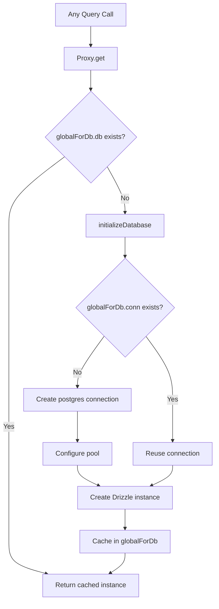

# Conexión y agrupación de bases de datos

La plantilla utiliza `postgres.js` (el paquete `postgres` npm) como controlador PostgreSQL con Drizzle ORM. La administración de la conexión se maneja a través de un patrón de inicialización diferida con almacenamiento en caché único global para sobrevivir al reemplazo en caliente del módulo (HMR) de Next.js en desarrollo.

## Arquitectura de conexión



## Configuración de la base de datos (`lib/db/drizzle.ts`)

### Inicialización diferida con proxy

La instancia de la base de datos se exporta como `Proxy` que inicializa la conexión en el primer acceso:

```typescript
export const db = new Proxy({} as ReturnType<typeof drizzle>, {
  get(target, prop) {
    const database = initializeDatabase();
    return database[prop as keyof typeof database];
  },
});
```

Esto asegura:
- No se crea ninguna conexión en el momento de la importación.
- Los scripts que importan el módulo pero no consultan la base de datos no generan sobrecarga de conexión
- La primera operación real de la base de datos desencadena la inicialización.

### Función de inicialización

```typescript
function initializeDatabase(): ReturnType<typeof drizzle> {
  if (!getDatabaseUrl()) {
    throw new Error('DATABASE_URL environment variable is required');
  }

  if (globalForDb.db) {
    return globalForDb.db;
  }

  const poolSize = getPoolSize();
  const conn = postgres(getDatabaseUrl()!, {
    max: poolSize,
    idle_timeout: 20,
    connect_timeout: 30,
    prepare: false,
    onnotice: getNodeEnv() === 'development' ? console.log : undefined,
  });

  globalForDb.conn = conn;
  globalForDb.db = drizzle(conn, { schema });
  return globalForDb.db;
}
```

### Opciones de conexión

|Opción|Valor|Propósito|
|--------|-------|---------|
|`max`|Configurable (ver tamaño de piscina)|Conexiones máximas en la piscina.|
|`idle_timeout`|`20` segundos|Cerrar conexiones inactivas después de esta duración|
|`connect_timeout`|`30` segundos|Tiempo máximo para establecer una conexión|
|`prepare`|`false`|Deshabilitar declaraciones preparadas (requerido para algunos entornos PaaS)|
|`onnotice`|`console.log` (solo desarrolladores)|Registrar mensajes de AVISO de PostgreSQL en desarrollo|

## Dimensionamiento de la piscina

### Configuración

El tamaño del grupo se puede configurar mediante la variable de entorno `DB_POOL_SIZE`, con valores predeterminados que tienen en cuenta el entorno:

```typescript
const getPoolSize = (): number => {
  const envPoolSize = process.env.DB_POOL_SIZE;
  if (envPoolSize) {
    const parsed = parseInt(envPoolSize, 10);
    return isNaN(parsed) ? 20 : Math.max(1, Math.min(parsed, 50));
  }
  return getNodeEnv() === 'production' ? 20 : 10;
};
```

### Valores predeterminados

|Medio ambiente|Tamaño de piscina predeterminado|Rango|
|-------------|------------------|-------|
|Producción| 20 | 1 - 50 |
|Desarrollo| 10 | 1 - 50 |

El tamaño del grupo está fijado entre 1 y 50 independientemente del valor configurado.

### Pautas sobre el tamaño de la piscina

- **Desarrollo (10):** Suficiente para un único desarrollador con HMR. Mantiene el uso de recursos bajo.
- **Producción (20):** Maneja solicitudes API simultáneas. Aumento para implementaciones de alto tráfico.
- **Sin servidor (1-5):** Utilice grupos pequeños cuando se implemente en plataformas sin servidor donde cada instancia tiene su propio grupo.

## Patrón singleton global

### Seguridad HMR

El modo de desarrollo Next.js vuelve a ejecutar los módulos cuando se modifican los archivos. Sin protección, cada ciclo de HMR crearía un nuevo grupo de conexiones, agotando rápidamente las conexiones de la base de datos.

La plantilla adjunta la conexión a `globalThis` para sobrevivir a HMR:

```typescript
const globalForDb = globalThis as unknown as {
  conn: postgres.Sql | undefined;
  db: ReturnType<typeof drizzle> | undefined;
};
```

Cuando un módulo se vuelve a ejecutar:
1. `initializeDatabase()` comprueba `globalForDb.db`
2. Si la instancia existe, se devuelve inmediatamente.
3. Si la conexión existe pero la instancia de Drizzle no, la conexión existente se reutiliza

El registro de desarrollo indica si se reutilizó una conexión:

```
Reusing existing database connection; pool size is unchanged
```

o recién creado:

```
Database connection established successfully with pool size: 10
```

### Acceso directo a la instancia

Para las bibliotecas que requieren una instancia concreta de Drizzle (por ejemplo, el adaptador Auth.js), se proporciona una función getter:

```typescript
export function getDrizzleInstance(): ReturnType<typeof drizzle> {
  return initializeDatabase();
}
```

## Módulo de configuración (`lib/db/config.ts`)

Un módulo de configuración seguro para scripts que **no** importa `server-only`, lo que permite que lo utilicen scripts de migración y semilla:

```typescript
export function getDatabaseUrl(): string | undefined {
  return process.env.DATABASE_URL;
}

export function getNodeEnv(): 'development' | 'production' | 'test' {
  const env = process.env.NODE_ENV;
  if (env === 'production' || env === 'test') return env;
  return 'development';
}

export function isProduction(): boolean {
  return getNodeEnv() === 'production';
}
```

## Corredor de migración (`lib/db/migrate.ts`)

El ejecutor de migración es idempotente y seguro para invocarlo en cada inicio de la aplicación:

```typescript
export async function runMigrations(): Promise<boolean> {
  const { db } = await import('./drizzle');
  await migrate(db, { migrationsFolder: './lib/db/migrations' });
  return true;
}
```

Comportamientos clave:
- Drizzle rastrea las migraciones aplicadas en `drizzle.__drizzle_migrations`
- Las migraciones ya aplicadas se omiten automáticamente
- Devuelve `true` en caso de éxito, `false` en caso de error (no arroja)
- Registra el estado de la migración antes y después de la ejecución.

## Variables de entorno

|variable|Requerido|Predeterminado|Descripción|
|----------|----------|---------|-------------|
|`DATABASE_URL`|si| -- |Cadena de conexión PostgreSQL|
|`DB_POOL_SIZE`|No|`20` (producción) / `10` (desarrollador)|Tamaño del grupo de conexiones (1-50)|
|`NODE_ENV`|No|`development`|Entorno (desarrollo/producción/prueba)|

## Configuración del kit de llovizna

La configuración del Drizzle Kit para la generación de esquemas y la gestión de la migración:

```typescript
// drizzle.config.ts
export default {
  schema: "./lib/db/schema.ts",
  out: "./lib/db/migrations",
  dialect: "postgresql",
  dbCredentials: {
    url: process.env.DATABASE_URL,
  },
} satisfies Config;
```

## Solución de problemas

|Problema|causa|Solución|
|-------|-------|----------|
|`DATABASE_URL is required`|Falta var de entorno|Establecer `DATABASE_URL` en `.env.local`|
|Tiempos de espera de conexión|Red lenta o base de datos sobrecargada|Aumente `connect_timeout` o verifique el estado de la base de datos|
|Agotamiento de la piscina en desarrollo|HMR creando múltiples grupos|Asegúrese de que el patrón `globalForDb` esté intacto|
|Agotamiento de la piscina en prod.|Demasiadas solicitudes simultáneas|Incrementar `DB_POOL_SIZE` (máximo 50)|
|`prepare` errores en PaaS|PaaS pgBouncer en modo transacción|Mantener `prepare: false`|
