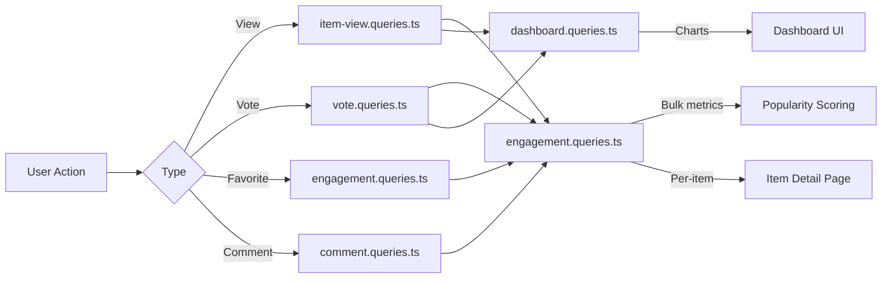

# Consultas de participación e interacción

Las consultas de participación agregan interacciones de usuarios (vistas, votos, favoritos, comentarios) entre elementos. Estas consultas impulsan la clasificación por popularidad, los gráficos del panel y los paneles de participación por artículo. Los módulos relevantes son `engagement.queries.ts`, `vote.queries.ts`, `comment.queries.ts`, `item-view.queries.ts` y `dashboard.queries.ts`.

## Flujo de datos de participación



## Métricas de participación masiva (`engagement.queries.ts`)

### `getEngagementMetricsPerItem`

La función principal para la puntuación de popularidad. Devuelve todas las dimensiones de participación para varios elementos en un único lote de consultas paralelas:

```typescript
export async function getEngagementMetricsPerItem(
  itemSlugs: string[]
): Promise<Map<string, ItemEngagementMetrics>>
```

Tipo de devolución:

```typescript
export interface ItemEngagementMetrics {
  views: number;
  votes: number;       // Net votes (upvotes - downvotes)
  favorites: number;
  comments: number;
  avgRating: number;   // Average rating from comments (0-5)
}
```

### Estrategia de consultas paralelas

Se ejecutan cuatro consultas independientes a través de `Promise.all` para obtener el máximo rendimiento:

```typescript
const [viewsData, votesData, favoritesData, commentsData] = await Promise.all([
  // 1. Views per item
  db.select({ itemId: itemViews.itemId, count: count() })
    .from(itemViews)
    .where(inArray(itemViews.itemId, itemSlugs))
    .groupBy(itemViews.itemId),

  // 2. Net votes per item (upvotes - downvotes)
  db.select({
      itemId: votes.itemId,
      netScore: sql<number>`SUM(CASE
        WHEN vote_type = 'upvote' THEN 1
        WHEN vote_type = 'downvote' THEN -1
        ELSE 0 END)`.as('netScore'),
    })
    .from(votes)
    .where(inArray(votes.itemId, itemSlugs))
    .groupBy(votes.itemId),

  // 3. Favorites per item
  db.select({ itemSlug: favorites.itemSlug, count: count() })
    .from(favorites)
    .where(inArray(favorites.itemSlug, itemSlugs))
    .groupBy(favorites.itemSlug),

  // 4. Comments count + average rating (excluding soft-deleted)
  db.select({
      itemId: comments.itemId,
      count: count(),
      avgRating: sql<number>`COALESCE(AVG(${comments.rating}), 0)`.as('avgRating'),
    })
    .from(comments)
    .where(and(inArray(comments.itemId, itemSlugs), isNull(comments.deletedAt)))
    .groupBy(comments.itemId),
]);
```

### Normalización de resultados

Cada resultado de la consulta se convierte en `Map` para la búsqueda O(1) y luego se combina en el mapa de métricas final:

```typescript
const viewsMap = new Map<string, number>(
  viewsData.map(v => [v.itemId, Number(v.count)])
);
// ... same for votesMap, favoritesMap, commentsMap

for (const slug of itemSlugs) {
  metricsMap.set(slug, {
    views: viewsMap.get(slug) ?? 0,
    votes: votesMap.get(slug) ?? 0,
    favorites: favoritesMap.get(slug) ?? 0,
    comments: commentsMap.get(slug)?.count ?? 0,
    avgRating: commentsMap.get(slug)?.avgRating ?? 0,
  });
}
```

### Funciones métricas independientes

|Función|Devoluciones|Descripción|
|----------|---------|-------------|
|`getFavoritesPerItem(itemSlugs)`|`Map<string, number>`|Recuentos favoritos por artículo|
|`getCommentsPerItem(itemSlugs)`|`Map<string, { count, avgRating }>`|Recuento de comentarios y calificaciones promedio|

Ambas funciones usan el mismo patrón: retorno temprano para matrices vacías, `groupBy` agregación, `Map` construcción.

## Consultas de votación (`vote.queries.ts`)

### Vota CRUD

|Función|Descripción|
|----------|-------------|
|`createVote(vote)`|Crear voto con normalización de slug|
|`getVoteByUserIdAndItemId(userId, itemSlug)`|Verificar voto existente|
|`deleteVote(voteId)`|Eliminar un voto por completo|

Todas las funciones de votación normalizan los slugs de elementos a través de `getItemIdFromSlug()` antes de realizar la consulta.

### Cálculo de puntuación neta

Puntuación de elemento individual usando `SUM` condicional:

```typescript
export async function getVoteCountForItem(itemSlug: string): Promise<number> {
  const itemId = getItemIdFromSlug(itemSlug);
  const [result] = await db
    .select({
      netScore: sql<number>`
        SUM(CASE
          WHEN vote_type = 'upvote' THEN 1
          WHEN vote_type = 'downvote' THEN -1
          ELSE 0
        END)`.as('netScore')
    })
    .from(votes)
    .where(eq(votes.itemId, itemId));
  return Number(result?.netScore ?? 0);
}
```

### Puntajes de votación masiva

`getVotesPerItem` devuelve un `Map<string, number>` de puntuaciones netas para múltiples elementos usando `inArray` y `groupBy`.

### Artículos ordenados por votación

```typescript
export async function getItemsSortedByVotes(limit = 10, offset = 0) {
  return db
    .select({
      itemId: votes.itemId,
      voteCount: sql<number>`count(${votes.id})`.as('vote_count')
    })
    .from(votes)
    .groupBy(votes.itemId)
    .orderBy(sql`vote_count DESC`)
    .limit(limit)
    .offset(offset);
}
```

## Consultas de comentarios (`comment.queries.ts`)

### Comentar CRUD

|Función|Descripción|
|----------|-------------|
|`createComment(data)`|Crear con normalización de slug|
|`getCommentById(id)`|Registro de comentarios sin procesar|
|`getCommentWithUserById(id)`|Comentar con perfil de usuario unirse|
|`updateComment(id, { content?, rating? })`|Actualizar con `editedAt` marca de tiempo|
|`updateCommentRating(id, rating)`|Actualización solo de calificación|
|`deleteComment(id)`|Eliminación temporal (`deletedAt = new Date()`)|

### Comentarios con datos de usuario

`getCommentsByItemId` usa un `innerJoin` con `clientProfiles` para enriquecer cada comentario con información del autor:

```typescript
export async function getCommentsByItemId(itemSlug: string): Promise<CommentWithUser[]> {
  const itemId = getItemIdFromSlug(itemSlug);
  return db
    .select({
      id: comments.id,
      content: comments.content,
      rating: comments.rating,
      userId: comments.userId,
      itemId: comments.itemId,
      createdAt: comments.createdAt,
      updatedAt: comments.updatedAt,
      editedAt: comments.editedAt,
      deletedAt: comments.deletedAt,
      user: {
        id: clientProfiles.id,
        name: clientProfiles.name,
        email: clientProfiles.email,
        image: clientProfiles.avatar
      }
    })
    .from(comments)
    .innerJoin(clientProfiles, eq(comments.userId, clientProfiles.id))
    .where(and(eq(comments.itemId, itemId), isNull(comments.deletedAt)))
    .orderBy(desc(comments.createdAt));
}
```

## Ver seguimiento (`item-view.queries.ts`)

### Deduplicación diaria

Las vistas se deduplican por espectador por elemento por día UTC utilizando el patrón de inserción `onConflictDoNothing`:

```typescript
export async function recordItemView(
  view: Pick<NewItemView, 'itemId' | 'viewerId' | 'viewedDateUtc'>
): Promise<boolean> {
  const result = await db
    .insert(itemViews)
    .values(view)
    .onConflictDoNothing()
    .returning({ id: itemViews.id });
  return result.length > 0; // true = new view, false = duplicate
}
```

### Ver funciones de agregación

|Función|Parámetros|Devoluciones|Descripción|
|----------|-----------|---------|-------------|
|`getTotalViewsCount(itemSlugs)`|`string[]`|`number`|Vistas totales de todos los artículos|
|`getRecentViewsCount(itemSlugs, days)`|`string[], number`|`number`|Vistas en los últimos N días|
|`getDailyViewsData(itemSlugs, days)`|`string[], number`|`Map<string, number>`|Recuentos de vistas diarias|
|`getViewsPerItem(itemSlugs)`|`string[]`|`Map<string, number>`|Recuentos de vistas por elemento|

### Ayudante de fecha UTC

Todos los cálculos de fecha utilizan UTC para evitar errores de uno por uno relacionados con la zona horaria:

```typescript
function getUtcDateString(daysAgo: number = 0): string {
  const date = new Date();
  date.setUTCDate(date.getUTCDate() - daysAgo);
  return date.toISOString().split('T')[0]; // "YYYY-MM-DD"
}
```

## Estadísticas del panel (`dashboard.queries.ts`)

### Métricas disponibles

|Función|Propósito|
|----------|---------|
|`getVotesReceivedCount(itemSlugs)`|Votos totales sobre los artículos del usuario.|
|`getCommentsReceivedCount(itemSlugs)`|Total de comentarios sobre los artículos del usuario.|
|`getUniqueItemsInteractedCount(clientId)`|Elementos con los que el usuario ha interactuado|
|`getUserTotalActivityCount(clientId)`|Votos totales + comentarios por usuario|
|`getWeeklyEngagementData(itemSlugs, weeks)`|Datos de gráficos agregados semanales|
|`getDailyActivityData(clientId, itemSlugs, days)`|Desglose de la actividad diaria|
|`getTopItemsEngagement(itemSlugs, limit)`|Elementos principales por puntuación de participación|

### Agregación de participación semanal

Utiliza `to_char` de PostgreSQL con formato de semana ISO para un agrupamiento semanal consistente:

```typescript
const weeklyVotes = await db
  .select({
    week: sql<string>`to_char(${votes.createdAt}, 'IYYY-IW')`.as('week'),
    count: count(),
  })
  .from(votes)
  .where(and(inArray(votes.itemId, itemSlugs), gte(votes.createdAt, startDate)))
  .groupBy(sql`to_char(${votes.createdAt}, 'IYYY-IW')`)
  .orderBy(sql`to_char(${votes.createdAt}, 'IYYY-IW')`);
```

## Consideraciones de rendimiento

- Todas las funciones masivas aceptan matrices y usan `inArray` para el procesamiento por lotes
- Las entradas de matriz vacía regresan temprano sin llegar a la base de datos
- `Promise.all` ejecuta agregaciones independientes simultáneamente
- `Map` las estructuras de datos proporcionan una búsqueda O(1) durante el ensamblaje de resultados
- Los comentarios eliminados temporalmente se excluyen a través de `isNull(comments.deletedAt)` en todas las agregaciones
