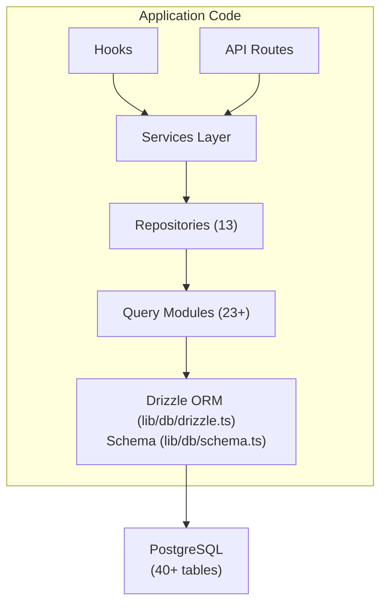

# Descripción general de la base de datos

La plantilla Ever Works utiliza **Drizzle ORM** con **PostgreSQL** como capa de base de datos. La base de datos es opcional (la aplicación puede ejecutarse sin ella para implementaciones de solo contenido), pero impulsa todas las funciones de usuario, suscripción, participación y administración.

## Pila de tecnología

|Componente|Tecnología|Propósito|
|-----------|-----------|---------|
|ORM|Llovizna ORM|Generador de consultas y gestión de esquemas con seguridad de tipos|
|Base de datos|PostgreSQL|Base de datos relacional primaria|
|Conductor|`postgres` (postgres.js)|Cliente PostgreSQL para Node.js|
|Migraciones|Kit de llovizna|Generación y ejecución de migración de esquemas.|
|siembra|`drizzle-seed` + scripts personalizados|Inicialización de base de datos con datos predeterminados|

## Arquitectura de base de datos



## Configuración

### Configuración de llovizna (`drizzle.config.ts`)

```typescript
export default {
  schema: "./lib/db/schema.ts",
  out: "./lib/db/migrations",
  dialect: "postgresql",
  dbCredentials: {
    url: process.env.DATABASE_URL,
  },
} satisfies Config;
```

La configuración apunta a:
- **Archivo de esquema**: `lib/db/schema.ts`: la única fuente de verdad para todas las definiciones de tablas
- **Salida de migraciones**: `lib/db/migrations/` -- donde se almacenan los archivos de migración SQL generados
- **Dialecto**: PostgreSQL
- **Conexión**: A través de `DATABASE_URL` variable de entorno

### Gestión de conexión (`lib/db/drizzle.ts`)

La conexión de la base de datos se inicializa de forma diferida en el primer uso y reutiliza las conexiones en recargas activas en desarrollo a través de un patrón singleton global.

Características clave:
- **Inicialización diferida**: la conexión a la base de datos no se crea hasta que se ejecuta la primera consulta
- **Acceso basado en proxy**: el objeto `db` exportado utiliza JavaScript `Proxy` para inicializar la conexión de forma transparente.
- **Agrupación de conexiones**: Tamaño del grupo configurable mediante la variable de entorno `DB_POOL_SIZE` (predeterminado: 20 en producción, 10 en desarrollo, limitado 1-50)
- **Tiempo de espera de inactividad**: las conexiones se liberan después de 20 segundos de inactividad
- **Tiempo de espera de conexión**: tiempo de espera de 30 segundos para establecer nuevas conexiones
- **Patrón singleton**: utiliza `globalThis` para conservar las conexiones en las recargas activas de Next.js

```typescript
// Usage - just import and use
import { db } from '@/lib/db/drizzle';

const users = await db.select().from(schema.users);
```

### Variables de entorno

|variable|Requerido|Predeterminado|Descripción|
|----------|----------|---------|-------------|
|`DATABASE_URL`|No| - |Cadena de conexión PostgreSQL|
|`DB_POOL_SIZE`|No| 10/20 |Tamaño del grupo de conexiones (dev/prod)|

Cuando `DATABASE_URL` no está configurado, las funciones de la base de datos se desactivan silenciosamente, lo que permite que la aplicación se ejecute en modo de solo contenido.

## Descripción general del esquema

El esquema de la base de datos se define en un único archivo (`lib/db/schema.ts`) que contiene más de 40 tablas organizadas por dominio:

|Dominio|Mesas|Descripción|
|--------|--------|-------------|
|Usuarios y autenticación| 8 |Usuarios, cuentas, sesiones, tokens, autenticadores|
|Roles y permisos| 3 |RBAC con roles, permisos y asignaciones de roles y permisos|
|Perfiles de clientes| 1 |Perfiles de usuario extendidos para cuentas de clientes|
|Compromiso con el contenido| 4 |Comentarios, votos, favoritos, vistas de artículos|
|Suscripciones| 4 |Planes, historial de suscripciones, proveedores de pago, cuentas de pago|
|Notificaciones| 1 |Sistema de notificación en la aplicación|
|Administrador y moderación| 4 |Informes, historial de moderación, registros de auditoría de elementos, registros de actividad|
|Integraciones| 2 |Configuración de CRM, asignaciones de integración|
|Empresas| 2 |Empresas y asociaciones de empresas de artículos|
|Anuncios de patrocinadores| 1 |Anuncios de artículos patrocinados|
|Encuestas| 2 |Encuestas y respuestas a encuestas|
|Boletín| 1 |Suscripciones a boletines|
|Sistema| 1 |Seguimiento del estado de las semillas|

## Inicialización de la base de datos

Al iniciar la aplicación (a través de `instrumentation.ts`), la plantilla automáticamente:

1. **Ejecuta migraciones**: la función `migrate()` de Drizzle aplica cualquier migraciones pendientes (idempotente: se omiten las migraciones ya aplicadas)
2. **Datos de inicialización**: si la base de datos no se ha inicializado, el script de inicialización se ejecuta con protección de bloqueo de asesoramiento para evitar condiciones de carrera en implementaciones multiproceso.

Esto lo maneja `lib/db/initialize.ts`. Consulte la [Guía de migraciones](./migrations-guide) y la [Semilla de base de datos](./seeding) para obtener más detalles.

## Comandos clave

```bash
# Generate a migration from schema changes
pnpm db:generate

# Run pending migrations
pnpm db:migrate

# Seed the database
pnpm db:seed

# Open Drizzle Studio (database GUI)
pnpm db:studio
```
