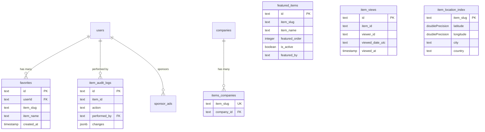

# Análisis profundo del esquema de elementos

## Descripción general

En la plantilla Ever Works, **los elementos se almacenan en un directorio CMS basado en Git** (`.content/`), no en una tabla de base de datos tradicional. Sin embargo, varias tablas de bases de datos admiten operaciones relacionadas con artículos, como seguimiento de vistas, auditoría de cambios, indexación de ubicaciones, administración de favoritos, presentación de artículos y vinculación de artículos a empresas.

Esta página documenta cada tabla de base de datos que hace referencia o admite elementos.

**Archivo fuente:** `template/lib/db/schema.ts`

---

## Item-Supporting Tables

| Table | Purpose |
|---|---|
| `favorites` | User-saved favorite items |
| `featured_items` | Admin-curated featured items |
| `item_views` | Per-day unique view tracking |
| `item_audit_logs` | Complete change history for admin panel |
| `item_location_index` | Geospatial index for "Near Me" filtering |
| `items_companies` | Links items to company records |
| `location_index_meta` | Singleton metadata for location index |

---

## Tabla: `favorites`

Almacena las relaciones de favoritos/marcadores del usuario con los elementos, identificados por slug.

### columnas

|columna|Nombre de base de datos|Tipo|Anulable|Predeterminado|Restricciones|
|---|---|---|---|---|---|
|`id`|`id`|`text`|No|`crypto.randomUUID()`|Clave primaria|
|`userId`|`userId`|`text`|No| - |FK -> `users.id` (CASCADA)|
|`itemSlug`|`item_slug`|`text`|No| - | - |
|`itemName`|`item_name`|`text`|No| - | - |
|`itemIconUrl`|`item_icon_url`|`text`|si| - | - |
|`itemCategory`|`item_category`|`text`|si| - | - |
|`createdAt`|`created_at`|`timestamp`|No|`now()`| - |
|`updatedAt`|`updated_at`|`timestamp`|No|`now()`| - |

### Índices

|Nombre|columnas|Tipo|
|---|---|---|
|`user_item_favorite_unique_idx`|`(userId, itemSlug)`|Único|
|`favorites_user_id_idx`|`userId`|árbol B|
|`favorites_item_slug_idx`|`itemSlug`|árbol B|
|`favorites_created_at_idx`|`createdAt`|árbol B|

### Tipos de mecanografiado

```typescript
export type Favorite = typeof favorites.$inferSelect;
export type NewFavorite = typeof favorites.$inferInsert;
export type FavoriteWithUser = Favorite & {
    user: typeof users.$inferSelect;
};
```

---

## Table: `featured_items`

Admin-curated list of items to highlight on the site. Supports ordering and optional expiration.

### Columns

| Column | DB Name | Type | Nullable | Default | Constraints |
|---|---|---|---|---|---|
| `id` | `id` | `text` | No | `crypto.randomUUID()` | Primary Key |
| `itemSlug` | `item_slug` | `text` | No | - | - |
| `itemName` | `item_name` | `text` | No | - | - |
| `itemIconUrl` | `item_icon_url` | `text` | Yes | - | - |
| `itemCategory` | `item_category` | `text` | Yes | - | - |
| `itemDescription` | `item_description` | `text` | Yes | - | - |
| `featuredOrder` | `featured_order` | `integer` | No | `0` | Display ordering |
| `featuredUntil` | `featured_until` | `timestamp` | Yes | - | Optional expiration |
| `isActive` | `is_active` | `boolean` | No | `true` | - |
| `featuredBy` | `featured_by` | `text` | No | - | Admin user ID |
| `featuredAt` | `featured_at` | `timestamp` | No | `now()` | - |
| `createdAt` | `created_at` | `timestamp` | No | `now()` | - |
| `updatedAt` | `updated_at` | `timestamp` | No | `now()` | - |

### Indexes

| Name | Columns | Type |
|---|---|---|
| `featured_items_item_slug_idx` | `itemSlug` | B-tree |
| `featured_items_featured_order_idx` | `featuredOrder` | B-tree |
| `featured_items_is_active_idx` | `isActive` | B-tree |
| `featured_items_featured_at_idx` | `featuredAt` | B-tree |
| `featured_items_featured_until_idx` | `featuredUntil` | B-tree |

### TypeScript Types

```typescript
export type FeaturedItem = typeof featuredItems.$inferSelect;
export type NewFeaturedItem = typeof featuredItems.$inferInsert;
```

---

## Tabla: `item_views`

Realiza un seguimiento de las vistas diarias únicas por artículo. Utiliza identificación de espectador anónimo basada en cookies y deduplicación de fecha UTC. No almacena direcciones IP por motivos de privacidad.

### columnas

|columna|Nombre de base de datos|Tipo|Anulable|Predeterminado|Restricciones|
|---|---|---|---|---|---|
|`id`|`id`|`text`|No|`crypto.randomUUID()`|Clave primaria|
|`itemId`|`item_id`|`text`|No| - |babosa de artículo|
|`viewerId`|`viewer_id`|`text`|No| - |ID de cookie anónima|
|`viewedDateUtc`|`viewed_date_utc`|`text`|No| - |Formato AAAA-MM-DD|
|`viewedAt`|`viewed_at`|`timestamp (tz)`|No|`now()`|Tiempo de visualización preciso|

### Índices

|Nombre|columnas|Tipo|
|---|---|---|
|`item_views_unique_daily_idx`|`(itemId, viewerId, viewedDateUtc)`|Único|
|`item_views_item_date_idx`|`(itemId, viewedDateUtc)`|Árbol B compuesto|

### Tipos de mecanografiado

```typescript
export type ItemView = typeof itemViews.$inferSelect;
export type NewItemView = typeof itemViews.$inferInsert;
```

---

## Table: `item_audit_logs`

Stores the complete change history for items managed through the admin panel. Since items live in Git, `itemId` is the slug (not a foreign key).

### Columns

| Column | DB Name | Type | Nullable | Default | Constraints |
|---|---|---|---|---|---|
| `id` | `id` | `text` | No | `crypto.randomUUID()` | Primary Key |
| `itemId` | `item_id` | `text` | No | - | Item slug |
| `itemName` | `item_name` | `text` | No | - | Denormalized |
| `action` | `action` | `text (enum)` | No | - | See enum values below |
| `previousStatus` | `previous_status` | `text` | Yes | - | For status changes |
| `newStatus` | `new_status` | `text` | Yes | - | For status changes |
| `changes` | `changes` | `jsonb` | Yes | - | `{ field: { old, new } }` |
| `performedBy` | `performed_by` | `text` | Yes | - | FK -> `users.id` (SET NULL) |
| `performedByName` | `performed_by_name` | `text` | Yes | - | Denormalized |
| `notes` | `notes` | `text` | Yes | - | Review notes |
| `metadata` | `metadata` | `jsonb` | Yes | - | IP, user agent, etc. |
| `createdAt` | `created_at` | `timestamp (tz)` | No | `now()` | - |

### Action Enum Values

```typescript
export const ItemAuditAction = {
    CREATED: 'created',
    UPDATED: 'updated',
    STATUS_CHANGED: 'status_changed',
    REVIEWED: 'reviewed',
    DELETED: 'deleted',
    RESTORED: 'restored'
} as const;
```

### Indexes

| Name | Columns | Type |
|---|---|---|
| `item_audit_logs_item_id_idx` | `itemId` | B-tree |
| `item_audit_logs_action_idx` | `action` | B-tree |
| `item_audit_logs_performed_by_idx` | `performedBy` | B-tree |
| `item_audit_logs_created_at_idx` | `createdAt` | B-tree |
| `item_audit_logs_item_id_action_idx` | `(itemId, action)` | Composite B-tree |

### TypeScript Types

```typescript
export type ItemAuditLog = typeof itemAuditLogs.$inferSelect;
export type NewItemAuditLog = typeof itemAuditLogs.$inferInsert;
export type ItemAuditChanges = Record<string, { old: unknown; new: unknown }>;
```

---

## Tabla: `item_location_index`

Índice geoespacial para elementos, que permite el filtrado "Cerca de mí" y la clasificación basada en la distancia. Esta es una tabla de índice únicamente; la fuente de la verdad permanece en Git CMS.

### columnas

|columna|Nombre de base de datos|Tipo|Anulable|Predeterminado|Restricciones|
|---|---|---|---|---|---|
|`itemSlug`|`item_slug`|`text`|No| - |Clave primaria|
|`latitude`|`latitude`|`doublePrecision`|No| - | - |
|`longitude`|`longitude`|`doublePrecision`|No| - | - |
|`address`|`address`|`text`|si| - | - |
|`city`|`city`|`text`|si| - | - |
|`state`|`state`|`text`|si| - | - |
|`country`|`country`|`text`|si| - | - |
|`cityNormalized`|`city_normalized`|`text`|si| - |Minúsculas, recortadas|
|`countryNormalized`|`country_normalized`|`text`|si| - |Minúsculas, recortadas|
|`postalCode`|`postal_code`|`text`|si| - | - |
|`serviceArea`|`service_area`|`text`|si| - | - |
|`isRemote`|`is_remote`|`boolean`|No|`false`| - |
|`indexedAt`|`indexed_at`|`timestamp (tz)`|No|`now()`| - |

### Índices

|Nombre|columnas|Tipo|
|---|---|---|
|`item_location_index_latitude_idx`|`latitude`|árbol B|
|`item_location_index_longitude_idx`|`longitude`|árbol B|
|`item_location_index_city_idx`|`city`|árbol B|
|`item_location_index_country_idx`|`country`|árbol B|
|`item_location_index_city_normalized_idx`|`cityNormalized`|árbol B|
|`item_location_index_country_normalized_idx`|`countryNormalized`|árbol B|
|`item_location_index_is_remote_idx`|`isRemote`|árbol B|
|`item_location_index_indexed_at_idx`|`indexedAt`|árbol B|
|`item_location_index_lat_long_idx`|`(latitude, longitude)`|Árbol B compuesto|

### Tipos de mecanografiado

```typescript
export type ItemLocationIndex = typeof itemLocationIndex.$inferSelect;
export type NewItemLocationIndex = typeof itemLocationIndex.$inferInsert;
```

---

## Table: `items_companies`

Links item slugs to company database records.

### Columns

| Column | DB Name | Type | Nullable | Default | Constraints |
|---|---|---|---|---|---|
| `itemSlug` | `item_slug` | `text` | No | - | Unique |
| `companyId` | `company_id` | `text` | No | - | FK -> `companies.id` (CASCADE) |
| `createdAt` | `created_at` | `timestamp (tz)` | No | `now()` | - |
| `updatedAt` | `updated_at` | `timestamp (tz)` | No | `now()` | - |

### Indexes

| Name | Columns | Type |
|---|---|---|
| `items_companies_company_id_idx` | `companyId` | B-tree |

---

## Tabla: `location_index_meta`

El índice de ubicación de seguimiento de tablas Singleton reconstruye metadatos en todas las implementaciones.

### columnas

|columna|Nombre de base de datos|Tipo|Anulable|Predeterminado|Restricciones|
|---|---|---|---|---|---|
|`id`|`id`|`text`|No|`'singleton'`|Clave primaria|
|`lastRebuildAt`|`last_rebuild_at`|`timestamp (tz)`|si| - | - |
|`lastRebuildDurationMs`|`last_rebuild_duration_ms`|`integer`|si| - | - |
|`lastRebuildItemCount`|`last_rebuild_item_count`|`integer`|si| - | - |
|`updatedAt`|`updated_at`|`timestamp (tz)`|No|`now()`| - |

### Índices

|Nombre|columnas|Tipo|
|---|---|---|
|`location_index_meta_singleton_idx`|`id`|Único|

---

## Relations Diagram



---

## Ejemplos de consultas

### Obtener los favoritos de los usuarios

```typescript
import { db } from '@/lib/db/drizzle';
import { favorites } from '@/lib/db/schema';
import { eq } from 'drizzle-orm';

const userFavorites = await db
    .select()
    .from(favorites)
    .where(eq(favorites.userId, userId));
```

### Grabar una vista de elemento

```typescript
import { itemViews } from '@/lib/db/schema';

await db.insert(itemViews).values({
    itemId: 'my-item-slug',
    viewerId: cookieViewerId,
    viewedDateUtc: '2025-01-15',
}).onConflictDoNothing();
```

### Obtener artículos destacados activos

```typescript
import { featuredItems } from '@/lib/db/schema';
import { eq, asc, or, isNull, gte } from 'drizzle-orm';

const featured = await db
    .select()
    .from(featuredItems)
    .where(eq(featuredItems.isActive, true))
    .orderBy(asc(featuredItems.featuredOrder));
```

### Buscar elementos cerca de una ubicación (cuadro delimitador)

```typescript
import { itemLocationIndex } from '@/lib/db/schema';
import { and, between } from 'drizzle-orm';

const nearby = await db
    .select()
    .from(itemLocationIndex)
    .where(
        and(
            between(itemLocationIndex.latitude, minLat, maxLat),
            between(itemLocationIndex.longitude, minLng, maxLng)
        )
    );
```

### Obtener el historial de auditoría de un artículo

```typescript
import { itemAuditLogs } from '@/lib/db/schema';
import { eq, desc } from 'drizzle-orm';

const history = await db
    .select()
    .from(itemAuditLogs)
    .where(eq(itemAuditLogs.itemId, 'my-item-slug'))
    .orderBy(desc(itemAuditLogs.createdAt));
```

---

## Design Notes

- **Items are NOT in the database.** They live in a Git-based CMS cloned into `.content/`. The database only stores metadata, indexes, and relationships.
- **Item identification is by slug.** All item-supporting tables reference items via `item_slug` or `item_id` (which IS the slug), not via foreign keys.
- **Denormalization is intentional.** Tables like `favorites` and `featured_items` store `item_name` and `item_icon_url` to avoid cross-system lookups at read time.
- **Privacy-first views.** The `item_views` table uses anonymous cookie IDs and does not store IP addresses.
