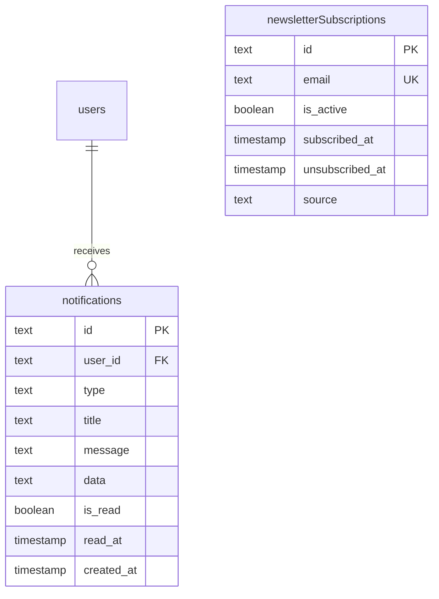
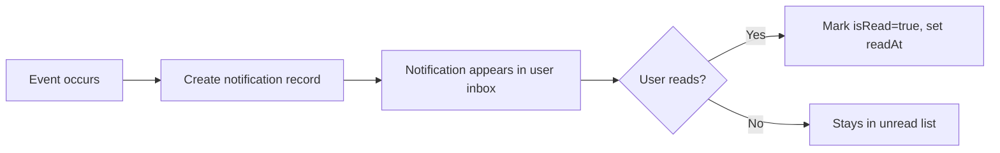

# Análisis profundo del esquema de notificaciones

## Descripción general

El módulo de notificaciones proporciona un sistema de notificación dentro de la aplicación para los usuarios. Las notificaciones se escriben, admiten seguimiento de lecturas/no leídas y pueden transportar cargas de datos arbitrarias. El sistema también incluye una tabla `newsletterSubscriptions` para la gestión de suscripciones de correo electrónico.

**Archivo fuente:** `template/lib/db/schema.ts`
**Archivo de relaciones:** `template/lib/db/migrations/relations.ts`

---

## Table: `notifications`

In-app notification records delivered to users.

### Columns

| Column | DB Name | Type | Nullable | Default | Constraints |
|---|---|---|---|---|---|
| `id` | `id` | `text` | No | `crypto.randomUUID()` | Primary Key |
| `userId` | `user_id` | `text` | No | - | FK -> `users.id` (CASCADE) |
| `type` | `type` | `text (enum)` | No | - | See notification types |
| `title` | `title` | `text` | No | - | Notification headline |
| `message` | `message` | `text` | No | - | Notification body |
| `data` | `data` | `text` | Yes | - | JSON payload |
| `isRead` | `is_read` | `boolean` | No | `false` | Read status |
| `readAt` | `read_at` | `timestamp` | Yes | - | When marked as read |
| `createdAt` | `created_at` | `timestamp` | No | `now()` | - |
| `updatedAt` | `updated_at` | `timestamp` | No | `now()` | - |

### Foreign Keys

| Column | References | On Delete |
|---|---|---|
| `user_id` | `users.id` | CASCADE |

### Indexes

| Name | Columns | Type |
|---|---|---|
| `notifications_user_idx` | `userId` | B-tree |
| `notifications_type_idx` | `type` | B-tree |
| `notifications_is_read_idx` | `isRead` | B-tree |
| `notifications_created_at_idx` | `createdAt` | B-tree |

---

## Enumeración del tipo de notificación

```typescript
// Defined inline in the schema
type: text('type', {
    enum: [
        'item_submission',    // A new item was submitted
        'comment_reported',   // A comment was reported
        'item_reported',      // An item was reported
        'user_registered',    // A new user registered
        'payment_failed',     // A payment attempt failed
        'system_alert'        // System-level notification
    ]
}).notNull()
```

|Tipo|Descripción|Destinatario típico|
|---|---|---|
|`item_submission`|Nuevo artículo enviado para revisión|Usuarios administradores|
|`comment_reported`|Un comentario fue marcado por un usuario.|Usuarios administradores|
|`item_reported`|Un elemento fue marcado por un usuario|Usuarios administradores|
|`user_registered`|Nuevo usuario creó una cuenta|Usuarios administradores|
|`payment_failed`|Un intento de pago falló|Usuario afectado|
|`system_alert`|Alertas y anuncios a nivel del sistema|Todos los usuarios o usuarios específicos|

---

## TypeScript Types

```typescript
export type Notification = typeof notifications.$inferSelect;
export type NewNotification = typeof notifications.$inferInsert;
```

---

## Relaciones

```typescript
// From relations.ts
export const notificationsRelations = relations(notifications, ({ one }) => ({
    user: one(users, {
        fields: [notifications.userId],
        references: [users.id]
    }),
}));

// Users have many notifications
export const usersRelations = relations(users, ({ many }) => ({
    // ... other relations
    notifications: many(notifications),
}));
```

---

## Table: `newsletterSubscriptions`

Email newsletter subscription management, separate from in-app notifications.

### Columns

| Column | DB Name | Type | Nullable | Default | Constraints |
|---|---|---|---|---|---|
| `id` | `id` | `text` | No | `crypto.randomUUID()` | Primary Key |
| `email` | `email` | `text` | No | - | Unique |
| `isActive` | `is_active` | `boolean` | No | `true` | Active subscription flag |
| `subscribedAt` | `subscribed_at` | `timestamp` | No | `now()` | - |
| `unsubscribedAt` | `unsubscribed_at` | `timestamp` | Yes | - | - |
| `lastEmailSent` | `last_email_sent` | `timestamp` | Yes | - | - |
| `source` | `source` | `text` | Yes | `'footer'` | `footer`, `popup`, etc. |

### Constraints

| Name | Columns | Type |
|---|---|---|
| `newsletterSubscriptions_email_unique` | `email` | Unique |

### TypeScript Types

```typescript
export type NewsletterSubscription = typeof newsletterSubscriptions.$inferSelect;
export type NewNewsletterSubscription = typeof newsletterSubscriptions.$inferInsert;
```

---

## Diagrama de relaciones



---

## Notification Flow



---

## La columna `data`

La columna `data` almacena una cadena JSON (no JSONB) con contexto arbitrario para la notificación. La estructura varía según el tipo de notificación:

```typescript
// item_submission
{ "itemSlug": "new-tool", "itemName": "New Tool", "submittedBy": "user-id" }

// comment_reported
{ "commentId": "comment-uuid", "itemSlug": "my-item", "reportId": "report-uuid" }

// payment_failed
{ "subscriptionId": "sub-uuid", "amount": 1999, "currency": "usd" }

// system_alert
{ "severity": "info", "actionUrl": "/admin/settings" }
```

---

## Query Examples

### Create a notification

```typescript
import { db } from '@/lib/db/drizzle';
import { notifications } from '@/lib/db/schema';

await db.insert(notifications).values({
    userId: targetUserId,
    type: 'item_submission',
    title: 'Nuevo artículo enviado',
    message: 'A new tool "Acme Editor" has been submitted for review.',
    data: JSON.stringify({
        itemSlug: 'acme-editor',
        itemName: 'Acme Editor',
        submittedBy: submitterUserId,
    }),
});
```

### Get unread notifications for a user

```typescript
import { eq, and, desc } from 'drizzle-orm';

const unread = await db
    .select()
    .from(notifications)
    .where(
        and(
            eq(notifications.userId, userId),
            eq(notifications.isRead, false)
        )
    )
    .orderBy(desc(notifications.createdAt));
```

### Get unread count

```typescript
import { sql } from 'drizzle-orm';

const [{ count }] = await db
    .select({ count: sql<number>`count(*)` })
    .from(notifications)
    .where(
        and(
            eq(notifications.userId, userId),
            eq(notifications.isRead, false)
        )
    );
```

### Mark notification as read

```typescript
await db
    .update(notifications)
    .set({
        isRead: true,
        readAt: new Date(),
        updatedAt: new Date(),
    })
    .where(eq(notifications.id, notificationId));
```

### Mark all notifications as read

```typescript
await db
    .update(notifications)
    .set({
        isRead: true,
        readAt: new Date(),
        updatedAt: new Date(),
    })
    .where(
        and(
            eq(notifications.userId, userId),
            eq(notifications.isRead, false)
        )
    );
```

### Get paginated notification history

```typescript
const page = 1;
const limit = 20;

const history = await db
    .select()
    .from(notifications)
    .where(eq(notifications.userId, userId))
    .orderBy(desc(notifications.createdAt))
    .limit(limit)
    .offset((page - 1) * limit);
```

### Subscribe to newsletter

```typescript
import { newsletterSubscriptions } from '@/lib/db/schema';

await db
    .insert(newsletterSubscriptions)
    .values({
        email: 'user@example.com',
        source: 'footer',
    })
    .onConflictDoUpdate({
        target: newsletterSubscriptions.email,
        set: {
            isActive: true,
            subscribedAt: new Date(),
            unsubscribedAt: null,
        },
    });
```

### Unsubscribe from newsletter

```typescript
await db
    .update(newsletterSubscriptions)
    .set({
        isActive: false,
        unsubscribedAt: new Date(),
    })
    .where(eq(newsletterSubscriptions.email, 'user@example.com'));
```

### Get active newsletter subscribers

```typescript
const subscribers = await db
    .select()
    .from(newsletterSubscriptions)
    .where(eq(newsletterSubscriptions.isActive, true));
```

---

## Notas de diseño

- **`data` es texto, no JSONB.** La columna de notificación `data` se almacena como un campo de texto sin formato que contiene JSON serializado, no una columna `jsonb`. Esto significa que debes `JSON.stringify()` al escribir y `JSON.parse()` al leer. Las consultas no pueden filtrar por campos dentro de `data`.
- **Sin tabla de preferencias de notificación.** El esquema actual no incluye una tabla de preferencias de notificación del usuario. Todos los tipos de notificación se entregan a todos los usuarios correspondientes. Para agregar preferencias de notificación por usuario, sería necesario crear una nueva tabla `notification_preferences`.
- **Eliminación en cascada.** Cuando se elimina un usuario, todas sus notificaciones se eliminan automáticamente a través de la clave externa CASCADE.
- **El boletín es independiente.** La tabla `newsletterSubscriptions` no está vinculada a la tabla `users` mediante clave externa. Esto es intencional: pueden existir suscripciones al boletín para visitantes no registrados que solo proporcionan una dirección de correo electrónico.
- **Seguimiento de fuente.** El campo `source` en las suscripciones al boletín rastrea dónde se originó la suscripción (formulario de pie de página, ventana emergente, etc.) con fines analíticos.
