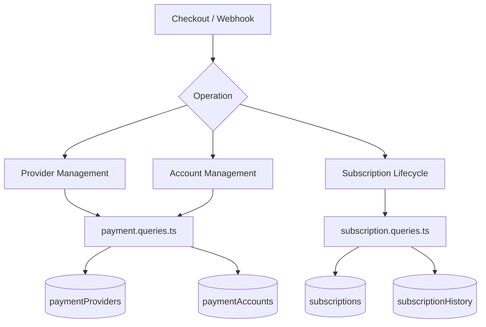
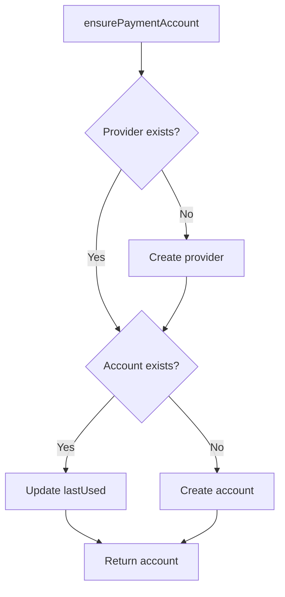
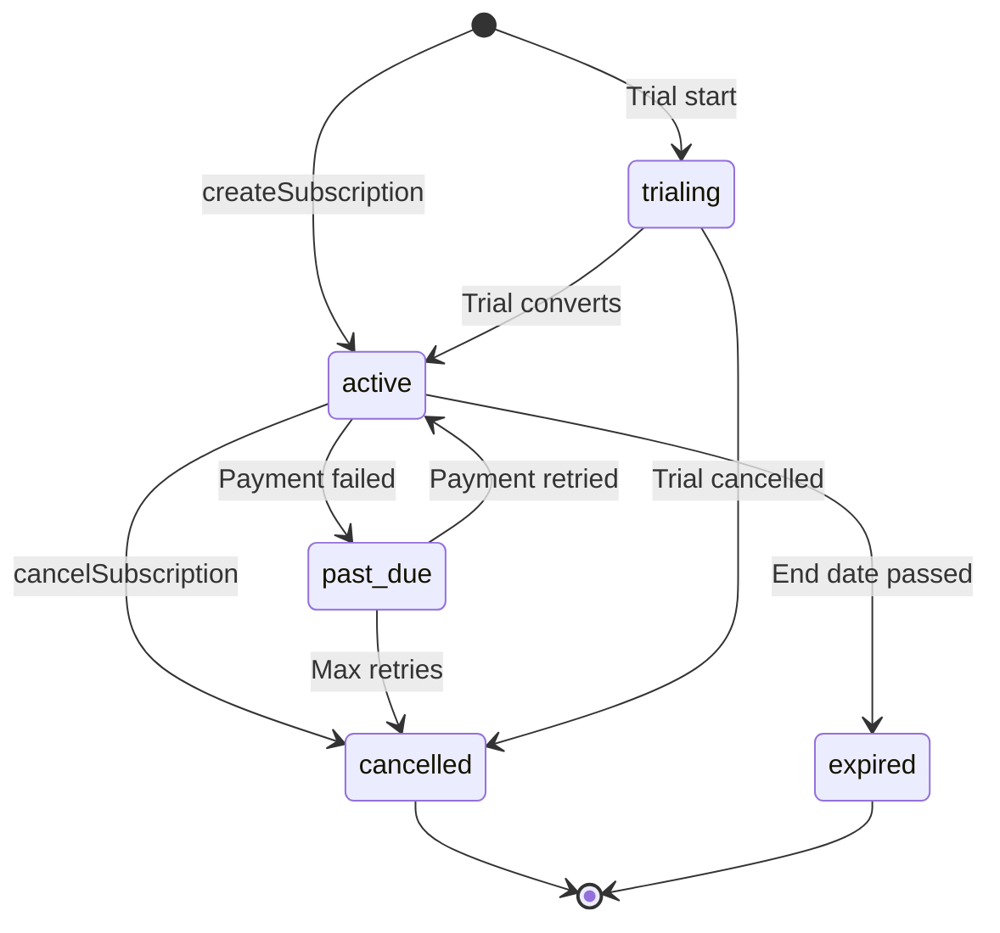

# Consultas de pago y suscripción

Las consultas de pago gestionan el registro de proveedores, las cuentas de pago de los usuarios y el ciclo de vida completo de la suscripción. Los módulos relevantes son `payment.queries.ts` y `subscription.queries.ts`.

## Arquitectura del sistema de pago



## Consultas de proveedores de pagos (`payment.queries.ts`)

### Proveedor CRUD

|Función|Descripción|
|----------|-------------|
|`getPaymentProvider(id)`|Obtener proveedor por ID|
|`getPaymentProviderByName(name)`|Obtener proveedor por nombre (por ejemplo, `'stripe'`)|
|`getActivePaymentProviders()`|Enumere todos los proveedores activos, ordenados por nombre|
|`createPaymentProvider(data)`|Crear un nuevo registro de proveedor|
|`updatePaymentProvider(id, data)`|Actualización parcial de campos de proveedor.|
|`deactivatePaymentProvider(id)`|Establecer `isActive = false`|

Nombres de proveedores admitidos: `stripe`, `lemonsqueezy`, `polar`, `solidgate`.

### Consultas sobre cuentas de pago

Las cuentas de pago vinculan a un usuario con un ID de cliente específico del proveedor:

|Función|Descripción|
|----------|-------------|
|`getPaymentAccountByUserId(userId, providerId)`|Obtener cuenta con cheque de proveedor activo|
|`getPaymentAccountByCustomerId(customerId, providerId)`|Búsqueda inversa por ID de cliente|
|`createPaymentAccount(data)`|Crear cuenta con `lastUsed` marca de tiempo|
|`updatePaymentAccountLastUsed(accountId)`|Toque `lastUsed` marca de tiempo|
|`getUserPaymentAccountByProvider(userId, providerName)`|Búsqueda por nombre de proveedor (resuelve el proveedor primero)|

### Validación de proveedor activo

`getPaymentAccountByUserId` realiza una triple unión interna para garantizar que tanto el proveedor como el usuario sean válidos:

```typescript
export async function getPaymentAccountByUserId(
  userId: string,
  providerId: string
): Promise<PaymentAccount | null> {
  const result = await db
    .select({ /* payment account fields */ })
    .from(paymentAccounts)
    .innerJoin(paymentProviders, eq(paymentAccounts.providerId, paymentProviders.id))
    .innerJoin(users, eq(paymentAccounts.userId, users.id))
    .where(and(
      eq(paymentAccounts.userId, userId),
      eq(paymentAccounts.providerId, providerId),
      eq(paymentProviders.isActive, true)
    ))
    .limit(1);
  return result[0] || null;
}
```

### Asegurar cuenta de pago

`ensurePaymentAccount` implementa un patrón de inserción idempotente para cuentas de pago:



```typescript
export async function ensurePaymentAccount(
  providerName: string,
  userId: string,
  customerId: string,
  accountId?: string
): Promise<PaymentAccount>
```

### Configurar cuenta de pago de usuario

`setupUserPaymentAccount` amplía el patrón de garantía con la detección de cambios de ID del cliente:

```typescript
if (existingAccount.customerId !== customerId) {
  await db
    .update(paymentAccounts)
    .set({
      customerId,
      accountId: accountId || existingAccount.accountId,
      lastUsed: new Date(),
      updatedAt: new Date()
    })
    .where(eq(paymentAccounts.id, existingAccount.id));
}
```

### Alias de conveniencia

- `getOrCreatePaymentAccount` -- alias de `ensurePaymentAccount`
- `createOrGetPaymentAccount` -- alias de `setupUserPaymentAccount`

## Consultas de suscripción (`subscription.queries.ts`)

### Búsqueda de suscripción

|Función|Parámetros|Devoluciones|
|----------|-----------|---------|
|`getUserActiveSubscription(userId)`|ID de usuario|Suscripción activa o nula|
|`getUserSubscriptions(userId)`|ID de usuario|Todas las suscripciones (ordenadas por fecha)|
|`getSubscriptionByProviderSubscriptionId(provider, subId)`|Proveedor + subID|Suscripción o nula|
|`getSubscriptionByUserIdAndSubscriptionId(userId, subId)`|Usuario + subID|Suscripción o nula|
|`getSubscriptionWithUser(subId)`|ID de suscripción|Suscripción con unión de usuario|
|`hasActiveSubscription(userId)`|ID de usuario|Booleano|

### Ciclo de vida de la suscripción

#### crear

```typescript
export async function createSubscription(data: NewSubscription): Promise<Subscription> {
  const result = await db
    .insert(subscriptions)
    .values({ ...data, createdAt: new Date(), updatedAt: new Date() })
    .returning();
  return result[0];
}
```

#### Estado de actualización

Los cambios de estado configuran automáticamente `cancelledAt` y `cancelReason` al realizar la transición a `CANCELLED`:

```typescript
export async function updateSubscriptionStatus(
  subscriptionId: string,
  status: string,
  reason?: string
): Promise<Subscription | null>
```

#### Cancelar

Admite tanto la cancelación inmediata como la cancelación de fin de período:

```typescript
export async function cancelSubscription(
  subscriptionId: string,
  reason?: string,
  cancelAtPeriodEnd: boolean = false
): Promise<Subscription | null>
```

Cuando `cancelAtPeriodEnd = true`, el estado permanece `ACTIVE` pero `cancelledAt` y `cancelAtPeriodEnd` están establecidos.

### Flujo de estado de suscripción



### Resolución del plan

`getUserPlan` comprueba el vencimiento de la suscripción y vuelve al plan gratuito:

```typescript
export async function getUserPlan(userId: string): Promise<string> {
  const subscription = await getUserActiveSubscription(userId);
  if (!subscription) return PaymentPlan.FREE;
  return getEffectivePlan(subscription.planId, subscription.endDate, subscription.status);
}
```

`getUserPlanWithExpiration` devuelve todos los detalles de vencimiento:

```typescript
{
  planId: string;         // Stored plan
  effectivePlan: string;  // Actual plan after expiration check
  isExpired: boolean;
  expiresAt: Date | null;
  status: string | null;
  subscriptionId: string | null;
}
```

### Caducidad y renovación

|Función|Descripción|
|----------|-------------|
|`getSubscriptionsExpiringSoon(days)`|Las suscripciones activas vencen en N días|
|`getExpiredSubscriptions()`|Suscripciones pasadas su fecha de finalización|
|`getSubscriptionsForRenewalReminder(days)`|Suscripciones que necesitan avisos de renovación|

### Historial de suscripción

Los cambios se registran en la tabla `subscriptionHistory`:

```typescript
export async function logSubscriptionHistory(data: NewSubscriptionHistory)
export async function getSubscriptionHistory(subscriptionId: string)
```

### Estadísticas de suscripción

`getSubscriptionStats` devuelve recuentos agregados:

```typescript
{
  total: number;
  active: number;
  cancelled: number;
  expired: number;
  pastDue: number;
  trialing: number;
}
```

## Constantes de esquema

```typescript
// lib/db/schema.ts
export const SubscriptionStatus = {
  ACTIVE: 'active',
  CANCELLED: 'cancelled',
  EXPIRED: 'expired',
  PAST_DUE: 'past_due',
  TRIALING: 'trialing',
} as const;

// lib/constants/payment.ts
export const PaymentPlan = {
  FREE: 'free',
  STANDARD: 'standard',
  PREMIUM: 'premium',
} as const;

export const PaymentProvider = {
  STRIPE: 'stripe',
  LEMONSQUEEZY: 'lemonsqueezy',
  POLAR: 'polar',
  SOLIDGATE: 'solidgate',
} as const;
```
