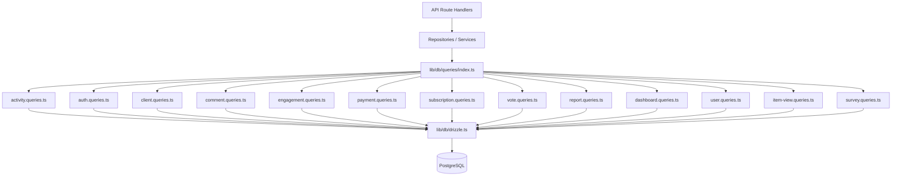

# Sistema de patrón de consulta

La plantilla organiza todas las consultas de la base de datos en módulos específicos del dominio en `lib/db/queries/`. Cada módulo sigue el Principio de Responsabilidad Única (SRP), agrupando operaciones relacionadas. Una exportación de barril en `index.ts` proporciona un único punto de entrada para todas las funciones de consulta.

## Descripción general de la arquitectura



## Módulos de consulta

|Módulo|Archivo|Propósito|
|--------|------|---------|
|Actividad|`activity.queries.ts`|Registro de actividad y seguimiento de auditoría|
|autenticación|`auth.queries.ts`|Tokens de restablecimiento de contraseña, tokens de verificación|
|Cliente|`client.queries.ts`|Perfil de cliente CRUD, búsqueda, estadísticas|
|Comentario|`comment.queries.ts`|Comenta CRUD con usuarios que se unen|
|Empresa|`company.queries.ts`|Gestión de empresas y vinculación item-empresa.|
|Panel de control|`dashboard.queries.ts`|Estadísticas del panel y gráficos de participación|
|Compromiso|`engagement.queries.ts`|Métricas de participación agregadas (vistas, votos, favoritos, comentarios)|
|Mapeo de integración|`integration-mapping.queries.ts`|Asignaciones de integración de CRM|
|Artículo|`item.queries.ts`|Normalización y validación de slugs de artículos.|
|Auditoría de artículos|`item-audit.queries.ts`|Historial de cambios de artículos|
|Vista de artículo|`item-view.queries.ts`|Ver seguimiento con deduplicación|
|Índice de ubicación|`location-index.queries.ts`|Indexación de elementos geoespaciales|
|Moderación|`moderation.queries.ts`|Acciones de moderación de contenidos|
|Boletín|`newsletter.queries.ts`|Gestión de suscriptores al boletín|
|Pago|`payment.queries.ts`|Proveedor de pagos y gestión de cuentas.|
|Informe|`report.queries.ts`|Informes de contenido con filtrado.|
|Suscripción|`subscription.queries.ts`|Gestión del ciclo de vida de la suscripción|
|Encuesta|`survey.queries.ts`|Respuestas y análisis de encuestas|
|Usuario|`user.queries.ts`|Comprobaciones CRUD y de administrador del usuario principal|
|votar|`vote.queries.ts`|Voto CRUD y cálculo de puntuación neta|

## Patrones comunes

### 1. Patrón de paginación

Todas las consultas de listas siguen un patrón de paginación consistente usando `limit` y `offset`:

```typescript
export async function getClientProfiles(params: {
  page?: number;
  limit?: number;
  search?: string;
  status?: string;
}): Promise<{
  profiles: ClientProfileWithAuth[];
  total: number;
  page: number;
  totalPages: number;
  limit: number;
}> {
  const { page = 1, limit = 10, search, status } = params;
  const offset = (page - 1) * limit;

  // 1. Build WHERE conditions dynamically
  const whereConditions: SQL[] = [];
  if (search) { /* add ILIKE condition */ }
  if (status) { whereConditions.push(eq(clientProfiles.status, status)); }
  const whereClause = whereConditions.length > 0
    ? and(...whereConditions)
    : undefined;

  // 2. Count query for total
  const countResult = await db
    .select({ count: sql<number>`count(distinct ${clientProfiles.id})` })
    .from(clientProfiles)
    .where(whereClause);
  const total = Number(countResult[0]?.count || 0);

  // 3. Data query with limit/offset
  const profiles = await db
    .select({ /* fields */ })
    .from(clientProfiles)
    .where(whereClause)
    .orderBy(desc(clientProfiles.createdAt))
    .limit(limit)
    .offset(offset);

  return {
    profiles,
    total,
    page,
    totalPages: Math.ceil(total / limit),
    limit,
  };
}
```

### 2. Patrón de filtrado dinámico

Los filtros se acumulan como una serie de condiciones SQL y se componen con `and()`:

```typescript
const whereConditions: SQL[] = [];

if (search) {
  const escapedSearch = search
    .replace(/\\/g, '\\\\')
    .replace(/[%_]/g, '\\$&');
  whereConditions.push(
    sql`(${clientProfiles.name} ILIKE ${`%${escapedSearch}%`} OR
         ${clientProfiles.email} ILIKE ${`%${escapedSearch}%`})`
  );
}

if (status) {
  whereConditions.push(eq(clientProfiles.status, status));
}

if (provider) {
  whereConditions.push(
    sql`exists (
      select 1 from ${accounts}
      where ${accounts.userId} = ${clientProfiles.userId}
        and ${accounts.provider} = ${provider}
    )`
  );
}

const whereClause = whereConditions.length > 0
  ? and(...whereConditions)
  : undefined;
```

### 3. Unir patrón

El código base utiliza `innerJoin`/`leftJoin` explícito y subconsultas para manejar datos relacionados:

**Unión interna para relaciones requeridas:**

```typescript
const result = await db
  .select({
    id: comments.id,
    content: comments.content,
    user: {
      id: clientProfiles.id,
      name: clientProfiles.name,
      email: clientProfiles.email,
      image: clientProfiles.avatar,
    },
  })
  .from(comments)
  .innerJoin(clientProfiles, eq(comments.userId, clientProfiles.id))
  .where(and(eq(comments.itemId, itemId), isNull(comments.deletedAt)))
  .orderBy(desc(comments.createdAt));
```

**Subconsulta para evitar filas duplicadas de múltiples combinaciones:**

```typescript
const profiles = await db
  .select({
    id: clientProfiles.id,
    // ... other fields
    accountProvider: sql<string>`coalesce(
      (SELECT provider FROM ${accounts}
       WHERE ${accounts.userId} = ${clientProfiles.userId}
       LIMIT 1),
      'unknown'
    )`,
  })
  .from(clientProfiles);
```

### 4. Patrón de agregación

Funciones agregadas como `count`, `SUM` y `AVG` se utilizan con `groupBy`:

```typescript
// Net vote score using conditional SUM
const voteCounts = await db
  .select({
    itemId: votes.itemId,
    netScore: sql<number>`
      SUM(CASE
        WHEN vote_type = 'upvote' THEN 1
        WHEN vote_type = 'downvote' THEN -1
        ELSE 0
      END)
    `.as('netScore'),
  })
  .from(votes)
  .where(inArray(votes.itemId, itemSlugs))
  .groupBy(votes.itemId);
```

### 5. Patrón de consulta paralela

Cuando se necesitan varias agregaciones independientes, las consultas se ejecutan en paralelo con `Promise.all`:

```typescript
const [viewsData, votesData, favoritesData, commentsData] =
  await Promise.all([
    db.select({ itemId: itemViews.itemId, count: count() })
      .from(itemViews)
      .where(inArray(itemViews.itemId, itemSlugs))
      .groupBy(itemViews.itemId),

    db.select({ itemId: votes.itemId, netScore: sql`...` })
      .from(votes)
      .where(inArray(votes.itemId, itemSlugs))
      .groupBy(votes.itemId),

    db.select({ itemSlug: favorites.itemSlug, count: count() })
      .from(favorites)
      .where(inArray(favorites.itemSlug, itemSlugs))
      .groupBy(favorites.itemSlug),

    db.select({ itemId: comments.itemId, count: count(), avgRating: sql`...` })
      .from(comments)
      .where(and(inArray(comments.itemId, itemSlugs), isNull(comments.deletedAt)))
      .groupBy(comments.itemId),
  ]);
```

### 6. Patrón Upsert/Resolución de Conflictos

Se utiliza para la deduplicación, especialmente en el seguimiento de vistas:

```typescript
export async function recordItemView(
  view: Pick<NewItemView, 'itemId' | 'viewerId' | 'viewedDateUtc'>
): Promise<boolean> {
  const result = await db
    .insert(itemViews)
    .values(view)
    .onConflictDoNothing()
    .returning({ id: itemViews.id });

  return result.length > 0;
}
```

### 7. Patrón de eliminación suave

Los registros se marcan como eliminados en lugar de eliminarse físicamente:

```typescript
export async function deleteComment(id: string) {
  const [comment] = await db
    .update(comments)
    .set({ deletedAt: new Date() })
    .where(eq(comments.id, id))
    .returning();
  return comment;
}

// Querying always filters out soft-deleted records
.where(and(eq(comments.itemId, itemId), isNull(comments.deletedAt)))
```

### 8. Patrón de normalización de resultados

Los resultados de la consulta a menudo se asignan a través de objetos de búsqueda `Map` para un acceso O(1) eficiente:

```typescript
const viewsMap = new Map<string, number>(
  viewsData.map(v => [v.itemId, Number(v.count)])
);
const votesMap = new Map<string, number>(
  votesData.map(v => [v.itemId, Number(v.netScore ?? 0)])
);

// Combine into final metrics
for (const slug of itemSlugs) {
  metricsMap.set(slug, {
    views: viewsMap.get(slug) ?? 0,
    votes: votesMap.get(slug) ?? 0,
  });
}
```

## Utilidades compartidas

### `lib/db/queries/utils.ts`

Proporciona funciones auxiliares compartidas entre módulos de consulta:

- **`extractUsernameFromEmail(email)`** -- Extrae y desinfecta un nombre de usuario de una dirección de correo electrónico
- **`ensureUniqueUsername(baseUsername)`** -- Genera un nombre de usuario único agregando sufijos numéricos si es necesario

### `lib/db/queries/types.ts`

Define los tipos compartidos utilizados en todos los módulos de consulta:

- **`ClientProfileWithAuth`** -- Perfil del cliente combinado con datos del proveedor de autenticación
- **`ClientStatus`** / **`ClientPlan`** / **`ClientAccountType`** -- Tipos de enumeración para filtrado
- **`CommentWithUser`** -- Datos de comentarios enriquecidos con información del usuario

## Convenio de importación

Todas las consultas se importan a través de la exportación de barriles:

```typescript
import {
  getClientProfiles,
  createVote,
  getEngagementMetricsPerItem,
  getUserActiveSubscription,
} from '@/lib/db/queries';
```
