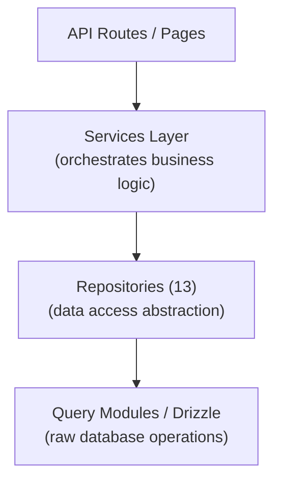

# Patrón de repositorio

La plantilla Ever Works implementa un patrón de repositorio a través de 13 clases de repositorio especializadas en `lib/repositories/`. Los repositorios proporcionan una abstracción de nivel superior sobre consultas de bases de datos sin procesar, encapsulando lógica de consulta compleja, reglas comerciales y transformación de datos.

## Arquitectura



## Lista de repositorios

|Repositorio|Archivo|Dominio|
|------------|------|--------|
|Análisis de administración (optimizado)|`admin-analytics-optimized.repository.ts`|Análisis de administración con optimización del rendimiento|
|Estadísticas de administración|`admin-stats.repository.ts`|Estadísticas del panel de administración|
|categoría|`category.repository.ts`|Gestión de categorías|
|Panel de cliente|`client-dashboard.repository.ts`|Operaciones del panel del cliente|
|Artículo del cliente|`client-item.repository.ts`|Envíos de artículos de clientes|
|Colección|`collection.repository.ts`|Gestión de colecciones|
|Mapeo de integración|`integration-mapping.repository.ts`|Asignaciones de integración de CRM|
|Artículo|`item.repository.ts`|Operaciones de artículos|
|Rol|`role.repository.ts`|Gestión de roles|
|Anuncio del patrocinador|`sponsor-ad.repository.ts`|Gestión de publicidad patrocinada.|
|Etiqueta|`tag.repository.ts`|Gestión de etiquetas|
|Veinte configuraciones de CRM|`twenty-crm-config.repository.ts`|configuración de CRM|
|Usuario|`user.repository.ts`|Gestión de usuarios|

## Repositorio de contenido basado en Git (`lib/repository.ts`)

Además de los repositorios de bases de datos, la plantilla incluye un repositorio de contenido basado en Git en `lib/repository.ts`. Esto maneja las operaciones de Git CMS:

- Clonar repositorio de contenido desde `DATA_REPOSITORY` URL
- Sincronizar contenido con upstream (extraer/empujar con detección de conflictos)
- Realice un seguimiento de los cambios locales y confírmelos
- Protección de tiempo de espera para operaciones de Git (tiempo de espera de 120 segundos)

Esto es distinto de los repositorios de bases de datos y administra el directorio `.content/` utilizado por la capa de contenido.

## Detalles del repositorio

### admin-analytics-optimizado.repository.ts

Repositorio de análisis de rendimiento optimizado para el panel de administración. Utiliza consultas por lotes y estrategias de almacenamiento en caché para minimizar la carga de la base de datos al generar vistas analíticas.

Capacidades clave:
- Estadísticas de vistas agregadas
- Tendencias de crecimiento de usuarios
- Resúmenes de participación en el contenido
- Análisis de ingresos

### admin-stats.repositorio.ts

Proporciona estadísticas del panel de administración.

Capacidades clave:
- Recuento total de usuarios
- Recuentos de suscripciones activas
- Estadísticas de contenido (elementos, comentarios, informes)
- Resúmenes de actividad reciente

### categoría.repositorio.ts

Gestiona datos de categorías con operaciones CRUD y manejo de relaciones.

Capacidades clave:
- Listado de categorías con recuentos de artículos
- Recorrido del árbol de categorías (padre/hijo)
- Búsqueda y filtrado de categorías
- Ordenación de categorías

### cliente-dashboard.repository.ts

El repositorio más grande (28 KB), que maneja todos los datos del panel del lado del cliente.

Capacidades clave:
- Gestión de envío de clientes
- Análisis de envíos (vistas, votos, comentarios por elemento)
- Historial de actividad del cliente
- Estadísticas resumidas del panel
- Listado de artículos paginados con filtros.

### elemento-cliente.repositorio.ts

Gestiona elementos desde la perspectiva del cliente (remitente).

Capacidades clave:
- Creación y actualizaciones de envío de artículos.
- Seguimiento del estado del artículo
- Historial de envíos
- Filtrado de artículos específicos del cliente

### colección.repositorio.ts

Gestión de colecciones para grupos de artículos seleccionados.

Capacidades clave:
- Operaciones CRUD de cobranza
- Asociaciones de colección de artículos
- Orden y estado de la colección
- Listado de colecciones paginadas

### integración-mapping.repository.ts

Persistencia del mapeo de integración de CRM.

Capacidades clave:
- Crear y actualizar asignaciones entre ID internos e ID de CRM
- Operaciones de inserción masiva
- Búsqueda por ID interno o ID de CRM
- Seguimiento de marca de tiempo de sincronización
- Gestión de hash de versión para detección de cambios

### elemento.repositorio.ts

Operaciones de datos de elementos principales (para metadatos almacenados en bases de datos, no para contenido de Git).

Capacidades clave:
- Gestión de metadatos de artículos
- Búsqueda de artículos con múltiples filtros.
- Agregación de datos de participación de artículos
- Gestión de artículos destacados

### rol.repositorio.ts

Gestión de roles para el sistema RBAC.

Capacidades clave:
- Operaciones CRUD de rol
- Asociaciones de permisos de roles
- Asignaciones de roles de usuario
- Validación de roles

### patrocinador-ad.repository.ts

Gestión del ciclo de vida de la publicidad patrocinada.

Capacidades clave:
- Creación y gestión de anuncios de patrocinadores.
- Transiciones de estado (pendiente, activo, caducado)
- Filtrado de anuncios por estado, usuario o artículo
- Datos de integración de pagos
- Manejo de vencimiento

### etiqueta.repositorio.ts

Gestión de etiquetas con asociaciones de artículos.

Capacidades clave:
- Etiquetar operaciones CRUD
- Búsqueda de etiquetas y autocompletar
- Estadísticas de uso de etiquetas
- Asociaciones de etiquetas de artículos

### veinte-crm-config.repository.ts

Veinte gestión de configuración singleton de CRM.

Capacidades clave:
- Obtener/actualizar la configuración de CRM
- Activar/desactivar la integración de CRM
- Gestión del modo de sincronización
- Gestión de claves API

### usuario.repositorio.ts

Gestión de cuentas de usuario.

Capacidades clave:
- Operaciones de perfil de usuario
- Búsqueda y filtrado de usuarios.
- Gestión del estado de la cuenta
- Eliminación de usuario (eliminación temporal)

## Patrón de uso

Los repositorios se importan y utilizan directamente en rutas API, servicios y componentes del servidor:

```typescript
import { clientDashboardRepository } from '@/lib/repositories/client-dashboard.repository';

// In an API route
export async function GET(request: NextRequest) {
  const session = await auth();
  const dashboard = await clientDashboardRepository.getDashboardStats(session.user.id);
  return NextResponse.json({ success: true, data: dashboard });
}
```

```typescript
import { itemRepository } from '@/lib/repositories/item.repository';

// In a server component
export default async function ItemPage({ params }) {
  const item = await itemRepository.findBySlug(params.slug);
  return <ItemDetail item={item} />;
}
```

## Repositorio frente a módulos de consulta

|Aspecto|Módulos de consulta (`lib/db/queries/`)|Repositorios (`lib/repositories/`)|
|--------|-----------------------------------|-------------------------------------|
|Complejidad|Consultas simples y enfocadas|Operaciones complejas de varias tablas|
|Lógica empresarial|Ninguno (acceso puro a datos)|Incluye validación y reglas de negocio.|
|Transformación de datos|Resultados sin procesar de la base de datos|Datos transformados/enriquecidos|
|Caso de uso|Operaciones directas de bases de datos|Acceso a datos a nivel de funciones|
|Consumidor típico|Otros módulos de consulta, rutas simples.|Servicios, rutas API, componentes del servidor.|

Ambas capas usan Drizzle ORM e importan la conexión de la base de datos desde `lib/db/drizzle.ts`. La elección entre ellos depende de la complejidad de la operación: las lecturas simples utilizan módulos de consulta directamente, mientras que las funciones complejas pasan por los repositorios.
