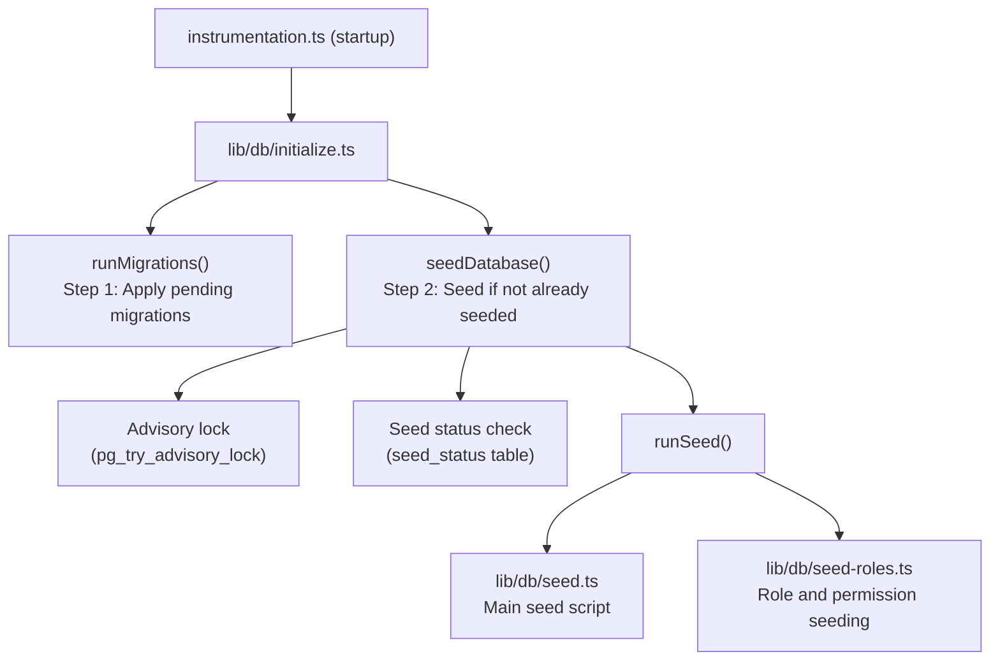

# Siembra de base de datos

La plantilla Ever Works incluye un completo sistema de inicialización de bases de datos que inicializa datos esenciales (roles, permisos, proveedores de pagos) y, opcionalmente, genera datos de demostración para desarrollo y pruebas.

## Arquitectura de semillas



## Guiones de semillas

### Script de semilla principal (`lib/db/seed.ts`)

El script inicial principal maneja toda la inicialización de la base de datos. Funciona en dos modos:

**Modo de Producción**: Semillas solo los datos esenciales necesarios para que la aplicación funcione:
- Roles de administrador y cliente
- Permisos del sistema
- Proveedores de pago predeterminados
- Registros del sistema requeridos

**Modo de demostración**: Además, genera datos de prueba completos para el desarrollo:
- Usuarios de muestra con diferentes roles
- Ejemplos de perfiles de clientes
- Suscripciones de ejemplo
- Comentarios de demostración, votos y favoritos.
- Notificaciones de prueba
- Entradas del registro de actividad

El modo de demostración se activa cuando se establece la variable de entorno `DEMO_MODE`.

Características clave:
- **Idempotencia por tabla**: cada tabla se verifica antes de sembrar; sólo se llenan las tablas vacías
- **Comprobaciones de existencia de tablas**: verifica que las tablas existan antes de intentar insertarlas.
- **Utiliza `drizzle-seed`**: aprovecha la biblioteca de siembra oficial de Drizzle para la generación de datos estructurados.
- **Seguro para repeticiones**: se puede llamar varias veces sin duplicar datos

```typescript
// Simplified seed flow
export async function runSeed(): Promise<void> {
  await ensureDb();
  const isDemo = isDemoMode();

  if (isDemo) {
    // Seed comprehensive test data
  } else {
    // Seed minimal essential data only
  }

  // Seed roles (always)
  if (await isTableEmpty('roles', roles)) {
    await seedRoles();
  }

  // Seed permissions (always)
  if (await isTableEmpty('permissions', permissions)) {
    await seedPermissions();
  }

  // Seed payment providers (always)
  if (await isTableEmpty('paymentProviders', paymentProviders)) {
    await seedPaymentProviders();
  }

  // Demo-only: seed users, profiles, subscriptions, etc.
  if (isDemo) {
    await seedDemoData();
  }
}
```

### Siembra de roles (`lib/db/seed-roles.ts`)

Un script dedicado para inicializar el sistema RBAC, que también se puede ejecutar de forma independiente.

**`seedPermissions()`** crea el conjunto de permisos inicial:

|Clave de permiso|Descripción|
|---------------|-------------|
|`read:own`|Puede leer datos propios|
|`write:own`|Puede escribir datos propios|
|`admin:all`|Acceso administrativo completo|
|`client:manage`|Puede gestionar operaciones específicas del cliente|
|`user:read`|Puede leer datos del usuario|
|`user:write`|Puede escribir datos de usuario|

Utiliza `onConflictDoUpdate` para actualizar de forma segura los permisos existentes sin fallar en las reejecuciones.

**`linkRolesToPermissions()`** crea asociaciones de permisos de rol:

- **Rol de administrador**: Obtiene TODOS los permisos
- **Rol de cliente**: Obtiene `read:own`, `write:own` y `client:manage`.

La función valida que los roles requeridos (administrador, cliente) existan y estén activos antes de crear asociaciones.

**`seedRolesAndPermissions()`** organiza ambas operaciones dentro de una transacción de base de datos:

```typescript
export async function seedRolesAndPermissions() {
  await db.transaction(async () => {
    await seedPermissions();
    await linkRolesToPermissions();
  });
}
```

Se puede ejecutar de forma independiente:
```bash
# Run directly (if configured as a script)
npx tsx lib/db/seed-roles.ts
```

## Sistema de inicialización (`lib/db/initialize.ts`)

El sistema de inicialización gestiona la secuencia de inicio completa con protección de concurrencia.

### Seguimiento del estado de las semillas

Una tabla `seed_status` realiza un seguimiento del estado de inicialización:

|Estado|Significado|
|--------|---------|
|`seeding`|Operación de semillas en curso|
|`completed`|Semilla completada exitosamente|
|`failed`|La semilla falló (error almacenado)|

### Protección de concurrencia

En implementaciones multiproceso (por ejemplo, múltiples funciones sin servidor de Vercel que se inician simultáneamente), el sistema evita la propagación duplicada mediante:

1. **Bloqueos de asesoramiento de PostgreSQL**: `pg_try_advisory_lock(12345)` proporciona un bloqueo sin bloqueo. Sólo un proceso puede adquirirlo.
2. **Tabla de estado de semilla**: Otros procesos verifican la tabla `seed_status` y esperan a que se complete.
3. **Detección obsoleta**: si un estado `seeding` tiene más de 5 minutos, se trata como obsoleto y se limpia.
4. **Tiempo de espera**: Los procesos que esperan a que se complete otra instancia expirarán después de 60 segundos.

### Flujo de inicialización

```
initializeDatabase()
│
├── DATABASE_URL not set? → Silent skip (DB is optional)
│
├── Step 1: Run migrations (always, idempotent)
│   └── Failure? → Error in production, warning in dev/preview
│
├── Step 2: Check if already seeded
│   └── seed_status = 'completed'? → Done
│
├── Step 3: Handle edge cases
│   ├── Previous seed failed? → Delete failed status, retry
│   ├── Stale seeding (>5min)? → Clean up, retry
│   └── Another instance seeding? → Wait for completion
│
├── Step 4: Acquire advisory lock
│   └── Lock not available? → Wait for other instance
│
├── Step 5: Double-check (another instance may have finished)
│
├── Step 6: Run seed
│   ├── Create seed_status record ('seeding')
│   ├── Execute runSeed()
│   └── Update seed_status ('completed' or 'failed')
│
└── Step 7: Release advisory lock (always, in finally block)
```

## Ejecutar semillas manualmente

### Semilla estándar

```bash
pnpm db:seed
```

### Guiones de semillas individuales

```bash
# Seed roles and permissions only
npx tsx lib/db/seed-roles.ts
```

### Modo de demostración

Para generar datos de demostración, configure la variable de entorno `DEMO_MODE`:

```bash
DEMO_MODE=true pnpm db:seed
```

## Variables de entorno

|variable|Predeterminado|Descripción|
|----------|---------|-------------|
|`DATABASE_URL`| - |Cadena de conexión de PostgreSQL (requerida para la inicialización)|
|`DEMO_MODE`|`false`|Habilitar la siembra de datos de demostración|

## Resumen de datos de semillas

### Siempre Sembrado (Modo Producción)

|mesa|Datos|
|-------|------|
|`roles`|Roles de administrador y cliente|
|`permissions`|Definiciones de permisos del sistema|
|`rolePermissions`|Asociaciones de permisos de roles|
|`paymentProviders`|Raya, LemonSqueezy, Polar, Solidgate|

### Sólo modo de demostración

|mesa|Datos|
|-------|------|
|`users`|Usuarios administradores y clientes de muestra|
|`accounts`|Cuentas de autenticación para usuarios de muestra|
|`clientProfiles`|Perfiles de clientes con estados variados|
|`subscriptions`|Suscripciones de muestra en todos los planes|
|`comments`|Comentarios de elementos de ejemplo|
|`votes`|Votos de muestra|
|`favorites`|Favoritos de muestra|
|`notifications`|Ejemplos de notificaciones de administrador|
|`activityLogs`|Historial de actividad de muestra|

## Mejores prácticas

1. **Nunca ejecute semillas en producción con DEMO_MODE**: los datos de demostración solo deben usarse en desarrollo y puesta en escena.
2. **Verifique el estado de la semilla antes de volver a sembrar manualmente**: consulte la tabla `seed_status` para comprender el estado actual
3. **Usar transacciones**: la inicialización de roles utiliza transacciones para garantizar la coherencia.
4. **Diseño idempotente**: siempre verifique si existen datos antes de insertarlos para admitir repeticiones seguras
5. **Bloqueos de aviso**: el sistema de bloqueo de aviso evita problemas en entornos sin servidor donde pueden iniciarse varias instancias simultáneamente
