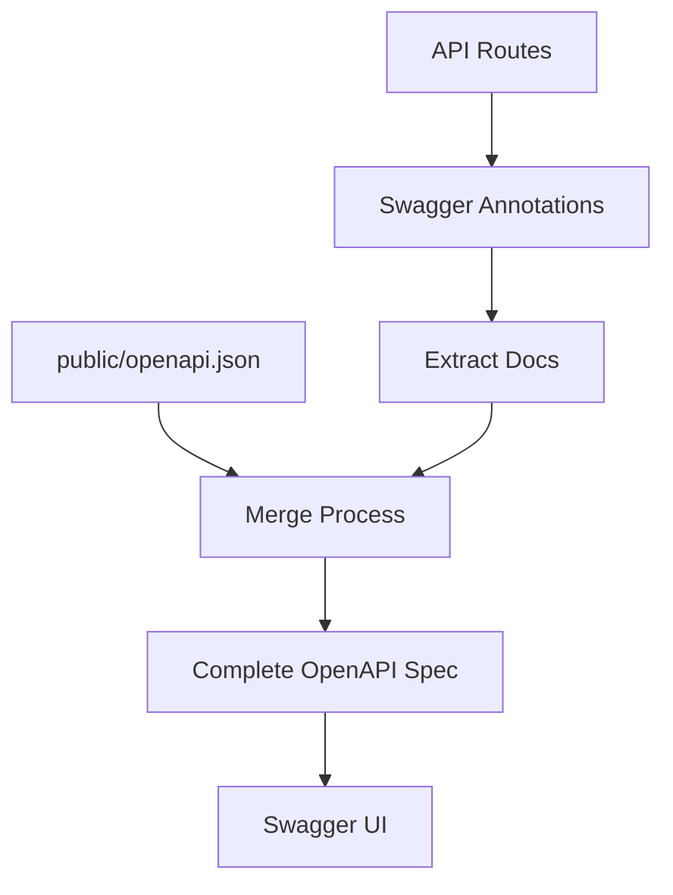

# Sistema Automatizado de Documentación de API

Ever Works incluye un sistema automatizado de documentación OpenAPI que genera documentación completa de la API desde tu código.

## Descripción General

El sistema proporciona:
- 📝 **Generación automatizada** - De anotaciones de código a especificación OpenAPI
- 🔄 **Enfoque híbrido** - Preserva documentación manual, añade automatizada
- 🎯 **Seguridad de tipos** - Integración con TypeScript
- 📊 **Swagger UI** - Explorador de API interactivo
- 🔧 **Hot reload** - Se regenera automáticamente durante el desarrollo

## Arquitectura



### Enfoque Híbrido

- ✅ **Preserva** el archivo `public/openapi.json` existente
- ✅ **Añade** anotaciones `@swagger` en el código de rutas
- ✅ **Combina** ambas fuentes automáticamente
- ✅ **Genera** archivo OpenAPI completo y consistente

## Instalación

### 1. Instalar Dependencias

```bash
# Run the installation script
./scripts/install-swagger-deps.sh

# Or manually with npm
npm install -D swagger-jsdoc @types/swagger-jsdoc tsx nodemon
```

### 2. Scripts Disponibles

```bash
# Generate documentation once
npm run generate-docs

# Watch mode for development (auto-regenerates)
npm run docs:watch

# Development with automatic generation
npm run dev
```

## Uso

### Añadir Anotaciones a las Rutas

```typescript
// app/api/example/route.ts
import { NextRequest, NextResponse } from 'next/server';

/**
 * @swagger
 * /api/example:
 *   get:
 *     tags: ["Example"]
 *     summary: "Get example data"
 *     description: "Returns example data from the API"
 *     responses:
 *       200:
 *         description: "Success"
 *         content:
 *           application/json:
 *             schema:
 *               type: object
 *               properties:
 *                 success:
 *                   type: boolean
 *                   example: true
 *                 data:
 *                   type: array
 *                   items:
 *                     type: string
 */
export async function GET() {
  return NextResponse.json({ success: true, data: ["example"] });
}
```

### Uso de Utilidades de Anotación

```typescript
import { createAdminRouteAnnotation, CommonAnnotations } from '@/lib/swagger/annotations';

/**
 * @swagger
 * /api/admin/users:
 *   get:
 *     tags: ["Admin"]
 *     summary: "Get all users"
 *     security:
 *       - bearerAuth: []
 *     responses:
 *       200:
 *         description: "Success"
 *       401:
 *         $ref: '#/components/responses/Unauthorized'
 *       500:
 *         $ref: '#/components/responses/ServerError'
 */
export async function GET() {
  // Implementation
}
```

### Anotaciones Comunes

El sistema proporciona componentes de anotación reutilizables:

```typescript
// lib/swagger/annotations.ts

export const CommonAnnotations = {
  responses: {
    unauthorized: {
      description: "Unauthorized - Invalid or missing authentication",
      content: {
        "application/json": {
          schema: {
            type: "object",
            properties: {
              error: { type: "string", example: "Unauthorized" }
            }
          }
        }
      }
    },
    serverError: {
      description: "Internal Server Error",
      content: {
        "application/json": {
          schema: {
            type: "object",
            properties: {
              error: { type: "string", example: "Internal server error" }
            }
          }
        }
      }
    }
  },
  
  security: {
    bearerAuth: {
      type: "http",
      scheme: "bearer",
      bearerFormat: "JWT"
    }
  }
};
```

## Estructura de Archivos

```
scripts/
├── generate-openapi.ts     # Script principal de generación
├── tsconfig.json          # Configuración TypeScript para scripts
└── install-swagger-deps.sh # Instalador de dependencias

lib/swagger/
└── annotations.ts         # Utilidades de anotación reutilizables

templates/
└── route-template.ts      # Plantilla para nuevas rutas

public/
└── openapi.json          # Especificación OpenAPI generada
```

## Configuración

### Configuración Base de OpenAPI

```typescript
// scripts/generate-openapi.ts
const swaggerDefinition = {
  openapi: '3.0.0',
  info: {
    title: 'Ever Works API',
    version: '1.0.0',
    description: 'API documentation for Ever Works directory platform',
  },
  servers: [
    {
      url: 'http://localhost:3000',
      description: 'Development server',
    },
    {
      url: 'https://yourdomain.com',
      description: 'Production server',
    },
  ],
  components: {
    securitySchemes: {
      bearerAuth: {
        type: 'http',
        scheme: 'bearer',
        bearerFormat: 'JWT',
      },
    },
  },
};
```

### Configuración de Swagger UI

Accede a la documentación interactiva de la API en:
- Desarrollo: `http://localhost:3000/api-docs`
- Producción: `https://yourdomain.com/api-docs`

## Mejores Prácticas

### 1. Etiquetado Consistente

Agrupa endpoints relacionados con etiquetas:

```typescript
/**
 * @swagger
 * /api/items:
 *   get:
 *     tags: ["Items"]  // Use consistent tag names
 */
```

### 2. Descripciones Detalladas

Proporciona descripciones y ejemplos claros:

```typescript
/**
 * @swagger
 * /api/items/{id}:
 *   get:
 *     summary: "Get item by ID"
 *     description: "Retrieves a single item from the directory by its unique identifier"
 *     parameters:
 *       - name: id
 *         in: path
 *         required: true
 *         description: "Unique item identifier"
 *         schema:
 *           type: string
 *           example: "item-123"
 */
```

### 3. Definiciones de Esquema

Define esquemas reutilizables en los componentes:

```typescript
/**
 * @swagger
 * components:
 *   schemas:
 *     Item:
 *       type: object
 *       required:
 *         - id
 *         - name
 *       properties:
 *         id:
 *           type: string
 *           example: "item-123"
 *         name:
 *           type: string
 *           example: "Example Item"
 *         description:
 *           type: string
 *           example: "Item description"
 */
```

### 4. Respuestas de Error

Documenta todas las respuestas de error posibles:

```typescript
/**
 * @swagger
 * /api/items:
 *   post:
 *     responses:
 *       201:
 *         description: "Item created successfully"
 *       400:
 *         description: "Invalid request data"
 *       401:
 *         description: "Unauthorized"
 *       500:
 *         description: "Server error"
 */
```

## Solución de Problemas

### La Documentación No Se Genera

**Problema**: El archivo OpenAPI no se actualiza

**Solución**: Verifica el script de generación

```bash
# Run manually to see errors
npm run generate-docs

# Check for syntax errors in annotations
```

### Swagger UI No Carga

**Problema**: La página de documentación de la API muestra un error

**Solución**: Verifica que el archivo OpenAPI sea válido

```bash
# Validate OpenAPI spec
npx swagger-cli validate public/openapi.json
```

### Anotaciones No Detectadas

**Problema**: Las anotaciones de rutas no aparecen en la documentación

**Solución**: Asegúrate del formato correcto

```typescript
// ✅ Correct
/**
 * @swagger
 * /api/route:
 *   get:
 *     ...
 */

// ❌ Incorrect (missing @swagger tag)
/**
 * /api/route:
 *   get:
 *     ...
 */
```

## Funciones Avanzadas

### Esquemas de Cuerpo de Solicitud

```typescript
/**
 * @swagger
 * /api/items:
 *   post:
 *     requestBody:
 *       required: true
 *       content:
 *         application/json:
 *           schema:
 *             type: object
 *             required:
 *               - name
 *             properties:
 *               name:
 *                 type: string
 *               description:
 *                 type: string
 */
```

### Autenticación

```typescript
/**
 * @swagger
 * /api/admin/settings:
 *   get:
 *     security:
 *       - bearerAuth: []
```
