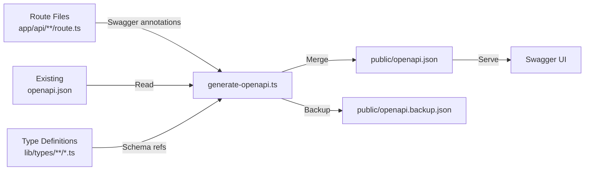

# Generación de OpenAPI

La plantilla incluye un sistema automatizado de generación de documentación OpenAPI que escanea anotaciones JSDoc `@swagger` en los archivos de rutas de la API, las fusiona con la documentación existente y produce una especificación completa `openapi.json`.

## Descripción General



## Ejecutando el Generador

```bash
# Generación estándar con salida
tsx scripts/generate-openapi.ts

# Modo silencioso (para CI/CD)
tsx scripts/generate-openapi.ts --silent
```

El script se ejecuta automáticamente en modo silencioso cuando se detectan variables de entorno CI (`CI`, `GITHUB_ACTIONS`, `GITLAB_CI`, `VERCEL`, etc.).

## Configuración

El generador usa `swagger-jsdoc` con la siguiente configuración base:

```typescript
const swaggerOptions = {
	definition: {
		openapi: '3.0.0',
		info: {
			title: 'Ever Works API',
			version: '1.0.0',
			description: 'Comprehensive API documentation for Directory Web Template',
			contact: {
				name: 'Ever Works Team',
				url: 'https://ever.works'
			}
		},
		servers: [{ url: '/', description: 'Current Environment' }],
		components: {
			securitySchemes: {
				sessionAuth: { type: 'http', scheme: 'bearer', bearerFormat: 'JWT' },
				session: { type: 'apiKey', in: 'cookie', name: 'session_token' },
				cronSecret: { type: 'http', scheme: 'bearer', bearerFormat: 'Secret' }
			}
		}
	},
	apis: ['./app/api/**/route.ts', './app/api/**/*.ts', './lib/types/**/*.ts']
};
```

## Esquemas de Seguridad

| Esquema       | Tipo                     | Uso                                     |
| ------------- | ------------------------ | --------------------------------------- |
| `sessionAuth` | Bearer JWT               | Endpoints de usuario autenticado        |
| `session`     | Cookie (`session_token`) | Autenticación de sesión del navegador   |
| `cronSecret`  | Bearer Secret            | Endpoints de tareas cron                |

## Esquemas de Componentes Integrados

El generador proporciona estos esquemas reutilizables:

### ErrorResponse

```json
{
	"type": "object",
	"properties": {
		"success": { "type": "boolean", "example": false },
		"error": { "type": "string", "example": "Error message" }
	},
	"required": ["success", "error"]
}
```

### PaginationMeta

```json
{
	"type": "object",
	"properties": {
		"page": { "type": "integer", "example": 1 },
		"pageSize": { "type": "integer", "example": 20 },
		"total": { "type": "integer", "example": 150 },
		"totalPages": { "type": "integer", "example": 8 }
	}
}
```

## Escribiendo Anotaciones Swagger

### Anotación Básica de Ruta

Añade comentarios JSDoc `@swagger` directamente encima o dentro de tus archivos de ruta:

```typescript
/**
 * @swagger
 * /api/items:
 *   get:
 *     tags: ["Items"]
 *     summary: "List all items"
 *     description: "Returns a paginated list of items with optional filtering"
 *     parameters:
 *       - name: "page"
 *         in: query
 *         schema:
 *           type: integer
 *           minimum: 1
 *           default: 1
 *       - name: "limit"
 *         in: query
 *         schema:
 *           type: integer
 *           minimum: 1
 *           maximum: 100
 *           default: 10
 *     responses:
 *       200:
 *         description: "Successful response"
 *         content:
 *           application/json:
 *             schema:
 *               $ref: "#/components/schemas/Pagination"
 *       500:
 *         description: "Internal server error"
 *         content:
 *           application/json:
 *             schema:
 *               $ref: "#/components/schemas/ErrorResponse"
 */
export async function GET(request: Request) {
	// handler implementation
}
```
