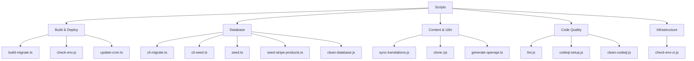
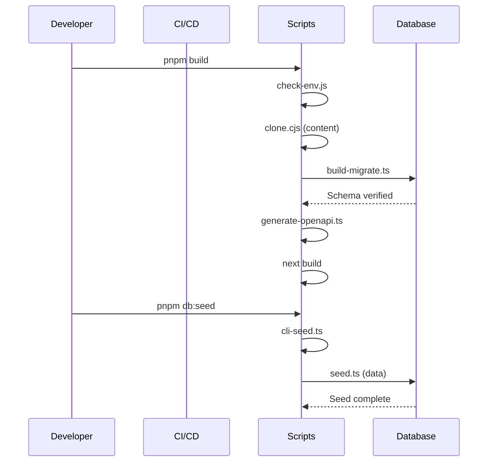

# Resumen de Scripts

El directorio `scripts/` contiene scripts de automatización que gestionan el pipeline de compilación, el ciclo de vida de la base de datos, la sincronización de contenido, la calidad del código y la infraestructura de despliegue. Cada script está diseñado para una fase específica del flujo de trabajo de desarrollo o despliegue.

## Estructura de Directorios

```
scripts/
├── build-migrate.ts          # Migraciones de base de datos en tiempo de compilación
├── check-env.js              # Validación de variables de entorno
├── check-env-ci.js           # Validación de env específica para CI
├── clean-database.js         # Utilidad de restablecimiento de la base de datos
├── cli-migrate.ts            # CLI de migración manual
├── cli-seed.ts               # CLI de seeding manual
├── clone.cjs                 # Clonación de contenido del CMS basado en Git
├── codeql-setup.js           # Configuración del análisis de seguridad CodeQL
├── clean-codeql.js           # Utilidad de limpieza de CodeQL
├── generate-openapi.ts       # Generación de especificación OpenAPI
├── lint.js                   # Script envolvente de ESLint
├── seed.ts                   # Seeder completo de la base de datos
├── seed-stripe-products.ts   # Seeder de productos/precios de Stripe
├── sync-translations.js      # Sincronización de traducciones i18n
├── update-cron.ts            # Gestión de tareas cron de Vercel
└── tsconfig.json             # Configuración TypeScript para scripts
```

## Categorías de Scripts



## Scripts de Compilación y Despliegue

### build-migrate.ts

Ejecuta migraciones de base de datos durante el proceso de compilación de Vercel. Garantiza la consistencia del esquema antes de que el despliegue entre en producción.

```bash
tsx scripts/build-migrate.ts
```

| Característica       | Comportamiento                                                          |
|----------------------|-------------------------------------------------------------------------|
| Detección de CI      | Omite migraciones en GitHub Actions (no Vercel)                         |
| Flag de omisión      | Define `SKIP_BUILD_MIGRATIONS=true` para omitir                         |
| Verificación esquema | Valida que las columnas críticas existen tras la migración              |
| Seguridad producción | Falla la compilación si las migraciones en producción fallan            |
| Tolerancia preview   | Permite errores de conexión en despliegues de vista previa              |

### check-env.js

Valida las variables de entorno antes del inicio de la aplicación. Categoriza dinámicamente las variables por prefijo y verifica la completitud.

```bash
node scripts/check-env.js [--silent] [--quick]
```

| Flag             | Descripción                                             |
|------------------|---------------------------------------------------------|
| `--silent`, `-s` | Suprime la salida no crítica                            |
| `--quick`, `-q`  | Omite verificaciones detalladas, salida mínima          |

Categorías detectadas automáticamente: `core`, `database`, `auth`, `supabase`, `content`, `email`, `payment`, `analytics`, `storage`, `api`, `security`, `background-jobs`.

### update-cron.ts

Gestiona los horarios de tareas cron de Vercel a través de la API de Vercel. Ajusta la frecuencia de sincronización según el plan del proyecto.

```bash
tsx scripts/update-cron.ts
```

| Variable de Entorno   | Propósito                                               |
|-----------------------|---------------------------------------------------------|
| `VERCEL_TOKEN`        | Token de autenticación de la API                        |
| `VERCEL_PROJECT_ID`   | Identificador del proyecto destino                      |
| `VERCEL_TEAM_SCOPE`   | Ámbito del equipo para llamadas a la API                |
| `VERCEL_DEPLOYMENT_ID`| Despliegue a esperar antes de actualizar                |
| `CRON_FREQUENCY`      | Establecer en `5min` para sincronización de alta frecuencia |

Horarios predeterminados: Plan gratuito usa `0 3 * * *` (diario a las 3 AM), Plan Pro usa `*/5 * * * *` (cada 5 minutos).

## Scripts de Base de Datos

### seed.ts

Rellena la base de datos con datos de prueba realistas incluyendo usuarios, perfiles, roles, permisos, registros de actividad, comentarios y votos.

```bash
DATABASE_URL=postgres://... pnpm seed
```

Datos sembrados (20 usuarios por defecto):

| Entidad             | Cantidad | Detalles                                      |
|---------------------|----------|-----------------------------------------------|
| Roles               | 2        | `admin` y `user`                              |
| Permisos            | Todos    | De las definiciones `getAllPermissions()`     |
| Usuarios            | 20       | Con direcciones de correo secuenciales        |
| Perfiles de cliente | 20       | Planes mixtos: gratuito, estándar, premium    |
| Roles de usuario    | 20       | El primer usuario es admin                    |
| Suscripciones boletín| ~7      | Cada 3er usuario                              |
| Registros actividad | 30       | Acciones SIGN_UP, SIGN_IN, COMMENT, VOTE      |
| Comentarios         | 15       | Comentarios de ejemplo con calificaciones     |
| Votos               | 25       | Mezcla de votos positivos y negativos         |

### seed-stripe-products.ts

Crea productos y precios de Stripe que coinciden con los niveles de facturación de la plantilla.

```bash
npx tsx scripts/seed-stripe-products.ts
```

Productos creados:

| Producto                    | Mensual   | Anual             | Tipo            |
|-----------------------------|-----------|-------------------|-----------------|
| Gratuito                    | $0        | $0                | Suscripción     |
| Estándar                    | $10/mes   | $96/año (20% dto) | Suscripción     |
| Premium                     | $20/mes   | $180/año (25% dto)| Suscripción     |
| Anuncio Patrocinado - Sem.  | $100      | --                | Pago único      |
| Anuncio Patrocinado - Mens. | $300      | --                | Pago único      |

### clean-database.js

Elimina todas las tablas en el esquema `public` y el esquema de seguimiento de migraciones `drizzle`. Usar con precaución.

```bash
node scripts/clean-database.js
```

**Advertencia:** Esta es una operación destructiva. Elimina todos los datos y definiciones de esquemas.

## Scripts de Contenido e i18n

### clone.cjs

Clona el repositorio de contenido CMS basado en Git en `.content/` según la variable de entorno `DATA_REPOSITORY`. Se llama automáticamente durante la compilación.

### sync-translations.js

Sincroniza los archivos de traducción con la referencia en inglés. Garantiza que todos los archivos de locale tengan cada clave presente en `en.json`.

```bash
node scripts/sync-translations.js
```

Locales actualmente soportados: `ar`, `bg`, `de`, `es`, `fr`, `he`, `hi`, `id`, `it`, `ja`, `ko`, `nl`, `pl`, `pt`, `ru`, `th`, `tr`, `uk`, `vi`.

### generate-openapi.ts

Escanea anotaciones JSDoc `@swagger` en archivos de rutas y las fusiona con la especificación `public/openapi.json` existente.

```bash
tsx scripts/generate-openapi.ts [--silent]
```

## Scripts de Calidad de Código

### lint.js

Envuelve ESLint con el formato de configuración flat, evitando problemas de compatibilidad del linter de Next.js.

```bash
node scripts/lint.js
```

Ejecuta `npx eslint . --max-warnings=55` internamente.

## Mapeos de Scripts de Package.json

| Script npm           | Comando Subyacente             | Propósito                    |
|----------------------|-------------------------------|------------------------------|
| `pnpm dev`           | `next dev`                    | Servidor de desarrollo       |
| `pnpm build`         | Pipeline de build con migraciones | Build de producción      |
| `pnpm lint`          | `node scripts/lint.js`        | Linting de código            |
| `pnpm db:generate`   | `drizzle-kit generate`        | Generar archivos de migración|
| `pnpm db:migrate`    | `tsx scripts/build-migrate.ts`| Ejecutar migraciones         |
| `pnpm db:migrate:cli`| `tsx scripts/cli-migrate.ts`  | CLI de migración manual      |
| `pnpm db:seed`       | `tsx scripts/cli-seed.ts`     | Seeding de la base de datos  |
| `pnpm db:studio`     | `drizzle-kit studio`          | GUI de la base de datos      |

## Flujo de Ejecución



## Añadiendo Nuevos Scripts

Al añadir un nuevo script:

1. Colócalo en el directorio `scripts/`
2. Usa TypeScript (`.ts`) para nuevos scripts cuando sea posible
3. Carga las variables de entorno mediante `dotenv` al inicio
4. Añade cabeceras JSDoc apropiadas con instrucciones de uso
5. Regístralo en los scripts de `package.json` si debe ser visible para el usuario
6. Maneja los errores correctamente con códigos de salida significativos
