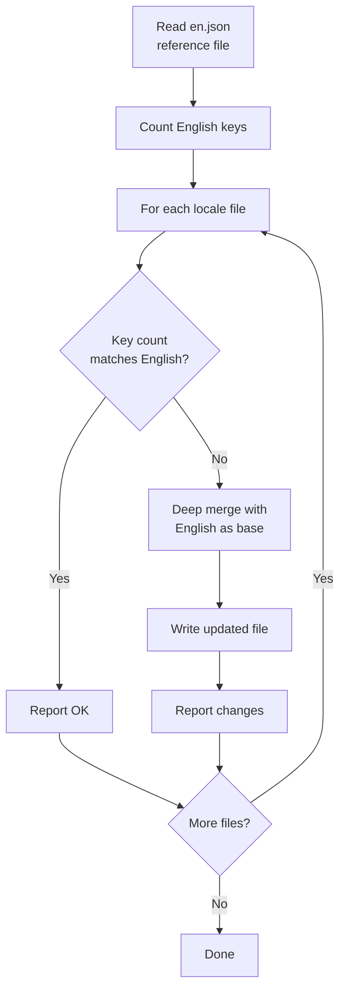
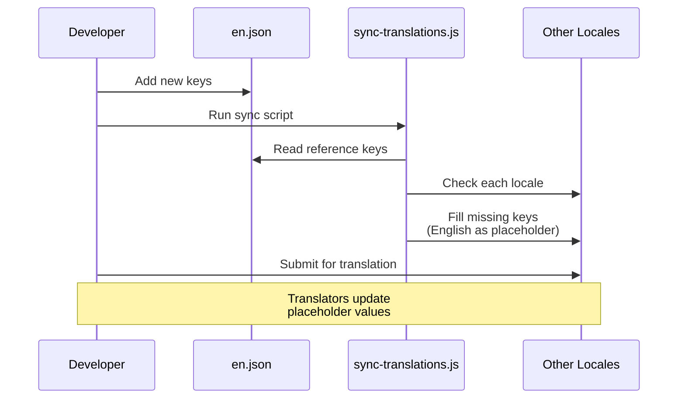

# Flujo de Trabajo de Traducción

La plantilla usa `next-intl` para la internacionalización (i18n) con archivos de mensajes basados en JSON. El flujo de trabajo de traducción garantiza que todos los locales soportados permanezcan sincronizados con el archivo de referencia en inglés a través de un script de sincronización automatizado.

## Locales Soportados

La plantilla viene con 20 idiomas soportados:

| Código | Idioma              | Código | Idioma      |
|--------|---------------------|--------|-------------|
| `en`   | Inglés (referencia) | `ko`   | Coreano     |
| `ar`   | Árabe               | `nl`   | Holandés    |
| `bg`   | Búlgaro             | `pl`   | Polaco      |
| `de`   | Alemán              | `pt`   | Portugués   |
| `es`   | Español             | `ru`   | Ruso        |
| `fr`   | Francés             | `th`   | Tailandés   |
| `he`   | Hebreo              | `tr`   | Turco       |
| `hi`   | Hindi               | `uk`   | Ucraniano   |
| `id`   | Indonesio           | `vi`   | Vietnamita  |
| `it`   | Italiano            | `ja`   | Japonés     |

## Estructura de Archivos

```
messages/
├── en.json          # Inglés (referencia - fuente de verdad)
├── ar.json          # Árabe
├── bg.json          # Búlgaro
├── de.json          # Alemán
├── es.json          # Español
├── fr.json          # Francés
├── he.json          # Hebreo
├── hi.json          # Hindi
├── id.json          # Indonesio
├── it.json          # Italiano
├── ja.json          # Japonés
├── ko.json          # Coreano
├── nl.json          # Holandés
├── pl.json          # Polaco
├── pt.json          # Portugués
├── ru.json          # Ruso
├── th.json          # Tailandés
├── tr.json          # Turco
├── uk.json          # Ucraniano
└── vi.json          # Vietnamita
```

## Script de Sincronización de Traducciones

El script `scripts/sync-translations.js` garantiza que todos los archivos de locale tengan cada clave definida en `en.json`.

### Ejecutando la Sincronización

```bash
node scripts/sync-translations.js
```

### Cómo Funciona



### Estrategia de Fusión

La sincronización usa una fusión profunda donde las traducciones existentes tienen prioridad:

```javascript
function deepMerge(target, source) {
  const result = { ...source };  // Start with English (source)
  for (const key in target) {
    if (typeof target[key] === 'object' && !Array.isArray(target[key])) {
      result[key] = deepMerge(target[key], source[key] || {});
    } else {
      result[key] = target[key]; // Existing translation wins
    }
  }
  return result;
}
```

**Comportamiento clave:**

- Las claves faltantes se rellenan con valores en inglés como marcadores de posición
- Las traducciones existentes nunca se sobreescriben
- Las estructuras anidadas se manejan recursivamente
- Los arrays se tratan como valores hoja (no se fusionan)

### Salida de Ejemplo

```
English file has 342 translation keys

ar.json: 340/342 keys (missing 2)
  -> Updated ar.json with missing keys from English

bg.json: 342/342 keys - OK
de.json: 342/342 keys - OK
es.json: 338/342 keys (missing 4)
  -> Updated es.json with missing keys from English

Done!
```

## Formato de Archivo de Mensajes

Los archivos de traducción usan JSON anidado con acceso de claves por notación de punto:

```json
{
  "common": {
    "loading": "Loading...",
    "error": "An error occurred",
    "save": "Save",
    "cancel": "Cancel"
  },
  "auth": {
    "signIn": "Sign In",
    "signOut": "Sign Out",
    "email": "Email Address",
    "password": "Password"
  },
  "navigation": {
    "home": "Home",
    "about": "About",
    "contact": "Contact"
  }
}
```

## Usando Traducciones en el Código

### Componentes Cliente

```tsx
'use client';
import { useTranslations } from 'next-intl';

export function LoginButton() {
  const t = useTranslations('auth');
  return <button>{t('signIn')}</button>;
}
```

### Componentes Servidor

```tsx
import { getTranslations } from 'next-intl/server';

export default async function Page() {
  const t = await getTranslations('common');
  return <h1>{t('loading')}</h1>;
}
```

### Con Variables

```json
{
  "greeting": "Hello, {name}!",
  "itemCount": "You have {count, plural, =0 {no items} one {1 item} other {# items}}"
}
```

```tsx
const t = useTranslations('dashboard');
t('greeting', { name: 'John' });     // "Hello, John!"
t('itemCount', { count: 5 });         // "You have 5 items"
```

## Añadiendo un Nuevo Idioma

Sigue estos pasos para añadir un nuevo locale:

### Paso 1: Crear el Archivo de Mensajes

```bash
# Copia el archivo inglés como punto de partida
cp messages/en.json messages/NEW_LOCALE.json
```

### Paso 2: Registrar el Locale

Añade el locale a la configuración i18n:

```typescript
// i18n/config.ts (o equivalente)
export const locales = ['en', 'ar', 'de', ..., 'NEW_LOCALE'];
```

### Paso 3: Traducir el Contenido

Edita `messages/NEW_LOCALE.json` y reemplaza las cadenas en inglés con valores traducidos.

### Paso 4: Ejecutar la Sincronización para Verificar

```bash
node scripts/sync-translations.js
```

Si tu archivo tiene todas las claves, reportará "OK". Las claves faltantes se rellenarán con marcadores de posición en inglés.

## Añadiendo Nuevas Claves de Traducción

Al añadir nuevas funciones que requieren texto orientado al usuario:

### Paso 1: Añadir a la Referencia en Inglés

```json
// messages/en.json
{
  "newFeature": {
    "title": "New Feature",
    "description": "This is a new feature"
  }
}
```

### Paso 2: Ejecutar la Sincronización

```bash
node scripts/sync-translations.js
```

Esto añade automáticamente las nuevas claves a todos los archivos de locale con texto en inglés como marcadores de posición.

### Paso 3: Solicitar Traducciones

Comparte las claves recién añadidas con traductores para cada locale. Solo necesitan actualizar los valores marcadores de posición en inglés.

## Conteo de Claves

El script de sincronización cuenta las claves recursivamente a través de objetos anidados:

```javascript
function countKeys(obj) {
  let count = 0;
  for (const key in obj) {
    if (typeof obj[key] === 'object' && !Array.isArray(obj[key])) {
      count += countKeys(obj[key]); // Recurse into nested objects
    } else {
      count++;                      // Count leaf values
    }
  }
  return count;
}
```

Esto cuenta solo las cadenas de traducción a nivel hoja, no las claves de agrupación intermedias.

## Soporte de Idiomas RTL

La plantilla soporta idiomas de derecha a izquierda (RTL) incluyendo árabe (`ar`) y hebreo (`he`). El diseño RTL se maneja automáticamente a través de la configuración del locale y el atributo CSS `dir`.

## Diagrama de Flujo de Trabajo



## Mejores Prácticas

1. **Siempre modifica `en.json` primero** -- Es la única fuente de verdad
2. **Ejecuta la sincronización tras cada cambio en inglés** -- Mantiene todos los locales alineados
3. **Nunca añadas claves manualmente a archivos no ingleses** -- Usa el script de sincronización
4. **Usa agrupación anidada** -- Agrupa claves por función o página para organización
5. **Evita cadenas fijas** -- Siempre usa `useTranslations` o `getTranslations`
6. **Prueba los diseños RTL** -- Verifica el renderizado en árabe y hebreo regularmente
7. **Mantén las claves descriptivas** -- Usa `auth.signInButton` no `auth.btn1`
