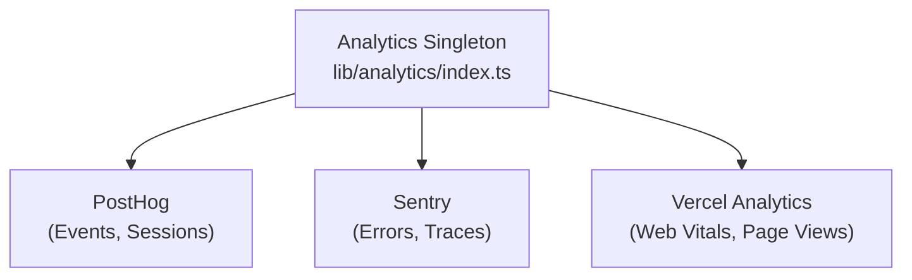

# Sistema de análisis

La plantilla Ever Works se integra con **PostHog**, **Sentry** y **Vercel Analytics** para realizar un seguimiento integral de eventos, monitoreo de errores, grabación de sesiones y análisis de rendimiento.

## Arquitectura



## Clase de análisis

La clase principal `Analytics` en `lib/analytics/index.ts` es un singleton que gestiona la inicialización y el envío de eventos entre proveedores:

```typescript
class Analytics {
  private static instance: Analytics;
  private initialized: boolean;
  private exceptionTrackingProvider: ExceptionTrackingProvider;

  static getInstance(): Analytics;
  init(): void;
  trackEvent(name: string, properties?: EventProperties): void;
  trackPageView(url: string): void;
  identify(userId: string, properties?: UserProperties): void;
  reset(): void;
}
```

### Resolución del proveedor de seguimiento de excepciones

El sistema admite una configuración flexible de seguimiento de excepciones:

```typescript
type ExceptionTrackingProvider = 'sentry' | 'posthog' | 'both' | 'none';
```

El proveedor se determina consultando disponibilidad:
1. Leer el valor de configuración `EXCEPTION_TRACKING_PROVIDER` 2. Validar que el proveedor elegido esté habilitado
3. Recurra a la alternativa disponible si la primaria no está configurada

## Integración de PostHog

### Configuración

```bash
NEXT_PUBLIC_POSTHOG_KEY=phc_xxx
NEXT_PUBLIC_POSTHOG_HOST=https://us.i.posthog.com

# Optional
NEXT_PUBLIC_POSTHOG_DEBUG=false
NEXT_PUBLIC_POSTHOG_SESSION_RECORDING=true
NEXT_PUBLIC_POSTHOG_AUTO_CAPTURE=true
NEXT_PUBLIC_POSTHOG_SAMPLE_RATE=1.0
NEXT_PUBLIC_POSTHOG_SESSION_RECORDING_SAMPLE_RATE=0.1
NEXT_PUBLIC_POSTHOG_EXCEPTION_TRACKING=true
```

### Servicio API de PostHog

Ubicado en `lib/services/posthog-api.service.ts` , el servicio del lado del servidor proporciona datos analíticos de administración:

```typescript
class PostHogApiService {
  constructor(); // Reads from analyticsConfig

  isConfigured(): boolean;
  async getTotalPageViews(days?: number): Promise<number>;
  async getTopPages(days?: number): Promise<PageData[]>;
  async getEventCounts(eventName: string, days?: number): Promise<number>;
}
```

**Requerido para el acceso API del lado del servidor:**
```bash
POSTHOG_PERSONAL_API_KEY=phx_xxx
POSTHOG_PROJECT_ID=12345
```

### Gancho del lado del cliente

```typescript
import { useAnalytics } from '@/hooks/use-analytics';

const {
  trackEvent,      // (name: string, properties?: object) => void
  trackPageView,   // (url: string) => void
  identify,        // (userId: string, properties?: object) => void
} = useAnalytics();
```

### Gancho de análisis geográfico

```typescript
import { useGeoAnalytics } from '@/hooks/use-geo-analytics';

const {
  geoData,         // Geographic analytics data
  isLoading,
} = useGeoAnalytics();
```

## Integración centinela

### Configuración

```bash
NEXT_PUBLIC_SENTRY_DSN=https://xxx@sentry.io/xxx
SENTRY_AUTH_TOKEN=sntrys_xxx
SENTRY_ORG=your-org
SENTRY_PROJECT=your-project
NEXT_PUBLIC_SENTRY_EXCEPTION_TRACKING=true
```

Centinela proporciona:
- **Seguimiento de errores**: captura automática de excepciones no controladas
- **Monitoreo de rendimiento** - Seguimiento de transacciones para rutas API y cargas de páginas
- **Repetición de sesión** -- Grabación de sesión opcional

## Análisis de Vercel

Vercel Analytics está disponible automáticamente cuando se implementa en Vercel:

```bash
# Enabled by default on Vercel deployments
NEXT_PUBLIC_VERCEL_ANALYTICS=true
```

Proporciona:
- **Web Vitals** - Monitoreo de Core Web Vitals (LCP, FID, CLS)
- **Vistas de página** - Seguimiento automático de vistas de página
- **Información sobre la audiencia** - Análisis geográfico y de dispositivos

## Panel de análisis de administración

El panel de administración proporciona análisis agregados a través del enlace `useAdminStats` :

```typescript
import { useAdminStats } from '@/hooks/use-admin-stats';

const {
  stats,           // Dashboard statistics
  isLoading,
} = useAdminStats();
```

El gancho `useDashboardStats` proporciona métricas más detalladas:

```typescript
import { useDashboardStats } from '@/hooks/use-dashboard-stats';

const {
  stats,           // { items, users, revenue, pageViews, ... }
  isLoading,
  refetch,
} = useDashboardStats();
```

## Deshabilitar análisis

Los proveedores de análisis se deshabilitan cuando falta su configuración. No se carga ningún código de seguimiento si no se configuran las variables de entorno correspondientes. Esto permite que la plantilla funcione sin ningún análisis en desarrollo.
