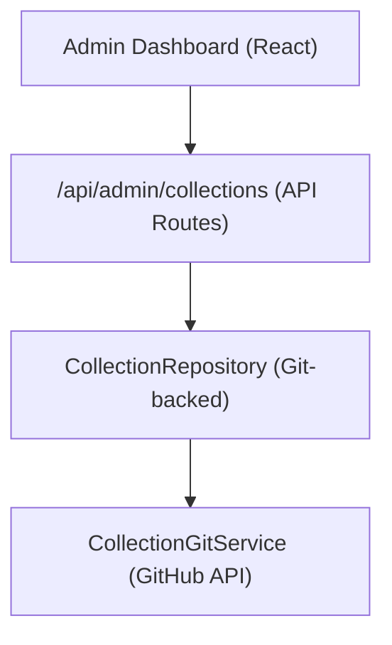

# Sistema de cobranzas

Las colecciones permiten a los administradores seleccionar grupos de elementos para mostrarlos en el sitio. El sistema almacena datos de recopilación en el repositorio CMS basado en Git y proporciona operaciones CRUD a través del panel de administración.

## Arquitectura



Las colecciones se almacenan como archivos en el repositorio CMS basado en Git (configurado mediante `DATA_REPOSITORY` ), utilizando el `CollectionGitService` para operaciones de lectura/escritura a través de la API de GitHub.

## Modelo de datos

```typescript
interface Collection {
  id: string;
  name: string;
  slug: string;
  description?: string;
  isActive: boolean;
  items: string[];          // Array of item slugs
  item_count: number;       // Computed from items array
  displayOrder?: number;
  created_at: string;
  updated_at: string;
}
```

## Repositorio de colecciones

Ubicado en `lib/repositories/collection.repository.ts` , el repositorio proporciona:

```typescript
class CollectionRepository {
  async findAll(options?: CollectionListOptions): Promise<Collection[]>;
  async findById(id: string): Promise<Collection | null>;
  async findBySlug(slug: string): Promise<Collection | null>;
  async create(data: CreateCollectionRequest): Promise<Collection>;
  async update(id: string, data: UpdateCollectionRequest): Promise<Collection>;
  async delete(id: string): Promise<void>;
  async assignItems(id: string, itemSlugs: string[]): Promise<void>;
}
```

### Opciones de lista

```typescript
interface CollectionListOptions {
  search?: string;           // Filter by name
  includeInactive?: boolean; // Include inactive collections
  sortBy?: 'name' | 'item_count' | 'created_at';
  sortOrder?: 'asc' | 'desc';
  page?: number;
  limit?: number;
}
```

## Gancho de administrador

```typescript
import { useAdminCollections } from '@/hooks/use-admin-collections';

const {
  collections,        // Collection[]
  total, page, totalPages, limit,
  isLoading, isSubmitting,
  createCollection,   // (data: CreateCollectionRequest) => Promise<boolean>
  updateCollection,   // (id: string, data: UpdateCollectionRequest) => Promise<boolean>
  deleteCollection,   // (id: string) => Promise<boolean>
  assignItems,        // (id: string, itemSlugs: string[]) => Promise<boolean>
  fetchAssignedItems, // (id: string) => Promise<Item[]>
  refetch, refreshData,
} = useAdminCollections({ page: 1, limit: 10, search: '' });
```

## Puntos finales API

| Método | Punto final | Descripción |
|--------|----------|-------------|
| OBTENER | `/api/admin/collections` | Listar colecciones (paginadas) |
| PUBLICAR | `/api/admin/collections` | Crear una nueva colección |
| PONER | `/api/admin/collections/:id` | Actualizar una colección |
| BORRAR | `/api/admin/collections/:id` | Eliminar una colección |
| OBTENER | `/api/admin/collections/:id/items` | Obtener elementos asignados |
| PUBLICAR | `/api/admin/collections/:id/items` | Asignar elementos a la colección |

## Pantalla del lado del cliente

El gancho `useCollectionsExists` comprueba si existe alguna colección activa, utilizada para la representación condicional:

```typescript
import { useCollectionsExists } from '@/hooks/use-collections-exists';
const { exists, isLoading } = useCollectionsExists();
```

## Configuración

Las colecciones requieren las siguientes variables de entorno:

```bash
DATA_REPOSITORY=https://github.com/owner/repo   # Git CMS repository
GH_TOKEN=ghp_xxx                                  # GitHub API token
GITHUB_BRANCH=main                                # Branch for collection data
```

El `CollectionRepository` analiza la URL `DATA_REPOSITORY` para extraer el propietario y el repositorio de GitHub, luego usa el token para la autenticación API.
