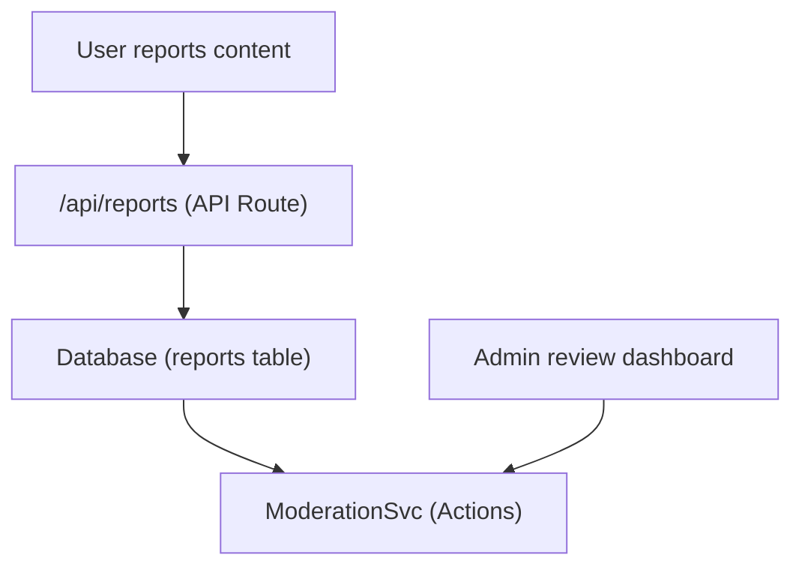

# Informes y moderación de contenido

La plantilla Ever Works incluye un sistema de moderación e informes de contenido que permite a los usuarios marcar contenido inapropiado y a los administradores tomar medidas sobre los elementos y comentarios reportados.

## Arquitectura



## Tipos de contenido

El sistema admite informes de dos tipos de contenido:

```typescript
enum ReportContentType {
  ITEM = 'item',
  COMMENT = 'comment',
}
```

## Servicio de moderación

Ubicado en `lib/services/moderation.service.ts` , el servicio proporciona acciones de moderación:

### Resolución del propietario del contenido

```typescript
async function getContentOwner(
  contentType: ReportContentTypeValues,
  contentId: string
): Promise<ContentOwnerResult>;
// Returns: { success: boolean, userId?: string, error?: string }
```

Resuelve el autor del contenido reportado buscando comentarios a través de `getCommentById()` o elementos a través de `ItemRepository.findById()` .

### Acciones de moderación

| Acción | Descripción | Efecto |
|--------|-------------|--------|
| **Eliminar contenido** | Eliminar el artículo o comentario reportado | Contenido eliminado, historial registrado |
| **Advertir al usuario** | Incrementar el recuento de advertencias | Contador de advertencia incrementado |
| **Suspender usuario** | Suspender temporalmente la cuenta | Acceso a la cuenta restringido |
| **Prohibir usuario** | Prohibir cuenta permanentemente | Cuenta restringida permanentemente |
| **Descartar informe** | Marcar informe como resuelto sin acción | Informe cerrado |

### Implementación de acciones

Cada acción crea una entrada en el historial de moderación y puede activar notificaciones por correo electrónico:

```typescript
// Example: Remove content
async function removeContent(
  contentType: ReportContentTypeValues,
  contentId: string,
  reportId: string,
  adminId: string
): Promise<ModerationResult>;
```

El servicio delega en:
- `deleteComment()` -- Para eliminar comentarios
- `ItemRepository` -- Para eliminar elementos
- `createModerationHistory()` -- Para pista de auditoría
- `incrementWarningCount()` -- Para advertencias al usuario
- `suspendUserQuery()` / `banUserQuery()` -- Para acciones de cuenta
- `EmailNotificationService` -- Para correos electrónicos de notificación de usuarios

## Gancho de administrador

```typescript
import { useAdminReports } from '@/hooks/use-admin-reports';

const {
  reports,           // Report[]
  total, page, totalPages,
  isLoading, isSubmitting,
  resolveReport,     // (id, action, reason?) => Promise<boolean>
  dismissReport,     // (id, reason?) => Promise<boolean>
  deleteReport,      // (id) => Promise<boolean>
  refetch, refreshData,
} = useAdminReports({ page: 1, limit: 10 });
```

## Flujo de trabajo de moderación

1. **El usuario informa contenido**: selecciona un motivo y lo envía a través de la API de informes.
2. **Notificación de administrador**: `NotificationService.createItemReportedNotification()` o `createCommentReportedNotification()` alerta a los administradores
3. **Revisiones del administrador**: ve los detalles del informe en el panel de administración
4. **El administrador toma medidas**: elige entre: eliminar contenido, advertir al usuario, suspender, prohibir o descartar.
5. **Historial registrado**: `createModerationHistory()` registra la acción con ID de administrador, marca de tiempo y motivo.
6. **Usuario notificado**: notificación por correo electrónico enviada al propietario del contenido sobre la acción realizada.

## Enumeración de acciones de moderación

```typescript
enum ModerationAction {
  REMOVE_CONTENT = 'remove_content',
  WARN_USER = 'warn_user',
  SUSPEND_USER = 'suspend_user',
  BAN_USER = 'ban_user',
  DISMISS = 'dismiss',
}
```

## Puntos finales API

| Método | Punto final | Descripción |
|--------|----------|-------------|
| PUBLICAR | `/api/reports` | Enviar un nuevo informe |
| OBTENER | `/api/admin/reports` | Informes de lista (administrador, paginados) |
| PUBLICAR | `/api/admin/reports/:id/resolve` | Resolver un reporte con acción |
| PUBLICAR | `/api/admin/reports/:id/dismiss` | Descartar un informe |
| BORRAR | `/api/admin/reports/:id` | Eliminar un informe |

## Documentación relacionada

- [Sistema de notificación](./notifications.md) -- Cómo se entregan las notificaciones de informes
- [Votación y comentarios](./voting-comments.md) -- Sistema de comentarios que se puede informar
