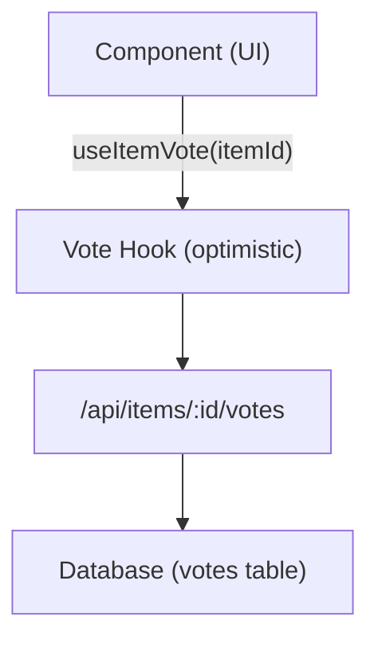

# Sistema de votación y comentarios

La plantilla Ever Works incluye un sistema completo de votación y comentarios que permite a los usuarios votar a favor o en contra de elementos, dejar reseñas con calificaciones de estrellas e interactuar con el contenido. Ambos sistemas utilizan actualizaciones optimistas para obtener comentarios instantáneos de la interfaz de usuario.

## Sistema de votación

### Arquitectura

El sistema de votación utiliza un modelo de votación por elemento en el que cada usuario autenticado puede emitir un voto (hacia arriba o hacia abajo) por elemento. El sistema rastrea el recuento neto de votos y los votos de los usuarios individuales.



### gancho useItemVote

```typescript
import { useItemVote } from '@/hooks/use-item-vote';

const {
  voteCount,       // number -- net vote count
  userVote,        // 'up' | 'down' | null
  isLoading,       // boolean
  handleVote,      // (type: 'up' | 'down') => void
  refreshVotes,    // () => void
} = useItemVote(itemId);
```

### Comportamiento de votación

| Estado actual | Acción | Resultado |
|--------------|--------|--------|
| Sin voto | Haga clic arriba | Voto positivo (+1) |
| Sin voto | Haga clic en Abajo | Voto negativo (-1) |
| Votado a favor | Haga clic arriba | Eliminar voto (alternar) |
| Votado a favor | Haga clic en Abajo | Cambiar a voto negativo (-2 neto) |
| Votado en contra | Haga clic en Abajo | Eliminar voto (alternar) |
| Votado en contra | Haga clic arriba | Cambiar a voto positivo (+2 neto) |

### Actualizaciones optimistas

El gancho de votación implementa actualizaciones positivas con reversión:

1. **onMutate**: cancela consultas salientes, toma una instantánea del estado actual, aplica una actualización optimista
2. **onSuccess**: reemplaza los datos optimistas con la respuesta del servidor
3. **onError**: retrocede a la instantánea, muestra el mensaje de error

### Autenticación

Los usuarios no autenticados que intentan votar ven un modo de inicio de sesión a través de `useLoginModal` :

```typescript
if (!user) {
  loginModal.onOpen('Please sign in to vote on this item');
  throw new Error('Authentication required');
}
```

### Gestión de caché

El enlace de la utilidad `useVoteCache` proporciona operaciones de caché entre componentes:

```typescript
import { useVoteCache } from '@/hooks/use-item-vote';

const {
  invalidateAllVotes,     // () => void
  invalidateItemVotes,    // (itemId: string) => void
  clearVoteCache,         // () => void
  prefetchItemVotes,      // (itemId: string) => Promise<void>
} = useVoteCache();
```

## Sistema de comentarios

### Arquitectura

Los comentarios respaldan operaciones CRUD completas con calificaciones de estrellas, moderación y actualizaciones en tiempo real.

### utilizar gancho de comentarios

```typescript
import { useComments } from '@/hooks/use-comments';

const {
  comments,              // CommentWithUser[]
  isPending,
  createComment,         // ({ content, itemId, rating }) => Promise
  isCreating,
  updateComment,         // ({ commentId, content?, rating? }) => Promise
  isUpdating,
  deleteComment,         // (commentId) => Promise
  isDeleting,
  rateComment,           // ({ commentId, rating }) => void
  isRatingComment,
  updateCommentRating,   // ({ commentId, rating }) => void
  isUpdatingRating,
  commentRating,         // number
  isLoadingRating,
} = useComments(itemId);
```

### Modelo de datos de comentarios

Cada comentario incluye:
- `id` -- Identificador único
- `content` -- Texto del comentario
- `rating` -- Calificación de estrellas opcional (1-5)
- `userId` -- Referencia del autor
- `itemId` -- Artículo asociado
- `user` -- Datos de usuario completados (nombre, correo electrónico, imagen)
- `createdAt` / `updatedAt` -- Marcas de tiempo

### Integración de calificación

Los comentarios y las calificaciones están estrechamente integrados:
- Crear un comentario con una calificación actualiza la calificación agregada del elemento.
- Editar la calificación de un comentario activa un nuevo cálculo
- La consulta `["item-rating", itemId]` se recupera después de cualquier mutación de comentario.

### Eventos entre componentes

El sistema de comentarios envía eventos DOM personalizados para la coordinación entre componentes:

```typescript
const COMMENT_MUTATION_EVENT = "comment:mutated";
window.dispatchEvent(new CustomEvent(COMMENT_MUTATION_EVENT, { detail: comment }));
```

Otros componentes pueden escuchar los cambios de comentarios sin un acoplamiento directo de React Query.

### Moderación del administrador

El gancho `useAdminComments` proporciona gestión de comentarios a nivel de administrador:

```typescript
import { useAdminComments } from '@/hooks/use-admin-comments';

const {
  comments,         // AdminCommentItem[]
  totalComments,
  totalPages,
  isDeleting,       // string | null (ID of comment being deleted)
  deleteComment,    // (id: string) => Promise<boolean>
} = useAdminComments({ page: 1, limit: 10, search: '' });
```

### Puntos finales API

| Método | Punto final | Descripción |
|--------|----------|-------------|
| OBTENER | `/api/items/:id/comments` | Obtener comentarios de un artículo |
| PUBLICAR | `/api/items/:id/comments` | Crear un nuevo comentario |
| PONER | `/api/items/:id/comments/:commentId` | Actualizar un comentario |
| BORRAR | `/api/items/:id/comments/:commentId` | Eliminar un comentario |
| PUBLICAR | `/api/items/:id/comments/rating` | Califica un comentario |
| PONER | `/api/items/:id/comments/rating` | Actualizar calificación de comentarios |
| OBTENER | `/api/items/:id/comments/rating` | Obtener calificación agregada |

## Integración de indicador de funciones

Tanto la votación como los comentarios respetan las marcas de características:

```typescript
const flags = getFeatureFlags();
// flags.ratings -- Controls star rating display
// flags.comments -- Controls comment section visibility
```

Cuando la base de datos no está configurada (falta `DATABASE_URL` ), estas funciones se desactivan automáticamente.
