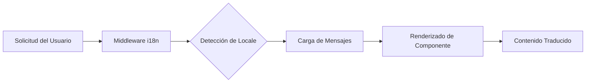

# Vista General de Internacionalización

Ever Works está construido con la internacionalización en mente, soportando múltiples idiomas a través de `next-intl`.

## 🌍 Idiomas Soportados

La plantilla incluye soporte integrado para:

- 🇬🇧 **Inglés** (en) – Idioma predeterminado
- 🇫🇷 **Francés** (fr)
- 🇪🇸 **Español** (es)
- 🇩🇪 **Alemán** (de)
- 🇨🇳 **Chino** (zh)
- 🇸🇦 **Árabe** (ar)
- 🇧🇬 **Búlgaro** (bg)
- 🇳🇱 **Neerlandés** (nl)
- 🇮🇱 **Hebreo** (he)
- 🇮🇹 **Italiano** (it)
- 🇵🇱 **Polaco** (pl)
- 🇵🇹 **Portugués** (pt)
- 🇷🇺 **Ruso** (ru)

## Cómo Funciona

### Localización Basada en URL

Ever Works usa detección de locale basada en URL:

```
https://yoursite.com/en/about    → Inglés
https://yoursite.com/fr/about    → Francés
https://yoursite.com/es/about    → Español
```

### Detección Automática de Idioma

El sistema detecta automáticamente:
1. El idioma del navegador del usuario
2. Redirige al locale apropiado
3. Recuerda la preferencia de idioma del usuario
4. Regresa al idioma predeterminado (Inglés)

## Arquitectura de Traducciones



## Archivos de Traducción

Las traducciones se almacenan en archivos JSON:

```
messages/
├── en.json    # Inglés
├── fr.json    # Francés
├── es.json    # Español
├── de.json    # Alemán
├── zh.json    # Chino
└── ar.json    # Árabe
```

## Ejemplo Rápido

```typescript
import { useTranslations } from 'next-intl';

export function MyComponent() {
  const t = useTranslations('common');

  return (
    <div>
      <h1>{t('welcome')}</h1>
      <p>{t('description')}</p>
    </div>
  );
}
```

## Características

### ✅ Cobertura Completa de Traducciones
- Componentes de UI
- Etiquetas de formularios y mensajes de validación
- Plantillas de correo electrónico
- Mensajes de error
- Metadatos SEO

### ✅ Soporte RTL
- Layout RTL automático para árabe y hebreo
- Elementos de UI en espejo
- Alineación de texto correcta

### ✅ Formato de Fechas y Números
- Formatos de fecha específicos por locale
- Formato de moneda
- Formato de números

### ✅ Pluralización
- Formas plurales automáticas
- Reglas específicas por idioma

## Próximos Pasos

- [Guía de Traducción →](./translation-guide) – Aprende a añadir y gestionar traducciones
- [Primeros Pasos](/getting-started) – Configura tu proyecto
- [Personalización](/guides/customization) – Personaliza tu sitio

## ¿Necesitas Ayuda?

Consulta nuestra [página de soporte](/advanced-guide/support) para asistencia con internacionalización.
