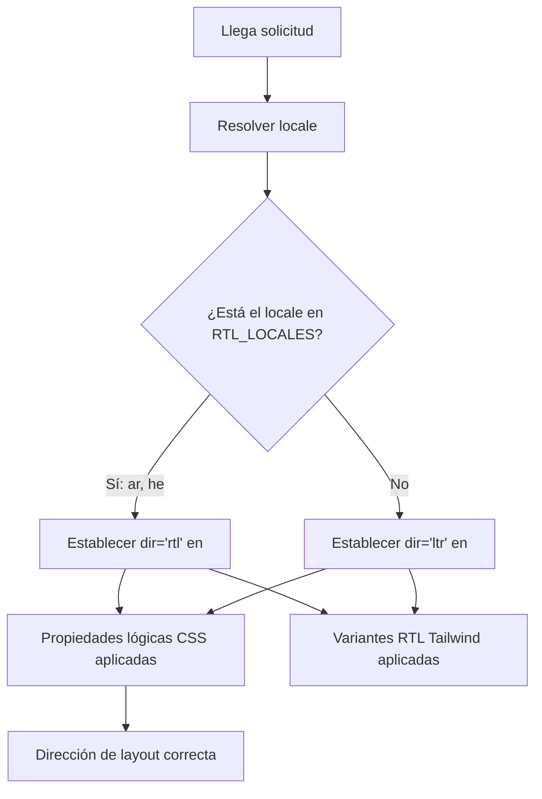

# Soporte RTL (de Derecha a Izquierda)

La plantilla soporta completamente los idiomas de derecha a izquierda (RTL) como el árabe y el hebreo. Esta página documenta cómo funciona la detección RTL, cómo se aplica la dirección del layout y cómo los componentes se adaptan a contextos RTL.

## Descripción General de la Arquitectura



## Archivos de Origen

| Archivo | Propósito |
|------|---------|
| `lib/constants.ts` | Definición de la lista de locales RTL |
| `app/layout.tsx` | Layout raíz con atributo `dir` |
| `components/language-switcher.tsx` | Mapa de idiomas con metadatos `isRTL` |

## Configuración de Locale RTL

```typescript
export const RTL_LOCALES: readonly Locale[] = ['ar', 'he'] as const;
```

## Cómo se Aplica la Dirección

### Detección en el Layout Raíz

```typescript
export default async function RootLayout({ children }) {
  const locale = await getLocale();
  const dir = RTL_LOCALES.includes(locale as Locale) ? 'rtl' : 'ltr';

  return (
    <html lang={locale} dir={dir} suppressHydrationWarning>
      <body className={`${getFontClassNames(locale)} antialiased`}>
        {children}
      </body>
    </html>
  );
}
```

## Estrategias CSS para RTL

### 1. Propiedades Lógicas CSS

| Propiedad Física | Propiedad Lógica | Significado LTR | Significado RTL |
|-------------------|-----------------|-------------|-------------|
| `margin-left` | `margin-inline-start` | Margen izquierdo | Margen derecho |
| `margin-right` | `margin-inline-end` | Margen derecho | Margen izquierdo |
| `padding-left` | `padding-inline-start` | Padding izquierdo | Padding derecho |
| `text-align: left` | `text-align: start` | Alineado a la izquierda | Alineado a la derecha |
| `left` | `inset-inline-start` | Posición izquierda | Posición derecha |

### 2. Soporte RTL en Tailwind CSS

```html
<div class="ml-4 rtl:mr-4 rtl:ml-0">
  Contenido con margen direccional
</div>

<svg class="rtl:rotate-180">
  <path d="M1 9 4-4-4-4" />
</svg>
```

### 3. Utilidades Lógicas de Tailwind

```html
<div class="ps-4">  <!-- padding-inline-start: 1rem -->
<div class="pe-4">  <!-- padding-inline-end: 1rem -->
<div class="ms-4">  <!-- margin-inline-start: 1rem -->
<div class="me-4">  <!-- margin-inline-end: 1rem -->
```

## Problemas RTL Comunes

| Problema | Causa | Solución |
|-------|-------|-----|
| Alineación de texto incorrecta | Uso de `text-left` en lugar de `text-start` | Usar propiedades lógicas |
| Iconos no reflejados | `rtl:rotate-180` faltante en iconos direccionales | Añadir variante RTL |
| Margen en el lado incorrecto | Uso de `ml-*` en lugar de `ms-*` | Usar utilidades lógicas de Tailwind |

## Agregar un Nuevo Idioma RTL

1. **Añadir el locale** a `LOCALES` en `lib/constants.ts`
2. **Añadir a `RTL_LOCALES`**
3. **Crear archivo de mensajes** en `messages/ur.json`
4. **Añadir entrada en el mapa de idiomas** en `components/language-switcher.tsx`
5. **Añadir SVG de bandera** en `public/flags/ur.svg`
6. **Probar el layout cuidadosamente** en modo RTL

## Mejores Prácticas

1. **Preferir propiedades lógicas CSS** sobre las físicas
2. **Usar `dir="rtl"` en `<html>`** (ya manejado por el layout raíz)
3. **Probar con contenido árabe/hebreo real**, no solo texto en inglés en modo RTL
4. **No reflejar imágenes decorativas** ni logotipos de marca
