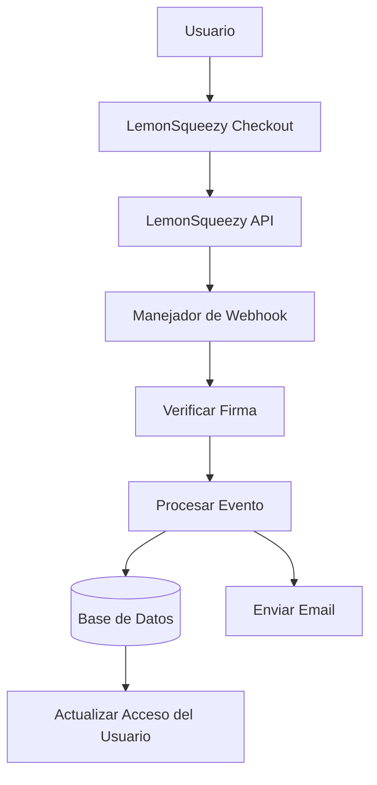

# Configuración LemonSqueezy

Esta guía explica cómo configurar LemonSqueezy como proveedor de pagos en tu aplicación Ever Works.

## Descripción general

LemonSqueezy es una plataforma merchant of record que simplifica:

- 💰 Pagos globales con cumplimiento fiscal automático
- 🌍 Soporte para 135+ países
- 📊 Prevención de fraudes integrada
- 🔄 Gestión de suscripciones
- 💳 Múltiples métodos de pago
- 📧 Recibos de correo electrónico automatizados

:::tip ¿Por qué LemonSqueezy?
LemonSqueezy actúa como merchant of record, manejando automáticamente todo el cumplimiento fiscal, IVA e impuesto sobre las ventas. Esto significa que no necesitas registrarte para impuestos en diferentes países.
:::

## Variables de entorno requeridas

Agrega estas variables a tu archivo `.env.local`:

```env
# Configuración LemonSqueezy
LEMONSQUEEZY_API_KEY=your_api_key_here
LEMONSQUEEZY_WEBHOOK_SECRET=your_webhook_secret_here
LEMONSQUEEZY_STORE_ID=your_store_id_here

# IDs de Producto/Variante (opcional)
NEXT_PUBLIC_LEMONSQUEEZY_PRO_VARIANT_ID=variant_id_here
NEXT_PUBLIC_LEMONSQUEEZY_SPONSOR_VARIANT_ID=variant_id_here
```

## Configuración del Dashboard de LemonSqueezy

### Paso 1: Crear tu tienda

1. Regístrate en [LemonSqueezy](https://lemonsqueezy.com)
2. Crea una nueva tienda
3. Completa los ajustes de tu tienda (nombre, moneda, etc.)
4. Copia tu **ID de Tienda** de la URL o ajustes

### Paso 2: Crear productos

1. Ve a **Productos** → **Nuevo Producto**
2. Crea tus niveles de precios:

| Producto | Precio | Tipo | Descripción |
|----------|--------|------|-------------|
| **Plan Pro** | $10/mes | Suscripción | Funciones avanzadas |
| **Plan Patrocinador** | $20 | Único | Soporte premium |

3. Para cada producto, crea **Variantes** con precios específicos
4. Copia el **ID de Variante** para cada opción de precio

### Paso 3: Obtener clave de API

1. Ve a **Configuración** → **API**
2. Crea una nueva clave de API
3. Copia la clave de API (comienza con `ls_`)
4. Agrégala a tu `.env.local` como `LEMONSQUEEZY_API_KEY`

### Paso 4: Configurar webhooks

1. Ve a **Configuración** → **Webhooks**
2. Haz clic en **Crear Webhook**
3. Configura el webhook:
   - **URL**: `https://tudominio.com/api/lemonsqueezy/webhook`
   - **Eventos**: Selecciona todos los eventos de suscripción y pedido
   - **Secreto**: Genera una clave secreta

4. Copia el **Secreto del Webhook** y agrégalo a tu `.env.local`

#### Eventos recomendados

Selecciona estos eventos en tu configuración de webhook:

- ✅ `subscription_created` - Nueva suscripción
- ✅ `subscription_updated` - Cambios en suscripción
- ✅ `subscription_cancelled` - Cancelación
- ✅ `subscription_payment_success` - Pago exitoso
- ✅ `subscription_payment_failed` - Pago fallido
- ✅ `subscription_trial_will_end` - Período de prueba terminando
- ✅ `order_created` - Compra única
- ✅ `order_refunded` - Reembolso procesado

## Endpoint del Webhook

El webhook está disponible en: `/api/lemonsqueezy/webhook`

### Mapeo de eventos soportados

| Evento LemonSqueezy | Evento interno | Descripción |
|--------------------|----------------|-------------|
| `subscription_created` | `SUBSCRIPTION_CREATED` | Nueva suscripción creada |
| `subscription_updated` | `SUBSCRIPTION_UPDATED` | Suscripción actualizada |
| `subscription_cancelled` | `SUBSCRIPTION_CANCELLED` | Suscripción cancelada |
| `subscription_payment_success` | `SUBSCRIPTION_PAYMENT_SUCCEEDED` | Pago exitoso |
| `subscription_payment_failed` | `SUBSCRIPTION_PAYMENT_FAILED` | Pago fallido |
| `subscription_trial_will_end` | `SUBSCRIPTION_TRIAL_ENDING` | Período de prueba terminando pronto |
| `order_created` | `PAYMENT_SUCCEEDED` | Pago único |
| `order_refunded` | `REFUND_SUCCEEDED` | Reembolso procesado |

## Implementación

### Arquitectura del sistema de pagos



### Funcionalidades

#### Seguridad

- ✅ Verificación de firma HMAC (SHA-256)
- ✅ Validación del secreto del webhook
- ✅ Manejo integral de errores
- ✅ Registro de solicitudes

#### Funcionalidad

- ✅ Gestión del ciclo de vida de suscripciones
- ✅ Procesamiento automático de pagos
- ✅ Notificaciones por correo electrónico
- ✅ Sincronización de base de datos
- ✅ Monitoreo de errores

## Ejemplo de uso

### Crear un Checkout

```typescript
import { LemonSqueezyProvider } from '@/lib/payment/providers/lemonsqueezy-provider';

const lsProvider = new LemonSqueezyProvider({
  apiKey: process.env.LEMONSQUEEZY_API_KEY!,
  storeId: process.env.LEMONSQUEEZY_STORE_ID!,
});

// Crear sesión de checkout
const checkout = await lsProvider.createCheckout({
  variantId: 'variant_id_here',
  customerId: 'customer_id',
  redirectUrl: 'https://yoursite.com/success',
});

// Redirigir usuario a checkout.url
```

## Pruebas

### Modo de prueba

1. LemonSqueezy proporciona un modo de prueba para desarrollo
2. Usa claves de API de prueba (disponibles en el dashboard)
3. Prueba webhooks con la herramienta de prueba de webhooks de LemonSqueezy

### Pruebas locales

```bash
# Usa una herramienta como ngrok para exponer tu servidor local
ngrok http 3000

# Actualiza la URL del webhook en el dashboard de LemonSqueezy
https://your-ngrok-url.ngrok.io/api/lemonsqueezy/webhook
```

## Monitoreo

Todos los eventos de webhook se registran:

- ✅ **Éxito**: `✅ LemonSqueezy [event] handled successfully`
- ❌ **Errores**: `❌ Failed to handle [event]: [error details]`

Revisa los logs de tu aplicación para actividad del webhook.

## Solución de problemas

### Problemas comunes

**Problema**: Error "No signature provided"

- **Solución**: Asegúrate de que LemonSqueezy esté enviando el header `x-signature`
- Verifica la configuración del webhook en el dashboard de LemonSqueezy

**Problema**: Error "Invalid signature"

- **Solución**: Verifica que `LEMONSQUEEZY_WEBHOOK_SECRET` coincida con el secreto en LemonSqueezy
- Asegúrate de que la URL del webhook esté correctamente configurada

**Problema**: Webhook no está recibiendo eventos

- **Solución**: Verifica que la URL del webhook sea accesible públicamente
- Usa ngrok para pruebas locales
- Revisa los logs de webhooks de LemonSqueezy

## Mejores prácticas de seguridad

1. **Solo HTTPS**: Usa siempre HTTPS para endpoints de webhook en producción
2. **Rotación de secretos**: Rota los secretos del webhook regularmente
3. **Monitoreo**: Monitorea los logs de webhooks para actividades sospechosas
4. **Variables de entorno**: Nunca hagas commit de secretos al control de versiones
5. **Rate limiting**: Implementa rate limiting para webhooks de producción
