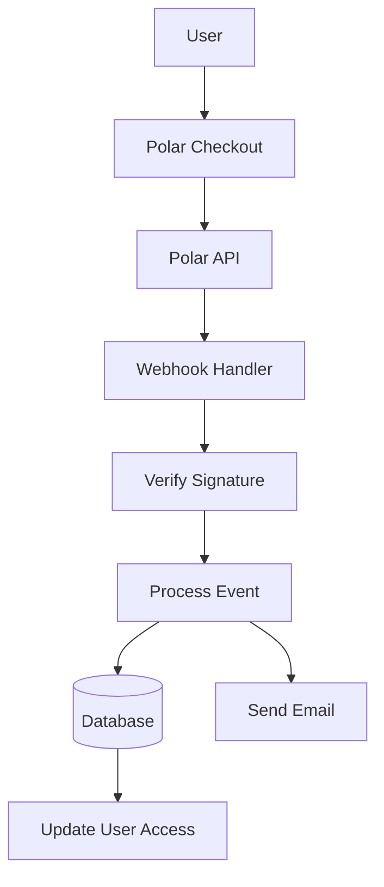

# Configuración polar

Esta guía explica cómo configurar Polar como proveedor de pagos en tu aplicación Ever Works.

## Descripción general

Polar es una plataforma de pago moderna diseñada para desarrolladores y creadores que ofrece:

- 💻 API y documentación fáciles de usar para desarrolladores
- 🔄 Soporte de suscripción y pago único
- 🐙 Integración de GitHub para patrocinios
- 💰 Estructura de precios transparente
- 🔒 Procesamiento de pago seguro
- 📊 Análisis e informes integrados

:::tip ¿Por qué Polar?
Polar está diseñado específicamente para desarrolladores y proyectos de código abierto y ofrece una API limpia, documentación excelente y una perfecta integración de GitHub para patrocinios y monetización.
:::

## Variables de entorno requeridas

Agregue estas variables a su archivo `.env.local` :

```env
# Polar Configuration
POLAR_API_KEY=your_polar_api_key_here
POLAR_WEBHOOK_SECRET=your_webhook_secret_here
POLAR_APP_URL=https://your-app-url.com

# Product IDs (optional)
NEXT_PUBLIC_POLAR_SUBSCRIPTION_PRODUCT_ID=product_id_here
NEXT_PUBLIC_POLAR_ONETIME_PRODUCT_ID=product_id_here
```

:::warning
Nunca envíe sus claves secretas al control de versiones. Mantenga `.env.local` en su archivo `.gitignore` .
:::

## Configuración del panel Polar

### Paso 1: Crea tu cuenta

1. Regístrate en [Polar](https://polar.sh)
2. Complete la configuración de su cuenta
3. Verifica tu dirección de correo electrónico

### Paso 2: Crear productos

1. Navegue a **Productos** → **Nuevo producto**
2. Cree sus niveles de precios:

| Producto | Precio | Tipo | Descripción |
|---------|-------|------|-------------|
| **Plan profesional** | $10/mes | Suscripción | Funciones avanzadas |
| **Plan de patrocinio** | $20 | Única vez | Soporte premium |

3. Configure los ajustes del producto:
   - Establecer precios y ciclo de facturación.
   - Agregar descripciones de productos
   - Configurar niveles de acceso
4. Copie el **ID de producto** para cada producto.

### Paso 3: Obtener la clave API

1. Vaya a **Configuración** → **Claves API**
2. Cree una nueva clave API
3. Copie la clave API
4. Agrégalo a tu `.env.local` como `POLAR_API_KEY` :::tip
Polar proporciona claves independientes para desarrollo y producción. Utilice claves de prueba durante el desarrollo.
:::

### Paso 4: Configurar webhooks

1. Vaya a **Configuración** → **Webhooks**
2. Haga clic en **Crear webhook**
3. Configure el webhook:
   - **URL**: `https://yourdomain.com/api/polar/webhook` - **Eventos**: seleccione todos los eventos de pago y suscripción
   - **Secreto**: genera una clave secreta

4. Copie el **Webhook Secret** y agréguelo a su `.env.local` #### Eventos recomendados

Seleccione estos eventos en la configuración de su webhook:

- ✅ `payment.succeeded` - Pago exitoso
- ✅ `payment.failed` - Pago fallido
- ✅ `subscription.created` - Nueva suscripción
- ✅ `subscription.updated` - Cambios de suscripción
- ✅ `subscription.cancelled` - Cancelación
- ✅ `subscription.trial_will_end` - Finalización del juicio
- ✅ `refund.created` - Reembolso procesado

## Arquitectura del sistema de pago



### Proveedor polar

El proveedor Polar ( `lib/payment/lib/providers/polar-provider.ts` ) implementa:

- ✅ Gestión de clientes
- ✅ Gestión de productos y precios
- ✅ Ciclo de vida de la suscripción
- ✅ Procesamiento de pagos
- ✅ Manejo de webhooks
- ✅ Soporte de reembolso

### Rutas API

Las siguientes rutas API están disponibles:

| Ruta | Método | Descripción |
|-------|--------|-------------|
| `/api/polar/webhook` | PUBLICAR | Manejar webhooks Polar |
| `/api/polar/subscription` | PUBLICAR | Crear suscripción |
| `/api/polar/subscription` | PONER | Suscripción de actualización |
| `/api/polar/subscription` | BORRAR | Cancelar suscripción |
| `/api/polar/checkout` | PUBLICAR | Crear sesión de pago |
| `/api/polar/payment` | OBTENER | Verificar estado de pago |

### Componentes de la interfaz de usuario

El sistema utiliza los componentes de pago de Polar:

- `PolarCheckoutButton` - Componente del botón de pago
- `PolarPaymentForm` - Formulario de pago con validación
- Diseño responsivo para dispositivos móviles y de escritorio.
- Soporte para múltiples métodos de pago.

## Ejemplos de uso

### Crear una suscripción

```typescript
import { PolarProvider } from '@/lib/payment/providers/polar-provider';

const configs = createProviderConfigs({
  apiKey: process.env.POLAR_API_KEY!,
  webhookSecret: process.env.POLAR_WEBHOOK_SECRET!,
  options: {
    appUrl: process.env.POLAR_APP_URL!
  }
});

const polarProvider = new PolarProvider(configs.polar);

const subscription = await polarProvider.createSubscription({
  customerId: 'customer_id',
  productId: 'product_id',
  paymentMethodId: 'payment_method_id',
  trialPeriodDays: 7
});
```

### Crear una sesión de pago

```typescript
const checkout = await polarProvider.createCheckout({
  productId: 'product_id_here',
  customerId: 'customer_id',
  successUrl: 'https://yoursite.com/success',
  cancelUrl: 'https://yoursite.com/cancel'
});

// Redirect user to checkout.url
```

### Utilice el componente de pago

```tsx
import { PolarCheckoutButton } from '@/lib/payment';

function PaymentPage() {
  return (
    <PolarCheckoutButton
      productId="product_id_here"
      amount={1000} // 10.00 USD in cents
      currency="usd"
      isSubscription={true}
      onSuccess={(paymentId) => {
        console.log('Payment succeeded:', paymentId);
        // Redirect to success page or update UI
      }}
      onError={(error) => {
        console.error('Payment error:', error);
        // Show error message to user
      }}
    />
  );
}
```

## Probando su integración

### Modo de prueba

1. **Usar claves API de prueba** (disponibles en el panel de Polar)
2. **Utilice métodos de pago de prueba**:
   - Tarjetas de prueba proporcionadas en el panel de Polar
   - Modo de prueba para todos los flujos de pago.

3. **Pruebe los webhooks localmente** con una herramienta como ngrok:

   ```golpecito
   ngrok http 3000
   ```

   Actualice la URL del webhook en el panel de Polar a su URL de ngrok.

### Prueba de webhook

```bash
# Use ngrok to expose your local server
ngrok http 3000

# Update webhook URL in Polar dashboard
https://your-ngrok-url.ngrok.io/api/polar/webhook

# Trigger test events from Polar dashboard
```

## Manejo de errores

El sistema maneja automáticamente errores comunes:

| Tipo de error | Manipulación |
|------------|----------|
| Pago rechazado | Mensaje de error fácil de usar |
| Problemas de red | Lógica de reintento automático |
| Fallos del webhook | Registrado para revisión manual |
| Errores de validación | Resaltado de campos de formulario |
| Errores de suscripción | Borrar mensajes de error |

## Mejores prácticas de seguridad

1. **Claves API**:
   - Nunca exponga claves secretas en el código del lado del cliente
   - Utilizar variables de entorno.
   - Rotar las llaves regularmente

2. **Verificación de webhook**:
   - Verifique siempre las firmas de webhooks
   - Validar los datos del evento antes de procesarlos.
   - Utilice HTTPS para todos los puntos finales de webhook

3. **Datos de pago**:
   - Nunca almacene datos de pago
   - Utilice el procesamiento de pagos seguro de Polar
   - Implementar una autenticación adecuada

4. **Sesiones de usuario**:
   - Verificar la autenticación del usuario
   - Validar permisos de usuario.
   - Registrar todas las actividades de pago

## Integración de GitHub

Polar ofrece una integración perfecta con GitHub:

- **Patrocinios de GitHub**: conecta Polar con patrocinadores de GitHub
- **Acceso al repositorio**: otorgar acceso según las suscripciones
- **Soporte de organización**: administrar las suscripciones del equipo
- **Acceso Automatizado**: Gestión de acceso automático

### Configurar la integración de GitHub

1. Vaya a **Configuración** → **Integraciones** → **GitHub**
2. Conecta tu cuenta de GitHub
3. Configurar reglas de acceso al repositorio
4. Configurar la gestión de acceso automatizada

## Dependencias

Paquetes requeridos (ya incluidos en Ever Works):

```json
{
  "@polar-sh/sdk": "^1.0.0"
}
```

## Solución de problemas

### Problemas comunes

**Problema**: el webhook no recibe eventos

- **Solución**: Verifique que la URL del webhook sea de acceso público
- Utilice ngrok para pruebas locales
- Verificar que el secreto del webhook sea correcto.

**Problema**: El pago falla silenciosamente

- **Solución**: compruebe si hay errores en la consola del navegador
- Verificar que las claves API sean correctas
- Consultar los registros del panel de Polar

**Problema**: La suscripción no se actualiza

- **Solución**: Verifique que los eventos de webhook estén configurados
- Verificar los registros del controlador de webhook
- Asegúrese de que las actualizaciones de la base de datos estén funcionando.

**Problema**: la integración de GitHub no funciona

- **Solución**: Verificar la conexión de GitHub en el panel de Polar
- Verificar la configuración de acceso al repositorio
- Garantizar que se concedan los permisos adecuados

## Comparación: Polar frente a otros proveedores

| Característica | polares | Raya | Limón exprimidor |
|---------|-------|--------|--------------|
| **Enfoque del desarrollador** | ✅ Excelente | ⚠️ Bueno | ⚠️ Bueno |
| **Integración de GitHub** | ✅ Nativo | ❌ No | ❌ No |
| **Compatible con código abierto** | ✅ Sí | ⚠️ Limitado | ⚠️ Limitado |
| **Complejidad de configuración** | ✅ Sencillo | ⚠️ Moderado | ✅ Sencillo |
| **Calidad API** | ✅ Excelente | ✅ Excelente | ⚠️ Bueno |
| **Cumplimiento tributario** | ⚠️ Manual | ⚠️ Manual | ✅ Automático |
| **Mejor para** | Desarrolladores, OSS | Alto volumen | Ventas globales |

## Próximos pasos

- [Configuración de Stripe](./stripe) - Proveedor de pago alternativo
- [Configuración de LemonSqueezy](./lemonsqueezy) - Proveedor de pago alternativo
- [Resumen de pagos](/pago) - Comparar proveedores de pagos
- [Variables de entorno](/deployment/environment-variables) - Configuración completa del entorno
- [Implementación](/implementación) - Implemente su integración de pagos

## Recursos

- [Documentación polar](https://docs.polar.sh/)
- [Referencia de API] (https://docs.polar.sh/api)
- [Guía de webhooks](https://docs.polar.sh/webhooks)
- [Integración de GitHub](https://docs.polar.sh/integrations/github)

## Soporte

¿Necesitas ayuda con la integración Polar? Consulte nuestra [página de soporte](/advanced-guide/support) o únase a nuestra comunidad.
