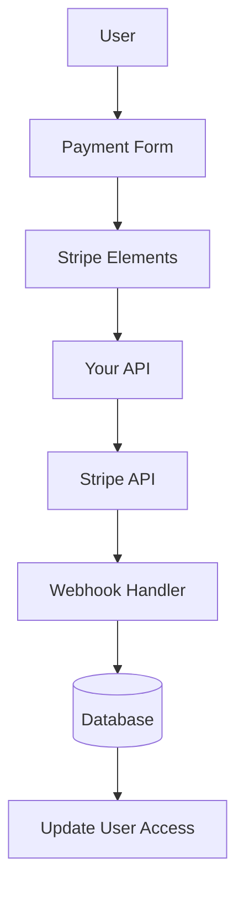

# Configuración de franja

Esta guía explica cómo configurar Stripe en tu aplicación Ever Works con un completo sistema de suscripción y pago.

## Descripción general

Stripe es una plataforma de pago integral que admite:

- 💳 Pagos únicos
- 🔄 Suscripciones recurrentes
- 🌍 Múltiples métodos de pago (tarjetas, Apple Pay, Google Pay)
- 💰 Múltiples monedas
- 📊 Análisis e informes avanzados

## Variables de entorno requeridas

Agregue estas variables a su archivo `.env.local` :

```bash
# Stripe Configuration
STRIPE_SECRET_KEY=sk_test_your_stripe_secret_key_here
STRIPE_WEBHOOK_SECRET=whsec_your_stripe_webhook_secret_here
NEXT_PUBLIC_STRIPE_PUBLISHABLE_KEY=pk_test_your_stripe_publishable_key_here

# Stripe Price IDs
NEXT_PUBLIC_STRIPE_SUBSCRIPTION_PRICE_ID=price_subscription_id_here
NEXT_PUBLIC_STRIPE_ONETIME_PRICE_ID=price_onetime_id_here
NEXT_PUBLIC_STRIPE_FREE_PRICE_ID=price_free_id_here

# Product Pricing (for display purposes)
NEXT_PUBLIC_PRODUCT_PRICE_PRO=10.00
NEXT_PUBLIC_PRODUCT_PRICE_SPONSOR=20.00
NEXT_PUBLIC_PRODUCT_PRICE_FREE=0.00
```

:::warning
Nunca envíe sus claves secretas al control de versiones. Mantenga `.env.local` en su archivo `.gitignore` .
:::

## Configuración del panel de Stripe

### Paso 1: crear productos

En su [Panel de Stripe](https://dashboard.stripe.com/):

1. Navegue a **Productos** → **Agregar producto**
2. Cree los siguientes productos:

| Producto | Precio | Tipo | Descripción |
|---------|-------|------|-------------|
| **Plan gratuito** | $0.00 | Única vez | Características básicas |
| **Plan profesional** | $10.00 | Suscripción mensual | Funciones avanzadas |
| **Plan de patrocinio** | $20.00 | Única vez | Soporte premium |

3. Copie el **ID de precio** de cada producto (comienza con `price_` )

### Paso 2: Configurar webhooks

Los webhooks permiten a Stripe notificar a su aplicación sobre eventos de pago.

1. Vaya a **Desarrolladores** → **Webhooks** → **Agregar punto final**
2. Configure la URL del punto final:
   - Desarrollo: `http://localhost:3000/api/stripe/webhook` - Producción: `https://your-domain.com/api/stripe/webhook` 3. Seleccione eventos para escuchar:
   - `payment_intent.succeeded` - `payment_intent.payment_failed` - `customer.subscription.created` - `customer.subscription.updated` - `customer.subscription.deleted` - `customer.subscription.trial_will_end` - `invoice.payment_succeeded` - `invoice.payment_failed` 4. Copie el **Secreto de firma** (comienza con `whsec_` )

### Paso 3: recuperar claves API

En tu panel de Stripe:

1. **Clave secreta**: **Desarrolladores** → **Claves API** → **Clave secreta** (comienza con `sk_` )
2. **Clave publicable**: **Desarrolladores** → **Claves API** → **Clave publicable** (comienza con `pk_` )
3. **Secreto del webhook**: **Desarrolladores** → **Webhooks** → Seleccione su webhook → **Secreto de firma**

:::tip
Utilice las teclas **modo de prueba** durante el desarrollo (comienzan con `sk_test_` y `pk_test_` ). Cambie a las teclas **modo en vivo** para producción.
:::

## Arquitectura del sistema de pago



### Proveedor de franjas

El proveedor Stripe ( `lib/payment/lib/providers/stripe-provider.ts` ) implementa:

- ✅ Gestión de clientes
- ✅ Creación de intención de pago
- ✅ Gestión de suscripciones
- ✅ Manejo de webhooks
- ✅ Soporte de intención de configuración
- ✅ Reembolsos y cancelaciones

### Rutas API

Las siguientes rutas API están disponibles:

| Ruta | Método | Descripción |
|-------|--------|-------------|
| `/api/stripe/webhook` | PUBLICAR | Manejar webhooks de rayas |
| `/api/stripe/subscription` | PUBLICAR | Crear suscripción |
| `/api/stripe/subscription` | PONER | Suscripción de actualización |
| `/api/stripe/subscription` | BORRAR | Cancelar suscripción |
| `/api/stripe/payment-intent` | PUBLICAR | Crear intención de pago |
| `/api/stripe/payment-intent` | OBTENER | Verificar pago |
| `/api/stripe/setup-intent` | PUBLICAR | Configurar método de pago |

### Componentes de la interfaz de usuario

El sistema utiliza Stripe Elements para formas de pago seguras:

- `StripeElementsWrapper` - Componente principal de envoltura
- `StripePaymentForm` - Formulario de pago con validación
- Soporte para Apple Pay y Google Pay
- Diseño responsivo para dispositivos móviles y de escritorio.

## Ejemplos de uso

### Crear una suscripción

```typescript
import { StripeProvider } from '@/lib/payment/providers/stripe-provider';

const configs = createProviderConfigs({
  apiKey: process.env.STRIPE_SECRET_KEY!,
  webhookSecret: process.env.STRIPE_WEBHOOK_SECRET!,
  options: {
    publishableKey: process.env.NEXT_PUBLIC_STRIPE_PUBLISHABLE_KEY!,
    apiVersion: '2023-10-16'
  }
});

const stripeProvider = new StripeProvider(configs.stripe);

const subscription = await stripeProvider.createSubscription({
  customerId: 'cus_customer_id',
  priceId: 'price_subscription_id',
  paymentMethodId: 'pm_payment_method_id',
  trialPeriodDays: 7
});
```

### Utilice el componente de pago

```tsx
import { PaymentForm } from '@/lib/payment';

function PaymentPage() {
  return (
    <PaymentForm
      amount={1000} // 10.00 USD in cents
      currency="usd"
      isSubscription={true}
      onSuccess={(paymentId) => {
        console.log('Payment succeeded:', paymentId);
        // Redirect to success page or update UI
      }}
      onError={(error) => {
        console.error('Payment error:', error);
        // Show error message to user
      }}
    />
  );
}
```

## Probando su integración

### Modo de prueba

1. **Utilice claves API de prueba** (comience con `sk_test_` y `pk_test_` )
2. **Utilice números de tarjeta de prueba**:
   - Éxito: `4242 4242 4242 4242` - Rechazar: `4000 0000 0000 0002` - 3D Seguro: `4000 0025 0000 3155` 3. **Pruebe los webhooks localmente** con Stripe CLI:

   ```golpecito
   escucha de banda --reenviar a localhost:3000/api/stripe/webhook
   ```

### Prueba de webhook

```bash
# Install Stripe CLI
brew install stripe/stripe-cli/stripe

# Login to your Stripe account
stripe login

# Forward webhooks to your local server
stripe listen --forward-to localhost:3000/api/stripe/webhook

# Trigger test events
stripe trigger payment_intent.succeeded
```

## Manejo de errores

El sistema maneja automáticamente errores comunes:

| Tipo de error | Manipulación |
|------------|----------|
| Tarjeta rechazada | Mensaje de error fácil de usar |
| Fondos insuficientes | Reintentar con tarjeta diferente |
| Problemas de red | Lógica de reintento automático |
| Fallos del webhook | Registrado para revisión manual |
| Errores de validación | Resaltado de campos de formulario |

## Mejores prácticas de seguridad

1. **Claves API**:
   - Nunca exponga claves secretas en el código del lado del cliente
   - Utilizar variables de entorno.
   - Rotar las llaves regularmente

2. **Verificación de webhook**:
   - Verifique siempre las firmas de webhooks
   - Validar los datos del evento antes de procesarlos.

3. **Datos de pago**:
   - Nunca guardes números de tarjetas
   - Utilice la tokenización de Stripe
   - Implementar el cumplimiento de PCI

4. **Sesiones de usuario**:
   - Verificar la autenticación del usuario
   - Validar permisos de usuario.
   - Registrar todas las actividades de pago

## Dependencias

Paquetes requeridos (ya incluidos en Ever Works):

```json
{
  "@stripe/react-stripe-js": "^3.7.0",
  "@stripe/stripe-js": "^7.3.0",
  "stripe": "^18.1.0"
}
```

## Solución de problemas

### Problemas comunes

**Problema**: el webhook no recibe eventos

- **Solución**: Verifique que la URL del webhook sea de acceso público
- Utilice Stripe CLI para pruebas locales
- Verificar que el secreto del webhook sea correcto.

**Problema**: El pago falla silenciosamente

- **Solución**: compruebe si hay errores en la consola del navegador
- Verificar que las claves API sean correctas
- Verifique los registros del panel de Stripe

**Problema**: 3D Secure no funciona

- **Solución**: asegúrese de manejar el estado `requires_action` - Implementar un flujo de redireccionamiento adecuado
- Prueba con tarjetas de prueba 3D Secure

## Próximos pasos

- [Configuración de LemonSqueezy](./lemonsqueezy) - Proveedor de pago alternativo
- [Variables de entorno](/deployment/environment-variables) - Configuración completa del entorno
- [Implementación](/implementación) - Implemente su integración de pagos

## Recursos

- [Documentación de Stripe](https://stripe.com/docs)
- [Guía de integración de Next.js](https://stripe.com/docs/paids/accept-a-paid?platform=web&ui=elements)
- [Gestión de suscripciones](https://stripe.com/docs/billing/subscriptions)
- [Eventos de Webhook](https://stripe.com/docs/api/events/types)

## Soporte

¿Necesitas ayuda con la integración de Stripe? Consulte nuestra [página de soporte](/advanced-guide/support) o únase a nuestra comunidad.
