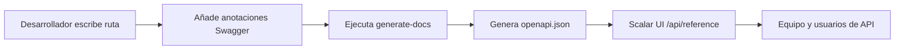

# Capacitación en Documentación API

Domina el sistema de documentación API automatizado usando anotaciones Swagger y la interfaz Scalar UI.

## 🎯 Objetivos

Al finalizar este módulo, serás capaz de:

- ✅ Comprender el flujo de trabajo de documentación API
- ✅ Escribir anotaciones Swagger correctas
- ✅ Seguir convenciones estandarizadas de etiquetas
- ✅ Generar y validar documentación
- ✅ Resolver problemas comunes
- ✅ Mantener documentación API de alta calidad

**Tiempo estimado**: 2–3 días

---

## ¿Por Qué Este Sistema?

### Problemas Resueltos

- **Documentación inconsistente**: Anteriormente había 8 etiquetas Stripe diferentes dispersas entre los endpoints
- **Sincronización manual**: Documentación frecuentemente desactualizada respecto al código real
- **Mala experiencia del desarrollador**: Swagger UI básico con funcionalidad limitada

### Beneficios Obtenidos

- **Sincronización automática**: Documentación generada directamente desde las anotaciones en el código
- **Interfaz moderna**: Scalar UI con pruebas interactivas y mejor UX
- **Estándares consistentes**: Sistema de etiquetas unificado y plantillas de documentación

---

## Arquitectura del Sistema

### Componentes Principales

1. **Anotaciones Swagger en el código**
   - Comentarios JSDoc con etiqueta `@swagger`
   - Formato de especificación OpenAPI 3.0
   - Incorporado directamente en archivos de ruta

2. **Script generate-docs**
   - Escanea todos los archivos `app/api/**/route.ts`
   - Extrae y valida anotaciones Swagger
   - Genera `public/openapi.json` unificado

3. **Interfaz Scalar UI**
   - Interfaz de documentación moderna y responsiva
   - Capacidad de prueba de API interactiva
   - Accesible en `/api/reference`

### Flujo de Trabajo Completo



---

## Comandos Esenciales

```bash
yarn generate-docs
yarn docs:watch
yarn docs:validate
git status public/openapi.json
```

---

## Sistema de Etiquetas Estandarizado

### Convenciones de Etiquetas

#### Operaciones de Administración

```yaml
"Admin - Users"        # Gestión de usuarios
"Admin - Categories"   # Gestión de categorías
"Admin - Items"        # Gestión de contenido
"Admin - Comments"     # Moderación de comentarios
```

#### Funcionalidades Principales

```yaml
"Authentication"       # Inicio de sesión, cierre, restablecimiento de contraseña
"Favorites"           # Favoritos del usuario
"Items & Content"     # Navegación de contenido público
```

#### Sistemas de Pago

```yaml
"Stripe - Core"              # Checkout, Payment Intent
"Stripe - Subscriptions"     # Gestión de suscripciones
"LemonSqueezy - Core"        # Todas las operaciones LemonSqueezy
```

---

## Mejores Prácticas

### Escribir Descripciones Efectivas

- Usar verbos de acción: "Crear", "Actualizar", "Eliminar", "Recuperar"
- Ser específico: "Obtener perfil de usuario" no "Obtener usuario"
- Mantener bajo 50 caracteres para legibilidad en la UI

### Ejemplos Realistas

```yaml
# ❌ Ejemplos malos
example: "string"

# ✅ Ejemplos buenos
example: "john.doe@company.com"
example: "user_123abc456def"
```

---

## Lista de Verificación del Desarrollador

Antes de confirmar cambios en la API:

- [ ] Anotación Swagger añadida o actualizada
- [ ] Etiqueta correcta del sistema estandarizado usada
- [ ] Resumen y descripción significativos presentes
- [ ] Todos los campos del cuerpo de solicitud documentados
- [ ] Todos los códigos de respuesta documentados
- [ ] `yarn generate-docs` ejecutado
- [ ] Documentación verificada en `/api/reference`
- [ ] `public/openapi.json` incluido en el commit
