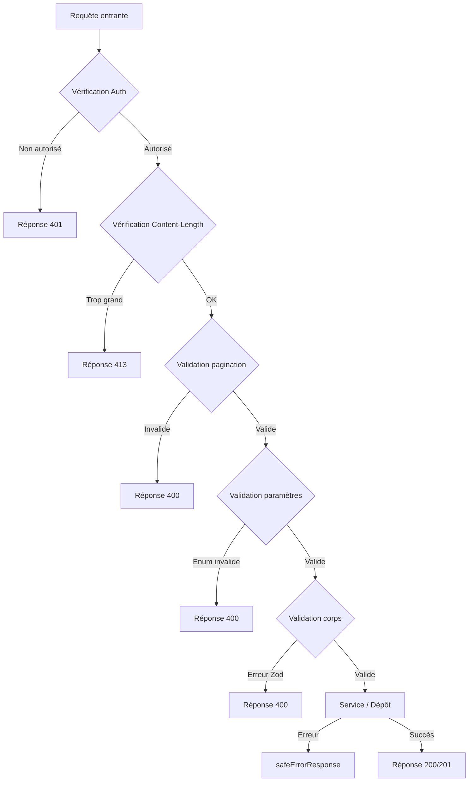

# Validation des requêtes API

Le modèle valide les requêtes API à plusieurs niveaux : schémas Zod pour la validation du corps/des paramètres de requête, fonctions utilitaires pour la pagination et les limites de taille de corps, et gardes de type inline pour les paramètres enum. Cette page documente chaque mécanisme de validation et comment ils sont utilisés dans les gestionnaires de routes API.

## Architecture de validation



## Schémas de validation Zod

### Schéma de localisation (`lib/validations/item.ts`)

Tous les champs sont optionnels ; la rigueur est contrôlée par les paramètres au niveau du formulaire :

```typescript
export const locationSchema = z.object({
  address: z.string().optional(),
  city: z.string().optional(),
  state: z.string().optional(),
  country: z.string().optional(),
  postal_code: z.string().optional(),
  latitude: z.number()
    .min(-90, 'Latitude must be between -90 and 90')
    .max(90, 'Latitude must be between -90 and 90')
    .optional(),
  longitude: z.number()
    .min(-180, 'Longitude must be between -180 and 180')
    .max(180, 'Longitude must be between -180 and 180')
    .optional(),
  service_area: z.enum(['local', 'regional', 'national', 'global']).optional(),
  is_remote: z.boolean().optional(),
  geocoded_by: z.enum(['mapbox', 'google']).optional(),
}).optional();
```

### Schémas d'éléments client (`lib/validations/client-item.ts`)

#### Créer un élément

```typescript
export const clientCreateItemSchema = z.object({
  name: z.string()
    .min(ITEM_VALIDATION.NAME_MIN_LENGTH)
    .max(ITEM_VALIDATION.NAME_MAX_LENGTH),
  description: z.string()
    .min(ITEM_VALIDATION.DESCRIPTION_MIN_LENGTH)
    .max(ITEM_VALIDATION.DESCRIPTION_MAX_LENGTH),
  source_url: z.string().url('Invalid URL format'),
  category: z.union([
    z.string().min(1, 'Category is required'),
    z.array(z.string().min(1)).min(1),
  ]).optional().nullable(),
  tags: z.array(z.string().min(1)).optional().default([]),
  icon_url: z.string().url().optional().or(z.literal('')),
  location: locationSchema,
});
```

#### Mettre à jour un élément

Utilise les mêmes définitions de champs avec tous les champs optionnels :

```typescript
export const clientUpdateItemSchema = z.object({
  name: z.string().min(...).max(...).optional(),
  description: z.string().min(...).max(...).optional(),
  source_url: z.string().url().optional(),
  category: z.union([z.string(), z.array(z.string())]).optional(),
  tags: z.array(z.string()).optional(),
  icon_url: z.string().url().optional().or(z.literal('')),
  location: locationSchema,
});
```

#### Paramètres de requête de liste

Les paramètres de requête utilisent `.transform()` pour convertir les entrées chaîne en valeurs typées :

```typescript
export const clientItemsListQuerySchema = z.object({
  page: z.string().optional()
    .transform(val => (val ? parseInt(val, 10) : 1))
    .refine(val => !Number.isNaN(val))
    .refine(val => val >= 1),
  limit: z.string().optional()
    .transform(val => (val ? parseInt(val, 10) : 10))
    .refine(val => !Number.isNaN(val))
    .refine(val => val >= 1 && val <= 100),
  status: z.enum(['all', 'pending', 'approved', 'rejected']).optional().default('all'),
  search: z.string().max(100).optional(),
  sortBy: z.enum(['name', 'updated_at', 'status', 'submitted_at']).optional().default('updated_at'),
  sortOrder: z.enum(['asc', 'desc']).optional().default('desc'),
  deleted: z.string().optional().transform(val => val === 'true'),
});
```

### Schéma de mot de passe (`lib/validations/auth.ts`)

```typescript
export const passwordSchema = z.string()
  .min(8, "Password must be at least 8 characters")
  .regex(/[A-Z]/, "Must contain at least one uppercase letter")
  .regex(/[a-z]/, "Must contain at least one lowercase letter")
  .regex(/[0-9]/, "Must contain at least one number")
  .regex(/[^A-Za-z0-9]/, "Must contain at least one special character");
```

### Schémas d'entreprise (`lib/validations/company.ts`)

```typescript
export const createCompanySchema = z.object({
  name: z.string().min(1).max(255),
  website: z.string().url().optional().or(z.literal("")),
  domain: z.string().max(255).optional()
    .transform(val => val?.toLowerCase().trim() || undefined),
  slug: z.string().max(255).optional()
    .transform(val => val?.toLowerCase().trim() || undefined)
    .refine(val => !val || /^[a-z0-9-]+$/.test(val)),
  status: z.enum(["active", "inactive"]).default("active"),
});
```

### Types inférés

Tous les schémas exportent des types inférés Zod aux côtés du schéma :

```typescript
export type ClientUpdateItemInput = z.infer<typeof clientUpdateItemSchema>;
export type ClientCreateItemInput = z.infer<typeof clientCreateItemSchema>;
export type CreateCompanyInput = z.infer<typeof createCompanySchema>;
```

## Validation de la pagination (`lib/utils/pagination-validation.ts`)

Un utilitaire partagé pour valider les paramètres de requête `page` et `limit` :

```typescript
export function validatePaginationParams(
  searchParams: URLSearchParams
): PaginationParams | PaginationError {
  const page = pageParam ? parseInt(pageParam, 10) : 1;
  const limit = limitParam ? parseInt(limitParam, 10) : 10;

  if (isNaN(page) || page < 1) {
    return { error: 'Invalid page parameter. Must be a positive integer.', status: 400 };
  }
  if (isNaN(limit) || limit < 1 || limit > 100) {
    return { error: 'Invalid limit parameter. Must be between 1 and 100.', status: 400 };
  }
  return { page, limit };
}
```

L'utilisation dans les gestionnaires de routes suit un modèle d'union discriminé :

```typescript
const paginationResult = validatePaginationParams(searchParams);
if ('error' in paginationResult) {
  return NextResponse.json(
    { success: false, error: paginationResult.error },
    { status: paginationResult.status }
  );
}
const { page, limit } = paginationResult;
```

## Limites de taille du corps de requête (`lib/utils/request-body.ts`)

### `readBodyWithLimit`

Lit le corps de la requête via `ReadableStream` avec vérification incrémentale de la taille :

```typescript
export async function readBodyWithLimit<T = unknown>(
  request: NextRequest,
  options: ReadBodyOptions
): Promise<ReadBodyResult<T>>
```

Fonctionnalités :
- Chemin rapide : vérifie d'abord l'en-tête `Content-Length`
- Incrémental : lit les fragments du flux et vérifie la taille au fur et à mesure
- Annulation : appelle `reader.cancel()` lorsque la limite est dépassée
- Analyse JSON : optionnel, gère gracieusement les `SyntaxError`

```typescript
// Utilisation
const { data } = await readBodyWithLimit(request, { maxSize: 1024 });
```

### `validateContentLength`

Rejet précoce sans lecture du corps :

```typescript
export function validateContentLength(request: NextRequest, maxSize: number): boolean
```

Lance `BodySizeLimitError` si l'en-tête `Content-Length` dépasse la limite.

### `BodySizeLimitError`

Classe d'erreur personnalisée avec les propriétés `maxSize` et `actualSize` :

```typescript
export class BodySizeLimitError extends Error {
  constructor(
    public readonly maxSize: number,
    public readonly actualSize: number
  ) {
    super(`Request body too large. Maximum size is ${maxSize} bytes, received ${actualSize} bytes.`);
  }
}
```

## Validation inline des paramètres

Pour les paramètres enum non couverts par les schémas Zod, les gestionnaires de routes utilisent des gardes de type inline :

```typescript
// Validation de statut type-safe
const validStatuses = ['draft', 'pending', 'approved', 'rejected'] as const;
type ItemStatus = (typeof validStatuses)[number];
const isItemStatus = (s: string): s is ItemStatus =>
  (validStatuses as readonly string[]).includes(s);

if (statusParam && !isItemStatus(statusParam)) {
  return NextResponse.json(
    { success: false, error: 'Invalid status parameter' },
    { status: 400 }
  );
}
```
