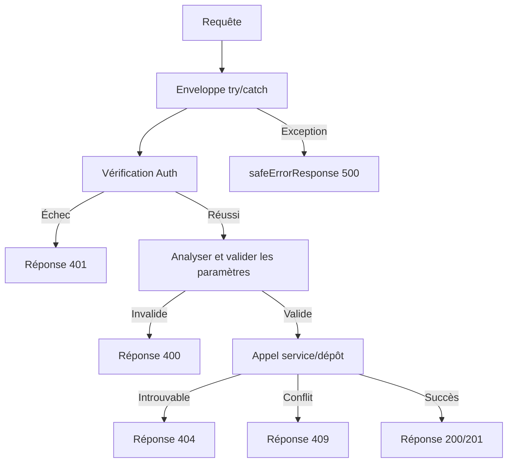

# Modèles de réponse API

Toutes les routes API suivent des conventions de réponse cohérentes : types d'union discriminés pour le succès/l'erreur, messages d'erreur tenant compte de l'environnement, codes de statut HTTP standard et documentation Swagger/JSDoc. Cette page couvre chaque modèle.

## Système de types de réponse

### Union discriminée (`lib/api/types.ts`)

Les réponses API utilisent un booléen `success` comme discriminant :

```typescript
export type ApiResponse<T = unknown> =
  | { success: true; data: T; total?: number; page?: number; limit?: number; totalPages?: number }
  | { success: false; error: string };
```

Cela permet aux appelants de réduire le type en toute sécurité :

```typescript
const response: ApiResponse<User[]> = await fetchUsers();
if (response.success) {
  // TypeScript sait : response.data est User[]
  console.log(response.data);
} else {
  // TypeScript sait : response.error est string
  console.error(response.error);
}
```

### Réponse paginée

Les endpoints de liste utilisent un wrapper paginé dédié :

```typescript
export type PaginatedResponse<T> =
  | {
      success: true;
      data: T[];
      meta: {
        page: number;
        totalPages: number;
        total: number;
        limit: number;
      };
    }
  | { success: false; error: string };
```

### Types d'erreur

```typescript
export interface ApiError {
  message: string;
  status?: number;
  code?: string;
}

export interface ErrorResponse {
  success: false;
  error: string;
}
```

## Formes de réponse standard

### Réponses de succès

#### Ressource unique

```typescript
return NextResponse.json({
  success: true,
  item,
  message: "Item created successfully",
}, { status: 201 });
```

#### Liste avec pagination

```typescript
return NextResponse.json({
  success: true,
  items: result.items,
  total: result.total,
  page: result.page,
  limit: result.limit,
  totalPages: result.totalPages,
});
```

#### Confirmation d'action

```typescript
return NextResponse.json({
  success: true,
  message: "Profile updated successfully",
});
```

### Réponses d'erreur

Toutes les réponses d'erreur incluent `success: false` et une chaîne `error` :

```typescript
// Non autorisé
return NextResponse.json(
  { success: false, error: "Unauthorized. Admin access required." },
  { status: 401 }
);

// Erreur de validation
return NextResponse.json(
  { success: false, error: "Invalid page parameter. Must be a positive integer." },
  { status: 400 }
);

// Conflit
return NextResponse.json(
  { success: false, error: `Item with slug '${slug}' already exists` },
  { status: 409 }
);
```

## Conventions des codes de statut HTTP

| Statut | Utilisation | Exemple |
|--------|-------------|---------|
| `200` | GET, PUT, PATCH, DELETE réussis | Lister des éléments, mettre à jour un profil |
| `201` | POST réussi (ressource créée) | Créer un élément, créer un commentaire |
| `400` | Paramètres ou corps invalides | Mauvaise pagination, champs requis manquants |
| `401` | Authentification requise ou échouée | Session manquante, non-admin |
| `404` | Ressource introuvable | Élément introuvable, profil introuvable |
| `409` | Conflit (ressource en double) | ID ou slug d'élément dupliqué |
| `413` | Corps de requête trop grand | Corps dépasse le max de `readBodyWithLimit` |
| `500` | Erreur interne du serveur | Exceptions non gérées |

## Réponse d'erreur sécurisée (`lib/utils/api-error.ts`)

### `safeErrorResponse`

Prévient la fuite d'informations en affichant des messages génériques en production et des messages détaillés en développement :

```typescript
export function safeErrorResponse(
  error: unknown,
  fallbackMessage: string,
  status: number = 500
): NextResponse {
  const detail = error instanceof Error ? error.message : String(error);

  // Toujours journaliser les détails complets côté serveur
  console.error(`[API Error] ${fallbackMessage}:`, detail);

  const message = process.env.NODE_ENV === "development" ? detail : fallbackMessage;

  return NextResponse.json({ success: false, error: message }, { status });
}
```

Utilisation dans les gestionnaires de routes :

```typescript
export async function GET(request: NextRequest) {
  try {
    // ... logique du gestionnaire
  } catch (error) {
    return safeErrorResponse(error, 'Failed to fetch items');
  }
}
```

### `safeErrorMessage`

Extrait un message sécurisé sans créer de `NextResponse` :

```typescript
export function safeErrorMessage(error: unknown, fallbackMessage: string): string {
  if (process.env.NODE_ENV === "development") {
    return error instanceof Error ? error.message : String(error);
  }
  return fallbackMessage;
}
```

### Comportement selon l'environnement

| Environnement | Sortie d'erreur | Journal serveur |
|---------------|-----------------|-----------------|
| Développement | `error.message` (détail complet) | Erreur complète journalisée |
| Production | `fallbackMessage` (générique) | Erreur complète journalisée |

## Structure des gestionnaires de routes

Tous les gestionnaires de routes API suivent une structure cohérente :



### Exemple de gestionnaire GET canonique

```typescript
export async function GET(request: NextRequest) {
  try {
    // 1. Vérification Auth
    const session = await auth();
    if (!session?.user?.isAdmin) {
      return NextResponse.json(
        { success: false, error: "Unauthorized. Admin access required." },
        { status: 401 }
      );
    }

    // 2. Analyser et valider les paramètres
    const { searchParams } = new URL(request.url);
    const paginationResult = validatePaginationParams(searchParams);
    if ('error' in paginationResult) {
      return NextResponse.json(
        { success: false, error: paginationResult.error },
        { status: paginationResult.status }
      );
    }

    // 3. Appeler la couche service
    const result = await repository.findAll(paginationResult);

    // 4. Retourner la réponse structurée
    return NextResponse.json({
      success: true,
      items: result.items,
      total: result.total,
      page: result.page,
      limit: result.limit,
      totalPages: result.totalPages,
    });

  } catch (error) {
    return safeErrorResponse(error, 'Failed to fetch items');
  }
}
```
