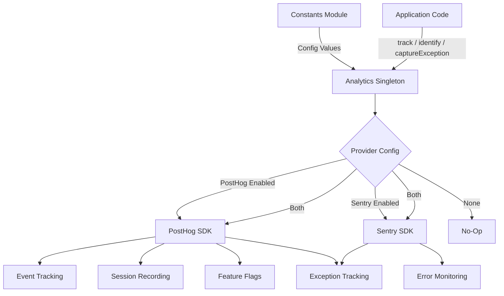
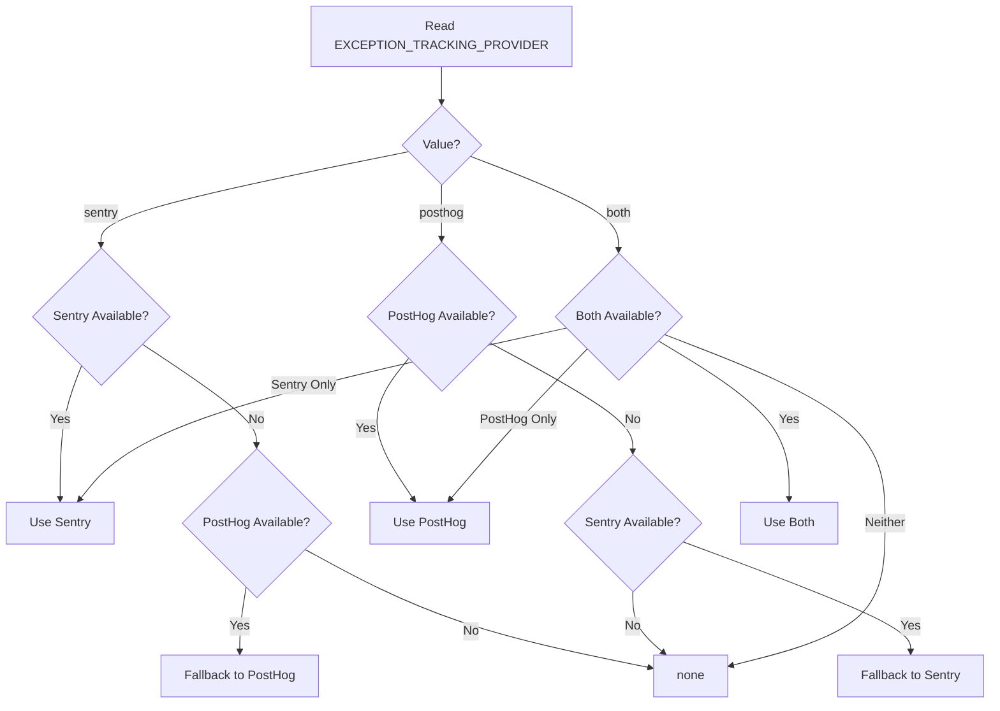

# Module d'analyse

Le module d'analyse (`template/lib/analytics/`) fournit une classe singleton unifiée pour le suivi des événements côté client, l'identification des utilisateurs, l'évaluation des indicateurs de fonctionnalité et la capture des exceptions. Il intègre **PostHog** pour l'analyse des produits et **Sentry** pour la surveillance des erreurs, avec la prise en charge de l'utilisation de l'un ou l'autre fournisseur individuellement, des deux simultanément ou ni l'un ni l'autre.

## Présentation de l'architecture



## Fichiers sources

|Fichier|Descriptif|
|------|-------------|
|`lib/analytics/index.ts`|`Analytics` classe singleton et `analytics` exportation|

## Classe de base : `Analytics`

La classe `Analytics` est un singleton qui encapsule PostHog et Sentry. Il est possible d'appeler en toute sécurité côté serveur : toutes les méthodes sont renvoyées silencieusement lorsque `window` n'est pas défini.

### Définitions des types

```typescript
type EventProperties = Properties;          // PostHog Properties type
type UserProperties = Record<string, any>;
type ExceptionTrackingProvider = 'sentry' | 'posthog' | 'both' | 'none';
```

### Accès unique

```typescript
// Get the singleton instance
const analytics = Analytics.getInstance();

// Or use the pre-created export
import { analytics } from '@/lib/analytics';
```

### `init(): void`

Initialise PostHog avec une configuration centralisée et configure le suivi des exceptions. Doit être appelé une fois côté client (généralement dans une disposition racine ou un composant fournisseur).

```typescript
// In your root layout or PostHog provider
'use client';
import { analytics } from '@/lib/analytics';

useEffect(() => {
  analytics.init();
}, []);
```

**Comportement :**
- Ignore l'initialisation si elle est déjà initialisée ou si elle est exécutée côté serveur
- Lit la configuration à partir des constantes (`POSTHOG_KEY`, `POSTHOG_HOST`, `POSTHOG_ENABLED`, etc.)
- Configure l'enregistrement de session avec masquage lorsque `POSTHOG_SESSION_RECORDING_ENABLED` est vrai
- Applique le taux d'échantillonnage (`POSTHOG_SAMPLE_RATE`) -- en production, la valeur par défaut est de 10 %
- Configure les gestionnaires globaux `window.onerror` et `unhandledrejection` lorsque le suivi des exceptions PostHog est activé
- Relie PostHog à Sentry lorsque les deux fournisseurs sont actifs

### `identify(userId: string, properties?: UserProperties): void`

Associe l'utilisateur anonyme actuel à un ID utilisateur identifié. Définit également le contexte utilisateur Sentry lorsque Sentry est activé.

```typescript
analytics.identify(session.user.id, {
  email: session.user.email,
  plan: 'premium',
});
```

### `reset(): void`

Réinitialise l'identité actuelle de l'utilisateur (par exemple, lors de la déconnexion). Efface les contextes utilisateur PostHog et Sentry.

```typescript
analytics.reset();
```

### `track(eventName: string, properties?: EventProperties): void`

Capture un événement personnalisé dans PostHog.

```typescript
analytics.track('item_submitted', {
  itemId: 'abc-123',
  category: 'SaaS Tools',
});
```

### `trackPageView(url: string, properties?: EventProperties): void`

Capture manuellement un événement d'affichage de page. À utiliser lorsque `POSTHOG_AUTO_CAPTURE` est désactivé et que vous avez besoin d'un suivi explicite des vues de page.

```typescript
analytics.trackPageView(window.location.href, {
  referrer: document.referrer,
});
```

### `isFeatureEnabled(flagKey: string, defaultValue?: boolean): boolean`

Évalue un indicateur de fonctionnalité PostHog de manière synchrone.

```typescript
const showNewUI = analytics.isFeatureEnabled('new-dashboard-ui', false);
```

### `reloadFeatureFlags(): Promise<void>`

Force une nouvelle récupération des indicateurs de fonctionnalités à partir du serveur PostHog.

```typescript
await analytics.reloadFeatureFlags();
```

### `captureException(error: Error | string, context?: Record<string, any>): void`

Suivi des exceptions unifié qui est envoyé au(x) fournisseur(s) configuré(s).

```typescript
try {
  await riskyOperation();
} catch (error) {
  analytics.captureException(error, {
    component: 'PaymentForm',
    action: 'submit',
  });
}
```

**Routage du fournisseur :**
- `'posthog'` -- Envoie l'événement `$exception` à PostHog avec trace de pile
- `'sentry'` -- Appelle `Sentry.captureException` avec un contexte supplémentaire
- `'both'` -- Envoie aux deux fournisseurs
- `'none'` -- Rejet silencieux

### `captureError(error: Error, context?: Record<string, any>): void`

**Obsolète.** Alias pour `captureException`. Enregistre un avertissement de dépréciation.

### `getExceptionTrackingProvider(): ExceptionTrackingProvider`

Renvoie le fournisseur de suivi des exceptions actuellement actif.

### `setUserProperties(properties: UserProperties): void`

Définit les propriétés utilisateur persistantes sur le profil personnel PostHog via `posthog.people.set()`.

```typescript
analytics.setUserProperties({
  subscription_tier: 'premium',
  company: 'Acme Corp',
});
```

### `setSuperProperties(properties: Record<string, any>): void`

Enregistre les super propriétés envoyées avec chaque événement ultérieur via `posthog.register()`.

```typescript
analytics.setSuperProperties({
  app_version: '2.1.0',
  environment: 'production',
});
```

## Constantes de configuration

Toute la configuration analytique est pilotée par les constantes de `lib/constants.ts` :

|Constante|Par défaut|Descriptif|
|----------|---------|-------------|
|`POSTHOG_KEY`|variable d'environnement|Clé API du projet PostHog|
|`POSTHOG_HOST`|variable d'environnement|URL de l'hôte de l'API PostHog|
|`POSTHOG_ENABLED`|dérivé|Vrai lorsque la clé et l'hôte sont définis|
|`POSTHOG_DEBUG`|variable d'environnement|Activer la journalisation du débogage PostHog|
|`POSTHOG_SESSION_RECORDING_ENABLED`|`'true'`|Activer l'enregistrement de la session|
|`POSTHOG_AUTO_CAPTURE`|`'false'`|Capture automatique des pages vues|
|`POSTHOG_SAMPLE_RATE`|`0.1` (prod) / `1.0` (dév.)|Taux d'échantillonnage des événements|
|`POSTHOG_SESSION_RECORDING_SAMPLE_RATE`|`0.1` (prod) / `1.0` (dév.)|Taux d'échantillonnage d'enregistrement|
|`EXCEPTION_TRACKING_PROVIDER`|`'both'`|Quel fournisseur gère les exceptions|
|`SENTRY_ENABLED`|dérivé|Vrai lorsque DSN est défini et que l'environnement l'autorise|

## Résolution du fournisseur de suivi des exceptions

Le fournisseur est déterminé au moment de la construction avec une logique de secours :



## Utilisation avec Next.js

Intégration typique dans un projet Next.js App Router :

```tsx
// app/providers.tsx
'use client';
import { useEffect } from 'react';
import { analytics } from '@/lib/analytics';
import { useSession } from 'next-auth/react';
import { usePathname } from 'next/navigation';

export function AnalyticsProvider({ children }: { children: React.ReactNode }) {
  const { data: session } = useSession();
  const pathname = usePathname();

  useEffect(() => {
    analytics.init();
  }, []);

  useEffect(() => {
    if (session?.user?.id) {
      analytics.identify(session.user.id, {
        email: session.user.email,
      });
    }
  }, [session]);

  useEffect(() => {
    analytics.trackPageView(pathname);
  }, [pathname]);

  return <>{children}</>;
}
```
