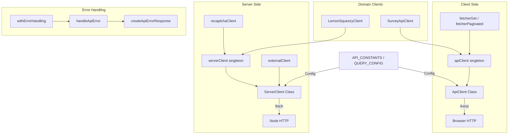

# Module client API

Le module client API (`template/lib/api/`) fournit une couche client HTTP complète pour la communication API côté client et côté serveur. Il comprend un client basé sur Axios pour une utilisation par navigateur, un client serveur natif basé sur `fetch` avec mise en cache et tentatives, des clients de domaine spécialisés et une gestion standardisée des erreurs.

## Présentation de l'architecture



## Fichiers sources

|Fichier|Descriptif|
|------|-------------|
|`lib/api/types.ts`|Définitions de types partagés pour la couche API|
|`lib/api/constants.ts`|Constantes API et configuration des requêtes|
|`lib/api/api-client-class.ts`|`ApiClient` -- Client basé sur Axios pour navigateur|
|`lib/api/singleton.ts`|`ApiClientSingleton` gestionnaire|
|`lib/api/api-client.ts`|Instance client prédéfinie et assistants de récupération|
|`lib/api/server-api-client.ts`|`ServerClient` -- client serveur basé sur la récupération|
|`lib/api/error-handler.ts`|Gestion standardisée des erreurs API|
|`lib/api/lemonsqueezy-client.ts`|Client de paiement LemonSqueezy|
|`lib/api/survey-api.client.ts`|Client d'enquête CRUD|

## Définitions des types

### Types de base

```typescript
type ApiEndpoint = string;
type QueryParams = Record<string, string | number | boolean | undefined>;
type RequestBody = Record<string, unknown>;

interface PaginationParams {
  page?: number;
  limit?: number;
  search?: string;
  sortBy?: string;
  sortOrder?: 'asc' | 'desc';
}
```

### Types de réponses (syndicats discriminés)

```typescript
type ApiResponse<T = unknown> =
  | { success: true; data: T; total?: number; page?: number; limit?: number; totalPages?: number }
  | { success: false; error: string };

type PaginatedResponse<T> =
  | { success: true; data: T[]; meta: { page: number; totalPages: number; total: number; limit: number } }
  | { success: false; error: string };
```

### Configuration client

```typescript
interface ApiClientConfig extends Partial<AxiosRequestConfig> {
  baseURL?: string;
  timeout?: number;
  headers?: Record<string, string>;
  accessToken?: string;
  frontendUrl?: string;
}

interface ApiError {
  message: string;
  status?: number;
  code?: string;
}
```

## Côté client : `ApiClient`

La classe `ApiClient` enveloppe Axios avec l'injection automatique de jetons, la gestion des erreurs de réponse et les réponses saisies.

### Constructeur

```typescript
const client = new ApiClient({
  baseURL: 'https://api.example.com',
  accessToken: 'bearer-token',
  headers: { 'X-Custom': 'value' },
});
```

### Méthodes HTTP

Toutes les méthodes déballent l'enveloppe `ApiResponse` et renvoient directement le champ `data` :

```typescript
// GET with query params
const items = await client.get<Item[]>('/items', { category: 'tools', limit: 10 });

// POST with body
const created = await client.post<Item>('/items', { name: 'New Tool', url: 'https://...' });

// PUT
const updated = await client.put<Item>('/items/123', { name: 'Updated' });

// PATCH
const patched = await client.patch<Item>('/items/123', { status: 'approved' });

// DELETE
await client.delete<void>('/items/123');

// Paginated GET
const page = await client.getPaginated<Item>('/items', { page: 1, limit: 20, search: 'react' });
```

### Accès unique

```typescript
import { getApiClient } from '@/lib/api/singleton';

const client = getApiClient();                    // Default instance
ApiClientSingleton.resetInstance();                // Reset (for tests)
```

### Exportations de commodité

```typescript
import { apiClient, fetcherGet, fetcherPaginated } from '@/lib/api/api-client';

// Use with React Query / SWR
const data = await fetcherGet<Item[]>('/api/items', { status: 'published' });
const page = await fetcherPaginated<Item>('/api/items', { page: 1, limit: 20 });
```

## Côté serveur : `ServerClient`

La classe `ServerClient` utilise `fetch` natif avec gestion des délais d'attente, tentatives automatiques, mise en cache LRU et résolution d'URL spécifique au serveur.

### Principales fonctionnalités

- **Gestion du délai d'attente** avec `AbortController` (par défaut : 30 secondes)
- **Tentatives automatiques** en cas d'erreur réseau (par défaut : 3 tentatives avec un délai de 1 s)
- **Cache LRU en mémoire** pour les requêtes GET (100 entrées, durée de vie de 5 minutes)
- **Résolution d'URL de serveur** pour les routes API internes pendant SSR
- **Prise en charge de FormData** avec gestion automatique du type de contenu

### Instances prédéfinies

```typescript
import { serverClient, externalClient, createApiClient, recaptchaClient } from '@/lib/api/server-api-client';

// Default server client
const result = await serverClient.get<UserData>('/api/users/me');

// External API client (15s timeout, 2 retries)
const external = await externalClient.get<any>('https://api.third-party.com/data');

// Custom client
const customClient = createApiClient('https://api.service.com', { timeout: 10000 });

// ReCAPTCHA verification
const captcha = await recaptchaClient.verify(token);
```

### Méthodes HTTP

```typescript
// All methods return ApiResponse<T>
const result = await serverClient.get<T>(endpoint, options?);
const result = await serverClient.post<T>(endpoint, data?, options?);
const result = await serverClient.put<T>(endpoint, data?, options?);
const result = await serverClient.patch<T>(endpoint, data?, options?);
const result = await serverClient.delete<T>(endpoint, options?);

// File upload
const result = await serverClient.upload<T>(endpoint, fileOrFormData, options?);

// URL-encoded form data
const result = await serverClient.postForm<T>(endpoint, { key: 'value' }, options?);
```

### Contrôle du cache

```typescript
serverClient.setCacheEnabled(false);   // Disable caching
serverClient.clearCache();             // Clear all cached responses
apiUtils.clearCache();                 // Same via utility
```

### Fonctions utilitaires

```typescript
import { apiUtils } from '@/lib/api/server-api-client';

apiUtils.isSuccess(response);                              // Type guard
apiUtils.getErrorMessage(response);                        // Extract error
apiUtils.createQueryString({ page: 1, limit: 20 });       // 'page=1&limit=20'
apiUtils.buildUrl('/api/items', { page: 1, limit: 20 });  // '/api/items?page=1&limit=20'
```

## Gestion des erreurs

### `HttpStatus` Énumération

```typescript
enum HttpStatus {
  BAD_REQUEST = 400,
  UNAUTHORIZED = 401,
  FORBIDDEN = 403,
  NOT_FOUND = 404,
  METHOD_NOT_ALLOWED = 405,
  CONFLICT = 409,
  UNPROCESSABLE_ENTITY = 422,
  INTERNAL_SERVER_ERROR = 500,
  SERVICE_UNAVAILABLE = 503,
}
```

### `handleApiError(error, context?): NextResponse`

Gère les erreurs de route API avec la détection automatique du code d'état à partir des messages d'erreur :

```typescript
import { handleApiError } from '@/lib/api/error-handler';

export async function GET() {
  try {
    const data = await fetchData();
    return NextResponse.json({ success: true, data });
  } catch (error) {
    return handleApiError(error, 'GET /api/items');
  }
}
```

### `withErrorHandling(handler, context?): Promise`

Fonction d'ordre supérieur qui encapsule un gestionnaire asynchrone avec gestion des erreurs :

```typescript
import { withErrorHandling } from '@/lib/api/error-handler';

export async function GET() {
  return withErrorHandling(async () => {
    const data = await fetchData();
    return NextResponse.json({ success: true, data });
  }, 'GET /api/items');
}
```

## Constantes de l'API

```typescript
const API_CONSTANTS = {
  HEADERS: { CONTENT_TYPE: 'application/json', ACCEPT: 'application/json' },
  STATUS: { UNAUTHORIZED: 401, FORBIDDEN: 403, NOT_FOUND: 404, SERVER_ERROR: 500 },
  DEFAULT_ERROR_MESSAGE: 'An unexpected error occurred',
};

const QUERY_CONFIG = {
  staleTime: 300_000,    // 5 minutes
  gcTime: 86_400_000,    // 1 day
  retry: 1,
  refetchOnWindowFocus: false,
};
```

## Clients de domaine

### LemonSqueezyClient

```typescript
import { lemonsqueezyClient } from '@/lib/api/lemonsqueezy-client';

const checkout = await lemonsqueezyClient.createCheckout({
  variantId: 12345,
  email: 'user@example.com',
  customPrice: 4900,
});
// Returns: { checkoutUrl, email, customPrice, variantId, metadata }

const health = await lemonsqueezyClient.healthCheck();
const validation = lemonsqueezyClient.validateCheckoutParams(params);
```

### SurveyApiClient

```typescript
import { surveyApiClient } from '@/lib/api/survey-api.client';

const surveys = await surveyApiClient.getMany({ type: 'nps', status: 'active' });
const survey = await surveyApiClient.getOne('survey-id');
const created = await surveyApiClient.create({ title: 'Feedback', type: 'nps' });
await surveyApiClient.submitResponse({ surveyId: 'id', answers: [...] });
const responses = await surveyApiClient.getResponses('survey-id', { page: 1 });
```
