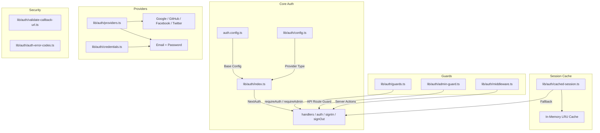
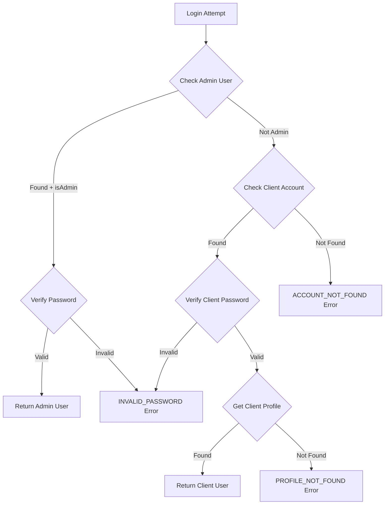

# Module Utilitaires d'authentification

Le module d'utilitaires d'authentification (`template/lib/auth/`) fournit une couche d'authentification complète construite sur NextAuth.js (Auth.js) avec prise en charge de plusieurs fournisseurs, mise en cache de session, protections côté serveur, actions de serveur validées et Supabase comme backend d'authentification alternatif.

## Présentation de l'architecture



## Fichiers sources

|Fichier|Descriptif|
|------|-------------|
|`lib/auth/index.ts`|Configuration NextAuth.js avec l'adaptateur Drizzle|
|`lib/auth/config.ts`|Configuration du type de fournisseur d'authentification|
|`lib/auth/credentials.ts`|Fournisseur d'informations d'identification par e-mail/mot de passe|
|`lib/auth/providers.ts`|Fabrique de fournisseurs OAuth|
|`lib/auth/guards.ts`|Protections de page côté serveur|
|`lib/auth/admin-guard.ts`|Garde d'administrateur de route API|
|`lib/auth/middleware.ts`|Middleware d’action serveur validé|
|`lib/auth/cached-session.ts`|Couche de mise en cache de session|
|`lib/auth/session-cache.ts`|Implémentation du cache|
|`lib/auth/validate-callback-url.ts`|Validation de l'URL de redirection|
|`lib/auth/auth-error-codes.ts`|Énumération du code d'erreur|
|`lib/auth/supabase/`|Client/serveur/middleware d'authentification Supabase|

## Configuration de NextAuth.js (`index.ts`)

L'exportation principale fournit l'interface NextAuth.js standard :

```typescript
import { auth, signIn, signOut, handlers, unstable_update } from '@/lib/auth';
```

### Stratégie de séance

- **Stratégie :** JWT (pas de sessions de base de données)
- **Âge maximum :** 30 jours
- **Âge de la mise à jour :** 24 heures (intervalle d'actualisation de la session)

### Rappel JWT

Le rappel JWT enrichit les jetons avec :
- `userId` -- à partir d'un objet utilisateur ou d'un jeton `sub`
- `clientProfileId` -- créé automatiquement pour les utilisateurs OAuth lors de la première connexion
- `isAdmin` -- déterminé à partir de `isClient`/`isAdmin` indicateurs ou par défaut à `false`
- `provider` -- le nom du fournisseur d'authentification

### Rappel de session

Le rappel de session mappe les champs JWT à l'objet de session :
- `session.user.id`
- `session.user.clientProfileId`
- `session.user.provider`
- `session.user.isAdmin`

### Pages personnalisées

```typescript
pages: {
  signIn: '/auth/signin',
  signOut: '/auth/signout',
  error: '/auth/error',
  verifyRequest: '/auth/verify-request',
  newUser: '/auth/register',
}
```

### Événements

- **signOut** -- invalide le cache de session pour l'utilisateur
- **updateUser** -- invalide le cache de session lorsque les données utilisateur changent

## Configuration d'authentification (`config.ts`)

### `AuthProviderType`

```typescript
type AuthProviderType = 'supabase' | 'next-auth' | 'both';
```

### `AuthConfig`

```typescript
interface AuthConfig {
  provider: AuthProviderType;
  supabase?: {
    url: string;
    anonKey: string;
    redirectUrl?: string;
  };
  nextAuth?: {
    enableCredentials?: boolean;
    enableOAuth?: boolean;
    providers?: any[];
  };
}
```

### `getAuthConfig(): AuthConfig`

Résout la configuration avec cette priorité :
1. Remplacement global via `configureAuth()`
2. Détection basée sur l'environnement (URL Supabase/présence de clé)
3. Par défaut : `next-auth` avec informations d'identification et OAuth activés

## Fournisseur d'informations d'identification (`credentials.ts`)

### Fonctions de mot de passe

```typescript
async function hashPassword(password: string): Promise<string>;
// Uses bcryptjs with 10 salt rounds, loaded via dynamic import

async function comparePasswords(plainText: string, hashed: string | null): Promise<boolean>;
// Returns false if hashed is null
```

### Flux d'authentification



### `AuthProviders` Énumération

```typescript
enum AuthProviders {
  CREDENTIALS = 'credentials',
  GOOGLE = 'google',
  FACEBOOK = 'facebook',
  GITHUB = 'github',
  TWITTER = 'twitter',
  X = 'x',
  MICROSOFT = 'microsoft',
}
```

## Fournisseurs OAuth (`providers.ts`)

### `createNextAuthProviders(config?): Provider[]`

Crée dynamiquement des instances de fournisseur NextAuth en fonction de la configuration :

```typescript
import { createNextAuthProviders } from '@/lib/auth/providers';

const providers = createNextAuthProviders({
  google: { enabled: true, clientId: '...', clientSecret: '...' },
  github: { enabled: true, clientId: '...', clientSecret: '...' },
  credentials: { enabled: true },
});
```

Fournisseurs pris en charge : **Google**, **GitHub**, **Facebook**, **Twitter**, **Credentials**.

## Gardes côté serveur (`guards.ts`)

### `requireAuth(): Promise<Session>`

Nécessite une authentification. Redirige vers `/auth/signin` s'il n'est pas authentifié.

```typescript
export default async function ProtectedPage() {
  const session = await requireAuth();
  return <div>Welcome {session.user.email}</div>;
}
```

### `requireAdmin(): Promise<Session>`

Nécessite un rôle d'administrateur. Redirige vers `/admin/auth/signin` s'il n'est pas authentifié, `/unauthorized` s'il n'est pas administrateur.

```typescript
export default async function AdminPage() {
  const session = await requireAdmin();
  return <div>Admin Dashboard</div>;
}
```

### `getSession(): Promise<Session | null>`

Obtient la session en cours sans redirection. Renvoie `null` pour les utilisateurs non authentifiés.

### `checkIsAdmin(): Promise<boolean>`

Vérifie le statut de l'administrateur sans redirection.

## API Route Guard (`admin-guard.ts`)

### `checkAdminAuth(): Promise<NextResponse | null>`

Renvoie `null` si autorisé, ou une erreur `NextResponse` (401/403/500) sinon :

```typescript
export async function GET() {
  const authError = await checkAdminAuth();
  if (authError) return authError;
  // ... handle authorized request
}
```

### `withAdminAuth(handler): handler`

Fonction d'ordre supérieur qui encapsule les gestionnaires de routes API :

```typescript
import { withAdminAuth } from '@/lib/auth/admin-guard';

export const GET = withAdminAuth(async (request) => {
  // Only reached if user is authenticated admin
  return NextResponse.json({ data: await getAdminData() });
});
```

## Actions de serveur validées (`middleware.ts`)

### `validatedAction(schema, action)`

Encapsule une action du serveur avec la validation Zod :

```typescript
import { validatedAction } from '@/lib/auth/middleware';
import { z } from 'zod';

const schema = z.object({ name: z.string().min(1), email: z.string().email() });

export const updateProfile = validatedAction(schema, async (data, formData) => {
  await db.update(users).set(data);
  return { success: 'Profile updated' };
});
```

### `validatedActionWithUser(schema, action)`

Comme ci-dessus mais vérifie également l'authentification et injecte à l'utilisateur :

```typescript
export const submitItem = validatedActionWithUser(schema, async (data, formData, user) => {
  await db.insert(items).values({ ...data, userId: user.id });
  return { success: 'Item submitted' };
});
```

### `ActionState` Type

```typescript
type ActionState = {
  error?: string;
  success?: string;
  redirect?: string;
  [key: string]: any;
};
```

## Mise en cache de session (`cached-session.ts`)

Réduit la surcharge d’authentification en mettant en cache les sessions décodées en mémoire.

### `getCachedSession(request?): Promise<Session | null>`

```typescript
import { getCachedSession } from '@/lib/auth/cached-session';

// In server components
const session = await getCachedSession();

// In API routes (pass request for token extraction)
const session = await getCachedSession(request);
```

### `invalidateSessionCache(token?, userId?): Promise<void>`

Invalide les sessions mises en cache par jeton ou ID utilisateur.

### `clearSessionCache(): void`

Efface toutes les sessions mises en cache (pour les déploiements ou les mises à jour critiques).

### Extraction de jetons

Les jetons sont extraits des requêtes dans cet ordre :
1. `next-auth.session-token` ou `__Secure-next-auth.session-token` cookie
2. `Authorization: Bearer <token>` en-tête
3. `X-Session-Token` en-tête personnalisé

## Codes d'erreur (`auth-error-codes.ts`)

```typescript
enum AuthErrorCode {
  ACCOUNT_NOT_FOUND = 'ACCOUNT_NOT_FOUND',
  INVALID_PASSWORD = 'INVALID_PASSWORD',
  PROFILE_NOT_FOUND = 'PROFILE_NOT_FOUND',
  GENERIC_ERROR = 'GENERIC_ERROR',
  RATE_LIMITED = 'RATE_LIMITED',
  USE_OAUTH_PROVIDER = 'USE_OAUTH_PROVIDER',
  SESSION_REFRESH_FAILED = 'SESSION_REFRESH_FAILED',
  PAGE_REFRESH_FAILED = 'PAGE_REFRESH_FAILED',
}
```

## Validation de l'URL de rappel (`validate-callback-url.ts`)

### `isValidCallbackUrl(url: string | null): boolean`

Empêche les vulnérabilités de redirection ouverte :

```typescript
isValidCallbackUrl('/admin/items')       // true
isValidCallbackUrl('/client/dashboard')  // true
isValidCallbackUrl('https://evil.com')   // false
isValidCallbackUrl('//evil.com')         // false
```

### `getSafeRedirectPath(callbackUrl, fallbackPath): string`

Renvoie l'URL de rappel si elle est valide, sinon le chemin de secours.

### `createSafeCallbackUrl(pathname, search?): string`

Crée une URL de rappel limitée à 2 048 caractères pour éviter la pollution des paramètres.
